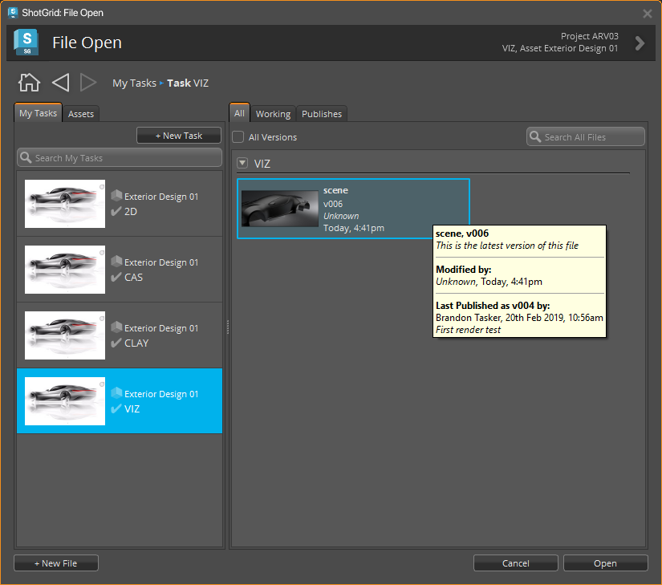
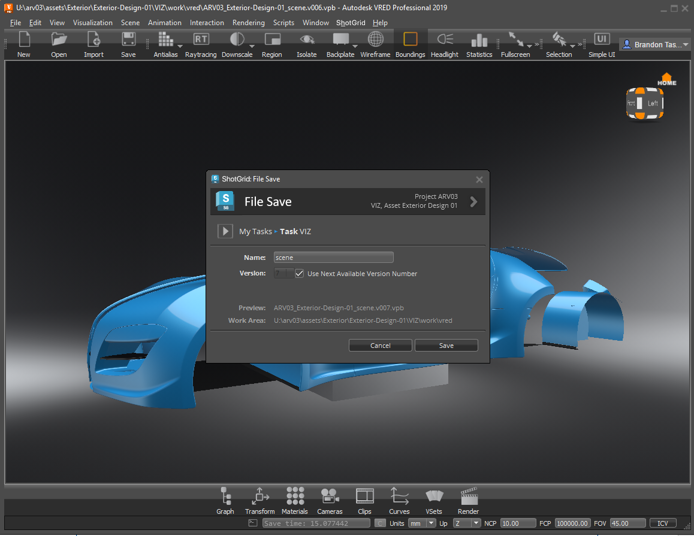

# VRED

 Engine for VRED は、 アプリと VRED を統合する標準プラットフォームを提供します。軽量で操作性に優れており、VRED のメニューに  のメニューを追加します。

## サポート対象のアプリケーション バージョン

この項目はテスト済みです。次のアプリケーション バージョンで動作することが分かっています。 



最新のリリースでの動作は十分可能ですが、正式なテストはまだ完了していません。

## アプリ開発者向けの情報

### VRED プロジェクト管理

 Engine for VRED が起動すると、このエンジンの設定で定義された場所を VRED プロジェクトが参照するように設定されます。つまり、新しいファイルを開くと、このプロジェクトも変更される場合があります。ファイルに基づく VRED プロジェクトの設定方法に関連する詳細設定は、テンプレート システムを使用して設定ファイルで指定できます。

## tk-vred を使用する

この  統合は、VRED 製品ファミリ(Pro および Design)をサポートします。

VRED を開くと、メニュー バーに  メニュー(VRED エンジン)が追加されます。

### ファイルの表示と保存

[マイ タスク] (My Tasks)タブと[アセット] (Assets)タブを使用すると、割り当てられたすべてのタスクを表示して、アセットを参照できます。 右側では、これらのタブを使用してすべてのファイル、作業ファイル、またはパブリッシュ ファイルを表示します。これらのファイルは、左側で選択されているものに関連付けられています。

### パブリッシュ 
[パブリッシュ] (Publish)ダイアログを開き、ファイルを  にパブリッシュします。パブリッシュ ファイルは、下流工程でアーティストが使用します。VRED パブリッシュの詳細については、[こちら](https://github.com/shotgunsoftware/tk-vred/wiki/Publishing)を参照してください。 

### ローダー 
Loader: コンテンツ ローダ アプリを開きます。動作について説明するスライドも含まれています。VRED のロードの詳細については、[こちら](https://github.com/shotgunsoftware/tk-vred/wiki/Loading)を参照してください。 

### シーンの詳細情報 
[詳細情報] (Breakdown)ダイアログが開き、「参照される」ファイル(およびそのリンク)のリストが表示され、シーン内で古くなっているものや Published File の別のバージョンを使用しているものが表示されます。
