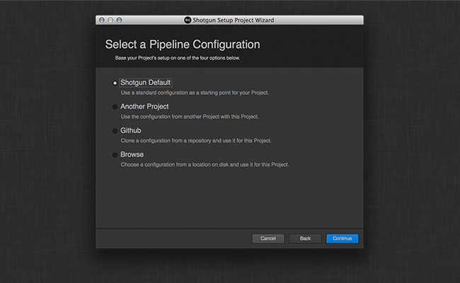

# Toolkit 管理 UI フレームワーク

管理 UI フレームワークは、Toolkit 管理コマンドをラップする標準ユーザ インタフェースを保持する場所を実装します。

現在、唯一のインタフェースは setup_project コマンドに対するものです。

## SetupProjectWizard API リファレンス



このフレームワークには QWizard が実装されており、Toolkit の  インスタンスからプロジェクトを設定できます。ウィザードを使用するには、クラスのインスタンスを作成し、設定するプロジェクトを標準の  API エンティティ ディクショナリとして渡し、親にするウィンドウを渡すだけです。

```python
adminui = sgtk.platform.import_framework("tk-framework-adminui", "setup_project")
setup = adminui.SetupProjectWizard(project, parent)
dialog_result = setup.exec_()
```

これによりウィザードが実行され、標準の QDialog Accepted または Rejected 値が返されます。

### SetupProjectWizard コンストラクタ

SetupProjectWizard を初期化します。これは、QtGui.QWizard のサブクラスです。

```python
SetupProjectWizard()
```
