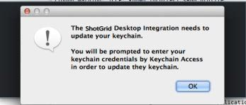
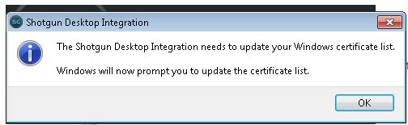

# Toolkit デスクトップ サーバ フレームワーク

デスクトップ サーバ フレームワークは、 のローカル ファイル リンクと Toolkit による統合で使用します。デスクトップ アクセスを必要とするアクションに、 Web サイトからの要求を安全にリッスンするローカル Websocket サーバを提供します。

ローカル ファイル リンクの場合、この要求により、 は Web インタフェースからローカル ファイル パスにアクセスし、要求時に  ページからこのファイルを直接開くことができます。Toolkit の場合、この要求により、 は任意のエンティティに登録されたパイプライン アクションを特定し、そのアクションを実行できます。

## デスクトップ統合を実行する方法

この  機能を使用するには、サポートされたデスクトップ統合が実行されている必要があります。
 とデスクトップを統合する場合のさまざまなオプションについては、[こちらのページ](https://support.shotgunsoftware.com/hc/ja/articles/219030858)を参照してください。Websocket サーバのセクションでは、このフレームワークが提供する機能について説明します。

###  Desktop

このフレームワークは  Desktop にバンドルされています。[こちら](https://support.shotgunsoftware.com/hc/ja/articles/219040668#Downloading%20Shotgun%20Desktop)からダウンロードできます。 Desktop を実行すると、Websocket サーバが自動的に起動されます。 Desktop を既に実行している場合、セットアップ プロセスは完了しています。

### サーバを設定する

設定ファイルにブラウザ統合設定を保存できます。この環境設定ファイルを設定するには、環境変数 `SGTK_BROWSER_INTEGRATION_CONFIG_LOCATION` を設定します。ローカル サーバの設定方法については、[サンプル ファイル](https://github.com/shotgunsoftware/tk-framework-desktopserver/blob/master/app/config.ini.example)を参照してください。

### 証明書を削除する

作成した証明書を削除する場合は、`python certificates.py --remove` コマンドを実行することができます。

## ラッパーを使用して起動する

既定では、サーバはオペレーティング システムの既定値を使用してコマンド(Linux では「xdg-open」、OS X では「open」、Windows では「run」に相当)を起動します。ファイルを起動するために独自のラッパーを指定する場合は、カスタム ラッパーを指定するように環境変数 **SHOTGUN_PLUGIN_LAUNCHER** を設定します。設定されている場合は、ラッパーはその唯一の引数としてパスで呼び出されます。

## 証明書

サーバを初めて実行すると、安全な接続の確立に必要な証明書が生成されます。この証明書はマシンのローカルに保存され、一般的に共有されることはありません。
証明書により、Websocket で必要な暗号化接続が許可されます。暗号化接続は、すべてのトラフィックがローカル(ブラウザからサーバ)で送受信される場合も必要です。 の Websocket トラフィックはインターネット経由で送受信されることはありません。

証明書がシステムに登録されると、次のようなダイアログが表示されます。
「OK」をクリックすると、登録が続行されます。





 Desktop を使用する場合、生成された証明書は次の場所に保存されます。

**OS X**: ~/Library/Caches/Shotgun/desktop/config/certificates<br/>
**Windows**: %AppData%\Shotgun\desktop\config\certificates<br/>
**Linux**: ~/.shotgun/desktop/config/certificates<br/>

## セキュリティ セットアップ: ローカルの  にインストール

既定では、Websocket サーバはポート 9000 でホストされる  サイトをリッスンするようにセットアップされます。
ローカルで  サーバを実行する場合、Websocket サーバからの接続を許可するように、 サーバの設定を更新する必要があります。

 Desktop を実行する場合は、 のバイナリ ファイルを含む ```config.ini``` ファイルを設定する必要があります。このファイルの格納場所の詳細については、[こちら](https://support.shotgunsoftware.com/hc/ja/articles/219040668#Advanced%20Installation%20Topics)を参照してください。

このファイル内に Websocket サーバの機能を制御するセクションがあります。
一般的な設定は次のようになります。

```ini
[BrowserIntegration]
low_level_debug=0
port=9000
enabled=1
whitelist=*.shotgunstudio.com
```

## トラブルシューティング

Linux 上でサーバは libffi に依存しています。Desktop が起動時にクラッシュし、libffi が見つからないというメッセージがログに記録された場合は、このパッケージをインストールする必要があります。

セットアップ中の問題や質問がある場合は、[サポート サイト](https://knowledge.autodesk.com/ja/contact-support)にアクセスしてサポートを依頼してください。サーバの実行に関して問題が発生する場合は、**config.ini** ファイルの **debug** を **1** に設定して、Desktop のログ ファイルを追加します。

ログ ファイルは次の場所にあります。

**OS X**: ~/Library/Logs/Shotgun/tk-desktop.log<br/>**Windows**: ~\%APPDATA%\Shotgun\tk-desktop.log<br/>**Linux**: ~/.shotgun/tk-desktop.log<br/>
