<!-- omit in toc -->
# 統合ユーザ ガイド

本書の内容:
- [はじめに](#introduction)
- [Desktop のスタートアップ](#getting-started-with-desktop)
  - [Desktop のインストール](#installation-of-desktop)
    - [Desktop の新しいバージョンをインストールする](#installing-a-newer-version-of-desktop)
  - [セルフ ホスト環境またはプロキシ サーバの背後からログインする](#logging-in-when-self-hosted-or-behind-a-proxy-server)
    - [認証およびブラウザの統合](#authentication-and-browser-integration)
  - [システム トレイ](#the-system-tray)
  - [プロジェクト ブラウザ](#the-project-browser)
  - [コマンド ランチャー](#the-command-launcher)
  - [コンソール](#the-console)
- [アプリケーションを起動する](#launching-applications)
- [Panel](#the-panel)
  - [概要](#overview)
  - [UI の詳細](#ui-details)
    - [アクティビティ ストリーム](#the-activity-stream)
    - [ノートの作成およびノートへの返信](#creating-and-replying-to-notes)
    - [ノート、バージョン、パブリッシュ、およびタスク](#notes-versions-publishes-and-tasks)
    - [情報タブ](#the-info-tab)
    - [検索](#searching)
    - [アクション](#actions)
    - [現在の作業領域とホーム領域](#the-current-work-area-and-the-me-area)
    - [現在の作業領域](#current-work-area)
- [Publisher](#the-publisher)
  - [概要](#overview-1)
  - [インタフェースのコンポーネントおよび概念](#interface-components-and-concepts)
  - [基本的なワークフロー](#basic-workflow)
    - [コンテンツ作成ソフトウェア内でパブリッシュする](#publishing-within-content-creation-software)
    - [項目およびタスクをパブリッシュする](#publish-items-and-tasks)
      - [コンテキスト](#context)
      - [検証](#validation)
      - [複数ドキュメントのワークフロー](#multi-document-workflows)
    - [スタンドアロン パブリッシュ](#stand-alone-publishing)
    - [パブリッシュ タイプ](#publish-types)
      - [スタンドアロン](#standalone)
      - [3ds Max](#3ds-max)
      - [Houdini](#houdini)
      - [Maya](#maya)
      - [Nuke](#nuke)
      - [Nuke Studio](#nuke-studio)
      - [Photoshop CC](#photoshop-cc)
- [Loader](#the-loader)
  - [概要](#overview-2)
  - [ツリー ビュー](#the-tree-view)
  - [ナビゲーション](#navigation)
  - [パブリッシュを見る](#looking-at-publishes)
  - [1 つまたは複数のパブリッシュをシーンに取り込む](#bringing-one-or-multiple-publishes-into-your-scene)
  - [古いパブリッシュを操作する](#working-with-older-publishes)
  - [関連付けられたレビュー](#associated-review)
- [高度な機能](#advanced-functionality)
- [謝辞](#acknowledgments)

## はじめに 

 の統合により、コンテンツ作成ツールに  を組み込むことができます。 を統合して使用することにより、ソフトウェアを素早く起動する、パネルを使って  に保管されたタスク関連のノートやデータをトラックする、パブリッシャーやローダーを使用してファイルをトラックし、シーンに取り込む、などの操作を行えるようになります。アーティストはタスクに関するすべての  データおよびプロジェクトに関するすべてのタスクに、アプリ内からアクセスすることができます。また、ノートへの返信、バージョンの再生、ファイルのパブリッシュ、同僚のパブリッシュ ファイルのロードを行うことができます。

 統合の最新の更新については、[リリース ノート](https://community.shotgridsoftware.com/tags/c/pipeline/6/release-notes)を参照してください。

## Desktop のスタートアップ

この統合の中心となるのが、** Desktop** アプリです。このソフトウェア アプリケーションによって  がローカル マシンでも使用できるように拡張され、 データにアクセスしたり、アプリケーションを起動したり、自分のマシンからパイプライン統合ツールを直接実行したりといった操作を簡単に行うことができます。

**従来型ツールキットまたはカスタム設定を実行する**  

 の統合は自動的にインストールされます。システムに精通しているクライアントが**従来型**のツールキット構成をインストールする必要がある場合、または **Desktop Setup Wizard** を使用して**カスタム** ツールキット設定をインストールする必要がある場合は、『[管理者ガイド](https://developer.shotgridsoftware.com/ja/8085533c/)』でその方法を確認してください。

### Desktop のインストール

 Desktop は[アプリ] (Apps)メニューからダウンロードできます。

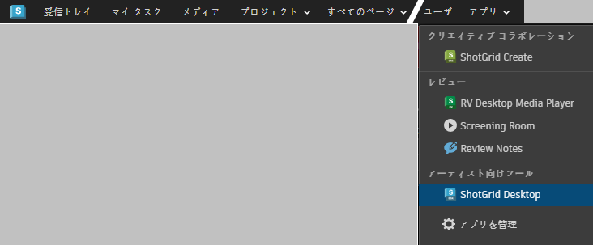

プロンプトに従って、Desktop for Mac、Desktop for Windows、または Desktop for Linux のいずれをダウンロードするのかを選択します。

#### Desktop の新しいバージョンをインストールする

サポートされているすべてのオペレーティング システムで、現在のバージョンをアンインストールすることなく  Desktop を更新できます。ただし、** デスクトップのバージョンを更新する前に、既存のセッションを終了してください**。

*注: Windows の場合、バージョンの更新中に Desktop が実行されていると、バイナリ ロックが干渉してインストーラが停止することがあります。この場合、一部のファイルがすでにコピーされているため、不完全なインストールになります。この問題を解決するには、Desktop を終了して[再試行] (retry)を選択します。*

### セルフ ホスト環境またはプロキシ サーバの背後からログインする

*注: ここに記載されているログインに関する内容は、セルフ ホスト環境の場合またはプロキシ サーバを使用している場合を想定しています。これは既定の動作ではありません。*

セルフ ホスト環境の場合またはプロキシ サーバを使用している場合に、Desktop を初めて開くと、証明書に関するプロンプトがブラウザに表示されます。このプロンプトが表示されるのは、 と Desktop アプリを接続するためです。証明書の設定に問題がある場合は、[Firefox](https://developer.shotgridsoftware.com/ja/d4936105/) および [Chrome およびその他のブラウザ](https://developer.shotgridsoftware.com/ja/95518180/)のトラブルシューティングのドキュメントを参照してください。

セキュリティ証明書のリストは 1 回のみ更新する必要があります。Mac および Windows では証明書を求めるプロンプトが表示されますが、Linux では表示されません。

証明書が設定されたら、 のサイトにログインする必要があります。

プロキシを経由する場合は、追加設定をいくつか行う必要があります。詳細については、『[管理者ガイド](https://developer.shotgridsoftware.com/ja/8085533c/#toolkit-configuration-file)』を参照してください。

#### 認証およびブラウザの統合

Desktop には、 Web アプリケーションとコンピュータの連携を実現するためのサービスが用意されています。このサービスを使用すると、[ローカル ファイル リンク](https://help.autodesk.com/view/SGSUB/JPN/?guid=SG_Administrator_ar_data_management_ar_linking_local_files_html)やソフトウェアの起動などの機能を実行できるようになります。セキュリティ上の理由から、ブラウザを使ってログインしたときと同じ  サイトに、同じユーザ名で Desktop にログインする必要があります。異なるユーザとしてログインするか、または異なるサイトにログインすると、アカウントを切り替えるように促すプロンプトが表示されます。アカウントを切り替えると、Desktop が再起動して、適切な資格情報を求めるプロンプトが表示されます。

### システム トレイ

アプリケーションが起動すると、システム トレイにアイコンとして表示されます。アプリのウィンドウを表示するには、このアイコンをクリックします。既定では、ウィンドウはシステム トレイに固定されるため、フォーカスを失ったウィンドウは自動的に非表示になります。

ウィンドウを固定解除するには、ユーザ メニューで「Undock from Menu」を選択するか、ヘッダーをドラッグします。固定解除したウィンドウは通常のウィンドウのようになり、フォーカスを失っても非表示になることはなくなります。

ウィンドウがドッキング解除されている場合は、[閉じる]ボタンをクリックして非表示にすることができます。再表示するには、システム トレイ アイコンをクリックします。

### プロジェクト ブラウザ

アプリの最初のメイン ビューはプロジェクト ブラウザです。ここに、 インスタンス内のすべてのプロジェクトが表示されます。最近アクセスしたプロジェクトが最初に表示されます。

ウィンドウの右下付近に  アカウントのサムネイルが表示されます。このユーザ メニューからウィンドウのドッキングやドッキング解除を行ったり、他のウィンドウの上に常に表示したり、ログ コンソールを表示したりできます。

ウィンドウの上部にある虫めがねアイコンをクリックして、検索ボックスを表示することができます。このボックスに入力すると、プロジェクトのリストがフィルタされて、入力している文字を含むプロジェクトのみが表示されます。

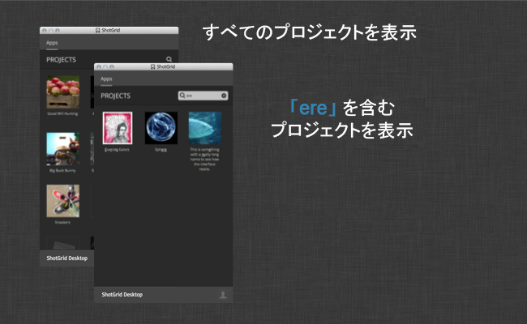

プロジェクトをクリックすると、このプロジェクトのコマンド ランチャー ビューが表示され、プロジェクトで使用可能なツールを起動できるようになります。

### コマンド ランチャー

プロジェクトを選択すると、そのプロジェクトのコマンド ランチャーが表示されます。このウィンドウには、プロジェクトで使用可能なツールおよびアプリケーションが、ボタンとしてグリッド状に表示されます。ボタンをクリックするだけで、対応するアプリケーションを起動できます。コマンド ランチャーは、プロジェクト固有の環境で実行されます。 がコマンド ランチャーと統合されている場合は、使用可能なすべてのツールが  のメニューに表示されます。

### コンソール

ユーザ メニューからコンソールを起動できます。コンソールには、プロジェクトを起動してからのログが表示されます。エラーが発生した場合は、ここにエラーの詳細が表示されます。

コンソールを右クリックすると、標準の編集メニューが表示され、テキスト全体の選択、選択内容のコピー、またはコンソール内のテキストのクリアを行うことができます。

## アプリケーションを起動する

 Desktop を起動してプロジェクトを選択すると、標準のアプリケーション フォルダ内でオペレーティング システムがスキャンされます。Desktop に、[統合対象のすべてのアプリケーション](https://www.shotgridsoftware.com/integrations/)のランチャーが表示されます。同じソフトウェアのバージョンが複数ある場合は、使用可能なすべてのバージョンを含むドロップダウン リストがランチャーに表示されます。ランチャー アイコン自体をクリックすると、最新バージョンが起動します。

Maya や Nuke などのアプリケーションは  Desktop からすぐに起動するか、 から直接起動することができます。いずれの方法でも、アプリケーション内から  の統合を使用することができます。

制作スタジオでは通常、出荷設定のままで使用することはなく、さまざまな追加設定が必要になります。スタジオによっては、標準以外の場所にソフトウェアが配置されていたり、ネイティブにサポートされていないソフトウェア用の社内エンジンが使用されていたりすることがあります。このような場合は、 の Web アプリから簡単に設定できます。詳細については、『[管理者ガイド](https://developer.shotgridsoftware.com/ja/8085533c/)』を参照してください。

表示される予定のアプリが表示されない場合は、『管理者ガイド』の [ Desktop のソフトウェアの設定に関するセクション](https://developer.shotgridsoftware.com/ja/8085533c/)を参照してください。

## Panel

### 概要

Desktop または  からアプリケーションを起動すると、 Panel が表示されます。 Panel は、Maya や Nuke などのアーティスト用アプリケーション内で直接実行される、小型かつ軽量バージョンの  です。このパネルを使用すると、作業中のアプリケーションを終了することなく、 の情報にすばやくアクセスできます。また、現在のタスクに関する情報に簡単にアクセスしたり、 からアクティビティ ストリーム、ノート、タスク、バージョン、およびパブリッシュに瞬時にアクセスしたりできます。さらに、チーム内の他のメンバーから確認のために送信されたバージョンを再生したり、ノートへの返信、新しいタスクの作成、 サイトの検索を行ったりできます。

### UI の詳細

 Panel はいくつかの主要な UI 要素で構成されています。上部には、ナビゲーションや検索用のボタンを含む_ツールバー_があります。ツールバーの右下にある_詳細エリア_には、現在表示している項目の情報が表示されます。この詳細領域は設定可能であるため、カスタム フィールドを表示したい場合や、パイプラインに極めて重要なデータがある場合は、ここに簡単に表示することができます。最後に、複数の_コンテンツ タブ_があります。これらの要素に  のリストがすべて表示されるため、 Panel 内でのナビゲーションが容易になり、パブリッシュなどの項目の参照、バージョンの確認、または現在のフォーカスにリンクされているタスクに割り当てられているユーザの確認をすばやく行うことができます。

統合でドッキングがサポートされているアプリケーションでは、 Panel が UI 内にシームレスにドッキングされた状態で表示されます。その他のアプリケーションでは、パネルは通常のウィンドウとして表示されます。

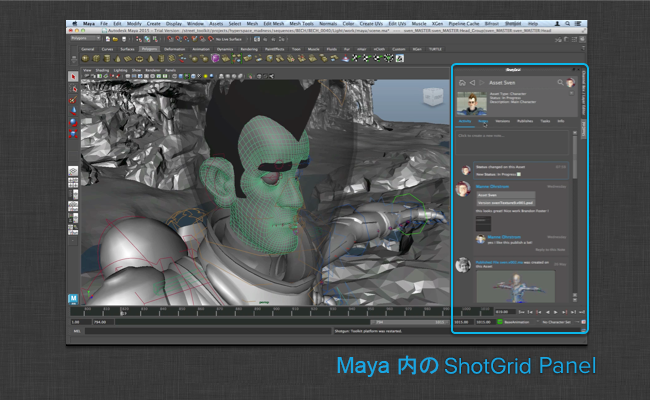

次に、 Panel で使用できるさまざまなタブおよび機能の概要を示します。

#### アクティビティ ストリーム

アクティビティ ストリームは、 内のアクティビティ ストリームと同様に機能して、次のような参照先のオブジェクトの中、または周囲で発生した動作を表示します。

* ノートを作成しているユーザ
* レビューのために送信されているバージョン
* パイプラインで作成されたパブリッシュ

アクティビティ ストリームから新しいノートを直接追加することも、既存のノートに返信することもできます。添付ファイルは自動的に表示され、添付ファイルをクリックすると、大きなプレビューが表示されます。

ファイルをアップロードした後に、プレースホルダ アイコンが表示される可能性があることに注意してください。最後のサムネイルを表示するパネルが使用可能になったら、手動で更新します。

#### ノートの作成およびノートへの返信

ノートの作成やノートへの返信は、 Panel から簡単に行うことができます。アクティビティ ストリームまたはノートの詳細ページに移動して、_create note_ や _reply to note_ をクリックするだけです。ノートのテキストを入力するためのダイアログ ボックスが表示されます。ノートを特定のユーザに送信する場合は、`@name` の表記を使用できます。こうすると、ノートの TO フィールドにこのユーザが自動的に追加されます。

#### ノート、バージョン、パブリッシュ、およびタスク

ノート、バージョン、パブリッシュ、およびタスクのタブはすべて同じように機能し、現在表示されている項目に関連付けられたデータが表示されます。項目をダブルクリックすると、この項目にフォーカスを設定できます。_パブリッシュ_に移動すると、このパブリッシュの依存関係を表示できます。この操作は、パイプラインで依存関係情報をトラッキングする場合に役立ち、アセットの相互接続方法に関する情報にすぐにアクセスできるようになります。

#### 情報タブ

探している情報が他のタブに見つからない場合は、情報タブに移動してください。このタブにはフォーカスされているエンティティのほとんどの  フィールドが表示されていて、青のハイパーリンクをクリックすると、 の他の場所に移動できます。

#### 検索

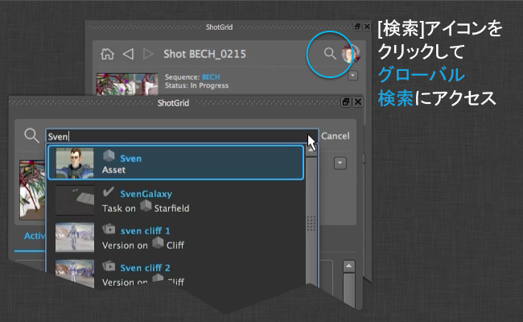

 内の別の場所や別のオブジェクトにすばやく移動する場合は、組み込みの検索機能を使用します。この検索機能は、 Web アプリケーションのグローバル検索と似ています。まず、探している情報の名前または説明を入力します。3 文字以上を入力すると、結果が表示されます。

#### アクション

 Panel を使って  データを使用することにより、シーン内で操作を実行することもできます。ローダーと同様に、パネルにもアクション システムが用意されていて、メニューによってトリガされるコードのスニペットを、ブラウザ内のメニュー項目として簡単に登録することができます。詳細領域から、およびリストからアクションにアクセスできます。詳細領域のアクション ボタンには、 にすばやく移動して、現在のビューを更新するための便利な組み込み関数もいくつか含まれています。

#### 現在の作業領域とホーム領域

左上のアイコンをクリックすると、現在の作業領域に移動できます。通常は、この領域が現在作業中のタスクになります。この領域を使用すると、ノートへのアクセスや、バージョンおよび現在の作業内容に関連するその他の情報の確認をすばやく行うことができます。 Panel の起動時に常にフォーカスが設定されるのも、この場所です。

右上に、現在のユーザのサムネイルを表示するボタンがあります。このボタンをクリックすると、現在のユーザに関連付けられている情報の表示ページに移動します。この領域には、以下が含まれています。

* 自分が提出したすべてのパブリッシュおよびバージョン
* 自分に割り当てられているタスク
* 自分が参加している、または自分に関連しているノート(自分が割り当てられているタスクに関連付けられているノートなど)を含むすべての会話

#### 現在の作業領域

タスクの作業を開始するときに、パネルを使用して現在の作業領域を設定できます。その後、作品をパブリッシュすると、その作品に  の現在のタスクが関連付けられます。

## Publisher

### 概要

アーティストは Publish アプリを使用して作品をパブリッシュすることにより、下流工程に関わるアーティストが自分の作品を使用できるようにすることができます。アーティストのコンテンツ作成ソフトウェア内における従来のパブリッシュ ワークフローと、ディスク上にある任意のファイルのスタンドアロン パブリッシュがサポートされます。コンテンツ作成ソフトウェアで作業し、基本的な  の統合を使用している場合、このアプリはアーティストがパブリッシュする項目を自動的に探して表示します。さらに高度な制作上のニーズがある場合は、アーティストのワークフローを操作するカスタム パブリッシュ プラグインを作成することもできます。

次のセクションでは、パブリッシャーの UI および基本的な統合ワークフローについて説明します。スタジオ固有のニーズに合わせてパブリッシャーをカスタマイズする方法については、『[パブリッシャー開発ガイド](https://developer.shotgridsoftware.com/tk-multi-publish2/)』を参照してください。

### インタフェースのコンポーネントおよび概念

ローカル ファイルシステム上の任意の場所からファイルをドラッグ アンド ドロップします。参照ボタンを使用してファイル ブラウザを開き、パブリッシュする 1 つまたは複数のファイルを選択します。

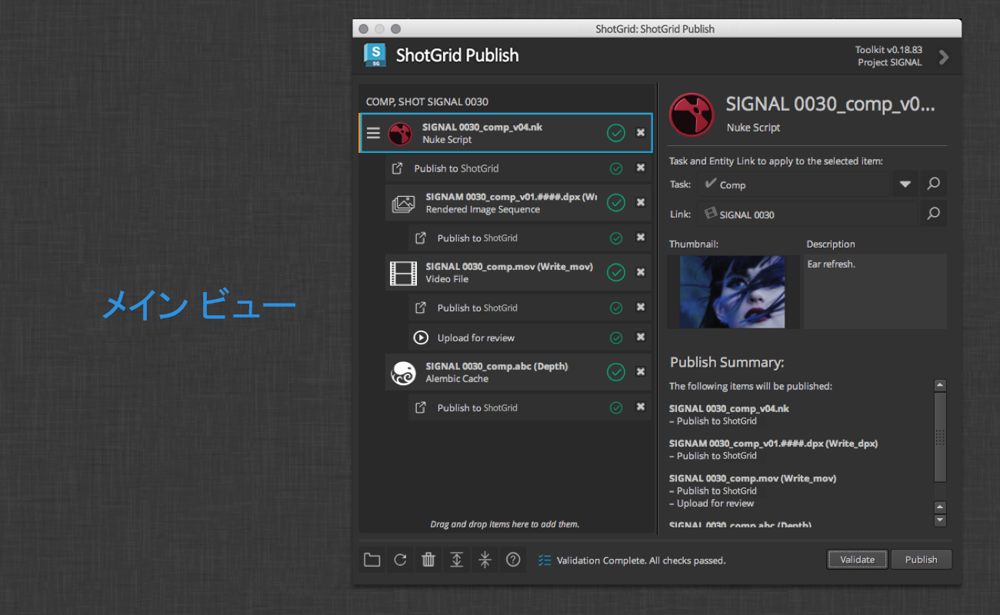

左側の項目ツリーに、パブリッシュされる項目が表示されます。最上位の項目には、作業ファイル内で生成されたレンダーやキャッシュなど、関連するサブ項目が含まれる場合があります。各項目の下に、パブリッシュ時に実行されるアクションを表す、1 つまたは複数のパブリッシュ タスクがあります。

項目自体は、パブリッシュ ファイルに関連付けられる  コンテキストを示すコンテキスト ヘッダでグループ化されます。

最上位項目が複数ある場合は、パブリッシュする項目や実行されるアクションの全体像を示す概要項目が表示されます。

項目を選択すると、インタフェースの右側にその項目の詳細が表示されます。詳細には宛先のコンテキスト、およびパブリッシュのサムネイルや説明が含まれます。項目および任意のサブ項目の概要を含めることもできます。

インタフェースの左下に、一連のツール ボタンがあります。これらのボタンは、次のとおりです。

* **[参照] (Browse)**: パブリッシュするファイルを参照する
* **[更新] (Refresh)**: パブリッシュ項目リストを更新する
* **[削除] (Delete)**: 選択した項目をリストから削除する
* **[展開] (Expand)**: リスト内のすべての項目を展開する
* **[折りたたむ] (Collapse)**: リスト内のすべての項目を折りたたむ
* **[ドキュメント] (Documentation)**: ワークフロー ドキュメントを開く

中央にステータス ラベルがあります。このラベルは、パブリッシャーが検証を実行してパブリッシュ タスクを実行すると、更新されます。このラベルをクリックすると、進行状況の詳細オーバーレイが表示されます。

右端には、**[検証] (Validate)**および**[パブリッシュ] (Publish)**ボタンがあります。[検証] (Validate)ボタンをクリックすると、すべてのおよびタスクに初期検証パスが実行されて、これらがパブリッシュ可能な状態になります。Publish ボタンをクリックすると、リスト内の項目のパブリッシュが開始されます。

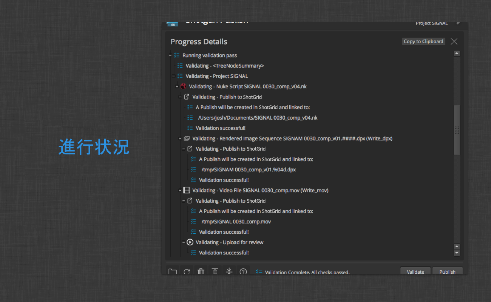

進行状況の詳細オーバーレイには、リスト内の項目の収集、検証、およびパブリッシュの出力が表示されます。

ユーザは[クリップボードにコピー] (Copy to Clipboard)ボタンをクリックして、パブリッシュ ログを簡単に共有できます。検証またはパブリッシュ エラーが発生した場合は、ログ メッセージにアクション ボタンが追加され、これをクリックすることによりユーザに追加情報を案内したり、場合によってはエラーをただちに修正することもできます。

### 基本的なワークフロー

パブリッシュ アプリの目的は、アーティストが自分の作品を他のアーティストにも使用できるようにすることです。 でファイルをパブリッシュすることは、パス、バージョン番号、アーティストの情報、関連する  コンテキストなど、パブリッシュするファイルの情報を含むレコードを  で作成することを意味します。 でファイルがトラックされている場合、他のユーザは [Loader](#the-loader) アプリを使用してそのファイルを利用することができます。

基本的な  の統合には、パイプラインでパブリッシュ アプリを使用する方法が 2 つ用意されています。スタンドアロン パブリッシュ方式と、コンテンツ作成ソフトウェア内でパブリッシュする方式です。次のセクションでは、それぞれのシナリオのワークフローの概要を示します。

#### コンテンツ作成ソフトウェア内でパブリッシュする

基本的な  の統合では、3dsMax、Houdini、Maya、Nuke、Nuke Studio、Photoshop などのコンテンツ作成ソフトウェアのパブリッシュ ワークフローがサポートされています。コンテンツ作成ソフトウェアを使用してパブリッシャーを起動すると、パブリッシャーはパブリッシュする項目を自動的に検出しようとします。パブリッシュのために表示されている項目はソフトウェアおよびアーティストの作業ファイルの内容に応じて若干異なりますが、パブリッシュに関する基本的な概念は同じものが適用されます。次に、Nuke 内でパブリッシュする例を示します。

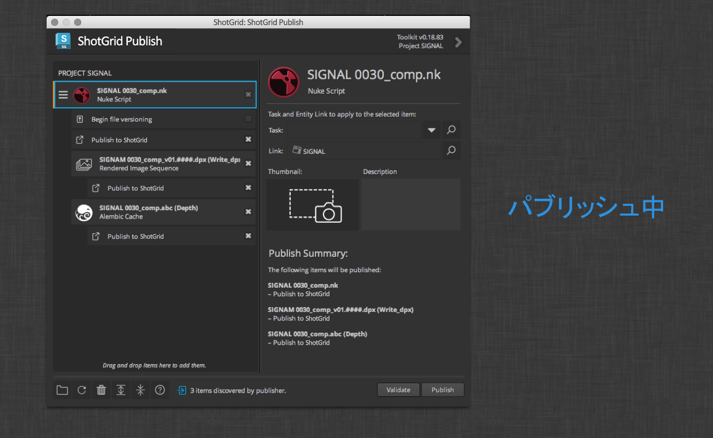

#### 項目およびタスクをパブリッシュする

このウィンドウの左側には、収集されたパブリッシュ項目が表示されています。3 つのパブリッシュ項目があります。作業ファイルが選択されていて、その下に 2 つの子項目があります。また、イメージ ファイル シーケンスおよび Alembic キャッシュがあります。これらの各項目には、**Publish to ** パブリッシュ タスクがアタッチされていて、このタスクを実行すると、 でパブリッシュ エントリの作成が処理され、個々のファイルまたはイメージ シーケンスがトラックされます。

Nuke スクリプトを表す親項目には、**Begin file versioning** プラグインがアタッチされています。このプラグインは、作業ファイルのパスにバージョン番号が含まれていない場合に表示されます。このプラグインをオンにすると、このタスクを実行したときにファイル名にバージョン番号が挿入されます。この場合、ファイル名は `bunny_010_0010.nk` から`bunny_010_0010.v001.nk` に変更されます。こうすることで、アーティストの作業ファイルの履歴が維持されます。このタスクは既定でオフになっていて、実行する必要はありません。このタスクを有効にした状態で項目をパブリッシュすると、次に作業ファイルをパブリッシュするときはファイル名にバージョン番号が挿入されているため、このタスクは表示されなくなります。

パブリッシュ タスクは必要に応じてオンまたはオフにすることができます。項目のチェックボックスにはサブタスクのオン/オフ状態が反映されていて、これらをコントロールします。たとえば、ある項目をオフにすると、そのすべてのタスクがオフになります。複数のタスクの中の 1 つをオフにすると、項目が半分オンの状態になります。特定のタイプのすべてのタスク(すべての **Publish to ** タスクなど)のオン/オフ状態を切り替えるには、`Shift` キーを押しながらチェックボックスをオンまたはオフにします。

パブリッシュ タスクを選択すると、このタスクの実行内容に関する情報が表示されます。

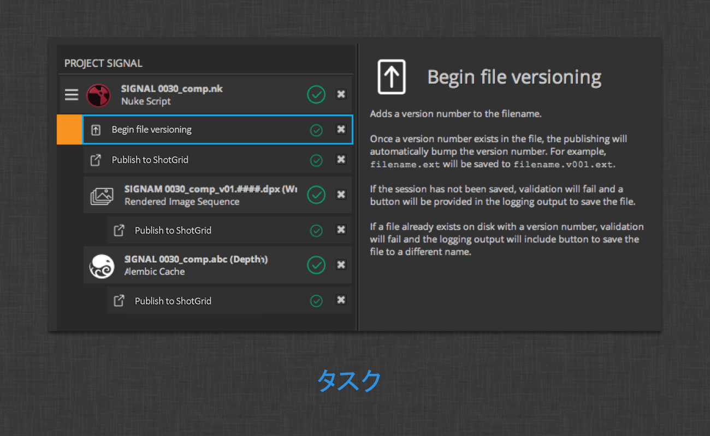

##### コンテキスト

Nuke スクリプト項目の上に、 でパブリッシュされた項目に関連付けられるコンテキストの名前が表示されます。このコンテキストを変更するには、インタフェースの右側にある Task または Link フィールドを変更します。複数の項目をパブリッシュする場合は、それらが異なるコンテキストで表示されることがあります。パブリッシュ項目の左側にある 3 つの水平線を含むアイコンは、コンテキスト間で項目を移動するためのドラッグ ハンドルです。

タスク エントリ フィールドの横に、ドロップダウン形式のメニュー ボタンも配置されています。このメニューで、ユーザが関心を持っている可能性のあるタスク グループをいくつか表示することができます。現在のユーザに割り当てられているタスク、現在のコンテキストに関連しているタスク(同じショットに割り当てられた別のタスクなど)、および最近参照されたタスクが表示されます。

タスクまたはエンティティのリンクを検索するには、いずれかのフィールドをクリックするか、検索アイコンをクリックして関心のあるコンテキストの名前を入力します。一致するタスクまたはエンティティのリンクがフィールドに表示されたら、これをクリックするか、または目的のコンテキストに移動できます。

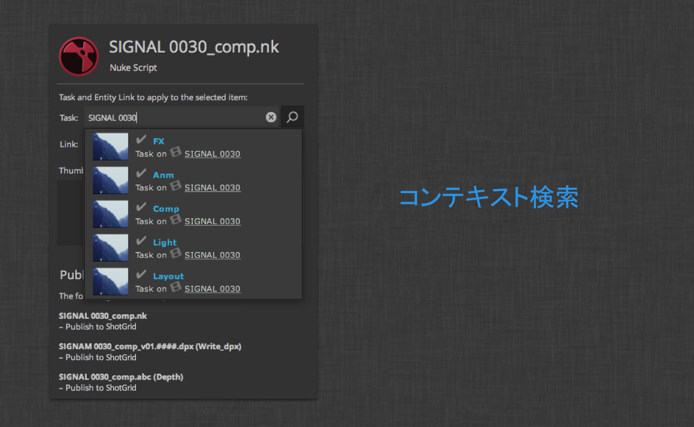

各パブリッシュ項目のカメラ アイコンをクリックすることにより、 内でパブリッシュのサムネイルとして使用する画面の一部を選択することができます。子項目があるシナリオの場合、既定では、子項目は親からサムネイルを継承します。子を選択してそのサムネイルをクリックすることにより、子項目のサムネイルをオーバーライドすることができます。

 のパブリッシュ データに、入力した説明を含めることができます。サムネイルと同様に、説明は親項目から継承されますが、子の詳細エントリに新しい説明を入力して説明をオーバーライドすることができます。

##### 検証

項目をパブリッシュする準備ができたら、[検証] (Validate)ボタンをクリックして、ファイルの状態を確認します。パブリッシュ項目を使用したときに、パブリッシュを予測どおりに完了できるようになります。

すべての項目が正常に検証されると、右側に緑のチェックマークが表示されます。検証されていない項目には、警告アイコンが表示されます。

パブリッシャーの下部にあるステータス ラベル領域にもこのステータスが表示されます。

項目のアイコンまたはステータスのラベルをクリックすると、進行状況の詳細オーバーレイが開き、検証の必要な問題がハイライトされます。

上記の例では、Nuke スクリプトが保存されませんでした。シナリオによっては、問題の解決策にユーザをすばやく誘導するため、または問題に関する詳細を取得するためのアクション ボタンが用意されています。ここには、Nuke の保存ダイアログを開くための**[名前を付けて保存] (Save As)**アクション ボタンが表示されています。

検証問題が修正されたら、進行状況の詳細オーバーレイを閉じて、パブリッシュ項目ビューに戻ることができます。パブリッシュ タスクに関する警告またはエラーを解決している場合は、検証を必要な回数だけ実行できます。

**[パブリッシュ] (Publish)**ボタンをクリックすると、アプリはリスト内の項目およびタスク間を移動して、それぞれに異なる検証パスを実行し、それからパブリッシュ ロジックを実行して  でのエントリ作成、サムネイルのアップロード、作業ファイルのバージョン引き上げなどを行います。項目ごとにパブリッシュの概要を作成し、必要なクリーンアップ作業を行うための仕上げパスも実行されます。

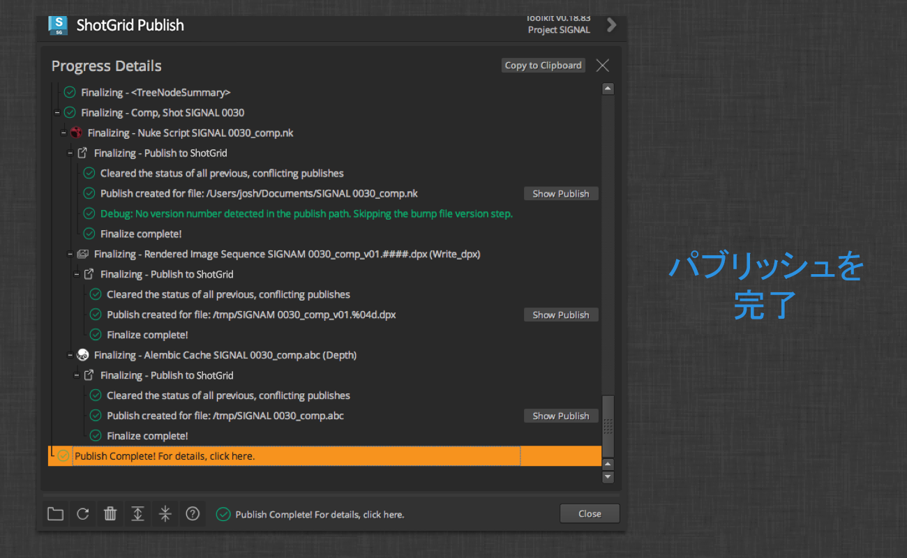

プロセス全体の結果を後で確認するには、パブリッシャーの下部にあるステータス ラベルをクリックして、プロジェクトの詳細オーバーレイを表示します。また、パブリッシュ中に進行状況の詳細ビューを表示したままにして、パブリッシュが発生したときに出力を確認することもできます。上の図には、 で新たに作成されたパブリッシュ エントリにすばやく移動するための追加のアクション ボタンが表示されています。

##### 複数ドキュメントのワークフロー

Photoshop や Nuke Studio などのコンテンツ作成ソフトウェアで複数ドキュメントのワークフローを使用している場合は、パブリッシュ項目リストに最上位項目が複数表示されます。

展開してオンにできるのは、現在のドキュメントまたはアクティブなドキュメントのみです。パブリッシュするすべてのドキュメントをオンにするには、`Shift` を押したまま、オフになっている項目のチェックボックスの中の 1 つをクリックします。折りたたまれた項目を展開するには、下部のツールバーにある展開ボタンを使用します。

複数の最上位項目がある場合は、リストの上部に概要項目が示されます。

この項目を選択すると、パブリッシュ対象として選択されているすべての項目の概要の全体が表示されます。上の図には、4 つの項目と、4 つの異なるコンテキストで実行する合計 8 個のタスクが表示されています。必要に応じて、このビューのすべての項目のコンテキストおよび説明をオーバーライドできます。

上の図には **Upload for review** タスクも表示されています。このタスクは Photoshop ワークフローに限定されません。レビュー可能なメディアとして、トランスコードして  にアップロードすることができるすべてのファイル タイプで使用できます。

#### スタンドアロン パブリッシュ

Publish アプリは、コンテンツ作成ソフトウェア内から実行しなくてもかまいません。

ここには、 Desktop から直接起動できるパブリッシャーを示しています。スタンドアロン モードで起動すると、ファイルの参照またはドラッグ アンド ドロップを実行するための領域が表示されます。

参照ボタンをクリックすると、標準のファイル ブラウザが開き、パブリッシュするファイルを選択できるようになります。

ブラウザでファイルを選択するか、どこかの場所からファイル システムにファイルをドラッグ アンド ドロップすると、これらのファイルがパブリッシュ対象のファイルとして最上位に表示されます。

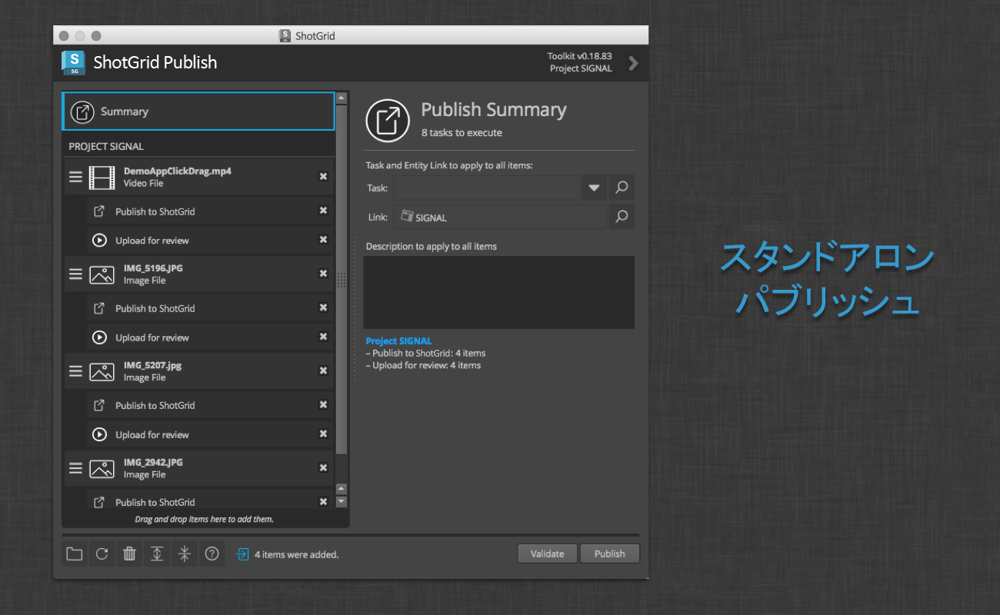

前の例と同様に、パブリッシュするときに、各項目のコンテキストを選択し、説明を設定して、実行するタスクを識別することができます。

#### パブリッシュ タイプ

次のセクションでは、基本的な  の統合ごとに自動収集されるパブリッシュ タイプについて説明します。

##### スタンドアロン

スタンドアロンのワークフローでは、パブリッシュ対象のファイルが自動的に収集されません。ユーザがファイルをパブリッシュするには、ファイルのパスをインタフェースにドラッグするか、ファイルのパスを参照する必要があります。**[パブリッシュ] (Publish)**ボタンをクリックする前の任意の時点で参照またはドロップされたファイルが、パブリッシャーに受け入れられます。基本的な統合では、既知のファイル タイプを使用して  のパブリッシュ タイプと関連付けることにより、任意のファイル拡張子を使用することができます。ファイルの拡張子が認識されない場合は、MIME タイプのファイルが使用されます。認識されたイメージおよびビデオの MIME タイプがパブリッシュ可能になり、確認のためにアップロードするタスクがアタッチされます。

基本的な統合では、ドロップされたフォルダ内にイメージシーケンスが含まれていることが前提となります。フォルダ内に認識されるイメージ シーケンスが見つかると、これらがすべてパブリッシュ対象項目として表示されます。シーケンスが見つからない場合は、パブリッシュ対象の項目が作成されません。

##### 3ds Max

パブリッシュ タイプに **3dsmax Scene** を指定した場合は、現在の Max セッションがパブリッシュ対象として収集されます。収集されたセッションは、Loader を介して別の Max セッションに結合したり、参照したりできます。

現在のセッションのプロジェクト フォルダを判別できる場合は、プロジェクトの **export** フォルダ内にあるすべてのファイルがパブリッシュ対象として表示されます。同様に、プロジェクトの **preview** フォルダ内にあるすべてのムービー ファイルがパブリッシュ可能になります。

##### Houdini

パブリッシュ タイプに **Houdini Scene** を指定した場合は、現在の Houdini セッションがパブリッシュ対象として収集されます。収集されたセッションは、Loader を介して別の Houdini セッションに結合したり、参照したりできます。

次のタイプのノードからディスクに書き込まれたファイルも自動的に収集されて、パブリッシュ項目として表示されます。

* **alembic**
* **comp**
* **ifd**
* **opengl**
* **wren**

##### Maya

パブリッシュ タイプに **Maya Scene** を指定した場合は、現在の Max セッションがパブリッシュ対象として収集されます。収集されたセッションは、Loader を介して別の Maya セッションに読み込んだり、参照したりできます。

現在のセッションのプロジェクト ルートを判別できる場合は、プロジェクトの **cache/Alembic** フォルダ内にあるすべての Alembic ファイルがパブリッシュ対象として表示されます。同様に、プロジェクトの **movies** フォルダ内にあるすべてのムービー ファイルがパブリッシュ可能になります。

##### Nuke

パブリッシュ タイプに **Nuke Script** を指定した場合は、現在の Nuke セッションがパブリッシュ対象として収集されます。収集されたセッションは、Loader を介して別の Nuke セッションに読み込んだり、新しいセッションとして開いたりできます。

次のタイプのノードからディスクに書き込まれたファイルも自動的に収集されて、パブリッシュ項目として表示されます。

* **Write**
* **WriteGeo**

##### Nuke Studio

パブリッシュ タイプに **NukeStudio Project** を指定した場合は、開いているすべての Nuke Studio プロジェクトがパブリッシュ対象として収集されます。収集されたプロジェクトは、Loader を介して別の Nuke Studio セッション内で新しいプロジェクトとして開くことができます。

##### Photoshop CC

パブリッシュ タイプに **Photoshop Image** を指定した場合は、開いているすべての Photoshop ドキュメントがパブリッシュ対象として収集されます。収集されたドキュメントは、Loader を介して別の Photoshop セッション内で新しいレイヤとしてロードしたり、新しいドキュメントとして開いたりできます。

## Loader

 の Loader を使用すると、 にパブリッシュしたファイルの概要確認と参照をすばやく行うことができます。検索可能なツリー ビュー ナビゲーション システムを使用することで、探しているタスク、ショット、またはアセットにすばやく、簡単にアクセスすることができます。アクセスしたら、この項目のすべてのパブリッシュについての概要がローダーにサムネイルで表示されます。その後は、設定可能なフックを利用して、パブリッシュを参照したり、現在のシーンに簡単に読み込んだりできます。

ディスク上のファイルまたはファイルのシーケンス(イメージのシーケンスなど)をそれぞれ表すパブリッシュが  に記録されます。パブリッシュは任意のアプリケーションで作成できますが、通常は Publisher で作成されます。

パブリッシュを作成すると、別のユーザがそのパブリッシュをパイプラインでロードできるようになります。ローダーが関係するのは、この段階です。ローダーを使用すると、ファイル システム ブラウザを連想させる方法で、 内に格納されたパブリッシュを参照することができます。

### 概要

ローダー アプリを使用すると、 にパブリッシュされたファイルをすばやく参照することができます。ローダ アプリには、タスク、ショット、またはアセットのサムネイルを簡単に表示できる検索可能なツリー ビュー ナビゲーション システムがあります。

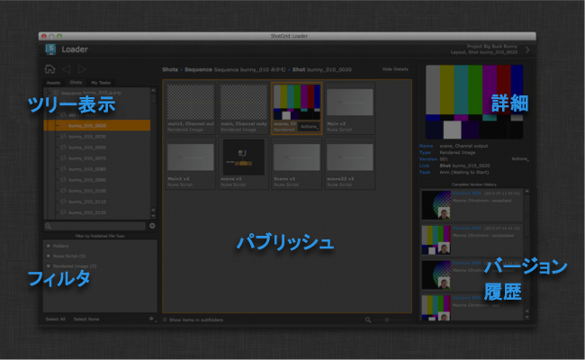

### ツリー ビュー

探しているショット、アセット、またはるタスクをすばやく見つけるには、左側のツリー ビューを使用します。探している項目の名前がわかっている場合は、検索領域にこの名前を入力して、検索フレーズと一致する項目のみをツリーに表示することができます。

入力を開始するとすぐに、ツリーの周りに青いバーが表示されます。このバーが表示されると、ツリー全体を表示することができなくなり、検索フレーズに基づいてツリー内の項目の一部が表示されます。検索を開始すると、ツリー内のすべてのノードが自動的に展開されます。便利なように、ツリーを右クリックすると、ツリー内のすべてのノードを展開する、または折りたたむオプションが表示されます。

### ナビゲーション

ツリー ビューの上部には、3 つのナビゲーション ボタンがあります。

ホーム ボタンをクリックすると、ローダーは現在の作業領域を表すショットまたはアセットに自動的に移動します。現在実行中の作業に関連する内容をすばやくロードする場合は、この方法が便利です。起動時にローダーに既定で表示されるのも、この場所です。ツリー ビューでさまざまな項目を選択すると、時間の経過と共に履歴が作成されます。この履歴内で移動するには、ブラウザと同様に、戻るボタンおよび進むボタンを使用します。

### パブリッシュを見る

ツリー内の項目を選択すると、UI の中央にあるパブリッシュ領域に使用可能なパブリッシュが表示されます。このビューの各項目は、一連のパブリッシュ内の最新の項目を表しています。したがって、例としてバージョン 15 のテクスチャが表示されている場合は、この項目のバージョン履歴にこれ以前の 14 個のバージョンが含まれています。

パブリッシュだけでなく、ショット、シーケンス、アセット、または他の  エンティティ タイプを表すフォルダ アイコンも表示されます。オブジェクトのサムネイルがある場合は、フォルダの上部にサムネイルがオーバーレイされ、ナビゲーションをすばやく、視覚的に行うことができます。フォルダをダブルクリックすると、階層内のこのフォルダに移動できます。

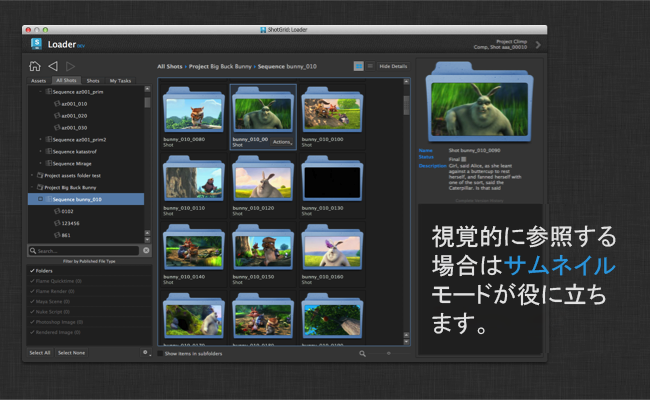

2 つの表示モードがあります。視覚的に参照して、テクスチャなどを検索する場合は、サムネイル モードが非常に便利です。リストをすばやく確認し、ズーム ハンドルを使用して即座にズーム インおよびズーム アウトすることができます。

Nuke スクリプトや Maya ファイルのように、テクスチャほど視覚的な情報が多くないデータを参照する場合は、サムネイル ビューでなくリスト ビューを使用します。このモードでは一部の追加情報がコンパクトに表示されるため、多数の項目内ですばやくスクロールすることができます。

特定のタイプの項目のみを表示する場合は、左下の_フィルタ パネル_を使用して、パブリッシュの表示/非表示をすばやく切り替えることができます。また、このリスト内の各タイプの横にある概要を参照して、現在選択されているツリー項目に対して検索されたパブリッシュ数をタイプごとに確認することもできます。

### 1 つまたは複数のパブリッシュをシーンに取り込む

項目をシーンに取り込む場合は、単にダブルクリックしてください。ローダーがパブリッシュに対して_既定のアクション_を実行します。項目をシーンに追加する方法が複数あることがあります(たとえば、Maya では別の Maya ファイルを参照したり、このファイルをシーンに読み込んだりできます)。この場合は、_[アクション] (Actions)_ ドロップダウン メニューをクリックするか、パブリッシュの任意の場所を右クリックして、使用可能なすべてのオプションを表示します。

複数の項目をシーンに取り込む場合は、複数の要素を選択し、選択範囲内の任意の項目を右クリックして、_[アクション] (Actions)_ポップアップ メニューを表示します。表示されるのは、選択範囲内のすべての項目に適用できるアクションのみであることに注意してください。

パブリッシュでなく、ショットまたはアセット フォルダ オブジェクトを選択した場合は、 またはファイル システムでこの項目を表示するオプションが表示されます。

### 古いパブリッシュを操作する

右側の詳細ペインを開くと、選択したパブリッシュのすべてのバージョン履歴が表示されます。このバージョン履歴から旧バージョンをロードすることができます。この操作を行うには、メイン ビューでパブリッシュを操作する場合と同様に、バージョン履歴内でバージョンを選択し、アクション メニューを使用してロードします。

### 関連付けられたレビュー

パブリッシュにレビュー バージョンが関連付けられている場合は、詳細ペインに再生ボタンが表示されます。このボタンをクリックすると、Web ページ内で Screening Room が起動し、ノートの確認や、バージョンへのノートの追加、および関連付けられたレビュー用 Quicktime の再生をすばやく行うことができます。

## 高度な機能

 のすべての統合は、高度にカスタマイズ可能で拡張可能なプラットフォームの上に構築されていて、ツールキットというパイプラインを作成するのに役立ちます。この機能にアクセスして設定する方法については、『[管理者ガイド](https://developer.shotgridsoftware.com/ja/8085533c/)』を参照してください。

## 謝辞

* PySide のバグ修正版は  Desktop と一緒に配布されtており、[こちら](https://www.autodesk.com/content/dam/autodesk/www/Company/files/PySide-1.2.2.sgtk.zip)から入手できます。
* Big Buck Bunny - 画像提供: (CC) Blender Foundation (www.blender.org)

特殊マークアップ「TANK_NO_HEADER」を追加して、ヘッダが不要だということをドキュメント作成システムに通知します。
