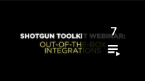

#  Toolkit ウェビナー

*更新日: 2020/5/8*

##  Toolkit ウェビナー プレイリスト

##  Toolkit ウェビナー ビデオ

1:  Toolkit ウェビナー: 追加設定が不要な統合*(60 分)*

新しい一連の Toolkit ウェビナーではまず、Rob Blau と Manne Öhrström が、すぐに開始できる統合についての質問に答えます。

2:  Toolkit ウェビナー: 新しい既定の設定についての解説*(60 分)*

このウェビナーでは、Josh Tomlinson と Rob Blau が、Toolkit プロジェクトの新しい既定の設定での変更点(およびその理由)について説明します。

3:  Toolkit ウェビナー: パブリッシュ ワークフローのカスタマイズ - ライブ デモ*(60 分)*

このウェビナーでは、Josh Tomlinson が、Maya でカスタムのパブリッシュ ワークフローを作成する方法について手順に沿って説明します。ここでは、パブリッシュ アプリの構成、構成方法、およびデータの収集とパブリッシュのためのカスタム フックの作成方法について学びます。

*補足資料*

[パイプラインのチュートリアル](https://developer.shotgridsoftware.com/ja/cb8926fc/)

4:  Toolkit ウェビナー: クラウド設定とマルチロケーション ワークフロー*(60 分)*

このウェビナーでは、Manne Ohrstrom が複数の場所にあるスタジオのアーティストのためのワークフローについて説明します。

*補足資料*

[Toolkit の初期化と設定管理の開発者向けドキュメント](https://developer.shotgridsoftware.com/tk-core/initializing.html)

[Manne が動画で引用している記述子タイプの一覧](https://developer.shotgridsoftware.com/tk-core/descriptor.html#descriptor-types)

5:  エコシステム ウェビナー: REST API *(60 分)*

このウェビナーでは、Brandon Ashworth が、役に立つデモ、使用例、レシピの紹介を通じて REST API の全体像と重要性、使用方法について説明します。

*補足資料*

[REST API リファレンス ドキュメント](https://developer.shotgridsoftware.com/rest-api/)

6:  Toolkit ウェビナー: 新しい Publisher API *(35 分)*

最新の統合リリースには、改善された Publish API が含まれています。これによって GUI アプリからパブリッシュ ロジックを分離し、各自のツールから、あるいはレンダー ファームからパブリッシュを実行できます。このウェビナーでは、Jean-Francois Boismenu が、API を使用して Publisher UI からパブリッシュ項目ツリーをレンダー ファームのジョブに渡す方法について説明します。

*補足資料*

[設定を含む Github リポジトリ](https://github.com/shotgunsoftware/tk-config-publish_api_webinar)

[31:00 で言及されている Pull 要求](https://github.com/shotgunsoftware/tk-config-publish_api_webinar/pull/1)

[Publish API のドキュメント](https://developer.shotgridsoftware.com/tk-multi-publish2/)

7:  Toolkit ウェビナー: After Effects の統合*(38 分)*

Adobe After Effects は、 の最新の統合対象です。このウェビナーでは、Rob Blau が、機能のライブ デモを通じて After Effects の統合について詳しく説明します。また、Photoshop との統合における困難な仕事を振り返り、Adobe 統合のための再利用可能なフレームワークを開発する方法について議論を展開します。

また、Tannaz Sassooni が、新しい開発者向けドキュメント サイトを紹介し、 との統合方法を学ぶユーザ向けによりわかりやすいコンテンツを作成している現状を説明します。

*補足資料*

[After Effects の統合ドキュメント](https://developer.shotgridsoftware.com/ja/1eca509c/)

[開発者用ドキュメント ポータル](https://developer.shotgridsoftware.com/ja)

##  Developer Day プレイリスト

##  Developer Day のビデオ

 チームは SIGGRAPH 2018 および 2019 において  Developer Day を発表しました。このコースへの参加を通じて、開発者はタスクの自動化、カスタム アプリの作成などで使用できるさまざまなリソースについて学ぶことができます。SIGGRAPH の後、Developer Day のコンテンツを特集した一連のウェビナーを開催しました。このプレイリストには、それらのウェビナーの記録が含まれています。

完全なスライド資料、サンプル コード、およびこのコンテンツに関連するその他の資料は、[2019 の場合はこちら](https://github.com/shotgunsoftware/sg-siggraph-2019)、[2018 の場合はこちら](https://github.com/shotgunsoftware/sg-devday-2018/)にあります。

1: SIGGRAPH Developer Day 2019:  開発の概要*(83 分)*

このウェビナーでは、Tannaz Sassooni と Patrick Boucher が  開発の概要を説明し、 の自動化エントリ ポイント、 の Python および REST API、 の API を使用してスタジオのタスクやデータ トラッキングを自動化する方法について紹介します。

[0:56](https://www.youtube.com/watch?v=i0aVJepZw8Y&list=PLEOzU2tEw33r4yfX7_WD7anyKrsDpQY2d&index=1&t=56s) 挨拶とオリエンテーション

[3:00](https://www.youtube.com/watch?v=i0aVJepZw8Y&list=PLEOzU2tEw33r4yfX7_WD7anyKrsDpQY2d&index=1&t=180s)  開発の概要: 一般的なパイプラインのニーズと、 の API と開発フレームワークを使用してそのニーズを満たす方法の概要を説明します。[Tannaz Sassooni]

[25:59](https://www.youtube.com/watch?v=i0aVJepZw8Y&list=PLEOzU2tEw33r4yfX7_WD7anyKrsDpQY2d&index=1&t=1559s)  API を使用したデータ管理の概要: 簡単な Python スクリプトと REST スクリプト、およびアクション メニュー アイテムを作成するためのフレームワークを使用して  の API について説明します。[Patrick Boucher]

2: SIGGRAPH Developer Day 2019: 高度な  開発*(78 分)*

このウェビナーでは、Brandon Ashworth と Manne Öhrström が、 について説明します。イベント デーモンと新しい Webhooks を使用して  でのデータ変更に対応し、 Toolkit を使用して簡単なパイプライン ツールを作成する方法を紹介します。

[0:39](https://www.youtube.com/watch?v=xUeY1pECHdI&list=PLEOzU2tEw33r4yfX7_WD7anyKrsDpQY2d&index=2&t=39s) 挨拶とオリエンテーション

[2:33](https://www.youtube.com/watch?v=xUeY1pECHdI&list=PLEOzU2tEw33r4yfX7_WD7anyKrsDpQY2d&index=2&t=153s)  イベントの操作 [Brandon Ashworth]

[41:25](https://www.youtube.com/watch?v=xUeY1pECHdI&list=PLEOzU2tEw33r4yfX7_WD7anyKrsDpQY2d&index=2&t=2485s) 複数のアーティスト アプリで実行する  Tool の開発 [Manne Öhrström]

3: SIGGRAPH Developer Day: Toolkit の管理*(1 時間 15 分)*

このウェビナーでは、Josh Tomlinson、Tannaz Sassooni、Phil Scadding が、統合を引き継ぎ、カスタム ディレクトリ構造を作成し、フックによってスタジオのデータフローをさらに自動化する方法をデモを通じて説明します。

[0:00](https://www.youtube.com/watch?v=7qZfy7KXXX0&list=PLEOzU2tEw33r4yfX7_WD7anyKrsDpQY2d&index=2&t=0s) 挨拶とオリエンテーション

[1:04](https://www.youtube.com/watch?v=7qZfy7KXXX0&list=PLEOzU2tEw33r4yfX7_WD7anyKrsDpQY2d&index=2&t=64s)  Toolkit の管理:  Desktop アプリを使用して一般的なコンテンツ作成ソフトウェアを起動する方法、および既定のパイプライン統合を使用して、アーティストが作業中のセッションを離れることなく  で作業する方法について説明します。[Phil Scadding]

[32:41](https://www.youtube.com/watch?v=7qZfy7KXXX0&list=PLEOzU2tEw33r4yfX7_WD7anyKrsDpQY2d&index=2&t=1961s) Toolkit の設定の概要: Toolkit のパイプライン設定を自由にナビゲートして、パイプライン ワークフローをカスタマイズする方法について説明します。[Tannaz Sassooni]

[56:20](https://www.youtube.com/watch?v=7qZfy7KXXX0&list=PLEOzU2tEw33r4yfX7_WD7anyKrsDpQY2d&index=2&t=3380s) フックの管理:  Toolkit の広範なフック セットを使用して設定にカスタム ロジックを追加し、Toolkit パイプラインをスタジオのニーズに合わせて調整する方法について説明します。[Josh Tomlinson]

4: SIGGRAPH Developer Day: 高度な  開発*(1 時間 15 分)*

Manne Ohrstrom、Jeff Beeland、Rob Blau が、ソース管理とクラウドベースのパイプライン展開のベスト プラクティスを実演し、アプリのビルドおよび Toolkit の標準フレームワークを使用した UI の迅速な設計とデータ処理について説明します。

[0:00](https://www.youtube.com/watch?v=bT2WlQaJVmY&list=PLEOzU2tEw33r4yfX7_WD7anyKrsDpQY2d&index=3&t=0s) 挨拶とオリエンテーション

[2:31](https://www.youtube.com/watch?v=bT2WlQaJVmY&list=PLEOzU2tEw33r4yfX7_WD7anyKrsDpQY2d&index=3&t=151s) Toolkit プラットフォーム: 開発と展開パターン: 開発のワークフロー、バージョン管理のベスト プラクティス、 サイトへのアップロードによるリモート ユーザへのパイプライン設定の配布など、Toolkit パイプライン構成を設定および展開するためのさまざまな方法について説明します。 [Manne Ohrstrom]

[30:23](https://www.youtube.com/watch?v=bT2WlQaJVmY&list=PLEOzU2tEw33r4yfX7_WD7anyKrsDpQY2d&index=3&t=1823s) Toolkit プラットフォーム: 独自のアプリを作成する: 提供されている API とフレームワークを利用して強力な UI を迅速に作成する方法を、簡単な Toolkit アプリの作成を通じて説明します。[Jeff Beeland]

[1:02:22](https://www.youtube.com/watch?v=bT2WlQaJVmY&list=PLEOzU2tEw33r4yfX7_WD7anyKrsDpQY2d&index=3&t=3742s) Autodesk Forge の紹介: オートデスクの一連の API 駆動型クラウド サービスである Forge、およびこのサービスを使用して  をさらに便利にする方法について説明します。[Rob Blau]

