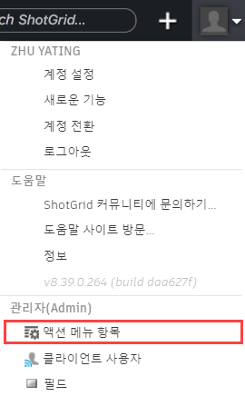

# 커스텀 액션 메뉴 항목

API 개발자는 액션 메뉴 항목(AMI)을 통해 엔티티별로 상황에 맞는 메뉴 항목을  커스터마이즈할 수 있습니다. 예를 들어, 여러 버전을 선택하고 마우스 오른쪽 버튼을 클릭한 다음 "PDF 보고서 작성(Build a PDF Report)"을 선택할 수 있습니다.

## 액션 메뉴 항목 필드

## 액션 메뉴 항목 유형

생성할 수 있는 메뉴 항목 유형은 두 가지입니다.

## HTTP URL 예시

한 예로, "PDF 보고서 작성(Build a PDF Report)"이라는 커스텀 메뉴 항목을 생성할 수 있습니다. 이렇게 하면 사람들이 버전 페이지로 이동하여 하나 이상의 버전을 선택하고 마우스 오른쪽 버튼을 클릭한 다음  메뉴에서 "PDF 보고서 작성(Build a PDF Report)"을 선택할 수 있습니다. 그러면 스크립트(사용자가 생성해야 함)가 실행되면서 깔끔한 형식의 보고서가 브라우저로 다시 전송됩니다. 작동 방식은 다음과 같습니다.

### UI를 통해 메뉴 항목 생성

설정(Settings) 메뉴에서 액션 메뉴 항목(Action Menu Items)을 선택하여 AMI 관리자(AMI Admin) 페이지를 엽니다.

새 AMI를 생성하려면 .

제목(Title) 및 기타 필수 필드를 입력하고, "액션 메뉴 항목 만들기(Create Action Menu Item)"를 클릭합니다.

### 사용자가 AMI를 클릭하면 어떻게 될까요?

 소프트웨어가 새 창에서, 또는 해당 옵션을 선택한 경우 모달 대화상자에서 POST 요청을 발송하고, 현재 페이지에서 수신 URL로 데이터를 함께 전송합니다(POST 요청의 일부로 전송). 다음은 이 워크플로우의 예입니다.

* 사용자가 버전 페이지로 이동
* 사용자가 하나 이상의 버전 선택
* 사용자가 상황에 맞는 메뉴 호출(마우스 오른쪽 버튼 클릭 또는 도구막대에서 기어 메뉴 클릭)
* 사용자가 'PDF 보고서 작성(Build a PDF Report)' 클릭
*  소프트웨어가 새 창에서 AMI의 URL로 POST 요청 발송( 서버는 HTTPS에서 구동되고, 사용자 URL은 HTTP에서 구동되는 경우에는 브라우저 경고가 표시될 수 있음)
* 지정된 URL에 위치한 사용자 스크립트가 POST 데이터를 처리하고, PDF 문서 생성
* 사용자가 보거나 다운로드할 수 있는 깔끔한 형식의 PDF 보고서가 사용자에게 다시 전송됨

## 커스텀 프로토콜 처리기 예시

커스텀 AMI를 한 차원 높게 구현하는 작업에는 커스텀 프로토콜 처리기(예: ://process_version)를 설정하는 작업이 수반됩니다. 이렇게 하면 로컬 컴퓨터에서 스크립트를 통해  소프트웨어를 Maya, RV 또는 Cinesync 같은 응용프로그램과 연동할 수 있습니다. 비-HTTP(S) 프로토콜을 지정하면 데이터가 POST 대신 GET을 통해 사용자 URL로 전송됩니다. 이 방법을 사용하여 내부 도구를 실행하고 다양한 요청을 발송할 수도 있습니다.

커스텀 프로토콜에 관한 자세한 정보는 [커스텀 브라우저 프로토콜을 사용하여 응용프로그램 실행](https://developer.shotgridsoftware.com/ko/67695b40/)을 참조하십시오.

> **참고:** [ 통합](https://developer.shotgridsoftware.com/ko/d587be80/)을 통해 Maya 및 기타 소프트웨어 패키지와의 통합도 기본 제공됩니다.
### 경량 페이로드

커스텀 프로토콜 사용 시 쿼리 정보는 GET 요청으로 전송됩니다. 특정 운영 체제와 브라우저 조합에 따라 허용되는 GET 요청 크기에 다양한 제약이 있습니다. 그래서 커스텀 프로토콜 AMI에서 경량 페이로드 체크박스를 선택하는 것이 좋습니다. 경량 페이로드를 선택한 상태에서는 스크립트가 단일 이벤트 로그 항목 ID를 수신하고, 이를 불러와 레코드 `meta` 필드의 `ami_payload` 키를 읽어 풀 페이로드를 가져올 수 있습니다.

## 예

다음은 시작하는 데 도움이 될 만한 몇 가지 관련 예시 스크립트입니다.

* [ActionMenuItem 호출 처리](http://developer.shotgridsoftware.com/python-api/cookbook/examples/ami_handler.html)
* [버전 패키저](http://developer.shotgridsoftware.com/python-api/cookbook/examples/ami_version_packager.html)

## 페이로드 컨텐츠

### 사용자 데이터

* **user_id:** 현재 로그인한 사용자의 사용자 ID(예: 34)
* **user_login:** 현재 로그인한 사용자의 로그인 정보(예: joe)

### 엔티티 데이터

* **entity_type:** 현재 페이지 또는 뷰의 엔티티 유형(예: 버전)
* **selected_ids:** 선택한 엔티티 ID를 쉼표로 분리한 목록(예: 931, 900)
* **ids:** 현재 페이지의 쿼리에서 반환된 모든 엔티티 ID를 쉼표로 분리한 목록. 이는 페이지 매김 때문에 보이지 않는 항목을 포함한 모든 ID를 반환합니다 (예: 931, 900, 904, 907). AMI에서 "선택 필수(Selection required)"를 선택한 경우 이 값은 **selected_ids**와 같아집니다.

### 페이지 데이터

* **title:** 페이지 제목(예: "모든 버전")
* **page_id:** 액션 메뉴 항목이 클릭된 페이지의 ID(예: 1353)
* **server_hostname:** AMI가 트리거된 시스템의 호스트 이름. 스테이징 서버와 프로덕션 서버 등 같은 AMI를 호출하는 여러 서버가 있는 경우 유용할 수 있습니다.
* **referrer_path:** AMI가 호출된 URL의 정규 경로.
* **session_uuid:** 이 AMI가 호출된 창의 고유 식별자. "데이터 업데이트 폴링(Poll for Data Updates)" 체크박스 및 Python API의 [`set_session_uuid`](http://developer.shotgridsoftware.com/python-api/reference.html?highlight=session_uuid#shotgun_api3.shotgun.Shotgun.set_session_uuid) 메서드와 함께 사용하면 AMI가 호출된 페이지로 정보를 다시 브로드캐스팅할 수 있습니다. **참고:** 이 기능의 업데이트 폴링은 기하급수적으로 감소하며, 폴링이 중지될 때까지 AMI가 업데이트되지 않으면 결국 중지되어 소스 페이지에서 업데이트를 볼 수 없게 될 수도 있습니다.
* **cols:** 페이지에 표시되는 모든 열의 시스템 필드 이름을 쉼표로 분리한 목록(예: code, sg_status_list, description)
* **column_display_names:** 페이지에 표시되는 모든 열의 표시 이름을 쉼표로 분리한 목록(예: 버전, 상태, 설명)
* **view:** AMI가 호출되었을 때 선택했던 뷰. 페이지 디자인 모드를 통해 특정 페이지에 대한 여러 뷰를 생성할 수 있습니다.
* **sort_column:** 정렬 기준이 된 열의 시스템 이름(예: code). 정렬 키가 여러 개인 경우 첫 번째 키만 전송합니다(**sort_columns** 참조).
* **sort_direction:** (예: asc 또는 desc) 정렬 방향이 여러 개인 경우 첫 번째 방향만 전송합니다(**sort_directions** 참조).
* **sort_columns:** 페이지 또는 뷰의 정렬 기준이 된 열의 시스템을 이름을 쉼표로 분리한 목록(예: code,created_at). 정렬 키가 여러 개인 경우에만 전송됩니다.
* **sort_directions:** 페이지 또는 뷰의 정렬 기준이 된 열의 시스템을 이름을 쉼표로 분리한 목록(예: code,created_at). 정렬 키가 여러 개인 경우에만 전송됩니다.
* **grouping_column:** 그룹 지정 기준이 된 열의 시스템 이름(예: code). 그룹 지정 열이 여러 개인 경우 첫 번째 열만 전송됩니다(**grouping_columns** 참조).
* **grouping_method:** 그룹 지정이 이루어진 방식(예: 엔티티 필드의 경우 `entitytype`, 날짜 필드의 경우 `month` 방식으로 그룹 지정). 그룹 지정 방식이 여러 개인 경우 첫 번째 방식만 전송됩니다(**grouping_columns** 참조).
* **grouping_direction:** 그룹 지정 방향(예: asc 또는 desc). 그룹 지정 방향이 여러 개인 경우 첫 번째 방향만 전송됩니다(**grouping_directions** 참조).
* **grouping_columns:** 데이터의 그룹 지정 기준이 된 열의 시스템 이름을 쉼표로 분리한 목록(예: code,created_at). 그룹 지정 열이 여러 개인 경우에만 전송됩니다.
* **grouping_methods:** 그룹 지정 방식을 쉼표로 분리한 목록(예: entity_type,month). 그룹 지정 열이 여러 개인 경우에만 전송됩니다.
* **grouping_directions:** 그룹 지정 방향을 쉼표로 분리한 목록(예: asc,desc). 그룹 지정 열이 여러 개인 경우에만 전송됩니다.

### 프로젝트 데이터(현재 페이지의 모든 엔티티가 같은 프로젝트를 공유하는 경우에만 전송)

* **project_name:** 프로젝트의 이름(예: Gunslinger)
* **project_id:** 프로젝트의 ID(예: 81)