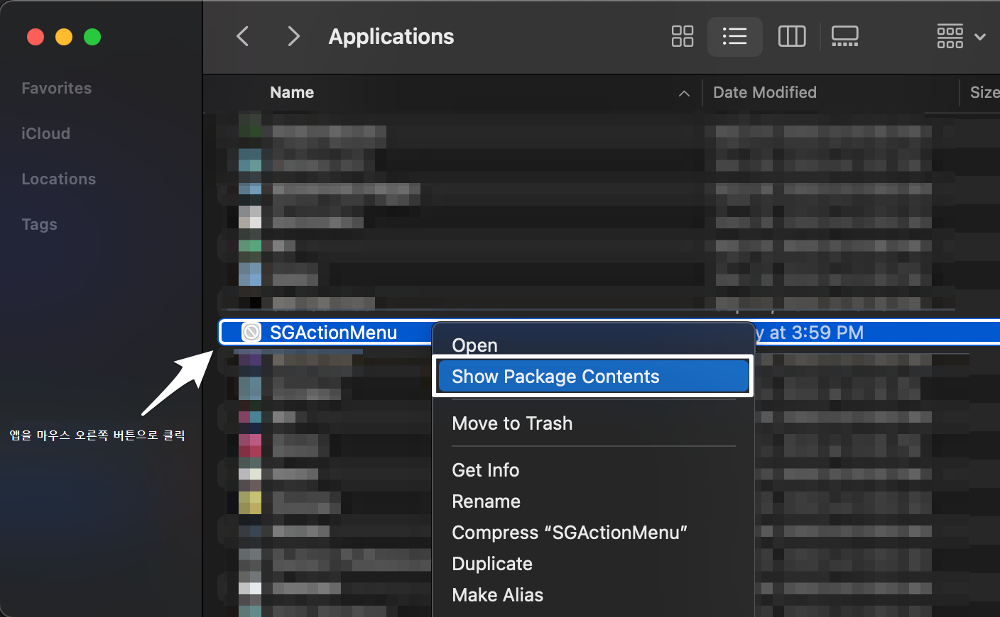
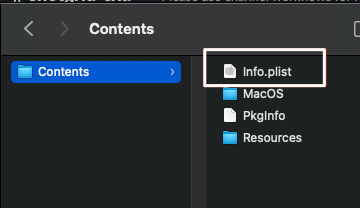

# 커스텀 브라우저 프로토콜을 사용하여 응용프로그램 실행

## 컨텐츠

- [프로토콜 등록](#registering-a-protocol)
  - [Windows에서 프로토콜 등록](#registering-a-protocol-on-windows)
  - [macOS에서 프로토콜 등록](#registering-a-protocol-on-macos)
  - [Linux에서 프로토콜 등록](#registering-a-protocol-on-linux)

가장 실질적인 [AMI(액션 메뉴 항목)](action-menu-items-create.md) 버전은 로컬 컴퓨터에서 응용프로그램 또는 스크립트를 실행하는 AMI입니다. 이 AMI가 작동하도록 하려면 실행하려는 스크립트나 응용프로그램과 브라우저 간 연결을 설정해 주어야 합니다. 이 링크를 커스텀 브라우저 프로토콜이라고 합니다.

사용자가 클릭하면 [foo] 응용프로그램이 실행되는 링크 유형을 설정한다고 해보겠습니다. 'http'를 접두사로 쓰는 대신 'foo' 같은 커스텀 프로토콜을 지정해야 합니다. 다음과 같은 링크가 될 것입니다.  
```
foo://some/info/here
```

운영 체제가 프로토콜 처리 방법을 알아야 합니다. 기본적으로 현재의 모든 운영 체제는 'http'는 기본 웹 브라우저가 처리해야 하고 'mailto'는 기본 메일 클라이언트가 처리해야 한다는 것을 알고 있습니다. 때로 응용프로그램이 설치되면 OS에 등록되고, OS에 특정 프로토콜에서 이 응용프로그램을 실행하도록 알립니다.

예를 들어 RV를 설치하는 경우, 응용프로그램이 `rvlink://`를 OS에 등록하고, RV가 모든 `rvlink://` 프로토콜 요청을 처리하여 이미지나 시퀀스를 RV에 표시할 것임을 알립니다. 따라서 사용자가 에서 하는 것처럼 `rvlink://`로 시작하는 링크를 클릭하면 운영 체제가 이를 인식하여 해당 링크를 통해 RV를 실행하고, 응용프로그램이 링크를 구문 분석하여 어떻게 처리할지 결정합니다.

URL 및 "rvlink" 프로토콜에 대한 자세한 정보는 [RV가 프로토콜 처리기 역할을 하는 방법에 대한 자세한 내용이 담긴 RV 사용자 매뉴얼](https://help.autodesk.com/view/SGSUB/KOR/?guid=SG_RV_rv_manuals_rv_user_manual_rv_user_manual_chapter_c_html#c-2-installing-the-protocol-handler)을 참조하십시오.

# 프로토콜 등록

## Windows에서 프로토콜 등록

Windows에서 프로토콜 처리기를 등록할 때에는 Windows 레지스트리를 수정하게 됩니다. 다음은 해당 레지스트리 키의 일반적인 예입니다.

```
HKEY_CLASSES_ROOT
foo
(Default) = "URL:foo Protocol"
URL Protocol = ""
shell
open
command (Default) = "foo_path" "%1"
```
대상 URL은 다음과 같습니다.

```
foo://host/path...
```



**Windows QT/QSetting 예시**

개발 중인 응용프로그램이 QT(또는 PyQT / PySide) 프레임워크로 작성되었다면 QSetting 객체를 활용하여 레지스트리 키 생성을 관리할 수 있습니다.

다음은 자동으로 응용프로그램이 레지스트리 키를 설정하도록 하기 위한 코드입니다.

```
// cmdLine points to the foo path.
//Add foo to the Os protocols and set foobar to handle the protocol
QSettings fooKey("HKEY_CLASSES_ROOT\\foo", QSettings::NativeFormat);
mxKey.setValue(".", "URL:foo Protocol");
mxKey.setValue("URL Protocol", "");
QSettings fooOpenKey("HKEY_CLASSES_ROOT\\foo\\shell\\open\\command", QSettings::NativeFormat);
mxOpenKey.setValue(".", cmdLine);
```

** AMI를 통해 Python 스크립트를 시작하는 Windows 예**

로컬로 실행되는 많은 AMI가 Python 인터프리터를 통해 간단한 Python 스크립트를 시작하려고 합니다. 덕분에 GUI(PyQT, PySide 또는 사용자가 선택하는 GUI 프레임워크)를 통해 간단한 스크립트나 앱까지 실행할 수 있는 것입니다. 이렇게 시작해 보는 데 도움이 될 만한 유용한 예를 살펴보겠습니다.

**1단계: 커스텀 "" 프로토콜 설정**

Windows 레지스트리 편집기 사용:

```
[HKEY_CLASSES_ROOT\]
@="URL: Protocol"
"URL Protocol"=""
[HKEY_CLASSES_ROOT\\shell]
[HKEY_CLASSES_ROOT\\shell\open]
[HKEY_CLASSES_ROOT\\shell\open\command]
@="python""sgTriggerScript.py""%1"
```

이 설정을 통해 스크립트의 첫 번째 인자 `sgTriggerScript.py` 및 두 번째 인자 `%1`을 통해 `python` 인터프리터를 실행하는 `://` 프로토콜을 등록합니다. `%1`은 브라우저에서 클릭한 URL 또는 호출된 AMI의 URL로 대체된다는 점에 유의하십시오. 이는 사용자의 Python 스크립트에서 첫 번째 인자가 됩니다.



**2단계: Python 스크립트의 수신 URL 구문 분석**

스크립트에서 제공되는 첫 번째 인자인 URL을 가져와 이를 구성요소 단위로 구문 분석하여 AMI가 호출된 컨텍스트를 파악합니다. 다음 코드에서 이를 어떻게 수행하는지 보여 주는 간단한 스캐폴딩을 확인할 수 있습니다.

**Python 스크립트**

```python
import sys
import pprint
try:
    from urlparse import parse_qs
except ImportError:
    from urllib.parse import parse_qs

def main(args):
    # Make sure we have only one arg, the URL
    if len(args) != 1:
        sys.exit("This script requires exactly one argument")

    # Make sure the argument have a : symbol
    if args[0].find(":") < 0:
        sys.exit("The argument is a url and requires the symbol ':'")

    # Parse the URL
    protocol, fullPath = args[0].split(":", 1)

    # If there is a querystring, parse it
    if fullPath.find("?") >= 0:
        path, fullArgs = fullPath.split("?", 1)
        action = path.strip("/")
        params = parse_qs(fullArgs)
    else:
        action = fullPath.strip("/")
        params = ""

    # This is where you can do something productive based on the params and the
    # action value in the URL. For now we'll just print out the contents of the
    # parsed URL.
    fh = open('output.txt', 'w')
    fh.write(pprint.pformat((protocol, action, params)))
    fh.close()
if __name__ == '__main__':
    sys.exit(main(sys.argv[1:])) 
```

**참고:** 이 스크립트는 Python 3 및 Python 2와 호환됩니다.

**3단계:  인터페이스를 커스텀 프로토콜, 그리고 궁극적으로는 스크립트와 연결**

끝으로 에 AMI를 생성합니다. 해당 URL 값은 `shotgrid://processVersion`이 됩니다. 이 AMI를 원하는 어떠한 엔티티 유형에든 할당할 수 있지만 다음 예에서는 버전 엔티티를 사용합니다.

버전 페이지로 이동하여 버전을 마우스 오른쪽 버튼으로 클릭하고 메뉴에서 AMI를 선택합니다. 이렇게 하면 브라우저가 `shotgrid://` URL을 열고, 이 URL이 다시 등록된 커스텀 프로토콜을 통해 사용자의 스크립트로 리디렉션됩니다.

이제 스크립트와 같은 디렉토리에 있는 `output.txt` 파일에서 다음과 같은 항목을 볼 수 있습니다.
```
('processVersion',
 {'cols': ['code',
           'image',
           'entity',
           'sg_status_list',
           'user',
           'description',
           'created_at'],
  'column_display_names': ['Version Name',
                           'Thumbnail',
                           'Link',
                           'Status',
                           'Artist',
                           'Description',
                           'Date Created'],
  'entity_type': ['Version'],
  'ids': ['6933,6934,6935'],
  'page_id': ['4606'],
  'project_id': ['86'],
  'project_name': ['Test'],
  'referrer_path': ['/detail/HumanUser/24'],
  'selected_ids': ['6934'],
  'server_hostname': ['my-site.shotgrid.autodesk.com'],
  'session_uuid': ['9676a296-7e16-11e7-8758-0242ac110004'],
  'sort_column': ['created_at'],
  'sort_direction': ['asc'],
  'user_id': ['24'],
  'user_login': ['shotgrid_admin'],
  'view': ['Default']})
```

**가능한 변형**

AMI에서 URL의 `//` 부분 뒤에 오는 키워드를 변경함으로써 스크립트 내 `action` 변수의 내용을 변경할 수 있습니다. 이때 같은 `shotgrid://` 프로토콜이 유지되고, 커스텀 프로토콜 하나만 등록됩니다. 그러면 `action` 변수의 내용과 매개변수의 내용을 통해 의도된 동작이 무엇인지 스크립트가 파악할 수 있습니다.

이 방법을 사용하여 응용프로그램을 열고, FTP 같은 서비스를 통해 컨텐츠를 업로드하고, 데이터를 보관하고, 이메일을 보내거나, PDF 보고서를 생성할 수 있습니다.

## macOS에서 프로토콜 등록

macOS BigSur 및 Monterey에서 프로토콜을 등록하려면 응용프로그램 또는 스크립트를 실행하도록 구성된 `.app` 번들을 생성해야 합니다.

**1단계: AppleScript 스크립트 편집기**

먼저 AppleScript 스크립트 편집기에서 다음 스크립트를 작성하는 것부터 시작하십시오.

```
on open location this_URL
    do shell script "sgTriggerScript.py '" & this_URL & "'"
end open location 
```

**디버깅 팁:** 오류를 포착하고 팝업에 표시하면 자동으로 오류를 발생시키지 않고 Python 스크립트를 실행하는 데 문제가 있는지 확인할 수 있습니다. 다음은 오류 시도를 위해 AppleScript에 추가할 수 있는 예제 조각입니다.

```
on open location this_URL
	try
		do shell script "/path/to/script.py '" & this_URL & "'"
	on error errStr
		display dialog "error" & errStr
	end try
end open location 
```

> **참고:** `tcsh` 등의 특정 셸에서 Python을 실행하도록 하려면 do shell script를 다음과 같이 변경하면 됩니다. `tcsh -c \"sgTriggerScript.py '" & this_URL & "'\"` 스크립트 편집기에서 간단한 스크립트를 _응용프로그램 번들_로 저장합니다.

**2단계: `info.plist` 파일 편집**

저장된 응용프로그램 번들을 찾아 컨텐츠를 엽니다. 



그런 다음 `info.plist` 파일을 열고, 다음을 plist dict에 추가합니다.



```xml
<key>CFBundleIdentifier</key>
<string>com.mycompany.AppleScript.</string>
<key>CFBundleURLTypes</key>
<array>
<dict>
<key>CFBundleURLName</key>
<string></string>
<key>CFBundleURLSchemes</key>
<array>
<string></string>
</array>
</dict>
</array>
```

다음 세 가지 문자열을 변경할 수도 있습니다(선택 사항).
```
com.mycompany.AppleScript.


```

세 번째 문자열은 프로토콜 처리기이므로 URL은 다음과 같습니다.  

```
shotgrid://something
```

**BigSur를 사용하는 경우 `info.plist` 파일에서 `NSAppleEventsUsageDescription`과 `NSSystemAdministrationUsageDescription` 사이에 있는 다음 줄을 _삭제_해야 합니다.** BigSur 이전 버전을 사용 중인 경우 이 단계를 건너뛰고 아래의 3단계를 계속합니다.

```xml
	<key>NSAppleMusicUsageDescription</key>
	<string>This script needs access to your music to run.</string>
	<key>NSCalendarsUsageDescription</key>
	<string>This script needs access to your calendars to run.</string>
	<key>NSCameraUsageDescription</key>
	<string>This script needs access to your camera to run.</string>
	<key>NSContactsUsageDescription</key>
	<string>This script needs access to your contacts to run.</string>
	<key>NSHomeKitUsageDescription</key>
	<string>This script needs access to your HomeKit Home to run.</string>
	<key>NSMicrophoneUsageDescription</key>
	<string>This script needs access to your microphone to run.</string>
	<key>NSPhotoLibraryUsageDescription</key>
	<string>This script needs access to your photos to run.</string>
	<key>NSRemindersUsageDescription</key>
	<string>This script needs access to your reminders to run.</string>
	<key>NSSiriUsageDescription</key>
	<string>This script needs access to Siri to run.</string> 
  ```

**3단계: `.app` 번들을 Applications 폴더로 이동**

끝으로, `.app` 번들을 Mac의 Applications 폴더로 옮깁니다. 그런 다음 번들을 두 번 클릭하여 프로토콜을 운영 체제에 등록합니다.

데이터 흐름은 이렇습니다. 에서 AMI를 클릭하거나 `shotgrid://`으로 시작하는 URL을 클릭하면 `.app` 번들이 응답하여 이 URL을 Python 스크립트로 전달합니다. 이때 Windows 예에서 사용한 것과 같은 스크립트를 사용할 수 있으며, 동일한 가능성이 모두 적용됩니다.



## Linux에서 프로토콜 등록

다음 코드를 사용합니다.
```
gconftool-2 -t string -s /desktop/gnome/url-handlers/foo/command 'foo "%s"'
gconftool-2 -s /desktop/gnome/url-handlers/foo/needs_terminal false -t bool
gconftool-2 -s /desktop/gnome/url-handlers/foo/enabled true -t bool
```
그리고 다음 위치에서 로컬 GConf 파일의 설정을 전역 기본값으로 사용합니다.  
```
/etc/gconf/gconf.xml.defaults/%gconf-tree.xml
```

Gnome 설정만 변경해도 KDE에도 적용됩니다. Firefox 및 GNU IceCat은 인식할 수 없는 접두사(`foo://` 등)를 만나면 사용자가 실행 중인 창 관리자에 상관없이 gnome-open을 따릅니다. 때문에 KDE의 Konqueror 같은 다른 브라우저는 이 시나리오에서 작동하지 않습니다.

Ubuntu에서 액션 메뉴 항목의 프로토콜 처리기를 설정하는 방법에 대한 자세한 정보는 [https://askubuntu.com/questions/527166/how-to-set-subl-protocol-handler-with-unity](https://askubuntu.com/questions/527166/how-to-set-subl-protocol-handler-with-unity)를 참조하십시오.