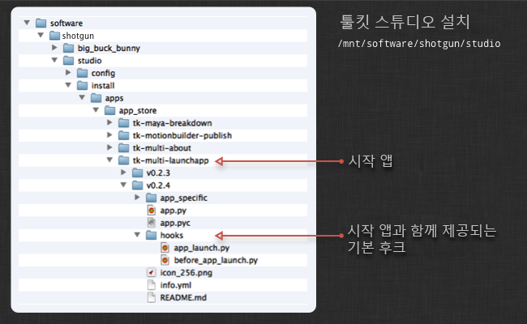

# 고급 툴킷 관리

고급 구성을 위한 툴킷을 관리하고 구성하는 방법을 소개합니다.

이 항목의 내용:
- [소개](#Introduction)
- [tank 명령 사용](#using-the-tank-command)
   - [디버그 모드로 실행](#running-in-debug-mode)
   - [Tookit API를 통해 tank 명령 실행](#running-tank-commands-via-the-tookit-api)
   - [유용한 tank 명령](#useful-tank-commands)
      - [setup_project](#setup_project)
      - [core](#core)
      - [configurations](#configurations)
      - [updates](#updates)
      - [install_app, install_engine](#install_app-install_engine)
      - [app_info](#app_info)
      - [folders, preview_folders](#folders-preview_folders)
      - [shell](#shell)
      - [dump_config](#dump_config)
         [고급 tank 명령](#advanced-tank-commands)
- [툴킷 Python API](#the-toolkit-python-api)
- [파이프라인 구성 및 샌드박스](#pipeline-configurations-and-sandboxes)
   - [샌드박스용 tank 명령 실행](#running-the-tank-command-for-a-sandbox)
   - [샌드박스에서 Core API 사용](#using-the-core-api-from-a-sandbox)
   - [샌드박스 액세스](#accessing-a-sandbox)
   - [파이프라인 구성 현지화](#localizing-a-pipeline-configuration)
   - [복제한 구성 삭제](#deleting-a-cloned-configuration)
- [업데이트 확인](#checking-for-updates)
   - [스테이징 샌드박스 만들기](#creating-a-staging-sandbox)
- [앱 시작 방법 구성](#configuring-how-apps-are-launched)
- [디스크에 폴더 만들기](#creating-folders-on-disk)
   - [파일 시스템 위치](#filesystem-locations)
   - [툴킷 폴더 이름 바꾸기](#renaming-toolkit-folders)
   - [생성 유예 및 사용자 샌드박스](#deferred-creation-and-user-sandboxes)
- [템플릿 구성](#configuring-templates)
   - [템플릿 파일의 @include 구문](#include-syntax-in-the-template-file)
   - [템플릿 파일에 외부 파일 포함](#including-external-files-in-your-template-file)
   - [폴더 생성 및 템플릿](#folder-creation-and-templates)
- [후크](#hooks)
   - [앱 레벨 후크](#app-level-hooks)
   - [코어 레벨 후크](#core-level-hooks)
   - [스튜디오 레벨 후크](#studio-level-hooks)
   - [프로젝트 이름 후크](#project-name-hook)
   - [연결 후크](#connection-hook)
- [앱 및 엔진 구성](#configuring-apps-and-engines)
   - [각 앱에는 위치 설정이 있음](#each-app-has-a-location-setting)
   - [파일 포함](#including-files)
   - [템플릿 설정 구성 - 파일 경로](#configuring-template-settings---file-paths)
   - [후크를 사용하여 앱 동작 커스터마이즈](#using-hooks-to-customize-app-behaviour)


# 소개

 툴킷 관리자 안내서입니다. 이 문서에서는 관리적인 관점에서  Pipeline Toolkit을 사용하여 앱을 설치 및 업데이트하고, 새 프로젝트를 설정하고, 스튜디오 구성을 관리하는 방법을 설명합니다. 툴킷은 비교적 기술적인 부분이므로 구성 및 관리 담당자가 sysadmin, 파이프라인/도구 개발자 또는 TD라고 가정합니다. 자세한 설명을 시작하기 전에 필요하면 다음 문서를 읽어 보시기 바랍니다. 많은 기본 개념을 다루고 구성 관리 및 업데이트에 대해 간략하게 소개합니다.

[ Pipeline Toolkit의 기본 개념 소개](https://developer.shotgridsoftware.com/ko/e95205a8/)

아직  툴킷으로 설정하지 않은 경우 [통합 사용자 안내서](https://developer.shotgridsoftware.com/ko/d587be80/)를 읽는 것이 좋습니다.

# tank 명령 사용

일반적으로  툴킷을 관리하고 사용할 때 `tank` 명령을 사용하는 것이 좋습니다. `tank` 명령을 사용하면 관리 명령과 실제 앱을 명령 셸에서 쉽고 빠르게 실행할 수 있습니다.

기본적으로 새로 만든 각 프로젝트에는 자체 독립적인 Core API와 함께 고유한 `tank` 명령도 있습니다. 간단히 프로젝트 구성 위치로 이동하여 `tank` 명령을 실행하면 해당 프로젝트에 적용 가능한 모든 명령을 볼 수 있습니다.

```
cd /mnt/software//big_buck_bunny
./tank
```
tank 명령은 다양한 방법으로 사용할 수 있습니다. 기본 개념은 먼저 tank 명령에 작동 위치와 수행할 작업을 지정하는 것입니다. 수행할 작업을 지정하지 않으면 사용 가능한 모든 명령 목록이 표시됩니다. 작동 위치를 지정하지 않으면 현재 디렉토리가 사용됩니다. tank 명령을 사용하여  항목을 나열할 수도 있습니다.

tank 명령 사용 방법에 대한 기본 개요:

```python
# Show all tank commands for an asset named 'piano'
> tank Asset piano

# We can also list all assets containing the phrase 'pi'
> tank Asset pi

# We can execute the built-in folder creation command for
# the piano
> tank Asset piano folders

# If the application launcher app is installed, we can launch maya
# and set the work area to the piano
> tank Asset piano launch_maya

# Alternatively, we can specify a path on disk instead of a  entity
> tank /mnt/projects/hero/assets/piano launch_maya

# Or we can change our work directory and run tank like this
> cd /mnt/projects/hero/assets/piano launch_maya
> tank launch_maya
```
## 디버그 모드로 실행

내부적으로 수행되는 작업을 확인하는 것이 유용할 때도 있습니다. `--debug` 플래그를 `tank` 명령에 전달할 수 있으며 이를 통해 상세한 출력 및 타이밍을 가능하게 하고 쉽게 문제를 트래킹하거나 작업이 예상대로 수행되지 않는 이유를 이해할 수 있습니다.

## Tookit API를 통해 tank 명령 실행

또한 대부분의 tank 명령은 API를 통해 실행되도록 완전히 지원됩니다. 이를 실행하여 보다 광범위한 스크립팅 워크플로우의 일부로 툴킷 관련 유지 관리 작업을 쉽게 수행할 수 있습니다. 이를 실행하는 방법에 대한 자세한 정보는 [Core API 참조](https://developer.shotgridsoftware.com/tk-core/)를 참조하십시오.

## 유용한 tank 명령

다음은  툴킷을 관리할 때 사용할 수 있는 유용한 tank 명령 목록입니다.

### setup_project

 데스크톱에 있는 프로젝트 설정 마법사의 명령행 버전입니다.  툴킷으로 새 프로젝트를 설정합니다. 에 프로젝트가 있고 툴킷을 사용하도록 확장하려고 할 때 이 설정으로 시작합니다. 이 명령은 프로세스를 통해 안내하며 사용할 구성 및 설정할 프로젝트와 같은 다양한 정보를 요청합니다.

**동일한 프로젝트에서 setup_project 다시 실행**

기본적으로 setup_project는 아직 설정되지 않은 프로젝트만 나열합니다. 그러나 동일한 프로젝트에서(특히 테스트하는 동안) setup_project를 다시 실행해야 하는 경우가 종종 있습니다. 이는 이전에 이미 설정한 프로젝트를 식별하는 노트와 함께 모든 프로젝트를 나열하는 --force 플래그를 전달하여 수행할 수 있습니다.

```python
> tank setup_project --force

Welcome to SGTK!
For documentation, see https://support.shotgunsoftware.com
- Running setup_project...

force mode: Projects already set up with Toolkit can be set up again.

Welcome to SGTK Project Setup!

Connecting to ...
Connecting to the App Store...

------------------------------------------------------------------
Which configuration would you like to associate with this project?

You can use the configuration from an existing project as a template for this
new project. All settings, apps and folder configuration settings will be
copied over to your new project. The following configurations were found:

   big_buck_bunny: '/mnt/software/sgtk/big_buck_bunny'
   ghosts: '/mnt/software/sgtk/ghosts'
   chasing_perfection: '/mnt/software/sgtk/chasing_perfection'

If you want to use any of the configs listed about for your new project, just
type in its path when prompted below.

You can use the Default Configuration for your new project.  The default
configuration is a good sample config, demonstrating a typical basic setup of
the  Pipeline Toolkit using the latest apps and engines. This will be
used by default if you just hit enter below.

If you have a configuration stored somewhere on disk, you can just enter the
path to this config it will be used for the new project.

[tk-config-default]:
Downloading Config tk-config-default v0.4.15 from the App Store...

This is the 'Default Config' config.

Below are all active projects, including ones that have been set up:
--------------------------------------------------------------------

[ 4] Demo Project
     Fubar is an epic story of an on-going political wa...

[ 5] Big Buck Bunny
Note: This project has already been set up.
     A killer bunny movie

[ 6] The Ghosts of Pere Lachaise
Note: This project has already been set up.
     De Films en Aiguille and ChezEddy present this year...

[ 7] Chasing Perfection
Note: This project has already been set up.
     You've seen the car commercials, the car races, and...

[ 8] What Happened to My Headphones?
     The Ryan Mayeda story

Please type in the id of the project to connect to or ENTER to exit:
```

툴킷은 프로젝트 설정 프로세스의 일부로 프로젝트 이름을 제안합니다. 이름에 만족하면 Enter 키를 눌러 계속 진행하고 만족하지 않은 경우 다른 이름을 직접 입력합니다.

프로젝트에 대해 특별한 스튜디오 이름 지정 규칙이 있는 경우 프로젝트 설정 프로세스에서 제안하는 기본값을 제어할 수도 있습니다. 이 작업은 고급 스튜디오 레벨 후크를 통해 수행됩니다. 자세한 정보는 이 문서 뒷부분의 스튜디오 레벨 후크 섹션을 참조하십시오.

### core

Core API 업데이트를 확인합니다. 이 명령은 App Store에 연결하여 최신 버전의 Core API가 있는지 확인합니다. Core API가 있는 경우 업데이트할 것인지 묻습니다.

이 명령의 출력 예:

```python
> tank core

Welcome to Sgtk!
Starting Sgtk for your current directory '/private/tmp'
- Running core...

WARNING: You are potentially about to update the Core API for multiple
projects.

Welcome to the Sgtk update checker!
This script will check if the Sgtk Core API
installed in /mnt/software/sgtk/studio
is up to date.

You are currently running version v0.13.22 of the Sgtk Platform
No need to update the Sgtk Core API at this time!
```

### configurations

프로젝트의 모든 구성에 대한 개요를 제공합니다. 이 명령은 프로젝트의 현재 액티비티를 분석하고자 할 때 유용할 수 있습니다.

이 명령의 출력 예:

```python
> tank Project Bunny configurations

Welcome to Sgtk!
Will search across all  Projects.
- Found Project Big Buck Bunny
- Starting Sgtk v0.13.22 using configuration
/mnt/software/sgtk/big_buck_bunny.
- Setting the Context to Big Buck Bunny.
- Running configurations...

Fetching data from ...

======================================================================
Available Configurations for Project 'Big Buck Bunny'
======================================================================

Configuration 'Primary' (Public)
-------------------------------------------------------

This is the Project Master Configuration. It will be used whenever this
project is accessed from a studio level sgtk command or API constructor.

Linux Location:  /mnt/software/sgtk/big_buck_bunny
Winows Location: z:\mnt\software\sgtk\big_buck_bunny
Mac Location:    /mnt/software/sgtk/big_buck_bunny

This configuration is using a shared version of the Core API.If you want it to
run its own independent version of the Toolkit Core API, you can run:
> /mnt/software/sgtk/big_buck_bunny/tank localize

If you want to check for app or engine updates, you can run:
> /mnt/software/sgtk/big_buck_bunny/tank updates

If you want to change the location of this configuration, you can run:
> /mnt/software/sgtk/big_buck_bunny/tank move_configuration

This is a public configuration. In , the actions defined in this
configuration will be on all users' menus.

Configuration 'Dev Area' (Private)
-------------------------------------------------------

Linux Location:  /Users/manne/sgtk_dev
Winows Location: z:\Users\manne\sgtk_dev
Mac Location:    /Users/manne/sgtk_dev

This configuration is using a shared version of the Core API.If you want it to
run its own independent version of the Toolkit Core API, you can run:
> /Users/manne/sgtk_dev/tank localize

If you want to check for app or engine updates, you can run:
> /Users/manne/sgtk_dev/tank updates

If you want to change the location of this configuration, you can run:
> /Users/manne/sgtk_dev/tank move_configuration

This is a private configuration. In , only Admin 3 will see the actions
defined in this config. If you want to add additional members to this
configuration, navigate to the SG Pipeline Configuration Page and add
them to the Users field.
```

### updates

이 명령은 프로젝트와 관련된 모든 환경에 사용 가능한 최신 버전의 앱 또는 엔진이 있는지 확인합니다. 앱과 엔진의 설치 방법에 따라 이 업데이트 프로그램이 로컬 git 리포지토리, Github 또는  툴킷 App Store에 대해 검사를 진행할 수 있습니다. 최신 버전이 검색되면 설정을 업데이트할지 묻습니다. 새로운 구성 매개변수가 새 버전의 앱에 도입된 경우 값을 묻는 메시지가 나타날 수 있습니다.

일반 구문:

```
> tank updates [environment_name] [engine_name] [app_name]
```

특수 키워드 ALL을 사용하여 한 범주의 모든 항목을 나타낼 수 있습니다. 예:

- 모든 항목 검사: `tank updates`
- 샷 환경 검사: `tank updates Shot`
- 모든 환경의 모든 Maya 앱 검사: `tank updates ALL tk-maya`
- 샷 환경의 모든 Maya 앱 검사: `tank updates Shot tk-maya`
- 모든 위치에서 Loader 앱이 최신 버전인지 확인: `tank updates ALL ALL tk-multi-loader`
- Maya에서 Loader 앱이 최신 버전인지 확인: `tank updates ALL tk-maya tk-multi-loader`

### install_app, install_engine

프로젝트와 관련된 환경 중 하나에 새 엔진 또는 앱을 설치합니다. 이 명령을 사용하여 툴킷 App Store 또는 git에서 설치할 수 있습니다.

### app_info

모든 앱과 주요 구성 설정에 대한 분석 보기

### folders, preview_folders

디스크에 항목에 대한 폴더를 만듭니다.

이 명령의 출력 예

```python
Welcome to Sgtk!
Will search across all  Projects.
- Found Asset Squirrel (Project 'Big Buck Bunny')
- Starting Sgtk v0.13.22 using configuration
/mnt/software/sgtk/big_buck_bunny.
- Setting the Context to Asset Squirrel.
- Running folders...

Creating folders, stand by...

The following items were processed:
 - /mnt/projects/big_buck_bunny
 - /mnt/projects/big_buck_bunny/reference
 - /mnt/projects/big_buck_bunny/reference/artwork
 - /mnt/projects/big_buck_bunny/reference/footage
 - /mnt/projects/big_buck_bunny/sequences
 - /mnt/projects/big_buck_bunny/assets
 - /mnt/projects/big_buck_bunny/assets/Character
 - /mnt/projects/big_buck_bunny/assets/Character/Squirrel
 - /mnt/projects/big_buck_bunny/assets/Character/Squirrel/sgtk_overrides.yml
 - /mnt/projects/big_buck_bunny/assets/Character/Squirrel/Art
 - /mnt/projects/big_buck_bunny/assets/Character/Squirrel/Model
 - /mnt/projects/big_buck_bunny/assets/Character/Squirrel/Rig
 - /mnt/projects/big_buck_bunny/assets/Character/Squirrel/Surface
 - /mnt/projects/big_buck_bunny/assets/Character/Squirrel/Art/publish
 - /mnt/projects/big_buck_bunny/assets/Character/Squirrel/Art/publish/elements
 - /mnt/projects/big_buck_bunny/assets/Character/Squirrel/Art/publish/maya
 - /mnt/projects/big_buck_bunny/assets/Character/Squirrel/Art/publish/nuke
 - /mnt/projects/big_buck_bunny/assets/Character/Squirrel/Art/publish/photoshop
 - /mnt/projects/big_buck_bunny/assets/Character/Squirrel/Art/publish/photoshop/jpg
 - /mnt/projects/big_buck_bunny/assets/Character/Squirrel/Art/publish/photoshop/psd
 - /mnt/projects/big_buck_bunny/assets/Character/Squirrel/Art/reference
 - /mnt/projects/big_buck_bunny/assets/Character/Squirrel/Art/reference/artwork
 - /mnt/projects/big_buck_bunny/assets/Character/Squirrel/Art/reference/footage
 - /mnt/projects/big_buck_bunny/assets/Character/Squirrel/Art/review
 - /mnt/projects/big_buck_bunny/assets/Character/Squirrel/Art/work
 - /mnt/projects/big_buck_bunny/assets/Character/Squirrel/Art/work/images
 - /mnt/projects/big_buck_bunny/assets/Character/Squirrel/Art/work/maya
 - /mnt/projects/big_buck_bunny/assets/Character/Squirrel/Art/work/maya/workspace.mel
 - /mnt/projects/big_buck_bunny/assets/Character/Squirrel/Art/work/maya/snapshots
 - /mnt/projects/big_buck_bunny/assets/Character/Squirrel/Art/work/nuke
 - /mnt/projects/big_buck_bunny/assets/Character/Squirrel/Art/work/nuke/snapshots
 - /mnt/projects/big_buck_bunny/assets/Character/Squirrel/Art/work/photoshop
 - /mnt/projects/big_buck_bunny/assets/Character/Squirrel/Art/work/photoshop/snapshots
 - /mnt/projects/big_buck_bunny/assets/Character/Squirrel/Model/publish
 - /mnt/projects/big_buck_bunny/assets/Character/Squirrel/Model/publish/elements
 - /mnt/projects/big_buck_bunny/assets/Character/Squirrel/Model/publish/maya
 - /mnt/projects/big_buck_bunny/assets/Character/Squirrel/Model/publish/nuke
 - /mnt/projects/big_buck_bunny/assets/Character/Squirrel/Model/publish/photoshop
 - /mnt/projects/big_buck_bunny/assets/Character/Squirrel/Model/publish/photoshop/jpg
 - /mnt/projects/big_buck_bunny/assets/Character/Squirrel/Model/publish/photoshop/psd
 - /mnt/projects/big_buck_bunny/assets/Character/Squirrel/Model/reference
 - /mnt/projects/big_buck_bunny/assets/Character/Squirrel/Model/reference/artwork
 - /mnt/projects/big_buck_bunny/assets/Character/Squirrel/Model/reference/footage
 - /mnt/projects/big_buck_bunny/assets/Character/Squirrel/Model/review
 - /mnt/projects/big_buck_bunny/assets/Character/Squirrel/Model/work
 - /mnt/projects/big_buck_bunny/assets/Character/Squirrel/Model/work/images
 - /mnt/projects/big_buck_bunny/assets/Character/Squirrel/Model/work/maya
 - /mnt/projects/big_buck_bunny/assets/Character/Squirrel/Model/work/maya/workspace.mel
 - /mnt/projects/big_buck_bunny/assets/Character/Squirrel/Model/work/maya/snapshots
 - /mnt/projects/big_buck_bunny/assets/Character/Squirrel/Model/work/nuke
 - /mnt/projects/big_buck_bunny/assets/Character/Squirrel/Model/work/nuke/snapshots
 - /mnt/projects/big_buck_bunny/assets/Character/Squirrel/Model/work/photoshop
 - /mnt/projects/big_buck_bunny/assets/Character/Squirrel/Model/work/photoshop/snapshots
 - /mnt/projects/big_buck_bunny/assets/Character/Squirrel/Rig/publish
 - /mnt/projects/big_buck_bunny/assets/Character/Squirrel/Rig/publish/elements
 - /mnt/projects/big_buck_bunny/assets/Character/Squirrel/Rig/publish/maya
 - /mnt/projects/big_buck_bunny/assets/Character/Squirrel/Rig/publish/nuke
 - /mnt/projects/big_buck_bunny/assets/Character/Squirrel/Rig/publish/photoshop
 - /mnt/projects/big_buck_bunny/assets/Character/Squirrel/Rig/publish/photoshop/jpg
 - /mnt/projects/big_buck_bunny/assets/Character/Squirrel/Rig/publish/photoshop/psd
 - /mnt/projects/big_buck_bunny/assets/Character/Squirrel/Rig/reference
 - /mnt/projects/big_buck_bunny/assets/Character/Squirrel/Rig/reference/artwork
 - /mnt/projects/big_buck_bunny/assets/Character/Squirrel/Rig/reference/footage
 - /mnt/projects/big_buck_bunny/assets/Character/Squirrel/Rig/review
 - /mnt/projects/big_buck_bunny/assets/Character/Squirrel/Rig/work
 - /mnt/projects/big_buck_bunny/assets/Character/Squirrel/Rig/work/images
 - /mnt/projects/big_buck_bunny/assets/Character/Squirrel/Rig/work/maya
 - /mnt/projects/big_buck_bunny/assets/Character/Squirrel/Rig/work/maya/workspace.mel
 - /mnt/projects/big_buck_bunny/assets/Character/Squirrel/Rig/work/maya/snapshots
 - /mnt/projects/big_buck_bunny/assets/Character/Squirrel/Rig/work/nuke
 - /mnt/projects/big_buck_bunny/assets/Character/Squirrel/Rig/work/nuke/snapshots
 - /mnt/projects/big_buck_bunny/assets/Character/Squirrel/Rig/work/photoshop
 - /mnt/projects/big_buck_bunny/assets/Character/Squirrel/Rig/work/photoshop/snapshots
 - /mnt/projects/big_buck_bunny/assets/Character/Squirrel/Surface/publish
 - /mnt/projects/big_buck_bunny/assets/Character/Squirrel/Surface/publish/elements
 - /mnt/projects/big_buck_bunny/assets/Character/Squirrel/Surface/publish/maya
 - /mnt/projects/big_buck_bunny/assets/Character/Squirrel/Surface/publish/nuke
 - /mnt/projects/big_buck_bunny/assets/Character/Squirrel/Surface/publish/photoshop
 - /mnt/projects/big_buck_bunny/assets/Character/Squirrel/Surface/publish/photoshop/jpg
 - /mnt/projects/big_buck_bunny/assets/Character/Squirrel/Surface/publish/photoshop/psd
 - /mnt/projects/big_buck_bunny/assets/Character/Squirrel/Surface/reference
 - /mnt/projects/big_buck_bunny/assets/Character/Squirrel/Surface/reference/artwork
 - /mnt/projects/big_buck_bunny/assets/Character/Squirrel/Surface/reference/footage
 - /mnt/projects/big_buck_bunny/assets/Character/Squirrel/Surface/review
 - /mnt/projects/big_buck_bunny/assets/Character/Squirrel/Surface/work
 - /mnt/projects/big_buck_bunny/assets/Character/Squirrel/Surface/work/images
 - /mnt/projects/big_buck_bunny/assets/Character/Squirrel/Surface/work/maya
 - /mnt/projects/big_buck_bunny/assets/Character/Squirrel/Surface/work/maya/workspace.mel
 - /mnt/projects/big_buck_bunny/assets/Character/Squirrel/Surface/work/maya/snapshots
 - /mnt/projects/big_buck_bunny/assets/Character/Squirrel/Surface/work/nuke
 - /mnt/projects/big_buck_bunny/assets/Character/Squirrel/Surface/work/nuke/snapshots
 - /mnt/projects/big_buck_bunny/assets/Character/Squirrel/Surface/work/photoshop
 - /mnt/projects/big_buck_bunny/assets/Character/Squirrel/Surface/work/photoshop/snapshots

In total, 93 folders were processed.
```
### shell

현재 선택된 컨텍스트에서 대화식 Python 셸을 시작합니다. 미리 초기화된 API, 컨텍스트 및 엔진 객체에 대한 유용한 참조를 설정합니다. `./tank shell`을 사용하여 툴킷 및  API 코드 예제를 테스트해 볼 수 있습니다. tank 실행 파일은 로컬 컴퓨터의 **파이프라인 구성 루트**에 있으며 다음과 같이 표시됩니다.

```
> cd /my_tank_configs/project_foobar
```

이 명령의 출력 예:

```python
Welcome to SGTK!
For documentation, see https://support.shotgunsoftware.com
You are running a tank command associated with  Project 'Chasing the
Light'. Only items associated with this project will be considered.
- Found Shot moo87 (Project 'Chasing the Light')
- Starting the SG pipeline toolkit v0.15.14.
- Setting the Context to Shot moo87.
- Started Shell Engine version v0.3.3
- Environment: /mnt/software/tank/chasing_the_light/config/env/shot.yml.
- Running shell...

Welcome to SG Pipeline Toolkit Python!
2.7.1 (r271:86832, Jul 31 2011, 19:30:53)
[GCC 4.2.1 (Based on Apple Inc. build 5658) (LLVM build 2335.15.00)]
Running on darwin

- A tk API handle is available via the tk variable
- A Shotgun API handle is available via the Shotgun variable
- Your current context is stored in the context variable
- The shell engine can be accessed via the engine variable
>>>
>>> tk
<Sgtk Core vHEAD@0x105f66990 Config /mnt/software/tank/chasing_the_light>
>>>
>>> context
<Sgtk Context:   Project: {'type': 'Project', 'id': 88, 'name': 'Chasing the Light'}
  Entity: {'type': 'Shot', 'id': 1184, 'name': 'moo87'}
  Step: None
  Task: None
  User: {'type': 'HumanUser', 'id': 42, 'name': 'Manne \xc3\x96hrstr\xc3\xb6m'}
  Additional Entities: []>
>>>
>>> Shotgun
<tank_vendor.Shotgun_api3.Shotgun.Shotgun object at 0x105fb2990>
>>>
>>> engine
<Sgtk Engine 0x105feead0: tk-shell, env: shot>
>>>
```

위의 예제에서 `./tank`는 Python 셸을 시작하고 필요한 몇 가지 변수를 설정합니다. 이 명령은 위의 변수에 다음과 같은 핸들과 컨텍스트를 제공하므로 인증과 사용자 세션 설정 및  사이트에 대한 커넥션 시작과 같은 몇 가지 기초 작업을 수행하지 않아도 됩니다.

- `tk` 변수에는 [툴킷 API](https://developer.shotgridsoftware.com/tk-core/core.html?highlight=context#the-toolkit-core-api)에 액세스할 수 있는 핸들이 있습니다.
- `` 변수에는 이미 사이트에 연결되고 데이터베이스 및 [ 사이트의 다른 항목을 쿼리할 준비가 된 [ API](https://developer.shotgridsoftware.com/python-api/)에 대한 핸들이 있습니다.]
- 컨텍스트 변수는 현재 컨텍스트(프로젝트, 샷, 에셋, 파이프라인 단계, 사용자 등)를 참조합니다. [다음은 활성 컨텍스트](https://developer.shotgridsoftware.com/tk-core/core.html?highlight=context#sgtk.Context)의 예입니다. 이 예에서 컨텍스트 인스턴스는 현재 컨텍스트를 설명하는 일련의 주요 필드를 수집하는 데 사용됩니다. 컨텍스트를 현재 작업 영역이라고도 합니다. 일반적으로 컨텍스트는 사용자가 작업 중인 현재 샷 또는 에셋입니다. 이 예에서 프로젝트는 "Chasing the Light"이고, ID는 1184이며, 샷은 "moo87"임을 알 수 있습니다. 할당된 파이프라인 단계 또는 태스크는 없지만 사용자는 Manne입니다. 툴킷 API용 스크립트를 작성할 때 이 정보가 필요할 수도 있으며 이 유용한 컨텍스트 변수에서 모든 항목을 사용할 수 있습니다.

```python
<Sgtk Context:   Project: {'type': 'Project', 'id': 88, 'name': 'Chasing the Light'}
     Entity: {'type': 'Shot', 'id': 1184, 'name': 'moo87'}
     Step: None
     Task: None
     User: {'type': 'HumanUser', 'id': 42, 'name': 'Manne \xc3\x96hrstr\xc3\xb6m'}
     Additional Entities: []>
```

`engine` 변수는 현재 실행 중인 [셸 엔진](https://developer.shotgridsoftware.com/ko/2ad59ee8/)의 인스턴스를 가리킵니다.

### dump_config

Core `v0.18`에서 사용 가능합니다.

기존 환경 구성을 `STDOUT` 또는 다른 파일에 덤프합니다. 구성의 전체 또는 스파스 표현을 덤프할 수 있습니다. 전체 표현에는 모든 설정의 기본값이 포함되지만 스파스 표현에는 설정의 기본값과는 다른 값만 포함됩니다. 기본적으로 명령의 출력에는 기본값이 있는 매니페스트를 기록한 각 설정의 코멘트가 포함되며 구성에 있는 항목과 다른 경우 기본값이 포함됩니다. 이 명령은 안전을 위해 기존 파일에 환경 구성을 덤프하는 것을 허용하지 않습니다.

용도:

```
./tank dump_config env_name [--sparse | --full] [--no_debug-comments] [--file=/path/to/output/file.yml]
```

이 명령의 출력 예:

```python
> ./tank dump_config shot_step --sparse --file=/tmp/shot_step.yml

Welcome to SGTK!
For documentation, see https://support.shotgunsoftware.com
Starting toolkit for path '/Shotgun/configs/sparse34913'
- The path is not associated with any SG object.
- Falling back on default project settings.
- Running as user 'Toolkit'
- Using configuration 'Primary' and Core HEAD
- Setting the Context to sparse34913.
- Running command dump_config...

----------------------------------------------------------------------
Command: Dump config
----------------------------------------------------------------------

Dumping config...
```

위의 명령을 실행하면 현재 프로젝트의 `shot_step` 환경 파일에 대한 스파스 복사본이 `/tmp/shot_step.yml`에 기록됩니다.

추가 디버그 코멘트를 제외하려면 `--no_debug_comments` 플래그를 사용합니다.

### 고급 tank 명령

다음은  툴킷을 관리할 때 사용할 수 있는 고급 tank 명령 목록입니다.

- `tank share_core` - 새 프로젝트가 만들어지면 각 프로젝트가 독립적으로 Core API의 복사본을 유지하는 상태로 종종 만들어집니다. 이 명령을 사용하면 이러한 프로젝트의 코어를 가져와서 디스크의 별도 위치로 이동할 수 있습니다. 이렇게 하면 여러 개의 프로젝트가 Core API의 단일 복사본을 공유하는 공유 코어를 만들 수 있습니다.

- `tank attach_to_core` - 새 프로젝트가 만들어지면 각 프로젝트가 독립적으로 Core API의 복사본을 유지하는 상태로 종종 만들어집니다. 이 명령을 사용하면 Core API의 자체 포함 버전을 유지 관리하지 않고 기존 Core API 설치에 구성을 연결할 수 있습니다.

- `tank localize` - 이 명령은 Core API를 특정 파이프라인 구성 위치로 다운로드합니다. 이 방법은 툴킷 스테이징 영역 내에서 새 버전의 Core API를 테스트하려는 경우에 유용합니다. 이 문서에서 이 프로세스에 대해 자세히 설명합니다.

- `tank clear_cache` - 툴킷의 일부 캐시를 지웁니다. 이 명령은 어떤 이유로든  내에 메뉴 항목이 나타나지 않는 경우 유용할 수 있습니다.

- `tank validate` - 프로젝트 구성의 유효성을 확인합니다.

- `tank cache_apps` - 필요한 모든 앱, 엔진 및 프레임워크 버전이 디스크에 있는지 확인합니다.

- `tank switch_app` - 개발에 유용합니다. 앱을 App Store 모드에서 로컬 또는 git 모드로 전환하거나 그 반대로 전환합니다.

- `tank push_configuration` - 현재 파이프라인 구성에 포함된 구성을 다른 파이프라인 구성으로 밉니다.

# 툴킷 Python API

 데스크톱, `tank` 명령 또는 를 사용하여 응용프로그램을 시작하는 경우 툴킷은 자동으로 `PYTHONPATH`에 추가되고 초기화됩니다. 툴킷 API를 수동으로 소싱하고 실행하는 것이 유용한 경우가 있습니다. Toolkit Core API를 pythonpath에 추가한 다음 가져와서 수행할 수 있습니다.

각 프로젝트 구성에는 `project_config_root/install/core/python` 안에 `python` 폴더가 있습니다. 해당 위치를 Python 경로에 추가하기만 하면 `sgtk` API를 가져올 수 있습니다.

```python
import sgtk

# create a Sgtk API object for a  entity
tk = sgtk.sgtk_from_entity("Shot", 123)

# Create a Sgtk API object based on a file system location
tk = sgtk.sgtk_from_path("/mnt/projects/hero/assets/chair")
```

# 파이프라인 구성 및 샌드박스

파이프라인 구성은 스튜디오 설치와 기본 구조가 동일합니다. 가장 중요한 점은 `install/core/python` 내부에 `tank` 명령과 툴킷 API가 모두 포함되어 있다는 것입니다. API와 tank 명령이 각 구성 전반에서 중복되는 이유는 개발을 쉽게 수행하고 프로덕션 구성 외부에서 작업을 수행하기 위해서입니다.

 툴킷에 새 프로젝트가 설정되면 해당 프로젝트 설정에 따라 프로젝트에 대한 ***기본 파이프라인 구성***이 생성됩니다. 이 구성을 '기본(Primary)'이라고 하며 프로젝트의 기본 구성을 나타냅니다.  내부에서 구성은 프로젝트에 대한 파이프라인 구성 엔티티 형태로 표현됩니다. 개발을 수행하거나 구성을 변경할 때는 일반적으로 기본(Primary) 구성에서 작업하지 않습니다. 실수로 일부 구성을 변경할 경우 해당 프로젝트에서 작업하는 모든 사람에게 영향을 줍니다. 대신  내부의 구성을 복제할 수 있습니다. 이제 다른 사람에게 영향을 주지 않고 변경 작업을 수행할 수 있는 자체 병렬 구성을 가질 수 있습니다.

## 샌드박스용 tank 명령 실행

스튜디오 레벨의 `tank` 명령을 사용하여 앱을 실행하면 항상 프로젝트의 기본 구성이 사용됩니다. 따라서 `tank Shot ABC123 launch_maya`를 입력하면  툴킷은 샷 ABC123이 속한 프로젝트를 찾고 기본 파이프라인 구성을 찾은 다음 Maya를 시작할 때 해당 구성 설정을 사용합니다. 대신 dev 샌드박스에서 실험 구성을 사용하려는 경우 개발 샌드박스 내에서 특정 tank 명령을 사용하여 Maya를 시작합니다(`~/sgtk_dev_sandbox/tank Shot ABC123 launch_maya`). 이제 툴킷은 프로젝트의 기본 구성이 아닌 dev 샌드박스의 구성을 사용합니다.

## 샌드박스에서 Core API 사용

마찬가지로, 스튜디오 설치 위치가 아닌 파이프라인 구성 내부에서 툴킷 API를 실행하려는 경우 스튜디오 Python API가 아닌 `PYTHONPATH`에 dev 샌드박스를 추가할 수 있습니다.

## 샌드박스 액세스

 내부는 훨씬 더 간단합니다. 프로젝트의 각 파이프라인 구성에는 해당 구성을 볼 수 있는 사용자의 목록이 있습니다. 필드를 공백으로 두면 모든 사용자가 구성을 볼 수 있습니다.


구성을 복제하면(에서 마우스 오른쪽 버튼으로 클릭) 자동으로 해당 구성에 연결되어 해당 구성에 대한 독점적인 가시성이 부여됩니다. Maya에서 새로 개발한 도구를 아티스트가 테스트하도록 하려면 해당 아티스트를 파이프라인 구성 dev 샌드박스에만 추가하면 됩니다. 그러면 아티스트가 샌드박스에서 Maya를 시작한 다음 프로세스 도구에서 작업에 액세스할 수 있습니다.

## 파이프라인 구성 현지화

기본적으로 파이프라인 구성은  툴킷 스튜디오 설치에서 해당 코드를 선택합니다. 툴킷 스튜디오 설치에는  툴킷이 사용하는 모든 앱 및 엔진 코드의 캐시와 Toolkit Core API 설치가 포함됩니다. 각 파이프라인 구성은 스튜디오 위치에서 Core API와 앱 캐시를 공유합니다. 이 방법을 사용하면 Core API 업데이트를 모든 프로젝트에 동시에 적용할 수 있기 때문에 유용할 때가 있습니다. 스튜디오 위치를 업데이트하면 모든 프로젝트에 영향을 줍니다.

그러나 때로는 파이프라인 구성을 잘라서 독립적으로 만들 수도 있습니다. 이러한 경우의 예는 다음과 같습니다.

- 업데이트를 중단하고 아무 변경 없이 프로젝트를 완료하려는 경우
- Toolkit Core API의 새 버전을 테스트하려는 파이프라인 구성이 있는 경우
- 집에서 작업할 때 사용할 최소한의 툴킷 번들을 조립하려는 경우

이 프로세스는 스튜디오 위치에서 완전히 독립적인 파이프라인 구성을 만들므로 구성을 ***현지화***한다고 하며 기본적으로 Core API가 파이프라인 구성에 복사됩니다. `tank localize` 명령을 실행하여 이 작업을 수행합니다.

구성을 현지화한 후에는 더 이상 스튜디오 tank 명령을 실행할 수 없습니다. 일반적으로 프로젝트가 현지화된 후에는 로컬 tank 명령과 Python API를 사용해야 합니다.

## 복제한 구성 삭제

복제한 구성 또는 dev 영역을 더 이상 사용하지 않으려면 해당 레코드를 삭제한 다음 디스크에서 해당 구성을 삭제합니다.

# 업데이트 확인

앱이나 엔진에 대한 업데이트가 있는지를 쉽게 확인할 수 있습니다. 프로젝트에 대해 `tank updates` 명령을 실행하기만 하면 됩니다.  툴킷은 업데이트를 확인하고 업데이트할 것인지 묻습니다. 기본값이 없는 새 매개변수가 있으면 업데이트 스크립트에서 값을 묻는 메시지를 표시합니다. 변경된 사항의 상세 정보를 확인하려는 경우 각 업데이트의 릴리즈 정보 페이지에 대한 URL 링크를 참조하십시오. 언제든지 프로세스를 종료할 수 있습니다.

Toolkit Core API를 업데이트하는 방법도 간단합니다. `tank core` 명령을 실행하기만 하면 됩니다.

## 스테이징 샌드박스 만들기

대부분은 기본 구성에서 `tank updates`를 실행하기만 해도 안전하지만 프로덕션 환경에 배포하기 전에 테스트하는 것이 좋습니다. 이 경우 기본 파이프라인 구성을 복제한 다음 업데이트 명령을 실행합니다. Core API 업그레이드의 경우 `core` 명령을 실행하기 전에 샌드박스를 현지화해야 합니다(현지화에 대한 자세한 정보는 윗부분 참조). 업데이트가 작동하는지 확인되면 기본 구성에서 다시 실행합니다. 이 작업을 수행하는 방법에 대한 자세한 정보는 [구성 관리](https://developer.shotgridsoftware.com/ko/60762324/)를 참조하십시오.

# 앱 시작 방법 구성

설치 직후 종종 구성에 필요한 툴킷 구성의 한 부분은 앱 시작 구성입니다. 당사에서는 이미 스튜디오가 커스터마이즈 및 도구를 갖추고 있는 경우가 많으므로 유연하고 구성 가능하도록 만들려고 노력해 왔습니다.

 내부에서 또는 tank 명령을 사용하여 응용프로그램(예: Maya 또는 Nuke)을 시작하면 응용프로그램 시작 및 툴킷 초기화를 담당하는 앱을 호출하게 됩니다. 이 앱을 `tk-multi-launchapp`이라고 합니다.

툴킷 스타터 구성 중 하나를 사용하여 새 프로젝트를 설정하면 시작 앱과 함께 사용되는 응용프로그램 경로를 변경하는 방법에 대한 지침이 표시됩니다. 대신 사용할 수 있는 대체 시스템이 있는 경우 이 앱을 반드시 사용할 필요는 없습니다. 시작 관리자 응용프로그램은 일반적으로 다음 단계를 수행합니다.

1. 사용할 컨텍스트를 파악합니다. 컨텍스트는 현재 작업 영역을 나타냅니다. 마우스 오른쪽 버튼으로  내부의 태스크, 에셋 또는 샷을 클릭하면 이를 기반으로 컨텍스트가 만들어집니다. tank 명령을 사용하는 경우 명령줄의 일부로 지정하는 것이거나 현재 디렉토리에서 선택됩니다.

2. 그런 다음 앱 구성의 설정에 따라 응용프로그램을 시작합니다. 시작 앱은 응용프로그램의 경로, 전달할 명령줄 인자, 응용프로그램을 실행하는 실제 코드 및 응용프로그램 시작 전에 설정해야 하는 환경 변수 등 여러 가지 방법으로 구성할 수 있습니다.

3. 툴킷 API가 나중에 초기화될 수 있도록 Pythonpath를 설정합니다.

4. 응용프로그램이 시작되면 툴킷 API를 가져와서 초기화합니다.

5. 마지막으로 엔진이 시작됩니다.

**예:  툴킷 시작 방법에 대한 추가 연습 예**

툴킷의 일반적인 부트스트래핑은 몇 단계로 진행됩니다.

- 기본 호스트 응용프로그램이 시작됩니다. 여기에는 Python 인터프리터가 있습니다. 이는 매우 간단한 형식으로 표준 셸에서 실행하는 CPython 인터프리터일 뿐입니다. Maya 또는 Nuke이거나 포함된 Python 인터프리터가 기본 제공되는 다른 항목일 수도 있습니다.

- Toolkit Core API를 `PYTHONPATH`에 추가하고 가져옵니다. `import sgtk`

- 이제 컨텍스트를 파악해야 합니다. 디스크상의 경로 또는  객체일 수 있습니다. 이제 팩토리 방식을 사용하여 툴킷 API 인스턴스를 만들 수 있습니다. `tk = sgtk.sgtk_from_path("/mnt/projects/hero/assets/chair01/lighting")` 또는  엔티티를 사용할 수 있습니다. `tk = sgtk.sgtk_from_entity("Shot", 123)` 엔티티를 사용할 때 위의 코드가 에 연결되고 해당 샷의 파이프라인 구성을 해결하고 디스크의 파이프라인 구성을 찾은 다음 파일 시스템 템플릿과 같은 Sgtk의 기본 설정을 로드합니다. 이 시점에서는 앱이나 엔진이 로드되지 않습니다. 경로 조회의 경우 파일 시스템을 사용하여 파이프라인 구성을 찾습니다.

- 이제 현재 작업 영역을 나타내는 컨텍스트 객체를 만듭니다. 엔티티 또는 경로에서 이 작업을 수행할 수도 있습니다. `ctx = tk.context_from_entity("Shot", 123)` 또는 `ctx = tk.context_from_path("/mnt/projects/hero/assets/chair01/lighting")`

- 마지막으로 엔진을 시작합니다. Maya 내부에서 Maya의 Python 인터프리터에 있는 이 명령을 실행하는 경우 다음을 수행합니다. `sgtk.platform.start_engine('tk-maya', tk, ctx)` 이렇게 하면 다음 작업이 수행됩니다.

   - 컨텍스트에 대한 환경 선택 후크를 실행합니다. 환경 선택 후크는 사용할 환경을 반환합니다. 환경에는 로드할 모든 앱 목록과 해당 구성이 포함되어 있습니다.

   - 환경 파일이 결정되면 엔진이 메모리에 로드됩니다. 그런 다음 엔진 기반 객체가 동적으로 로드되고 해당 init 방식을 실행합니다. 엔진이 로드되면 모든 앱이 동일한 방식으로 로드됩니다. 로드되는 동안 일반적으로 엔진이 응용프로그램 어딘가에 "" 메뉴를 등록하고 각 앱은 일련의 명령을 엔진에 등록합니다. 이러한 명령은 나중에 실행을 위한 진입점이 됩니다. 사용자가  메뉴에서 특정 항목을 클릭하면 앱 실행이 트리거됩니다.

전체적인 예의 모습은 다음과 같습니다.

```python
# starting up sgtk when your context is based on a path
import sgtk
path = "/mnt/projects/hero/assets/chair01/lighting"
# create a sgtk api handle
tk = sgtk.sgtk_from_path(path)
# create a context object
ctx = tk.context_from_path(path)
# start the tank engine
sgtk.platform.start_engine('tk-maya', tk, ctx)

# starting up sgtk when your context is based on a  object
import sgtk
entity_type = "Shot"
entity_id = 123
# create a sgtk api handle
tk = sgtk.sgtk_from_entity(entity_type, entity_id)
# create a context object
ctx = tk.context_from_entity(entity_type, entity_id)
# start the sgtk engine
sgtk.platform.start_engine('tk-maya', tk, ctx)
```

# 디스크에 폴더 만들기

툴킷 구성의 핵심 부분은 파일 시스템 구성입니다.  툴킷을 사용하면 일관된 방식으로 디스크에 폴더를 만들 수 있으며 생성 프로세스는 에서 구동됩니다. 다음은 구성 내부의 핵심 폴더에 대한 개요입니다.


폴더 구성을 설정하는 것은 비교적 쉽습니다. 구성은 기본적으로 사용자가 만든 템플릿 폴더 구조이며, 여기에는 폴더가 에셋 또는 샷 등을 나타내야 함을 가리키는 일부 구성 파일이 있습니다. 파일 시스템 구조를 구성할 때 언제든지 ***폴더 미리보기*** 기능을 사용하여 만들 항목의 목록을 가져올 수 있습니다. 이 명령은 와 tank 명령에서 모두 사용할 수 있습니다.

일반적인 폴더를 사용하여 스캐폴드의 윤곽을 그리면서 시작합니다. 예를 들어 에셋, 샷 또는 파이프라인 단계를 나타내는 스캐폴드에 동적 폴더 레벨이 있는 경우 우선 무시합니다. 결과에 만족하면 각 동적 폴더에 동적 기능을 단계별로 추가합니다. 이 작업을 수행하려면 폴더와 이름이 같은 yml 파일을 추가합니다.

yaml 파일에서 특수 구문을 사용하여 폴더를 만드는 방법을 정의합니다.  툴킷은 많은 동적 동작을 지원하지만 일반적으로는  엔티티를 나타내는 동적 노드입니다. 이 경우 구성 파일의 모양은 다음과 유사할 수 있습니다.

```python
# the type of dynamic content
type: "Shotgun_entity"

# the Shotgun field to use for the folder name
name: "{code}_{sg_prefix}"

# the Shotgun entity type to connect to
entity_type: "Asset"

# Shotgun filters to apply when getting the list of items
# this should be a list of dicts, each dict containing
# three fields: path, relation and values
# (this is std Shotgun API syntax)
# any values starting with $ are resolved into path objects
filters:
    - { "path": "project", "relation": "is", "values": [ "$project" ] }
    - { "path": "sg_asset_type", "relation": "is", "values": [ "$asset_type"] }

```

동적 폴더가 에셋 엔티티에 두 개의  필드를 사용하여 명명된 폴더를 만들어야 한다는 정보가 제공됩니다. 또한 현재 프로젝트 및 에셋 유형의 에셋만 고려하여 표준  API 쿼리 구문을 사용하여 상위 폴더를 기반으로 제약 조건을 정의합니다.

지원되는 노드 유형에 대한 자세한 정보는 [참조 문서를 참조하십시오](https://developer.shotgridsoftware.com/ko/82ff76f7/).

## 파일 시스템 위치

툴킷 폴더 생성 시스템을 통해 디스크에 폴더를 만들면 이러한 폴더도 에 저장되고 트래킹됩니다. 폴더는 관리자 메뉴 아래에 있을 수 있는 의 **파일 시스템 위치** 엔티티로 표시됩니다. 일반적으로 이 데이터는 툴킷에 의해 백그라운드에서 트래킹되며 사용자가 볼 필요는 없습니다. 이러한 파일 시스템 위치 엔티티는 툴킷에서 디스크의 폴더를 동기화하고 트래킹하는 데 사용되며 폴더 만들기가 처음 실행될 때 만들어진 방식대로 디스크의 폴더 구조를 다시 만드는 데 사용할 수 있습니다. 파일 시스템 위치 엔티티 데이터는 차례로 디스크의 특정 경로와 관련된  엔티티를 파악하려고 할 때 주로 사용됩니다.

성능상의 이유로 파일 시스템 위치 테이블의 컨텐츠는 사용자의 로컬 시스템에 캐시됩니다. 이는 폴더/엔티티 조회 속도를 높이기 위한 것입니다. 전문가의 경우 `cache_location` 코어 후크를 수정하여 이 캐시의 위치를 커스터마이즈할 수 있습니다. 캐시된 로컬 폴더 표현은 응용프로그램을 시작할 때와 디스크에 폴더를 만들 때마다 동기화됩니다.

## 툴킷 폴더 이름 바꾸기

툴킷 폴더 생성을 실행하면 의 엔티티와 디스크의 폴더 간에 연결이 설정됩니다.  툴킷은 폴더 스키마 구성을 사용하여 디스크에 일련의 폴더를 생성하고 이러한 각 폴더는 의 `Filesystem Location` 엔티티로 등록됩니다. 즉,  데이터(예: 샷 및 에셋 이름) 및 구성이 디스크 및 의 실제 폴더에 "지정"된다고 생각할 수 있습니다.

폴더가 만들어지면 더 이상 에서 엔티티 이름을 자유롭게 변경할 수 없습니다. 엔티티의 이름을 바꾸고 툴킷을 시작하려고 하면 오류 메시지가 나타납니다. 이는 특정 엔티티와 관련된 폴더의 트래킹을 피하기 위한 것입니다.

툴킷 폴더의 이름을 바꾸려면 다음을 수행합니다.

- 먼저 에서 엔티티(에셋 또는 샷)의 이름을 변경합니다.
- `tank unregister_folders` 명령을 실행하여 등록된 폴더의 등록을 취소합니다. 그러면 엔티티와 디스크 간의 관계를 트래킹하는 의 파일 시스템 위치 엔티티가 제거됩니다. 이 명령은 디스크의 컨텐츠에는 영향을 주지 않으며 디스크의 위치를 가리키는 의 `Filesystem Location` 엔티티에만 영향을 줍니다. 예를 들어, Plant라는 에셋에 대한 폴더의 등록을 취소하려면 `tank Asset Plant unregister_folders` 명령을 실행합니다. 폴더의 등록이 취소된다는 간략한 내용과 함께 작업 확인을 요청합니다.
- 폴더의 등록이 취소되면 본질적으로 에셋이 "재설정"됩니다. 현재 에셋과 관련된 폴더가 없을 때 에서 새 이름으로 폴더 생성을 실행하면 디스크에 새 폴더가 만들어집니다.
- 마지막으로 디스크의 이전 위치에서 새 위치로 모든 데이터를 이동합니다. 또한 파일 간의 링크가 새 위치를 가리키도록 업데이트되는지 확인합니다.

## 생성 유예 및 사용자 샌드박스

툴킷 폴더 생성도 두 가지 단계로 실행되도록 설정할 수 있습니다. 하나의 단계는 사용자가 폴더 생성 명령을 실행할 때마다 실행되고 또 다른 단계는 응용프로그램이 시작되기 직전에 실행됩니다. 이 동작은 툴킷 응용프로그램 시작 관리자(폴더 생성을 수행하기 위한 표준 API 방식 호출)에서 기본으로 제공합니다. 폴더 생성 유예의 경우 다음과 같은 사례를 처리할 수 있습니다.

- 파이프라인에 다양한 컨텐츠 생성 응용프로그램이 여러 개 있고 실제로 필요할 때까지 모든 응용프로그램 각각에 대해 전체 폴더 스캐폴드를 포함하지 않으려는 경우 각각의 컨텐츠 생성 앱에 구성에서 유예된 하위 트리가 포함되도록 폴더 생성을 설정할 수 있습니다. 프로덕션 담당자 또는 관리자가 샷에 대한 폴더를 만들면 Maya, Nuke, Mari 등의 작업 영역을 만들기 직전에 중지됩니다. 그런 다음 응용프로그램이 시작되면 이러한 폴더가 응용프로그램이 시작되기 직전에 만들어집니다.
- 파일 시스템에 사용자 기반 샌드박스를 만들려면 작업을 수행하기 직전에 샌드박스를 만들어야 합니다. 폴더 생성 유예를 사용하면 이 프로세스를 쉽게 수행할 수 있는 특별한 사용자 노드를 추가할 수 있습니다. 그런 다음 템플릿 구성에서는 사용자 노드를  API에서 나타내는 방식인 HumanUser로 참조합니다.

생성 유예에 대한 자세한 정보는 [참조 설명서를 참조하십시오](https://developer.shotgridsoftware.com/ko/82ff76f7/).

# 템플릿 구성

파일 시스템 구조를 만들었으면 위의 폴더 구조를 기반으로 일련의 파일 시스템 위치를 구성할 차례입니다. 이러한 위치는 템플릿이라고 하며  툴킷의 필수적인 부분입니다. 템플릿 파일에는 각 필드의 의미를 정의하는 키 섹션, 템플릿 경로를 정의할 수 있는 경로 섹션 및 문자열 표현식을 정의할 수 있는 문자열 섹션 등 세 부분이 있습니다. 파일에서 두 가지 구문을 사용할 수 있습니다. 즉, 단일 저장소 루트가 있는 구성에 사용할 수 있는 단순 형식의 구문과 다중 루트 구성에 사용할 수 있는 고급 구문이 있습니다.

**예: 단일 루트 템플릿 형식**

```yml
# The keys section contains the definitions for all the different keys that are being
# used in the Toolkit. A key is a magic token that is replaced by a value at runtime, for example
# {Shot}. The section below tells the Toolkit which data types and formats to expect for each key.
keys:
    Sequence:
        type: str
    Shot:
        type: str
    Step:
        type: str
    sg_asset_type:
        type: str
    Asset:
        type: str
    name:
        type: str
        filter_by: alphanumeric
    iteration:
        type: int
    version:
        type: int
        format_spec: '03'
    version_four:
       type: int
       format_spec: '04'
       alias: version
    timestamp:
        type: str
    width:
        type: int
    height:
        type: int
    channel:
        type: str
        filter_by: alphanumeric
    SEQ:
        type: sequence
        format_spec: '04'
    eye:
        type: str

# The paths section contains all the the key locations where files are to be stored
# by the Toolkit Apps. Each path is made up of several keys (like {version} or {shot}) and
# these are defined in the keys section above.
#
# Toolkit apps use these paths as part of their configuration to define where on disk
# different files should go.
paths:

    ##########################################################################################
    # Shot pipeline / maya

    shot_root: 'sequences/{Sequence}/{Shot}/{Step}'

    # define the location of a work area
    shot_work_area_maya: '@shot_root/work/maya'

    # define the location of a publish area
    shot_publish_area_maya: '@shot_root/publish/maya'

    # The location of WIP files
    maya_shot_work: '@shot_root/work/maya/{name}.v{version}.ma'

    # The location of backups of WIP files
    maya_shot_snapshot: '@shot_root/work/maya/snapshots/{name}.v{version}.{timestamp}.ma'

    # The location of published maya files
    maya_shot_publish: '@shot_root/publish/maya/{name}.v{version}.ma'

    ##########################################################################################
    # Asset pipeline / maya

    asset_root: 'assets/{sg_asset_type}/{Asset}/{Step}'

    # define the location of a work area
    asset_work_area_maya: '@asset_root/work/maya'

    # define the location of a publish area
    asset_publish_area_maya: '@asset_root/publish/maya'

    # The location of WIP files
    maya_asset_work: '@asset_root/work/maya/{name}.v{version}.ma'

    # The location of backups of WIP files
    maya_asset_snapshot: '@asset_root/work/maya/snapshots/{name}.v{version}.{timestamp}.ma'

    # The location of published maya files
    maya_asset_publish: '@asset_root/publish/maya/{name}.v{version}.ma'

# The strings section is similar to the paths section - but rather than defining paths
# on disk, it contains a list of strings. Strings are typically used when you want to be
# able to configure the way data is written to  - it may be the name field for a
# review version or the formatting of a publish.
strings:

    nuke_shot_version_name: '{Shot}_{name}_{channel}_v{version}.{iteration}'
    nuke_asset_version_name: '{Asset}_{name}_{channel}_v{version}.{iteration}'
```

**예: 다중 루트 템플릿 형식**

```yml
#
# The keys section contains the definitions for all the different keys that are being
# used in the Toolkit. A key is a magic token that is replaced by a value at runtime, for example
# {Shot}. The section below tells the Toolkit which data types and formats to expect for each key.
#
keys:
    Sequence:
        type: str
    Shot:
        type: str
    Step:
        type: str
    sg_asset_type:
        type: str
    Asset:
        type: str
    name:
        type: str
        filter_by: alphanumeric
    iteration:
        type: int
    version:
        type: int
        format_spec: '03'
    version_four:
       type: int
       format_spec: '04'
       alias: version
    timestamp:
        type: str
    width:
        type: int
    height:
        type: int
    channel:
        type: str
        filter_by: alphanumeric
    SEQ:
        type: sequence
        format_spec: '04'
    eye:
        type: str

# The paths section contains all the the key locations where files are to be stored
# by the Toolkit Apps. Each path is made up of several keys (like {version} or {shot}) and
# these are defined in the keys section above.
# Toolkit apps use these paths as part of their configuration to define where on disk
# different files should go.
paths:

    ##########################################################################################
    # Shot pipeline / Maya

    shot_root: 'sequences/{Sequence}/{Shot}/{Step}'

    # define the location of a work area
    shot_work_area_maya:
      definition: '@shot_root/work/maya'
      root_name: primary

    # define the location of a publish area
    shot_publish_area_maya:
      definition: '@shot_root/publish/maya'
      root_name: primary

    # The location of WIP files
    maya_shot_work:
      definition: '@shot_root/work/maya/{name}.v{version}.ma'
      root_name: primary

    # The location of backups of WIP files
    maya_shot_snapshot:
      definition: '@shot_root/work/maya/snapshots/{name}.v{version}.{timestamp}.ma'
      root_name: primary

    # The location of published maya files
    maya_shot_publish:
      definition: '@shot_root/publish/maya/{name}.v{version}.ma'
      root_name: primary

    ##########################################################################################
    # Asset pipeline / Maya

    asset_root: 'assets/{sg_asset_type}/{Asset}/{Step}'

    # define the location of a work area
    asset_work_area_maya:
      definition: '@asset_root/work/maya'
      root_name: secondary

    # define the location of a publish area
    asset_publish_area_maya:
      definition: '@asset_root/publish/maya'
      root_name: secondary

    # The location of WIP files
    maya_asset_work:
      definition: '@asset_root/work/maya/{name}.v{version}.ma'
      root_name: secondary

    # The location of backups of WIP files
    maya_asset_snapshot:
      definition: '@asset_root/work/maya/snapshots/{name}.v{version}.{timestamp}.ma'
      root_name: secondary

    # The location of published maya files
    maya_asset_publish:
      definition: '@asset_root/publish/maya/{name}.v{version}.ma'
      root_name: secondary

# The strings section is similar to the paths section - but rather than defining paths
# on disk, it contains a list of strings. Strings are typically used when you want to be
# able to configure the way data is written to  - it may be the name field for a
# review version or the formatting of a publish.

strings:

    # when a review version in  is created inside of nuke, this is the
    # name that is being given to it (the code field)
    nuke_shot_version_name: '{Shot}_{name}_{channel}_v{version}.{iteration}'
    nuke_asset_version_name: '{Asset}_{name}_{channel}_v{version}.{iteration}'
```

템플릿 파일에 사용할 수 있는 여러 가지 구성 옵션이 있습니다. [여기에서 전체 참조를 찾을 수 있습니다](https://developer.shotgridsoftware.com/ko/82ff76f7/).

## 템플릿 파일의 @include 구문

템플릿 파일에서 반복을 줄이기 위해 필드를 다시 사용할 수 있습니다.

```yml
paths:
    asset_root: 'assets/{sg_asset_type}/{Asset}/{Step}'
    maya_asset_work: '@asset_root/work/maya/@maya_asset_file'

strings:
    maya_asset_file: '{name}.v{version}.ma'
```

템플릿을 여러 파일로 분할하고 파일을 다른 파일에 포함할 수도 있습니다. 자세한 정보는 [참조 문서](https://developer.shotgridsoftware.com/ko/82ff76f7/)를 참조하십시오.


## 템플릿 파일에 외부 파일 포함

환경 구성을 여러 파일로 분리한 다음 다른 파일에 파일을 포함할 수 있는 것과 같이 이 방법으로 템플릿 파일을 관리할 수 있습니다. 예를 들어 다중 프로젝트에서 공유되는 전역 구성을 설정하는 경우에 유용할 수 있습니다.

include 구문 중 하나를 사용하여 `templates.yml` 파일에 추가 파일을 포함합니다.

```yml
# single include using a path local to the location of the current file
include: './include_file.yml'
# multiple incudes, processed in order
includes: ['./include_file_1.yml', './include_file_2.yml']
# you can also use absolute paths when including things:
include:
# files that are not recognized are skipped, so you can put paths for
# windows and linux next to each other for multi platform support:
includes: ['/foo/bar/hello.yml', 'z:\foo\bar\hello.yml']
# you can use environment variables inside of full paths too
includes: ['$STUDIO_ROOT/foo/bar/hello.yml', '%STUDIO_ROOT%\foo\bar\hello.yml']
```

포함된 파일은 기본 templates.yml 파일과 동일한 구조를 가져야 합니다. 즉, `paths`, `keys` 및 `strings` 섹션을 포함해야 합니다. 툴킷 프로세스가 포함되면, 위에서 아래로, 깊은 순서대로 재귀적으로 읽으며 데이터를 `paths`, `keys` 및 `paths` 등 세 가지 "버킷"에 개별적으로 추가합니다. 이 프로세스 도중 버킷에 이미 값이 있으면 덮어씁니다. 모든 include가 처리되면 전체 구성의 유효성을 확인합니다.

간단한 예를 살펴보겠습니다. 다음과 같이 기본 `templates.yml` 파일이 있습니다.

```yml
include: ./global_defs.yml
keys:
    name:
        type: str
        filter_by: alphanumeric
    version:
        type: int
        format_spec: "03"
paths:
    maya_shot_work: '@shot_root/work/maya/{name}.v{version}.ma'
```
그리고 여기에 포함된 파일 `global_defs.yml`의 컨텐츠가 있습니다.

```yml
keys:
    Sequence:
        type: str
    Shot:
        type: str
    Step:
        type: str
paths:
    shot_root: sequences/{Sequence}/{Shot}/{Step}
```

각 파일에 필요한 모든 항목이 포함되도록 키와 경로를 함께 유지하는 것이 좋습니다(하지만 적절하지 않은 경우도 있음). 이렇게 하면 일반적으로 유지 관리가 더 쉬워집니다.

## 폴더 생성 및 템플릿

폴더 생성 시스템에서 만든 폴더를 참조하는 템플릿을 만들 때 ' API' 스타일 표기법을 사용하여 필드를 지정해야 합니다. 이는 놓치기 쉬운 감지하기 힘든 사항입니다. 위의 예는 이러한 부분에 대한 좋은 예입니다. 폴더를 만들 때 먼저 항목을 에셋 유형별로 그룹화한 다음 에셋 이름별로 그룹화하는 구성을 설정했습니다. 예를 들면 다음과 같습니다.

```
/mnt/projects/my_project/assets/character/Hero
```

그런 다음 이 경로와 일치하는 툴킷에서 템플릿을 만들려고 합니다.  툴킷이 템플릿을 경로 및 컨텍스트와 일치시키려면  API를 사용하는 경우와 마찬가지로, 필드의 이름을 지정해야 합니다. 에셋 유형 폴더 레벨은 에서 이 필드의 필드 이름인 `sg_asset_type`이라고 해야 하며, 에셋 레벨 폴더는  API를 사용할 때 에셋 엔티티 유형을 참조하는 방법인 `Asset`(대문자 A)이라고 해야 합니다.

# 후크

후크는 툴킷 구성의 유연한 부분입니다. 일반적으로 앱, 엔진 또는 Core API를 구성할 때 매개변수 컬렉션을 지정하여 일부 동작을 정의합니다. 그러나 이것만으로는 부족한 경우가 있으며 여기에서 후크가 작동하게 됩니다. 후크는 Python 코드의 작은 부분이며 앱, 엔진 또는 실제로 코어의 모양을 커스터마이즈하는 데 사용할 수 있습니다. Shotgun은 가벼운 원자 레벨의 후크를 디자인하려고 했습니다. 툴킷에는 후크가 나타나는 3가지 레벨이 있습니다. 아래 섹션에서 각 레벨에 대한 자세한 정보를 참조하십시오.

## 앱 레벨 후크

각 툴킷 앱(및 해당 엔진)에는 설정 모음이 있으며 그중 일부가 후크일 수 있습니다. 각 앱에는 기본 후크 모음이 있으며 사용자가 특별히 재정의하지 않는 한 자동으로 사용됩니다. 후크는 일반적으로 응용프로그램과 밀접하게 관련된 항목을 커스터마이즈하는 데 사용됩니다. 예를 들어 이미지를 Maya에 로드하는 툴킷의 경우 UI 코드와 모든 상호 작용 로직은 앱 내에 있지만 실제로 이미지를 Maya에 로드하는 비즈니스 로직의 작은 부분은 후크 내부에 있습니다. 이렇게 하면 스튜디오가 동작을 커스터마이즈할 수 있습니다. 기본 후크가 Maya에서 표준 텍스처 노드를 간단히 만들 수 있지만 다른 노드 유형을 사용하려는 스튜디오는 후크를 재정의할 수 있으므로 코드를 다시 작성할 필요 없이 전체 앱의 동작을 쉽게 변경할 수 있습니다.

앱 후크를 커스터마이즈할 때는 일반적으로 기본 후크를 앱의 후크 폴더에서 프로젝트의 후크 폴더에 복사합니다. 그런 다음 기본 후크가 아닌 새로운 후크를 읽도록 환경 파일 내부의 앱 설정을 업데이트해야 합니다. 커스터마이즈 후크는 앱에서 제공하는 기본 후크에서 자동으로 상속되므로 수정 및 작은 조정을 쉽게 추가할 수 있지만 비즈니스 로직의 대부분을 기본 후크에 유지할 수 있습니다. 후크 상속에 대한 자세한 정보는 [환경 구성 참조](https://developer.shotgridsoftware.com/ko/6d10dedf/)를 참고하십시오.

## 코어 레벨 후크

코어 후크를 사용하면 툴킷에서 시스템 레벨의 동작을 재정의할 수 있습니다. 코어 레벨 후크는 모두 프로젝트별로 재정의되므로 재정의를 통해 각 프로젝트를 개별적으로 설정해야 합니다. 새 프로젝트를 설정할 때 동일한 구성을 계속 재사용하는 경우 일반적으로 간단합니다.

코어 구성 영역에는 특별한 `hooks` 폴더가 있습니다. 이 폴더에서는 특정 코어 후크를 구현할 수 있습니다. 코어 후크는 앱에서 찾을 수 있는 후크와 유사하며 툴킷에서 코드 조각을 추출하여 커스터마이즈할 수 있는 방법입니다. Core API를 사용하면 파일 시스템 I/O, 폴더 생성 및 파일 시스템 구조의 유효성 확인을 포함하여 다양한 코어 동작을 재정의할 수 있습니다.


기본적으로 툴킷은 API 폴더에서 필요한 코어 후크를 선택합니다. 동작을 커스터마이즈하려면 후크 파일을 가져 와서 구성의 `config/core/hooks` 영역에 복사합니다. 그런 다음 코드를 수정합니다.

사용 가능한 코어 후크 목록은 Core API 내부의 후크 폴더를 확인합니다. 각 후크에는 무엇을 수행하고 어떻게 수정될 수 있는지에 대한 매우 많은 문서가 포함되어 있습니다.

## 스튜디오 레벨 후크

또한 스튜디오 레벨 후크라고 하는 몇 가지 특별한 후크가 있습니다. 이러한 후크는 전역적이며 모든 항목에 영향을 미치며  특정 프로젝트 외부에 있는 툴킷의 모습을 제어합니다.

## 프로젝트 이름 후크

프로젝트 설정 프로세스에서 프로젝트의 '디스크 이름'을 묻는 메시지가 표시되며 의 프로젝트 이름을 기반으로 이름을 제안하지만 공백과 파일 시스템 형식이 아닌 글자는 밑줄로 바뀝니다. 디스크 이름은 프로젝트 데이터 및 구성이 저장되는 폴더의 이름입니다.

디스크 이름을 지정할 때 슬래시를 사용할 수 있습니다. 이렇게 하면 아래로 여러 폴더를 갖는 프로젝트 루트 포인트가 생성되며, 스튜디오에서 예를 들어 분야(광고, vfx 등)를 기반으로 해당 프로젝트가 구성된 경우이거나 스튜디오 프로젝트의 업무량이 너무 커서 파일 시스템을 단일 레벨로 인해 관리하기 어렵게 된 경우에 유용할 수 있습니다. 항상 슬래시('/')를 사용해야 합니다. 툴킷은 Windows에서 필요한 조정을 수행합니다.

위에서 설명한 다중 레벨 폴더와 함께 툴킷에서 설정 프로세스의 일부로 제안하는 이름을 커스터마이즈할 수도 있습니다. 이 작업은 특별한 스튜디오 레벨의 후크에서 수행됩니다. 이 동작을 커스터마이즈하려면 `config/core` 폴더의 스튜디오 API 위치 안에 `project_name.py`라는 파일을 만듭니다. 이 폴더에는 `install_location.yml`, `app_store.yml` 및 `shotgun.yml`과 같은 파일이 있어야 합니다.

`project_name.py` 후크 파일은 예를 들어 다음과 같이 표시될 수 있습니다.

```python
from tank import Hook
import os

class ProjectName(Hook):

    def execute(self, sg, project_id, **kwargs):
        """
        Gets executed when the setup_project command needs a disk name preview.
        """

        # example: create a name based on both the sg_type field and the name field

        sg_data = sg.find_one("Project", [["id", "is", project_id]], ["name", "sg_type"])

        # create a name, for example vfx/project_x or commercials/project_y
        name = "%s/%s" % ( sg_data["sg_type"], sg_data["name"] )

        # perform basic replacements
        return name.replace("_", "/").replace(" ", "/")
```

## 커넥션 후크

툴킷은 관련된  인스턴스에 연결할 수 있도록 커넥션 설정을 저장합니다. 때로는 동적 방식으로 이러한 커넥션 설정을 제어하는 것이 유용할 수 있습니다. 이 경우 `config/core` 폴더의 스튜디오 API 위치 내에 `sg_connection.py`라는 후크 파일을 만듭니다. 이 폴더에는 `install_location.yml`, `app_store.yml` 및 `shotgun.yml`과 같은 파일이 있어야 합니다.

이 후크는  커넥션 설정 후 호출되며 `shotgun.yml` 및 `app_store.yml` 구성 파일에서 읽혀집니다. 절차를 통해 커넥션 설정을 쉽게 수정할 수 있습니다. 예를 들어 일부 외부 환경 변수에 따라 다른 프록시 서버를 설정할 수 있습니다.

다음 3개의 매개변수가 후크에 전달됩니다.

- `config_data`는 읽은  구성 파일의 설정을 포함하는 사전이며 일반적으로 `host`, `api_script`, `api_key` 및 `http_proxy` 키가 포함되어 있습니다.

- `user`는 커넥션 정보와 관련된 사용자 프로파일로서 전문가 설정이며 거의 항상 `defualt`로 설정됩니다.

- `cfg_path`는 `config_data`가 로드된 구성 파일의 경로입니다.

후크는 config_data와 같은 형식으로 사전을 반환해야 합니다.

프록시 설정을 커스터마이즈하는 경우 반환되는 프록시 문자열은  API 생성자에서 예상하는 것과 동일한 형식(예: 123.123.123.123, 123.123.123.123:8888 또는 username:pass@123.123.123.123:8888)이어야 합니다.

다음은 시작 지점으로 사용할 수 있는 구현의 예입니다.

```python
from tank import Hook
import os

class CustomShotunConnection(Hook):
    """
    Allows for post processing of  connection data prior to connection
    """
    def execute(self, config_data, user, cfg_path, **kwargs):

        # explicitly set the proxy server setting
        config_data["http_proxy"] = "123.123.123.123"
        return config_data
```

# 앱 및 엔진 구성

이제 디스크상의 모든 키 위치를 정의하는 템플릿 파일을 설정했으므로 구성에 포함할 앱 및 엔진을 결정하기 시작할 수 있습니다. 소개 문서의 다른 부분에서 설명한 것처럼 앱 및 엔진 구성은 일련의 ***환경***으로 세분화됩니다. 환경은 기본적으로 대체 구성이며 샷 작업 및 에셋 작업과 같이 다르게 구성된 다양한 앱 제품군을 제공해야 할 경우가 많기 때문에 유용합니다. 좀 더 복잡한 파이프라인의 경우, 모델링 설정이 리깅과 다르도록 부서에서 더 세분화할 수 있습니다. 이러한 작업은 모두 환경을 통해 처리됩니다.

환경 파일에 다수의 가능한 엔진이 정의되며 실행 중인 응용프로그램에 따라 이 섹션 중 하나가 사용됩니다. 예를 들어 Maya를 실행 중인 경우 툴킷에서 'tk-maya' 엔진이 시작되도록 합니다.  툴킷은 먼저 현재 작업 영역을 기준으로 사용할 환경을 결정한 다음 이 환경 내에서 `tk-maya` 엔진을 찾습니다. 엔진을 찾으면 이 섹션에 정의된 모든 앱에 로드됩니다.

각 앱에 여러 가지 설정을 구성할 수 있습니다. 앱을 설치하거나 업그레이드할 때  툴킷의 안내에 따라 기본값이 없는 모든 설정을 구성해야 합니다. 툴킷 앱은 재활용이 가능하도록 설계되기 때문에 설정 방법에 따라 다양한 방식으로 많은 워크플로우에서 사용할 수 있습니다. 동일한 환경에서 동일한 앱을 여러 번 정의할 수도 있습니다. 예를 들어 구성이 다르지만 동일한 게시 앱을 사용하는 두 가지 게시자(리깅 게시용 및 모델 게시용)를 Maya 메뉴에 표시할 수 있습니다.

**예: 환경 파일**

```yml
include: ./includes/app_launchers.yml

engines:

  # 3dsmax engine
  tk-3dsmax:
    debug_logging: false
    location: {name: tk-3dsmax, type: app_store, version: v0.2.6}

    # all the registered apps for this engine
    apps:

      tk-multi-about:
        location: {name: tk-multi-about, type: app_store, version: v0.1.8}

      tk-multi-loader-texture:
        dependency_mode: false
        hook_add_file_to_scene: default
        location: {name: tk-multi-loader, type: app_store, version: v0.2.6}
        menu_name: Load Texture...
        publish_filters: []
        sg_entity_types:
          Asset: []
        single_select: true
        tank_types: [Diffuse Texture, Specular Texture]

      tk-multi-publish:
        display_name: Publish
        hook_copy_file: default
        hook_post_publish: default
        hook_primary_pre_publish: default
        hook_primary_publish: default
        hook_scan_scene: default
        hook_secondary_pre_publish: default
        hook_secondary_publish: default
        hook_thumbnail: default
        location: {name: tk-multi-publish, type: app_store, version: v0.2.5}
        primary_description: Publish and version up the current 3ds Max scene
        primary_display_name: 3ds Max Publish
        primary_icon: icons/publish_3dsmax_main.png
        primary_publish_template: max_shot_publish
        primary_scene_item_type: work_file
        primary_tank_type: 3dsmax Scene
        secondary_outputs: []
        template_work: max_shot_work

      tk-multi-screeningroom: '@launch_screeningroom'

      tk-multi-snapshot:
        hook_copy_file: default
        hook_scene_operation: default
        hook_thumbnail: default
        location: {name: tk-multi-snapshot, type: app_store, version: v0.1.15}
        template_snapshot: max_shot_snapshot
        template_work: max_shot_work

      tk-multi-workfiles:
        hook_copy_file: default
        hook_scene_operation: default
        location: {name: tk-multi-workfiles, type: app_store, version: v0.2.5}
        sg_entity_types: [Shot, Asset]
        template_publish: max_shot_publish
        template_publish_area: shot_publish_area_max
        template_work: max_shot_work
        template_work_area: shot_work_area_max

  # the maya engine
  tk-maya:
    debug_logging: false
    location: {name: tk-maya, type: app_store, version: v0.2.7}
    menu_favourites:
    - {app_instance: tk-multi-workfiles, name: File Manager...}
    - {app_instance: tk-multi-snapshot, name: Snapshot...}
    - {app_instance: tk-multi-workfiles, name: Save As...}
    - {app_instance: tk-multi-publish, name: Publish...}
    template_project: shot_work_area_maya

    # all the registered apps for this engine
    apps:

      tk-maya-breakdown:
        hook_multi_update: default
        hook_scan_scene: default
        location: {name: tk-maya-breakdown, type: app_store, version: v0.2.7}

      tk-multi-about:
        location: {name: tk-multi-about, type: app_store, version: v0.1.8}

      tk-multi-loader-1:
        dependency_mode: false
        hook_add_file_to_scene: default
        location: {name: tk-multi-loader, type: app_store, version: v0.2.6}
        menu_name: Load Assets...
        publish_filters: []
        sg_entity_types:
          Asset: []
        single_select: true
        tank_types: [Maya Model, Maya Rig]

      tk-multi-loader-2:
        dependency_mode: false
        hook_add_file_to_scene: default
        location: {name: tk-multi-loader, type: app_store, version: v0.2.6}
        menu_name: Load Shots...
        publish_filters: []
        sg_entity_types:
          Shot: []
        single_select: true
        tank_types: [Maya Anim, Maya Lighting, Maya Scene]

      tk-multi-publish:
        display_name: Publish
        hook_copy_file: default
        hook_post_publish: default
        hook_primary_pre_publish: default
        hook_primary_publish: default
        hook_scan_scene: default
        hook_secondary_pre_publish: default
        hook_secondary_publish: default
        hook_thumbnail: default
        location: {name: tk-multi-publish, type: app_store, version: v0.2.5}
        primary_description: Publish and version up the current Maya scene
        primary_display_name: Maya Publish
        primary_icon: icons/publish_maya_main.png
        primary_publish_template: maya_shot_publish
        primary_scene_item_type: work_file
        primary_tank_type: Maya Scene
        secondary_outputs: []
        template_work: maya_shot_work

      tk-multi-screeningroom: '@launch_screeningroom'

      tk-multi-setframerange:
        location: {name: tk-multi-setframerange, type: app_store, version: v0.1.2}
        sg_in_frame_field: sg_cut_in
        sg_out_frame_field: sg_cut_out

      tk-multi-snapshot:
        hook_copy_file: default
        hook_scene_operation: default
        hook_thumbnail: default
        location: {name: tk-multi-snapshot, type: app_store, version: v0.1.15}
        template_snapshot: maya_shot_snapshot
        template_work: maya_shot_work

      tk-multi-workfiles:
        hook_copy_file: default
        hook_scene_operation: default
        location: {name: tk-multi-workfiles, type: app_store, version: v0.2.5}
        sg_entity_types: [Shot, Asset]
        template_publish: maya_shot_publish
        template_publish_area: shot_publish_area_maya
        template_work: maya_shot_work
        template_work_area: shot_work_area_maya
```

## 각 앱에는 위치 설정이 있음

환경 파일의 각 항목에는 특별한 `location` 토큰이 있습니다. 이 토큰은 툴킷에서 앱 코드를 선택하는 위치와 앱의 새 버전을 확인해야 하는 방법을 정의합니다. 예를 들어 위치 토큰은 다음과 같이 정의될 수 있습니다.

```
location: {name: tk-multi-setframerange, type: app_store, version: v0.1.2}
```

이 유형은 App Store에서 이 앱을 제공했으며 특정 버전이 사용되고 있음을 나타냅니다. 업데이트 확인을 실행하면  툴킷이 App Store에 연결되어 `v0.1.2`보다 최신 버전이 있는지 확인합니다. 그러한 경우 업그레이드할 것인지 묻습니다. 툴킷은 git 및 github를 포함하여 몇 가지 다른 위치 유형을 지원하므로 직접 앱을 빌드하고 git를 사용하여 앱을 트래킹하며 업그레이드 확인 시 git에서 새 태그를 만들 때 올바로 처리되는지 업데이트에서 감지합니다. 자세한 정보는 [참조 문서를 참조하십시오](https://developer.shotgridsoftware.com/ko/6d10dedf/).

## 파일 포함

외부 파일을 환경 파일에 포함할 수 있습니다. 이 방법은 설정을 중앙 집중화하거나 재정의를 관리할 때 유용합니다.

- 여러 환경에서 Maya를 시작하더라도 응용프로그램(Maya, Nuke)에 대한 모든 파일 경로를 한 곳에서 관리할 수 있도록 구성할 수 있습니다.

- 여러 환경에서 동일한 설정으로 사용되는 앱을 한 곳에서 정의할 수 있습니다.

- 다중 프로젝트에서 공유되는 '중앙' 파이프라인 구성을 유지 관리할 수 있으며, 업데이트될 때 모든 프로젝트에 업데이트가 반영될 수 있습니다. 각 프로젝트는 특정 동작이 필요한 경우 포함되는 중앙 구성을 잠재적으로 재정의하거나 확장할 수 있습니다.

- 컨텍스트의 파일을 재정의로 포함할 수 있습니다. 즉 설정 매개변수를 샷 단위 또는 에셋 단위로 재구성할 수 있습니다. 이것은 기본 구성에 설명되어 있으며 여기에서 샷 또는 에셋 단위로 Maya, Nuke 등에 대한 경로 설정을 재정의할 수 있습니다.

- 전체 경로에서 환경 변수를 사용하면 자동으로 확장됩니다. Linux에서는 include 구문 분석기에 혼동을 줄 수 있으므로 `${ENV_VAR}` 형식이 아닌 `$ENV_VAR` 형식이어야 합니다. 예: includes: `['$STUDIO_ROOT/foo/bar/hello.yml'`, `'%STUDIO_ROOT%\foo\bar\hello.yml']`.

**예: 앱 시작을 위한 샷별 재정의**

셸 엔진에 대해 다음과 같은 환경 파일이 있다고 가정합니다.

```yml
include: ./includes/app_launchers.yml

engines:
  tk-shell:
    debug_logging: false
    location: {name: tk-shell, type: app_store, version: v0.3.0}

    apps:
        tk-multi-launch3dsmax: '@launch_3dsmax'
        tk-multi-launchmaya: '@launch_maya'
        tk-multi-launchmotionbuilder: '@launch_motionbuilder'
        tk-multi-launchnuke: '@launch_nuke'
        tk-multi-launchphotoshop: '@launch_photoshop'
```

이러한 각 앱은 참조 파일이며 `app_launchers` 포함 파일에 정의되어 있습니다. 이 파일은 각 앱의 실제 앱 구성을 포함하며 다음과 같이 표시됩니다.

```yml
includes:

    # first include the configuration's global settings for application paths
    - ./paths.yml

    # now include overrides - these will be loaded if they are found
    - sequences/{Sequence}/{Shot}/sgtk_overrides.yml
    - assets/{sg_asset_type}/{Asset}/sgtk_overrides.yml

launch_3dsmax:
  engine: tk-3dsmax
  extra: {}
  hook_app_launch: default
  hook_before_app_launch: default
  linux_args: ''
  linux_path: ''
  location: {name: tk-multi-launchapp, type: app_store, version: v0.2.4}
  mac_args: ''
  mac_path: ''
  menu_name: Launch 3DSMax
  windows_args: ''
  windows_path: '@3dsmax_windows'

launch_maya:
  engine: tk-maya
  extra: {}
  hook_app_launch: default
  hook_before_app_launch: default
  linux_args: ''
  linux_path: '@maya_linux'
  location: {name: tk-multi-launchapp, type: app_store, version: v0.2.4}
  mac_args: ''
  mac_path: '@maya_mac'
  menu_name: Launch Maya
  windows_args: ''
  windows_path: '@maya_windows'
```

위의 파일에는 Maya, Nuke 등에 대한 실제 경로가 포함되어 있지 않습니다. 대신, 실제 경로는 별도의 파일 `paths.yml`에 정의됩니다.

```yml
# maya
maya_windows: 'C:\Program Files\Autodesk\Maya2012\bin\maya.exe'
maya_mac: /Applications/Autodesk/maya2012/Maya.app
maya_linux: maya

# nuke
nuke_mac: /Applications/Nuke6.3v8/Nuke6.3v8.app
nuke_windows: 'C:\Program Files\Nuke6.3v8\Nuke6.3.exe'
nuke_linux: Nuke6.3
```

`app_launchers` 파일은 우선 위의 파일을 포함하지만 `sequences/{Sequence}/{Shot}/sgtk_overrides.yml`도 포함합니다. 템플릿과 마찬가지로, 컨텍스트별 파일 경로이므로 현재 컨텍스트에 대한 경로를 확인하려고 시도합니다. 경로를 확인하고 나면 해당 경로를 찾아서 로드합니다. 즉, 샷 위치에 `sgtk_overrides.yml`을 만들고 특정 샷에 대해서만 응용프로그램 경로를 재정의할 수 있습니다.

```yml
# maya
maya_windows: 'C:\Program Files\Autodesk\Maya2012\bin\special_maya.exe'
```

여기에서는 Windows용 특별한 버전의 Maya를 사용합니다. 나머지 경로는 `paths.yml` 파일에 정의된 원래 경로입니다.

include 작동 방법에 대한 자세한 정보는 [참조 문서를 참조하십시오](https://developer.shotgridsoftware.com/ko/82ff76f7/).

## 템플릿 설정 구성 - 파일 경로

많은 앱에서 사용하는 중요한 설정 유형은 `template` 설정입니다. 파일 시스템 위치를 지정해야 하는 앱은 이 설정을 사용합니다. 앱은 파일 시스템 구조 또는 명명 규칙을 사용하도록 설계되어 일반적이거나 유연성 있게 개발되었습니다. 템플릿은 기본 파일 시스템과 독립적으로 앱을 사용할 수 있도록 하는 주요 요소입니다. 자세한 정보는 [개념 소개](https://developer.shotgridsoftware.com/ko/e95205a8/)를 참조하십시오.

앱을 구성하고 템플릿을 설정할 때 올바른 필드 집합이 포함된 템플릿을 지정해야 합니다. 필드는 필수적이거나 선택적일 수 있습니다. 필수 필드는 템플릿에 반드시 포함되어야 하며, 선택 필드는 템플릿의 일부가 될 수 있지만 필드가 템플릿에서 정의되지 않더라도 앱이 작동한다는 의미합니다.


앱이 실행되면 구성에서 지정한 템플릿의 경로가 만들어집니다. 이 경로는 현재 컨텍스트와 앱 로직에서 제공하는 일련의 필드를 기반으로 만들어집니다. 즉, 템플릿에 컨텍스트의 일부가 아니거나 앱에 대한 선택 또는 필수 필드의 일부가 아닌 필드가 있는 경우 앱이 해당 필드에 값을 설정할 수 없으므로 작동하지 않습니다. 툴킷에서 시작할 때 구성의 유효성을 확인하여 이러한 상황을 방지할 수 있습니다.

템플릿 설정의 유효성을 확인할 때 툴킷은 먼저 컨텍스트를 확인하고 컨텍스트에서 제공한 필드를 템플릿의 필드와 비교합니다. 컨텍스트를 비교하여 필드 목록이 앱에 대한 필수/선택 매개변수 정의와 일치하지 않으면 유효성 확인 오류가 발생합니다.

**실제 예: 스냅샷 앱**

다음은 작동 방식에 대한 실제 예입니다. 툴킷 앱 중 하나인 **스냅 샷 앱**을 살펴보겠습니다.

이 앱은 여러 템플릿 설정을 사용합니다. 다음은 앱 설정 분석에 정의된 이러한 설정 중 하나입니다.

- **설정 이름**: template_snapshot
- **유형**: template
- **필수 템플릿 키**: version
- **선택적 템플릿 키**: name, timestamp, increment
- **설명**: 스냅샷 백업을 디스크에 저장할 위치를 정의하는 템플릿에 대한 참조입니다.

런타임에 컨텍스트에서 제공하는 필드 외에도 이 템플릿 설정에는 `version` 필드가 포함된 템플릿이 필요합니다. 선택적 `name`, `timestamp` 또는 `increment` 필드를 포함할 수 있지만 다른 필드는 포함할 수 없습니다. 예를 들면 다음과 같습니다.

샷의 태스크에 대해 Maya를 시작한다고 가정합니다. 그러면 컨텍스트에 다음 필드가 포함됩니다.

- 현재 프로젝트가 설정된 필드
- 현재 엔티티(예: 샷)가 설정된 필드
- 현재 단계가 설정된 필드
- 현재 태스크가 설정된 필드

엔진이 시작되면 구성의 유효성을 확인합니다. 다음은 위의 `template_snapshot` 필드에 대해 다른 설정이 적용되면 발생하게 되는 몇 가지 예입니다.

- `sequences/{Sequence}/{Shot}/{Step}/work/maya/{name}.v{version}.ma` 템플릿은 스냅샷 `template_snapshot` 설정과 함께 사용할 수 있습니다.

   - `Sequence`, `Shot` 및 `Step`은 컨텍스트에 의해 채워집니다. 컨텍스트는 현재 샷을 인식하기 때문에 현재 시퀀스(파일 시스템의 상위 폴더임)를 자동으로 파악할 수 있습니다.
   - 템플릿의 `version` 필드는 앱 설정에 필요한 필드입니다.
   - `name` 필드는 선택 필드입니다.
   - 다른 필드는 없습니다.

- (샷) 컨텍스트에서 `Asset` 필드를 확인하는 방법을 알 수 없기 때문에 `assets/{Asset}/work/maya/{name}.v{version}.ma` 템플릿은 유효하지 않습니다.

- 필수 `version` 필드가 없기 때문에 `sequences/{Sequence}/{Shot}/{Step}/work/maya/{name}.ma` 템플릿은 유효하지 않습니다.

- `extension` 필드를 알 수 없고 앱에서 입력하는 방법을 알 수 없기 때문에 `sequences/{Sequence}/{Shot}/{Step}/work/maya/{name}.v{version}.{extension}` 템플릿은 유효하지 않습니다.

## 후크를 사용하여 앱 동작 커스터마이즈

앱에서 자주 사용하는 또 다른 설정 유형은 `hook` 설정 유형입니다. 후크는 앱이 정상적인 실행의 일부로 실행될 코드 조각입니다. 후크를 사용하면 매우 유연한 앱 커스터마이즈가 가능하므로 앱의 일부 비즈니스 로직을 실제 앱 코드와 분리할 수 있습니다.

예를 들어 다양한 참조와 파일 입력을 위해 씬을 스캔해야 하는 분석 앱이 있다고 가정합니다. Maya의 경우 Maya가 제공하는 표준 참조 노드를 처리하는 기본 동작을 제공할 수 있지만 Studio에서 커스텀 유형의 참조 노드를 사용하는 경우에는 어떻게 해야 할까요? 물론 스튜디오에서 언제나 앱을 가져와서 github에서 포크(fork)할 수 있지만 참조 노드에 대한 씬을 스캔하는 코드에 커스터마이즈 노드 유형을 추가하기만 하면 실제로 변경할 수 있으므로 그렇게까지 할 필요는 없습니다.

대신, 분석을 통해 씬 스캔 코드 조각을 후크로 구현할 수 있습니다. 이는 앱 구성의 일부인 효과적인 설정이라는 것을 의미합니다. plain-vanilla Maya의 사례를 처리하는 기본값이 제공되므로 즉시 작동할 수 있지만 원하는 경우  툴킷을 간편하게 구성하여 이 동작을 완전히 변경할 수도 있습니다.

앱이 설치되면 기본값으로 모든 후크 설정이 구성에 표시됩니다. 즉, 앱은 함께 제공되는 기본 제공 후크 구현을 사용합니다. 예를 들어 시작 관리자 앱 구성은 다음과 같습니다.

```yml
launch_maya:
  engine: tk-maya
  extra: {}
  hook_app_launch: default
  hook_before_app_launch: default
  linux_args: ''
  linux_path: '@maya_linux'
  location: {name: tk-multi-launchapp, type: app_store, version: v0.2.4}
  mac_args: ''
  mac_path: '@maya_mac'
  menu_name: Launch Maya
  windows_args: ''
  windows_path: '@maya_windows'
```

`hook_app_launch` 및 `hook_before_app_launch`는 기본 앱 구현을 사용하는 두 개의 후크가 있음을 알 수 있습니다. 이러한 후크는 스튜디오가 시작 프로세스를 커스터마이즈하고 환경 변수를 설정할 수 있도록 하기 위해 만들어졌습니다.



이러한 후크를 커스터마이즈하려면 먼저 원래 구현을 찾아야 합니다. 각 앱에는 후크가 등록되는 후크 폴더가 있습니다. 이제 커스터마이즈하려는 후크를 가져와서 ***구성의 후크 폴더에 해당 후크를 복사***합니다. 코드를 필요에 따라 변경합니다.

환경 구성에는 `default`로 설정된 후크가 아직 있으며, 이 경우에는 앱과 함께 제공되는 기본 후크만 선택됩니다. 새 설정을 선택하려면 기본값을 구성 후크 폴더 안에 있는 Python 후크 파일의 이름으로 변경합니다.

**예: 후크를 커스터마이즈하는 방법**

다음은 앱 시작 관리자의 `hook_before_app_launch` 후크를 커스터마이즈하는 방법에 대한 간단한 요약입니다.

1. 기본 후크 구현을 복사합니다. 앱과 함께 제공되는 기본 후크의 위치는 위의 이미지를 참조하십시오. 이제 이 파일을 구성 영역의 후크 폴더에 복사합니다. 예를 들어 파이프라인 구성이 `/mnt/software/sgtk/big_buck_bunny`에 있으면 이 파일을 `/mnt/software/sgtk/big_buck_bunny/config/hooks/before_app_launch.py`에 복사합니다.

2. Python 코드를 필요에 따라 변경합니다.

3. 마지막으로 새 코드를 사용하도록 환경 구성을 업데이트합니다.

```yml
yaml launch_maya: engine: tk-maya extra: {} hook_app_launch: default hook_before_app_launch: before_app_launch # <-- uses custom hook! linux_args: '' linux_path: '@maya_linux' location: {name: tk-multi-launchapp, type: app_store, version: v0.2.4} mac_args: '' mac_path: '@maya_mac' menu_name: Launch Maya windows_args: '' windows_path: '@maya_windows'
```

다음에 시작 앱을 실행하면 코드가 기본 후크 코드 대신 실행됩니다.