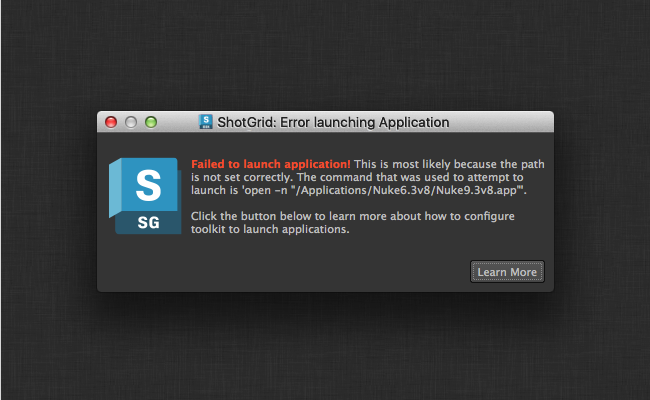
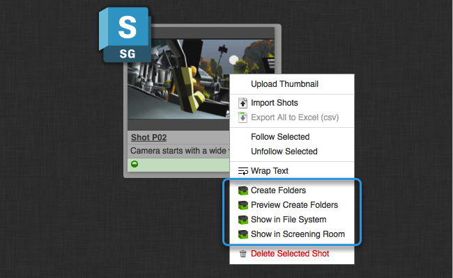
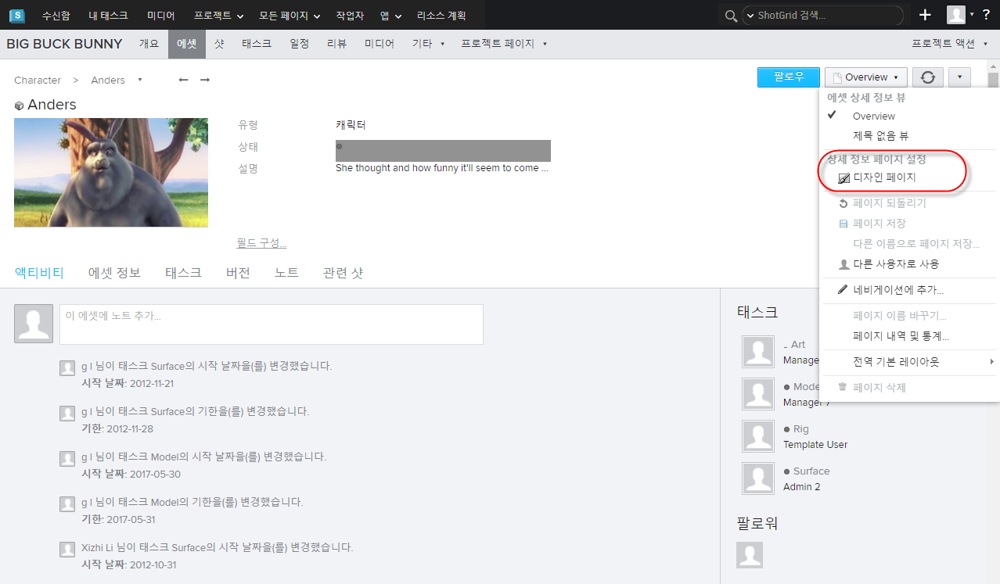
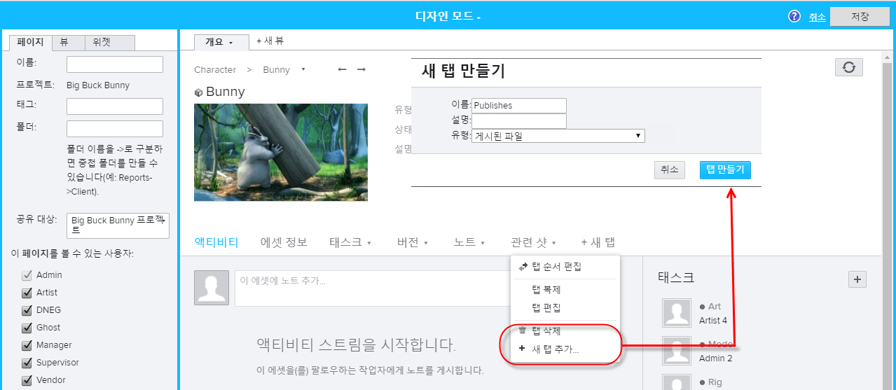
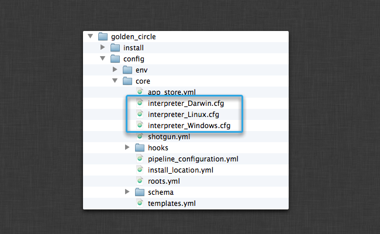
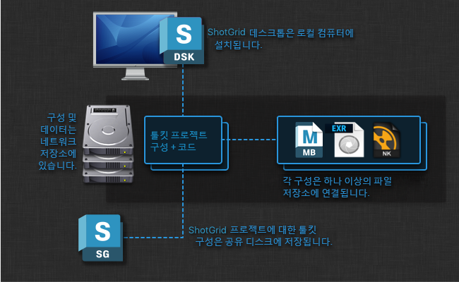
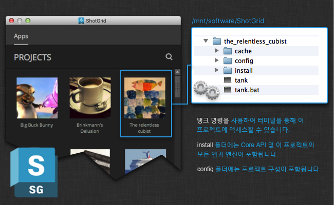
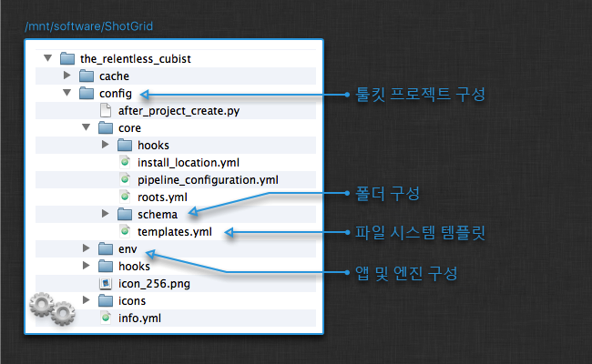

# 첫 번째 프로젝트 실행 이후 작업

이제  데스크톱을 사용하여 첫 번째 프로젝트를 실행한 후의 작업에 대해 설명하겠습니다. 여기서는 공통 질문 및 주제를 다루고 유용한 문서 리소스를 소개합니다.

# 툴킷 소개

툴킷 소개 이 문서를 읽고 있다면  데스크톱을 사용하여 첫 번째  Pipeline Toolkit 프로젝트를 성공적으로 설치했다는 것을 의미합니다.

이 단계에서는 이미 프로젝트를 실행 중이고 위의 스크린샷처럼 여러 응용프로그램 시작 관리자가 있는 프로젝트 페이지가 표시되어 있어야 합니다. 이제 Maya, Nuke 또는 다른 응용프로그램을 열어 보십시오. 파일 및 에셋을 관리하기 위한 추가 기능이 있는  메뉴를 찾아야 합니다.

다음으로 수행할 작업은 무엇일까요? 툴킷은 구성 및 작동 방식 면에서 많은 유연성을 제공합니다. 이 문서에서는  데스크톱을 사용하여 첫 번째 프로젝트를 실행한 후에 수행하면 좋은 일부 단계에 대해 설명합니다.

# 기초 구성

이 섹션에는 구성에 필요한 여러 가지 조정 및 유용한 정보가 포함되어 있습니다. 첫 번째 툴킷 프로젝트를 방금 설정했다면 아마도 올바른 작동을 위해 여러 가지 설정을 조금씩 조정해야 할 것입니다. 이 섹션에서는 이러한 다양한 단계를 설명합니다. 이 중 일부는 구성 파일 편집 및 내부적으로 진행되는 작업과 관련이 있습니다. 궁금한 사항이 있으시면 언제든지 [지원 사이트](https://knowledge.autodesk.com/ko/contact-support)를 방문해 도움을 주시기 바랍니다.

## 응용프로그램 경로 설정

첫 번째 프로젝트를 설정하고 시작 버튼 중 하나를 클릭하여 Maya, Motionbuilder 또는 Nuke를 시작하면 다음과 같은 오류 메시지가 표시될 수 있습니다.

툴킷 프로젝트 구성에는 시작할 수 있는 다양한 실행 파일의 경로가 저장됩니다. 위의 메시지가 표시되면 해당 경로가 스튜디오 설정과 일치하지 않는 것일 수 있습니다. 또한 잘못된 버전의 응용프로그램이 시작되고 있음을 알 수 있습니다. 예를 들어 기본 구성에는 Maya 2015 경로가 있지만 스튜디오는 Maya 2014를 실행 중일 수 있습니다. 이 경우 경로를 변경해야 합니다.

기본 구성에서 이러한 경로는 모두 `paths.yml`이라는 단일 파일에 저장됩니다. 경로를 변경하려면 디스크에서 프로젝트 구성을 찾은 다음 `paths.yml` 파일을 찾을 때까지 config 폴더를 탐색합니다.

이 파일을 열고 경로를 원하는 대로 변경합니다. 파일을 저장한 후에는  데스크톱에 프로젝트를 그대로 두고 다시 클릭해야 합니다. 그러나 전체 응용프로그램을 다시 시작할 필요는 없습니다.

**추가 정보**

응용프로그램에 대한 자세한 정보는 다음 항목을 참조하십시오.

- [툴킷 응용프로그램 시작 관리자](https://support.shotgunsoftware.com/hc/ko/articles/219032968)
- [명령행 인수 전달](https://support.shotgunsoftware.com/hc/ko/articles/219032968#Use%20Command%20Line%20Arguments%20at%20Launch)

##  통합

툴킷은 와 통합되며 UI의 다양한 부분에 특별한 툴킷 액션 메뉴 항목을 추가하여 기존 인터페이스를 확장합니다.

이를 통해 에서 직접 데이터를 조작하는 툴킷 응용프로그램 또는 커스텀 도구를 시작할 수 있게 됩니다. 통합에 대한 자세한 내용은  사이트, [관리 안내서의 브라우저 통합 섹션](https://support.shotgunsoftware.com/hc/ko/articles/115000067493-Integrations-Admin-Guide#Browser%20Integration)을 참조하십시오.

##  UI에 게시 추가

툴킷을 설치한 후에는 일반적으로  UI 레이아웃을 약간 조정하는 것이 좋습니다.  Pipeline Toolkit은 파일을 게시할 때 _게시 엔티티_를 만들므로 에셋 및 샷과 같은 주요 에셋에 _게시(Publishes) 탭_을 추가하기에 편리합니다. 이렇게 하려면 관리자(admin)로 로그인해야 합니다. 에셋 또는 샷으로 이동하고 _디자인 모드_를 시작합니다.

이제 탭 중 하나에서 작은 메뉴 삼각형을 클릭하고 _새 탭 추가(Add New Tab)_ 액션을 선택합니다. 그러면 대화상자 UI가 나타납니다. _게시(Publishes)_ 탭을 호출하고 _게시된 파일(Published File)_ 엔티티와 연결되어 있는지 확인합니다.

이제 _저장(Save)_을 클릭하여 변경 사항을 저장합니다. 설정이 끝났습니다.

참고: 사용자가 새 탭을 만들 때 는 몇 개의 기본 필드를 선택하여 가져옵니다. 게시할 필드를 몇 개 더 추가할 수 있습니다. 새 게시 탭에서 볼 수 있는 스프레드시트의 오른쪽 상단에 있는 작은 더하기 버튼을 클릭하면 됩니다. 다음 필드를 추가하는 것이 좋습니다.

- **설명(Description)** - 이 게시에서 변경한 사항에 대한 설명 저장
- **만든 사람(Created by)** - 게시를 만든 사용자
- **만든 날짜(Date Created)** - 게시를 만든 날짜

레이아웃을 변경하는 경우 완료 후 반드시 페이지를 저장해야 합니다.

## 다중 운영 체제

경우에 따라 설명서의 이 섹션에 대한 링크와 함께 **Python을 찾을 수 없음(Python cannot be found)**이라는 메시지가 표시될 수 있습니다.

툴킷은 [Python](https://www.python.org/)이라는 언어를 사용하여 스크립트와 기능을 실행합니다.  데스크톱에는 완전한 Python 설치가 기본 제공되므로 보통은 이 메시지에 대해 신경쓸 필요가 없습니다.  데스크톱을 사용하여 새 툴킷 프로젝트를 설정한 경우 프로젝트는 기본적으로  데스크톱과 함께 번들로 제공되는 Python을 사용하도록 설정됩니다. 그러나 툴킷에 Python을 사용하도록 명시적으로 알려야 할 때도 있습니다. 다음과 같은 경우를 예로 들 수 있습니다.

- 모든 Python 기본값을 자동으로 설정하지 않는 이전 버전의  데스크톱을 사용할 경우
-  데스크톱을 디스크의 표준 위치가 아닌 위치에 설치한 경우
- 수동 또는 복잡한 툴킷 프로젝트 설정을 실행하는 경우

Python 경로는 수동으로 편집할 수 있는 구성 파일에 저장됩니다.

올바른 파일을 찾으려면 먼저 프로젝트 구성으로 이동합니다. 그런 다음 `interpreter_`로 시작하는 트리 파일을 찾습니다. 여기에는 Linux, Windows 및 Mac("Darwin")용 Python 인터프리터에 대한 경로가 포함되어 있습니다. 이러한 파일에는 세 가지 운영 체제 각각에 대한 Python의 위치가 들어 있습니다. 이제 사용하려는 운영 체제에 대한 Python 위치를 수동으로 추가해야 합니다.

파일이 비어 있으면 이전 버전의  데스크톱을 사용하고 있는 것입니다. 이 경우 빈 파일을 기본 Python 경로로 업데이트하십시오. 다음을 참조하십시오.

- Macosx(Darwin): `/Applications/Shotgun.app/Contents/Frameworks/Python/bin/python`
- Windows: `C:\Program Files\Shotgun\Python\python.exe`
- Linux: `/opt/Shotgun/Python/bin/python`

 데스크톱을 표준 위치가 아닌 곳에 설치했거나 별도로 설정한 Python 위치를 사용하려는 경우 파일 경로가 유효한 Python 설치를 가리키는지 확인합니다. Python은 v2.6 이상이어야 합니다(단, Python 3 제외). UI 기반 응용프로그램과 도구를 실행하려면 지정한 Python에 PyQt 또는 PySide가 설치되어 있고 QT v4.6 이상에 링크되어 있는지 확인하십시오.

또한 여러 운영 체제에서 툴킷을 실행하려면 프로젝트 설정 마법사를 실행할 때 원하는 모든 플랫폼에 대한 경로를 지정해야 합니다. 이 작업을 수행하지 않고 저장소 경로 또는 구성 위치에 추가 운영 체제를 추가하려는 경우 [지원 사이트](https://knowledge.autodesk.com/ko/contact-support)에서 도움을 요청하십시오.

# 다음 단계

이제  프로젝트(또는 테스트 프로젝트)에서 기본  설정을 사용할 수 있습니다. 응용프로그램이 시작되고 상황에 맞는 메뉴 액션 및 게시가 에 표시되고 항목이 원하는 운영 체제 플랫폼에서 작동합니다.

다음 섹션에서는 해당 기본 구성을 가져와 나머지 스튜디오 파이프라인처럼 작동하도록 조정하는 프로세스에 대해 설명합니다. 툴킷은 유연하고 상세한 구성이 가능하며 당사에서는 많은 문서를 제공합니다. 시작하기 전에 실제 모든 작동 방식을 확인하려면 몇 분 정도 시간을 내어 다양한 연습 동영상을 확인하는 것이 좋습니다. 이 동영상은  Pipeline Toolkit이 Maya 및 Nuke와 같은 응용프로그램 내에서 작동하는 방식을 보여 줍니다. 또한 게시, 버전 제어, 로딩 등과 같은 기본 개념도 설명합니다.

[ 툴킷 동영상 컬렉션](https://support.shotgunsoftware.com/hc/ko/articles/219040678)

## 툴킷 프로젝트 분석

새로운 툴킷 프로젝트를 만들면 몇 가지 주요 위치에 구성됩니다.

-  데스크톱 및 해당 구성은 로컬 시스템에 설치됩니다. 원하는 경우 응용프로그램과 구성을 공유 저장소에 재배치할 수 있습니다.
- 툴킷 프로젝트는 텍스처, 파일, 렌더링 등을 데이터 영역에 저장합니다. 이 데이터를 다른 사용자와 공유하기 때문에 일반적으로 이 영역은 공유 저장소에 있지만 이 규칙에는 예외가 있습니다. 사용자 작업 영역은 로컬(사용자 전용) 저장소에 저장할 수 있으며 Perforce 통합과 같은 통합은 외부 시스템을 사용하여 컨텐츠를 배포하는 데 도움이 됩니다.
- 툴킷 구성은 코드, 앱, Core API 등을 비롯하여 완전한 자체 포함 번들입니다. 이 구성은 일반적으로 공유 저장소에 저장되므로 모든 사용자가 쉽게 액세스할 수 있습니다.

디스크의 프로젝트 구성에는 몇 가지 서로 다른 항목이 있습니다.

다음 섹션에서는 프로젝트 구성 폴더의 여러 부분을 살펴보겠습니다.

### 명령행 액세스

 데스크톱뿐만 아니라 터미널 또는 셸을 통해 툴킷에 액세스할 수도 있습니다. 디스크에 생성하는 각 프로젝트에는 API 세션 시작 및 응용프로그램 시작을 포함하여 많은 기능에 명령행 기반으로 액세스할 수 있는 특수 `tank` 명령이 있습니다.

프로젝트 구성으로 이동하면 구성 루트에 `tank` 및 `tank.bat` 명령이 표시됩니다. 옵션 없이 이러한 명령을 실행하면 다음의 유용한 명령을 포함하여 현재 구성에서 지원되는 모든 명령 목록을 확인할 수 있습니다.

- `tank shell` - tk api 액세스 권한으로 대화형 Python 셸 시작
- `tank core` - 이 프로젝트에 사용할 수 있는 Core API 업데이트가 있는지 확인
- `tank updates` - 이 구성의 앱이나 엔진에 사용 가능한 업데이트가 있는지 확인

`tank` 명령을 사용하여 수행할 수 있는 작업에 대한 자세한 정보는 자세한 기술 문서를 참조하십시오.

[툴킷 관리 방법](https://support.shotgunsoftware.com/hc/ko/articles/219033178)

### 주요 구성 파일

`config` 폴더에는 몇 가지 주요 구성 파일이 있습니다.

응용프로그램을 시작할 때 필요한 모든 구조가 디스크상에 있고 사전에 준비되도록 하기 위해 디스크에 폴더를 자동으로 만드는 폴더 생성 시스템이 툴킷과 함께 제공됩니다. 이에 대한 구성은 위에 표시된 `schema` 폴더에서 찾을 수 있습니다.

또한 툴킷 _템플릿 시스템_을 함께 사용하면 게시, 작업 파일, 렌더링 등 구성할 수 있는 파일에 대한 다양한 경로를 쉽게 정의할 수 있습니다. 이 항목은 위의 `templates.yml` 파일에 저장됩니다.

프로젝트 구성의 이 두 부분을 함께 사용하면 툴킷이 기존 파이프라인에서 이해할 수 있도록 디스크의 위치에 데이터를 기록하는 데 사용되는 다양한 앱을 조정할 수 있습니다.

자세한 정보는 다음과 같은 고급 문서를 참조하십시오.

- [폴더 구성](https://support.shotgunsoftware.com/hc/ko/articles/219033178#Creating%20folders%20on%20disk%20with%20Sgtk)
- [파일 시스템 템플릿](https://support.shotgunsoftware.com/hc/ko/articles/219033178#Configuring%20Templates)

기본적으로 툴킷은 구성된 **앱 및 엔진**의 모음으로 구성됩니다. 이 구성은 `env` 폴더에 있습니다. 위에 설명된 파일 시스템 구성 파일이 디스크상에서의 리소스 _위치_를 정의하면 해당 앱 및 엔진이 있는 환경 구성이 파이프라인이 수행해야 할 _작업_을 정의합니다.

### Core API 플랫폼

각 프로젝트 구성은 앱 및 엔진의 컬렉션을 사용합니다. 이러한 앱 및 엔진의 구성은 구성 내의 `env` 폴더에 저장됩니다. 툴킷은 이러한 앱 및 엔진을 실행하는 데 필요한 다양한 버전의 코드를 자동으로 다운로드하고 관리합니다. 코드는 `install` 폴더 안에 있습니다.

구성, 앱 및 엔진은 모두 Toolkit Core 플랫폼 상단에서 실행됩니다. 새로운 프로젝트의 경우 `install` 폴더 내에도 저장됩니다. 기본적으로 프로젝트 구성은 완전하게 자체 포함되어 있습니다. 즉, 툴킷을 실행하는 데 필요한 모든 부분이 단일 위치에 있습니다. 또한 각 프로젝트가 독립적이며 하나의 프로젝트를 업데이트해도 다른 프로젝트가 중단되지 않는다는 것을 의미합니다.

기술 참고 사항: 공유 Toolkit Core 사용(클릭하여 확장)

### 추가 정보

 Pipeline Toolkit의 개략적인 개념을 살펴보고 '전체적인 내용'을 설명하는 좀 더 기술적인 문서도 있습니다. 툴킷이 기본적으로 제공하는 기능을 잘 이해한 다음 이러한 문서로 옮겨가서 특정 스튜디오 요구 사항에 맞게 툴킷을 조정할 수 있는 방법을 더 깊이 이해하는 것이 좋습니다.

[ 툴킷](https://support.shotgunsoftware.com/hc/ko/articles/219040648)의 개괄적인 개념에 대한 소개

## 툴킷 커뮤니티

TD 및 파이프라인 엔지니어의 커뮤니티는 툴킷의 한 부분을 구성합니다. 우리는 강력하고 유연한 파이프라인 환경으로 툴킷을 함께 개선할 수 있는 역동적인 코드 공유 커뮤니티를 만드는 데 주력하고 있습니다.

궁금한 점이 있거나 기존 게시물 및 논의를 살펴보고 싶다면 [공개 포럼 섹션](https://support.shotgunsoftware.com/hc/en-us/community/topics/200682428-Pipeline-Toolkit-Common-Questions-and-Answers)을 방문하십시오.

