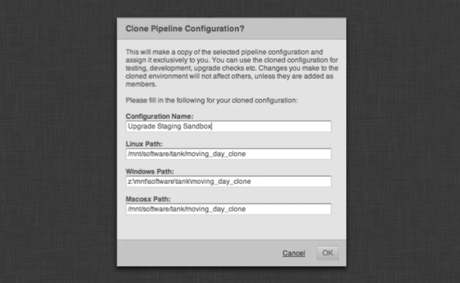

# 구성 스테이징 및 롤아웃

이 문서에서는 프로덕션 파이프라인의 변경 사항을 안전하게 롤아웃하는 방법에 대한 모범 사례를 설명합니다. 여기에서는 스테이징 샌드박스(즉, 프로덕션 구성 사본)를 만들고, 이 샌드박스를 업데이트하여 테스트를 진행한 다음 마지막으로 변경 사항을 프로덕션 구성으로 푸시하는 방법을 설명합니다.

_이 문서에서는 툴킷 구성에 대한 제어 권한을 갖고 있는 경우에만 사용할 수 있는 기능에 대해 설명합니다. 기본 설정에 대한 자세한 내용은 [ 통합 관리자 안내서](https://developer.shotgridsoftware.com/8085533c/)를 참조하십시오._

# 소개

이 문서에서는 툴킷 구성을 관리하는 방법을 간략히 설명합니다. 툴킷에는 샌드박스가 적용된 안전한 환경에서 구성을 안전하게 관리하고 업그레이드 및 변경 사항을 전체 프로덕션으로 롤아웃하기 전에 테스트하도록 하는 몇 가지 유틸리티와 도구가 포함되어 있습니다.

이 문서에서는 다음과 같은 방법을 설명합니다.

- Toolkit Core API를 안전하게 업그레이드하는 방법
- 앱 및 엔진을 업그레이드하는 방법
- 다중 프로젝트에서 구성을 관리하는 다양한 방법
- 툴킷의 _복제_ 및 _밀기_(푸시) 기능을 통해 프로덕션에 영향을 주지 않고 업그레이드 및 변경 사항을 안전하게 테스트하는 방법
- `git` 소스 제어 및 툴킷으로 작업하는 방법

# 구성 관리의 기본 사항

각 툴킷 프로젝트에는 하나 이상의 구성이 관련되어 있습니다. 구성에는 프로젝트에 필요한 모든 설정(파일 시스템 위치(템플릿), 엔진 앱 등)이 있습니다. 툴킷에서 각 프로젝트를 독립적으로 구성할 수 있습니다. 즉, 서로 다른 프로젝트가 병렬적으로 실행될 수 있으며 하나의 프로젝트를 업그레이드해도 다른 프로젝트에 영향을 미치지 않습니다.

많은 프로젝트에 대한 작업을 수행하는 경우 번거로울 수 있으며 이 프로세스를 쉽고 안전하며 원활하게 실행할 수 있게 해 주는 여러 가지 방법이 제공됩니다.

의 각 프로젝트에는 많은 **파이프라인 구성**이 있습니다. 프로젝트가 툴킷으로 먼저 설정되면 `primary`라는 파이프라인 구성이 만들어집니다. 의 파이프라인 구성 엔티티는 툴킷 구성을 찾을 수 있는 디스크상의 위치를 가리킵니다.

프로젝트 과정에서 종종 구성을 변경해야 합니다. 구성을 조정할 수도 있거나 앱 또는 엔진을 추가해야 할 수 있습니다. 또한 새 앱 버전이 자주 릴리즈되므로 가능하면 최신 버전을 사용하는 것이 좋습니다.

_기본_ 프로젝트 구성을 즉시 업그레이드할 수는 있지만 위험할 수 있습니다. 이 구성은 프로젝트의 모든 사람이 사용하므로 문제가 발생할 경우 모든 사람에게 영향을 미칩니다. 그러므로 해당 그룹의 작업자가 액세스할 수 있는 격리된 버전의 구성을 만드는 것이 좋습니다. 이렇게 설정된 안전한 환경에서는 업그레이드, 구성 변경 및 개발 시에 다른 프로덕션에 영향을 주지 않습니다. 변경 사항을 테스트한 후에 안전하고 확실하게 기본 구성으로 푸시할 수 있습니다.

이 프로세스를 _복제_ 라고 하며, 해당 사용자(및 해당 사용자가 초대한 다른 사용자)만 복제본에 액세스할 수 있도록 기본 구성의 개인 복사본을 만드는 것을 의미합니다. 이 환경에서 안전하게 변경할 수 있으며, 성공적으로 변경한 후 기본 구성으로 변경 사항을 다시 푸시할 수 있습니다.

## 구성 복제

툴킷을 설정하고 프로젝트를 구성하면 설치 프로그램이 다음과 같이 표시될 것입니다.


_스튜디오_ 설치에는 모든 프로젝트의 Core API가 포함되어 있습니다. 또한 이 _스튜디오_ 위치에는 툴킷이 활성화된  프로젝트에 액세스하는 데 사용할 수 있는 `tank` 명령과 툴킷 Python API가 포함되어 있습니다.

이 외에도 각 프로젝트에 대한 구성 폴더가 있습니다. 이 폴더에는 해당 프로젝트에 대한 모든 설정이 있습니다. 또한 이 구성에서 특별히 작동하는 `tank` 명령(및 Python API)도 포함되어 있습니다. 이 `tank` 명령 또는 API 코드를 사용하는 경우 이 구성에서만 작동합니다.

새 프로젝트가 설정되면 _기본_ 구성이 만들어집니다. 이 구성은 기본적으로 툴킷이 프로젝트에 대해 사용됩니다. 기본 구성 외에도 프로젝트에 대한 추가 구성을 만들 수 있습니다. 이러한 구성은 병렬로 존재할 수 있습니다. 예를 들어 일부 수정 사항을 개인적으로 테스트하거나 일부 앱을 업그레이드하거나 전체 팀에 영향을 주지 않고 개발을 수행하려는 경우에 유용합니다. 추가 구성은 _복제_, 즉 구성이 새 위치로 복사되는 프로세스에 의해 만들어집니다.

구성을 복제하면 설정이 다음과 같이 표시될 수 있습니다.


스튜디오 레벨 `tank` 명령과 기본 프로젝트 구성 `tank` 명령 외에도 새로운 파이프라인 구성에 자체 `tank` 명령이 있습니다. 이 `tank` 명령을 실행하면 스테이징 샌드박스에 있는 구성에서만 작동합니다. 따라서 Maya에서 새로운 일부 항목을 테스트하려면 간단히 복제 샌드박스로 이동하여 `./tank Shot xyz launch_maya`를 실행합니다. 그러면 Maya에 표시되는  메뉴에 기본 구성이 아닌 스테이징 샌드박스 내부의 구성이 반영됩니다.

스튜디오 레벨 `tank` 명령은 항상 기본 구성을 사용하므로 복제 구성에 액세스하려면 반드시 해당 위치로 이동하여 해당 폴더에 있는 `tank` 명령을 사용해야 합니다. 에서는 특정 사용자 집합을 파이프라인 구성 항목에 할당할 수 있으며, 이제 구성과 관련된 모든 사용자에게 기본 구성의 항목 외에 메뉴 항목이 표시됩니다.


### 복제 구성 만들기

업그레이드를 안전하게 테스트할 수 있는 스테이징 샌드박스를 만들려면 에서 프로젝트의 파이프라인 구성을 탐색하고 마우스 오른쪽 버튼으로 기본 구성을 클릭합니다. 구성을 복제하는 옵션이 나타납니다.


이 옵션을 클릭하면 새로운 구성이 위치할 디스크의 경로를 지정하는 대화상자가 나타납니다. 다중 OS 설정을 실행하는 경우 모든 관련 플랫폼의 경로를 입력해야 합니다.



확인(OK)을 누르면 툴킷이 구성을 복사하고 복제본을 설정합니다. 또한  사용자와 이 구성이 연결되므로 복제를 만들자마자  내에 새로운 메뉴 항목이 표시됩니다.

### 스테이징 샌드박스의 변경 사항을 기본 구성으로 푸시

관련 업데이트를 적용하고 필요한 테스트를 실행한 다음 `tank push_configuration` 명령을 실행하여 변경 사항을 프로덕션 구성으로 다시 푸시할 수 있습니다. 이렇게 하면 스테이징 샌드박스의 모든 변경 사항이 기본 구성으로 전송됩니다.

`push_configuration` 명령을 실행하면 현재 구성이 백업 위치로 이동됩니다. 실수로 푸시하거나 푸시에 문제가 있는 경우 백업 폴더의 컨텐츠를 가져와서 구성 폴더로 복사하는 방법으로 간단히 롤백할 수 있습니다.

기본적으로 이 명령은 파일 모음을 대상 파이프라인 구성의 `config` 폴더에 복사합니다. Unix를 사용하고 있고 더 원자적인 업데이트를 원할 경우 `push_configuration` 명령에 `--symlink` 플래그를 추가할 수 있습니다. 이렇게 하면 대상 파이프라인 구성의 `config` 폴더가 기호 링크로 바뀌므로 현재 실행 중인 세션에서 구성 불일치의 위험 없이 쉽게 업그레이드할 수 있습니다.

### 이전 복제 구성 새로 고침

이전 dev  또는 스테이징 샌드박스 설정이 있고 컨텐츠를 최신 프로덕션 구성과 동기화해야 하는 경우에는 기본 구성에 대해 `push_configuration` 명령을 실행합니다.
```shell
tank push_configuration

Welcome to the  Pipeline Toolkit!
For documentation, see https://support.shotgunsoftware.com
Starting Toolkit for your current directory '/tmp'
- Using configuration 'Primary' and Core v0.14.52
- Setting the Context to Empty Context.
- Running command push_configuration...

----------------------------------------------------------------------
Command: Push configuration
----------------------------------------------------------------------

This command will push the configuration in the current pipeline configuration
('Primary') to another pipeline configuration in the project.

Your existing configuration will be backed up.

The following pipeline configurations are available to push to:
 - [324] Staging Sandbox (/my/staging/sandbox)

Please type in the id of the configuration to push to (ENTER to exit): 324
Hold on, pushing config...
Checking if there are any apps that need downloading...
Push Complete!

Your old configuration has been backed up into the following folder:
/my/staging/sandbox/config.bak.20140108_093218
```
기본 프로젝트 구성에서 스테이징 샌드박스로 푸시하는 방법을 확인하십시오. _기본_ 구성의 `tank` 명령을 실행하여 이 작업을 수행합니다. 여러 샌드박스가 설정된 경우 해당 샌드박스 간에 데이터를 푸시할 수도 있습니다.

### 복제한 구성 삭제

복제 구성을 삭제하려면 에서 해당 항목을 삭제하고 디스크에서 폴더를 제거하기만 하면 됩니다.

## 최신 앱 및 엔진 가져오기

스테이징 샌드박스(또는 기타 다른 구성)에서 `tank updates` 명령을 실행하여 사용 가능한 앱 업데이트가 있는지 확인할 수 있습니다. 이 명령에는 구성의 특정 영역만 확인하려는 경우 사용할 수 있는 기초적인 필터가 있습니다.

```shell
----------------------------------------------------------------------
Command: Updates
----------------------------------------------------------------------

This command will go through your current configuration and check if there are
any updates available. If there are updates, you will be asked if you want to
perform an upgrade. If settings has been added to the new version that you are
installing, you may be prompted to specified values for these.

Running this command with no parameters will check all environments, engines
and app. This may take a long time. You can also run the updater on a subset
of your installed apps and engines.

General syntax:
> tank updates [environment_name] [engine_name] [app_name]

The special keyword ALL can be used to denote all items in a category.

Examples:

Check everything:
> tank updates

Check the Shot environment:
> tank updates Shot

Check all maya apps in all environments:
> tank updates ALL tk-maya

Check all maya apps in the Shot environment:
> tank updates Shot tk-maya

Make sure the loader app is up to date everywhere:
> tank updates ALL ALL tk-multi-loader

Make sure the loader app is up to date in maya:
> tank updates ALL tk-maya tk-multi-loader
```
## Toolkit Core API 업그레이드

이 섹션에서는 복제 스테이징 샌드박스 구성을 사용하여 Toolkit Core API를 안전하게 업그레이드하는 방법에 대해 설명합니다. 스테이징 샌드박스가 아직 준비되지 않았다면 이전 섹션의 지침을 따르십시오.

스테이징 샌드박스가 [공유 스튜디오 Core API](https://developer.shotgridsoftware.com/b12f2510/#how-do-i-update-my-pipeline-configuration-to-use-an-existing-shared-core)를 사용하는 파이프라인 구성에서 복제된 경우 고유한 Core API 코드를 사용하도록 샌드박스를 업데이트합니다. 이러한 작업을 일컬어 코어를 "현지화"한다고 하며 스테이징 샌드박스로 이동한 다음 `tank localize`를 실행하여 수행할 수 있습니다. 이 명령은 스튜디오 설치에서 Core API를 샌드박스에 복사하며 나중에 다른 버전의 Core API를 실행하고 테스트할 수 있습니다.

_툴킷의 기본 동작은 기본적으로 코어를 현지화하는 것입니다. 이전에 공유 스튜디오 코어를 명시적으로 만들지 않은 경우 코어가 이미 현지화되어 있다고 가정하는 것이 안전합니다._
```shell
cd /my/staging/sandbox
./tank localize

Welcome to the  Pipeline Toolkit!
For documentation, see https://support.shotgunsoftware.com
Starting Toolkit for your current directory '/my/staging/sandbox'
- Using configuration 'Staging Sandbox' and Core v0.14.52
- Setting the Context to Empty Context.
- Running command localize...

----------------------------------------------------------------------
Command: Localize
----------------------------------------------------------------------

This will copy the Core API in /mnt/software/shotgun/studio into the Pipeline
configuration /my/staging/sandbox.

Do you want to proceed [yn]y

Localizing Core: /mnt/software/shotgun/studio/install/core -> /my/staging/sandbox/install/core
Copying Core Configuration Files...
Localizing Apps: /mnt/software/shotgun/studio/install/apps -> /my/staging/sandbox/install/apps
Localizing Engines: /mnt/software/shotgun/studio/install/engines -> /my/staging/sandbox/install/engines
Localizing Frameworks: /mnt/software/shotgun/studio/install/frameworks -> /my/staging/sandbox/install/frameworks
The Core API was successfully localized.

Localize complete! This pipeline configuration now has an independent API.
If you upgrade the API for this configuration (using the 'tank core' command),
no other configurations or projects will be affected.
```
이제 더 이상 Core API를 스튜디오 위치에서 공유하지 않고 자체 독립적인 버전을 실행합니다. 그런 다음 로컬 tank 명령을 다시 사용하여 표준 Core API 업그레이드를 수행할 수 있습니다.
```shell
cd /my/staging/sandbox
./tank core
```
툴킷을 통해 사용 가능한 새 버전이 있는지 확인하여 다운로드하고 설치합니다.

Core API를 업데이트했으면 설치를 테스트해야 합니다. 샌드박스의 `tank` 명령을 사용하거나 의 특수 메뉴 항목을 사용하여 일부 앱을 실행합니다.  파이프라인에 대한 기본적인 연습을 수행하고 필요에 따라 테스트를 수행합니다.

결과에 만족한 경우 Core API의 스튜디오 버전 업데이트를 진행할 수 있습니다. 일반적인 툴킷 설정에서는 모든 프로젝트 간에 Core API가 공유되므로 스튜디오 위치 `tank` 명령에서의 `tank core` 명령을 실행하여 모든 프로젝트의 Core API를 업데이트합니다.

# 프로젝트 수명 주기 관리

각 툴킷 프로젝트에는 해당 프로젝트의 모든 설정이 있는 독립적인 구성이 포함됩니다. 많은 프로젝트를 관리한다는 것은 많은 구성을 관리해야 한다는 의미입니다. 따라서 툴킷에는 개별 프로젝트와 스튜디오 수명 주기 및 구성 개선을 위해 구성을 다룰 수 있는 다양한 도구 및 방법이 포함되어 있습니다. 이 섹션에서는 몇몇 모범 사례를 간략히 설명하고 구성을 설정하는 실제 단계를 소개합니다.

스튜디오의 요구 사항에 따라 복잡성이 다양할 수 있습니다. 툴킷은 세 가지 접근 방식을 제공하며 각각에 대해 자세히 설명하겠습니다.

- 가장 간단한 방법은 새 프로젝트를 설정할 때 이전 프로젝트의 구성을 복사하는 것입니다. 이 방법은 소규모 스튜디오나 프로젝트가 많지 않은 경우에 유용합니다.
- 프로젝트 회전율이 높고 두 개 이상의 프로젝트를 병렬로 실행하는 경우 다음 통합 레벨에 `git` 버전 제어를 포함하는 것이 좋습니다. 툴킷은 git에 대한 기본적인 지원을 제공합니다. git 기반 워크플로우를 통해 시작하고 실행한 후에는 스튜디오에 대한 단일 구성을 가지게 되며 시간 경과에 따라 해당 구성에 대한 모든 변경 사항을 트래킹할 수 있습니다. 각 프로젝트는 필요할 때마다 구성 변경 사항을 안전하게 가져올 수 있습니다.
- 대규모 프로덕션에서는 단일 구성을 설정하고 스튜디오에서 현재 진행되는 모든 프로젝트에 직접 연결하는 방식을 고려해 볼 수 있습니다. 이 경우 한 번의 구성 변경으로 모든 프로젝트에 즉각적인 영향을 미칠 수 있습니다.

다음 섹션에서는 다양한 접근 방식을 자세히 설명합니다.

## 이전 프로젝트에서 구성 상속

구성 관리에 대한 가장 간단한 방법입니다. 툴킷을 사용하여 프로젝트를 처음 설정하면 기본 구성이 다운로드됩니다. 그런 다음 파이프라인 설정, 파일 시스템 위치 등에 맞게 첫 번째 프로젝트를 설정합니다. 프로젝트가 실행 중일 때 `tank updates`와 같은 명령 등을 실행하여 실행 중인 앱 버전을 업데이트합니다.

두 번째 프로젝트를 시작할 때 기초 구성으로 다시 시작하지 않으려면 프로젝트 설정 단계에서 첫 번째 프로젝트의 구성을 새 프로젝트의 시작 지점으로 지정합니다. 즉, 첫 번째 프로젝트에서 수행한 모든 변경, 조정 및 개선 사항을 두 번째 프로젝트에서도 활용할 수 있습니다. 세 번째 프로젝트의 경우 두 번째 프로젝트의 구성을 사용합니다.


이 간단한 방법으로 시간이 지남에 따라 구성을 점차 개선시킬 수 있습니다. 변경과 개선 사항은 프로젝트 간에 필요에 따라 전달됩니다. `setup_project` 명령을 처음 실행하려면 설정 프로세스에서 사용할 구성을 묻는 메시지가 나타날 때 Enter 키를 누릅니다. 이렇게 하면 기본 구성이 다운로드되어 설치됩니다.

두 번째 프로젝트의 경우 이전 프로젝트 구성에 대한 경로 목록이 제공됩니다. 이러한 경로 중 하나를 선택하여 설정 프로세스에서 구성을 묻는 메시지가 표시될 때 입력합니다. 이렇게 하면 해당 구성이 새 프로젝트에 복사됩니다.
```
Welcome to the  Pipeline Toolkit!
For documentation, see https://support.shotgunsoftware.com
- Running command setup_project...

----------------------------------------------------------------------
Command: Setup project
----------------------------------------------------------------------

Welcome to the  Pipeline Toolkit Project Setup!

Connecting to ...
Connecting to the App Store...

------------------------------------------------------------------
Which configuration would you like to associate with this project?

You can use the configuration from an existing project as a template for this
new project. All settings, apps and folder configuration settings will be
copied over to your new project. The following configurations were found:

   My very first project: '/mnt/software/shotgun/first_project/config'

If you want to use any of the configs listed about for your new project, just
type in its path when prompted below.

You can use the Default Configuration for your new project.  The default
configuration is a good sample config, demonstrating a typical basic setup of
the  Pipeline Toolkit using the latest apps and engines. This will be
used by default if you just hit enter below.

If you have a configuration stored somewhere on disk, you can enter the path
to this config and it will be used for the new project.

You can also enter an url pointing to a git repository. Toolkit will then
clone this repository and base the config on its content.

[tk-config-default]: /mnt/software/shotgun/first_project/config
```
## git 소스 제어의 스튜디오 구성

첫 번째 접근 방식에는 프로젝트가 서로 연결되지 않는다는 제한이 있습니다. 10개의 프로젝트가 있고 중요한 버그 수정이 릴리즈되어 업데이트해야 하는 경우 각 프로젝트를 수동으로 확인하고 `tank updates` 명령을 실행해야 합니다.

이 문제를 해결하는 한 가지 방법은 마스터 구성을 만들고 git 소스 제어에 저장하는 것입니다. 새 프로젝트를 만들 때마다 프로젝트 설정 대화상자에 이 git 리포지토리의 경로를 입력하기만 하면 툴킷에서 복제됩니다. 이제 모든 프로젝트가 동일한 "스튜디오 마스터" 구성에 연결됩니다. 프로젝트 구성을 변경한 후에는 커밋하고 스튜디오 마스터에 푸시할 수 있습니다. 그러면 다른 프로젝트에서 이 변경 사항을 쉽게 가져올 수 있습니다. 또한 git를 통해 변경한 모든 내역은 기록으로 유지됩니다.

    git란?


기본 개념은 git 구성을 저장하는 git 리포지토리를 설정하는 것입니다. `tank setup_project`를 실행할 때마다 이 리포지토리에 git URL을 지정하면(예: `username@someserver.com:/studio_config.git`) 새 프로젝트가 기본 스튜디오 리포지토리에 연결된 리포지토리가 되도록 설치 프로세스에서 리포지토리가 복제됩니다. 연결된 후에는 변경 사항을 푸시(push)하고 풀(pull)해서 분기에서 보다 세부적으로 작업할 수 있습니다.

### 스튜디오 구성 리포지토리 설정

다른 작업을 수행하기 전에 스튜디오 구성 리포지토리를 만들어야 합니다. 이 섹션에서는 기존 툴킷 구성을 가져와서 git 리포지토리를 만드는 방법을 보여 줍니다.

먼저 git 서버로 가서 리포지토리를 만들어야 합니다. 이 프로세스는 설정에 따라 달라질 수 있습니다. GitHub 등을 사용하는 경우에는 웹 브라우저를 시작하고 github.com로 이동합니다. 서버에 액세스할 수 있으면 `git init --bare` 등을 수행할 수 있습니다. 위의 예에서 만든 git 리포지토리를 `username@someserver.com:/studio_config.git`라고 가정합니다.

이제 리포지토리를 시드하는 데 사용하려는 프로젝트의 `config` 폴더를 `config.bak` 위치로 이동합니다.
```shell
cd /project_configs/studio_config
mv config config.bak
```
초기화된 git 리포지토리를 스튜디오 구성을 기반으로 할 프로젝트의 `config` 위치에 복제합니다. clone 명령을 실행하면 git 리포지토리인 빈 `config folder` 폴더가 생성됩니다.
```shell
cd /project_configs/studio_config
git clone username@someserver.com:/studio_config.git config
```
`config.bak` 위치의 모든 파일을 `config` 폴더로 다시 복사합니다. 그러면 빈 `config.bak` 폴더를 삭제할 수 있습니다. 구성 파일은 이제 git 리포지토리 내에 있습니다. 이 파일을 추가하고 커밋한 다음 서버로 푸시해야 합니다. 하지만 먼저 일부 툴킷 시스템 파일을 올바르게 처리하도록 정리해야 합니다. `config` 폴더에서 `.gitignore` 파일을 만들어 다음 줄을 추가합니다.
```shell
install_location.yml
pipeline_configuration.yml
```

이제 git에서 두 시스템 파일을 무시합니다. 그런 다음 나머지 파일을 구성에 추가하고 커밋하여 스튜디오 리포지토리로 푸시할 수 있습니다.

```shell
git add --all
git commit -am "initial commit of our studio config!"
git push
```
### git에서 새 프로젝트 만들기

새 프로젝트를 만들 때 설치 프로세스에서 사용할 구성의 경로를 입력하라는 메시지가 표시되면 유효한 git URL을 지정하기만 하면 됩니다. 위의 예시에 따라 `username@someserver.com:/studio_config.git`를 입력합니다. 프로젝트 설정 프로세스의 일부로 툴킷이 이 리포지토리를 새 프로젝트 구성의 `config` 폴더에 복제합니다. 이는 나중에 이 구성 폴더로 가서 git 명령을 실행할 수 있음을 의미합니다. 복제된 파이프라인 구성도 git 리포지토리를 복제하므로 완벽하게 작동합니다.

### 프로젝트 변경

기본 구성을 변경할 때마다 간단히 `config` 폴더로 가서 `git diff`, `git commit` 및 `git push`를 실행할 수 있습니다. 이렇게 하면 프로젝트 구성을 복제한 스튜디오 구성에 변경 사항이 푸시됩니다.

### 프로젝트를 최신 버전으로 업데이트

또한 일부를 변경하여 스튜디오 레벨 구성을 업데이트하여 프로젝트로 가져오려는 경우 `config` 폴더에서 `git pull`을 실행합니다.  **중요**: 이 작업을 완료한 후에는 `tank cache_apps`를 실행하여 변경된 구성에 필요한 모든 앱 버전이 시스템에 있는지 확인하십시오.

### 고급 git 사용: 분기

새 프로젝트가 만들어질 때 툴킷의 기본 동작은 간단한 복제 작업입니다. 프로젝트는 git `master` 분기를 사용합니다. 고급 설정으로, 예를 들어 프로젝트의 특정 구성 변경 사항을 비공개로 유지하고 다른 프로젝트와 공유하지 않으려는 경우 프로젝트를 만든 후에 git 분기를 설정할 수 있습니다. 그런 다음 이 분기에 커밋합니다. 스튜디오 구성으로 푸시하려는 변경 사항을 프로젝트의 로컬 마스터 분기와 병합한 다음 푸시할 수 있습니다.

### 고급 git 사용: 배치(Batch) 배포

툴킷은 파이프라인 구성 엔티티를 통해  사이트에 대한 다른 모든 구성의 목록을 유지하므로 이 목록을 반복하고 각 항목에 대해 `git pull` 명령을 실행하는 방법으로 모든 프로젝트에서 배치(Batch) 업데이트를 효과적으로 실행할 수 있습니다. 이 기능은 현재 툴킷의 기본 제공 기능에 포함되어 있지 않지만 Python 및  Python API를 사용하여 스크립팅할 수 있습니다.

## include를 사용한 전역 구성

위의 git 기반 접근 방식은 git를 통해 연결된 독립적인 프로젝트 구성을 처리합니다. 업데이트는 프로젝트 전체에 자동으로 반영되지 않으므로 강제로 풀/푸시해야 합니다.

구성이 실제로 한 곳에 저장되고 단일 변경으로 프로젝트 그룹에 즉시 반영할 수 있는 완전한 중앙 집중식 구성의 경우 툴킷 구성의 `@include` 기능을 사용해야 합니다. 이렇게 하면 각 프로젝트 구성이 실제 구성이 저장된 중앙 위치를 가리키도록 참조를 만들 수 있습니다.


`@include` 구문을 사용하면 여러 파일을 함께 연결할 수 있습니다. 예를 들어 다음 컨텐츠가 포함된 `/tmp/stuff.yml` 파일이 있는 경우 다음과 같습니다.
```
# paths to maya
maya_windows: 'C:\Program  Files\Autodesk\Maya2012\bin\maya.exe'
maya_mac: '/Applications/Autodesk/maya2012/Maya.app'
maya_linux: 'maya'

# a configured toolkit app
file_manager:
  allow_task_creation: true
  file_extensions: []
  hook_copy_file: default
  hook_filter_publishes: default
  hook_filter_work_files: default
  hook_scene_operation: default
  launch_at_startup: false
  launch_change_work_area_at_startup: false
  location: {name: tk-multi-workfiles, type: app_store, version: v0.4.8}
  saveas_default_name: scene
  saveas_prefer_version_up: false
  sg_entity_type_filters: {}
  sg_entity_types: [Shot, Asset]
  task_extra_display_fields: []
  template_publish: null
  template_publish_area: null
  template_work: null
  template_work_area: null
```
위에서 볼 수 있듯이 서로 다른 여러 레벨에서 include 정의를 만들 수 있습니다. 위의 경우에는 앱 정의와 세 개의 문자열 값이 있습니다. 그런 다음 환경 파일에서 이를 참조할 수 있습니다.
```
includes: ['/tmp/stuff.yml']

engines:

  tk-maya:

    # First all our app definitions
    apps:
        # normally, we would have the entire set of configuration parameters at this point.
        # because we are using an include, we can reference an entire sub-section of configuration
        # using the @ keyword:
        tk-multi-workfiles: '@file_manager'

        # alternatively, for simple values, we can use them as parameter values for apps:
        tk-maya-launcher:
          mac_path: '@maya_mac'
          linux_path: '@maya_linux'
          windows_path: '@maya_windows'
          location: {name: tk-multi-launchapp, type: app_store, version: v0.2.19}

    # and after the apps section follows specific configuration options for the engine
    location: {name: tk-maya, type: app_store, version: v0.4.1}
    menu_favourites:
    - {app_instance: tk-multi-workfiles, name:  File Manager...}
    template_project: null
    use_sgtk_as_menu_name: false
```
또한 여러 include 파일을 차례로 읽을 수 있습니다. 두 개의 다른 파일에 동일한 include 정의가 존재하면 가장 최근에 읽은 파일이 우선합니다. 위 예시 환경을 확장할 수 있습니다.
```
includes:

    # first include a global config file which contains all the studio level app definitions
    - '/studio/configurations/studio_apps.yml'

    # now we can include an include containing overrides, for example based on project type.
    # if the global config contains an entry named file_manager and the vfx_apps.yml contains
    # the same, the vfx_apps definition will be used.
    - '/studio/configurations/vfx_apps.yml'

engines:

  tk-maya:    
    apps:
        tk-multi-workfiles: '@file_manager'

    location: {name: tk-maya, type: app_store, version: v0.4.1}
    use_sgtk_as_menu_name: false
```
방금 설명한 방법으로 프로젝트 유형 기본값에 의해 재정의될 수 있는 스튜디오 기본값을 설정할 수 있으며 이 기본값은 특정 프로젝트 설정에 의해 재정의될 수 있습니다. 위의 예와 같이 앱 레벨에서 수행하거나 다음 섹션에서와 같이 엔진 레벨에서 수행할 수 있습니다.

### 전역 구성 설정 모범 사례

전역 구성을 설정하는 몇 가지 방법이 있습니다. 이를 설정하기 위한 모범 사례 접근 방식으로서 구성을 엔진별로 세분화하는 것이 좋습니다. 각 환경 파일은 완전히 비어 있으며 별도의 파일에 정의된 엔진(및 앱)을 참조합니다. 따라서 한 번에 엔진 하나씩 쉽게 조정하고 재구성할 수 있습니다.

이러한 각 include 파일은 표준 형식으로 되어 있으며 엔진 이름을 따서 명명됩니다. 예를 들어, Maya 엔진을 사용하는 경우 include 파일에는 엔진과 해당 앱만 포함됩니다. 최상위 항목의 이름은 간단히 `maya`로 지정됩니다.
```yaml
maya:
    apps:
      tk-maya-breakdown:
        hook_multi_update: default
        hook_scan_scene: default
        location: {name: tk-maya-breakdown, type: app_store, version: v0.2.13}
      tk-multi-loader2:
        action_mappings:
          Maya Scene: [reference, import]
          Photoshop Image: [texture_node]
          Rendered Image: [texture_node]
        actions_hook: '{self}/tk-maya_actions.py'
        entities:
        - caption: Assets
          entity_type: Asset
          filters:
          - [project, is, '{context.project}']
          hierarchy: [sg_asset_type, code]
        filter_publishes_hook: '{self}/filter_publishes.py'
        location: {name: tk-multi-loader2, type: app_store, version: v1.0.6}
        menu_name: Load
        publish_filters: []
        title_name: Loader
      [... additional app entries here ...]

    debug_logging: true
    location: {name: tk-maya, type: app_store, version: v0.3.10}
    menu_favourites:
    - {app_instance: tk-multi-workfiles, name:  File Manager...}
    - {app_instance: tk-multi-snapshot, name: Snapshot...}
    - {app_instance: tk-multi-workfiles, name:  Save As...}
    - {app_instance: tk-multi-publish, name: Publish...}
    template_project: shot_work_area_maya
    use_sgtk_as_menu_name: false

# each include file has a framworks section containing all the frameworks needed for
# all apps in the file
frameworks:
  tk-framework-shotgunutils_v1.x.x:
    location: {name: tk-framework-shotgunutils, type: app_store, version: v1.0.8}
```
스튜디오에서는 대부분 단일 Maya 설정이 없지만 다양한 부서 및 유형에 따라 수많은 다른 Maya 설정이 있을 수 있습니다. 파일 계층 구조로 구성된 각각에 대해 Maya include 파일을 설정하는 것이 좋습니다. 이 파일에는 위의 파일과 같이 최상위 `maya` 항목이 있습니다.


이제 각 프로젝트에 여러 환경이 포함됩니다. 이러한 각 환경 파일은 특정 환경을 엔진 및 앱 설정 컬렉션에 연결하는 엔진 include 목록입니다. 스튜디오(이와 같은 include를 포함하는 모든 파일)에 대해 하나 이상의 기본 프로젝트 구성을 설정할 수 있으며, 이를 통해 이 실제 앱 및 엔진 페이로드가 include 파일 내에 완전히 포함되어 전역적으로 됩니다. 전역 include 파일을 변경하면 모든 프로젝트가 영향을 받습니다. 이 설정을 사용하면 환경 파일의 형식이 다음과 같이 됩니다.
```yaml
includes:     
    - '/studio/configurations/maya/asset.yml'
    - '/studio/configurations/nuke/asset.yml'
    - '/studio/configurations/houdini/generic.yml'

engines:
  tk-maya: '@maya'
  tk-nuke: '@nuke'
  tk-houdini: '@houdini'

# we don't need any frameworks here because there are no apps or engines defined
frameworks: null
```
위의 설정을 세분화하여 일부 프로젝트 관련 항목을 정의하기 시작하려면 `@maya`를 환경 파일 자체에 있는 일련의 앱 및 엔진 정의로 간단하게 대체합니다.

### 전역 구성 관리

전역 구성을 관리하는 것은 일반 구성을 관리하는 것보다 복잡합니다. 여러 프로젝트를 하나의 파일 구조로 결합했기 때문에 프로젝트에서 `tank updates` 명령을 실행하고 앱 버전을 업데이트하도록 선택하면 다른 모든 프로젝트에 영향을 주므로 주의하여 진행해야 합니다.

또한 복제할 대상이 이제 include만 포함하는 프로젝트 구성이기 때문에 표준 복제 워크플로우는 기본적으로 작동하지 않습니다.

안전한 테스트 및 유지 관리를 위해 소스 컨트롤(예: `git`)에 전역 구성을 저장하고 특별한 테스트 프로젝트로 별도의 테스트 영역에서 업데이트하는 것이 좋습니다. 품질 관리가 통과되면 변경 사항을 커밋하여 실제 전역 구성으로 가져옵니다.
