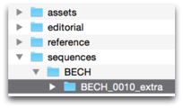
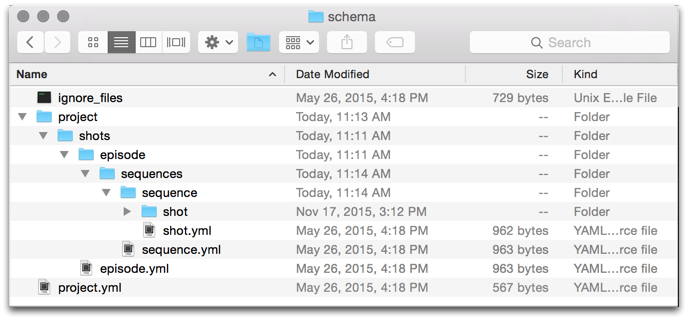

# 파일 시스템 구성 참조

이 문서는  Pipeline Toolkit의 파일 시스템 중심 구성에 대한 완전한 참조 문서입니다. 여기에서는 템플릿 시스템 작동 방식 및 사용 가능한 옵션을 설명합니다. 또한 폴더 생성 구성에 포함할 수 있는 다양한 매개변수를 모두 보여 줍니다.  
_이 문서에서는 툴킷 구성에 대한 제어 권한이 있는 경우에만 사용할 수 있는 기능에 대해 설명합니다. 자세한 내용은 [ 통합 관리자 안내서](https://support.shotgunsoftware.com/hc/ko/articles/115000067493)를 참조하십시오._

# 소개

이 문서에서는 파일 시스템과 관련된 툴킷 구성의 해당 부분을 구성하는 방법과 그 예를 설명합니다. 툴킷은 많은 파일과 디렉토리를 처리하며, 툴킷의 구성을 활용하여 경로의 결합 방법 및 의미를 표현할 수 있습니다. 일반적으로 파일 시스템은 완전히 다른 두 가지 방법으로 액세스됩니다.

1. **폴더 생성:** 에서 객체를 만든 후에는 작업이 시작될 수 있도록 디스크에 폴더를 만들어야 합니다. 이 작업은 디스크에 샷을 나타내는 폴더를 만드는 것처럼 간단할 수도 있고, 샷에 대해 작업하는 각 사용자가 디스크의 개별 영역에서 작업할 수 있도록 사용자별 작업 샌드박스를 설정하는 것처럼 복잡할 수 있습니다.

   - 툴킷은 응용프로그램을 시작할 때(예: 샷 BECH_0010을 위해 Maya를 시작할 때) 폴더 생성을 자동화하며 Maya를 시작하기 전에 폴더가 있는지 확인합니다. 폴더가 없으면 즉시 만들어집니다. 폴더는 [셸에서의 tank 명령](https://support.shotgunsoftware.com/hc/ko/articles/219033178-Administering-Toolkit#Useful%20tank%20commands) 및 [Shotgun의 폴더 만들기(Create Folders)](https://support.shotgunsoftware.com/hc/ko/articles/219040688-Beyond-your-first-project#Shotgun%20Integration) 메뉴를 통해 API 방식을 사용하여 만들 수도 있습니다. 이 폴더 생성 프로세스는 특별한 구성 파일 세트를 통해 진행됩니다. 자세한 정보는 아래 문서의 [1부](https://support.shotgunsoftware.com/hc/ko/articles/219039868-Integrations-File-System-Reference#Part%201%20-%20Folder%20Creation%20Syntax)를 참조하십시오.
2. **작업 열기 및 저장:** 작업하는 동안 디스크의 표준화된 위치에서 파일을 열고 저장해야 합니다. 이러한 파일 위치는 일반적으로 작업 시작 전에 만들어진 폴더 구조 내에 있습니다.

   - 폴더 구조가 설정되면 해당 구조를 사용하여 디스크의 주요 위치를 식별할 수 있습니다. 이러한 위치를 [템플릿](https://support.shotgunsoftware.com/hc/ko/articles/219039868-Integrations-File-System-Reference#Part%202%20-%20Configuring%20File%20System%20Templates)이라고 합니다. 예를 들어 `maya_shot_publish`라는 템플릿을 정의하여 샷을 위해 게시된 Maya 파일을 참조할 수 있습니다.  [툴킷 앱](https://support.shotgunsoftware.com/hc/ko/articles/219039798)은 이 템플릿을 사용합니다. Publish 앱은 이 템플릿을 사용하여 파일을 작성해야 할 위치를 제어할 수 있으며 [Workfiles 앱](https://support.shotgunsoftware.com/hc/ko/articles/219033088-Your-Work-Files)은 템플릿을 사용하여 파일을 열 위치를 확인할 수 있습니다. 툴킷의 환경 구성 내에서 각 앱이 사용하는 템플릿을 제어할 수 있습니다. 툴킷에서 사용되는 모든 주요 파일 위치는 단일 템플릿 파일에 정의되므로 쉽게 확인할 수 있습니다.

# 1부 - 폴더 생성 구문

폴더 구성은 의 엔티티를 디스크의 위치에 매핑합니다. 구성은 단일 구성 파일을 사용하는 것이 아니라 구성된 각 단위의 템플릿 역할을 하는 "미니 파일 시스템" 형식입니다. 이를 **스키마 구성**이라고 합니다. 툴킷의 폴더 생성이 실행되면 폴더와 파일이 이 "미니 파일 시스템"에서 대상 위치로 복사됩니다. 동적 동작을 만들 수 있습니다. 예를 들어 폴더가 에서 샷을 나타낼 수 있으며 해당 폴더의 이름 지정을 제어할 수 있습니다. 구체적으로 말하면, 여러 개의  필드에서 해당 폴더의 이름을 가져온 다음 폴더가 만들어지기 전에 문자 변환을 수행할 수 있습니다.

위의 이미지는 스키마 구성을 보여 줍니다. 툴킷 폴더 생성을 실행하면 의 엔티티와 디스크의 폴더 간에 연결이 설정됩니다.  툴킷은 이 폴더 스키마 구성을 사용하여 디스크에 일련의 폴더를 생성하고 각 폴더는 에 [`Filesystem Location`](https://developer.shotgunsoftware.com/cbbf99a4/) 엔티티로 등록됩니다. 즉,  데이터(예: 샷 및 에셋 이름) 및 구성이 디스크 및 의 실제 폴더에 "지정"된다고 생각할 수 있습니다. 구성은 항상 "project"라는 폴더에서 시작됩니다. 이 폴더는 항상 의 연결된 프로젝트를 나타내며 프로젝트의 툴킷 이름으로 대체됩니다. 이 레벨 아래에는 정적 폴더가 있습니다. 폴더 작성자는 자동으로 **sequences**와 같은 폴더를 만듭니다.

sequences 폴더 내에는 **sequence** 폴더와 **sequence.yml** 파일이 있습니다. 툴킷은 폴더와 같은 이름을 가진 YAML 파일을 발견할 때마다 YAML 파일의 컨텐츠를 읽고 원하는 동적 동작을 추가합니다. 이 경우, **sequence.yml** 파일에는 project 폴더 아래 세 가지 유형의 항목으로 구성된 구조가 있습니다.

1. **일반 폴더 및 파일:** 대상 위치로 간단히 복사됩니다.
2. **YAML 파일이 있는 폴더**(폴더와 같은 이름): 동적 컨텐츠를 나타냅니다. 예를 들어, **shot** 및 **shot.yml**이 있을 수 있으며 폴더가 만들어질 때 이 **shot** 폴더는 여러 폴더(샷당 하나의 폴더)를 생성하는 데 사용되는 템플릿입니다.
3. **name.symlink.yml 파일**은 폴더가 처리될 때 기호 링크를 생성합니다.  [기호 링크는 이 문서](https://support.shotgunsoftware.com/hc/ko/articles/219039868-File-System-Reference#Symbolic%20Links)의 뒷부분에서 설명합니다.

현재 YAML 파일에 표시된 동적 구성 설정은 다음 모드를 지원합니다.

- **[ 쿼리 폴더:](#shotgun-query-folders)**  데이터베이스 쿼리를 기반으로 하는 동적 폴더. 예를 들어 이 모드는 프로젝트의 모든 샷에 대한 폴더를 만드는 데 사용할 수 있습니다.

- **[ 목록 필드 폴더: ](#shotgun-list-field-folders)**   목록 필드를 기반으로 하는 동적 폴더 이름입니다. 예를 들어 이 모드는 의 에셋 엔티티에 있는  목록 필드 "Asset Type"의 모든 값에 대한 폴더를 만드는 데 사용할 수 있습니다.

- **[유예된 폴더:](#workspaces-and-deferred-folder-creation)** 툴킷 API의 폴더 생성 방식을 통해 두 번째 폴더 생성 패스가 요청될 때(일반적으로 Maya와 같은 응용프로그램이 시작될 때)만 실행됩니다. 일반적으로 이 방식은 응용프로그램을 시작하기 직전에 툴킷의 다양한 응용프로그램 시작 관리자에 의해 실행됩니다.

- **[현재 사용자 폴더:](#current-user-folder)**  현재 사용자를 나타내는 특수 폴더입니다.

이러한 모드에 대해 자세히 살펴보겠습니다.

##  쿼리 폴더

 쿼리에 해당하는 동적 폴더의 경우 YAML 파일에서 다음 구문을 사용합니다.

    
    # the type of dynamic content
    type: shotgun_entity

    
    # the  entity type to connect to
    entity_type: Asset

    
    # the  field to use for the folder name
    name: code

    
    #  filters to apply when getting the list of items
    
    # this should be a list of dicts, each dict containing
    
    # three fields: path, relation and values
    
    # (this is std  API syntax)
    
    # any values starting with $ are resolved into path objects
    filters: [ { "path": "project", "relation": "is", "values": [ "$project" ] } ]

- 동적 컨텐츠 **type** 필드의 값을 **shotgun_entity**로 설정합니다.
- **entity_type** 필드는 데이터를 가져올  엔티티(예: "에셋", "샷", "시퀀스", "CustomEntity02" 등)로 설정해야 합니다.
- **name** 필드는 의 데이터를 기반으로 각 폴더에 지정해야 하는 이름입니다.

   - 위의 예와 같이 단일 필드를 사용할 수 있습니다(예: `name: code`).
   - 여러 필드를 괄호로 묶어 사용할 수 있습니다(예: `name:``"{asset_type}_{code}"`).
   - 링크된 다른 엔티티의 필드를 포함하려면 표준 `name: "{sg_sequence.Sequence.code}_{code}"` 도트 구문을 사용할 수 있습니다(예: ).
- **filters** 필드는  쿼리이며 [ API 구문](http://developer.shotgunsoftware.com/python-api/reference.html)을 비슷하게 따릅니다. 이는 사전 목록이며 각 사전에는 _path_, _relation_ 및 _values_ 키가 있어야 합니다. 유효한 $syntax 값은 상응하는  엔티티(예: 프로젝트의 경우 `"$project"`, sequence.yml이 상위 디렉토리 계층에 있는 경우 `"$sequence"`)가 있는 모든 상위 폴더입니다.  엔티티 링크의 경우 $syntax(예: `{ "path": "project", "relation": "is", "values": [ "$project" ] }`)를 사용하여 구성에서 상위 폴더를 참조할 수 있습니다. [아래 예](https://support.shotgunsoftware.com/hc/ko/articles/219039868-Integrations-File-System-Reference#Examples)에서 자세히 설명합니다.

## 다중 폴더

한 번에 여러 폴더를 만드는 표현식을 만들려면 이름 정의에 슬래시를 포함합니다.

    
    # the type of dynamic content
    type: shotgun_entity

    
    # the  entity type to connect to
    entity_type: Asset

    
    # the  field to use for the folder name
    name: "{sg_asset_type}/{code}"

    
    #  filters to apply when getting the list of items
    
    # this should be a list of dicts, each dict containing
    
    # three fields: path, relation and values
    
    # (this is std  API syntax)
    
    # any values starting with $ are resolved into path objects
    filters: [ { "path": "project", "relation": "is", "values": [ "$project" ] } ]

이러한 종류의 경로에 대한 파일 시스템 템플릿(자세한 정보는 이 문서의 2부 참조)을 만들 때 마지막 폴더는  엔티티를 나타냅니다. 예를 들어 위의 예는 다음 템플릿으로 표현될 수 있습니다.

    asset_step_folder: assets/{asset_type}/{Asset}/{Step}

`{asset_type}`  및 `{Asset}`은 모두 문자열 템플릿 키로 정의되며 `{Asset}` 토큰은 지정된 경로의 컨텍스트를 결정할 때 컨텍스트 계산에서 사용합니다.

## 상위 폴더를 사용하여 만들기

에서는  데이터 구조 내에 중첩이 있습니다. 이 중첩은 상위-하위 또는 하위-상위 관계일 수 있습니다. 예를 들어 시퀀스는 일반적으로 파일 시스템에서 샷에 대한 상위 항목이며, 마찬가지로 샷은 일반적으로 시퀀스의 하위 항목입니다.



shotgun_entity 유형 폴더는 폴더 생성 프로세스에서 상위 항목을 만들 때 하위 항목도 만들어지도록 반복할지 여부를 제어하는 선택적 플래그를 지원합니다. 플래그는 특정 고정 값(이 경우 "true" 또는 "false")만을 지정할 수 있는 설정입니다. 이 플래그를 추가하려면 다음 예를 사용합니다.

    
    # recurse down from parent folder
    create_with_parent: true

언급한 바와 같이 이 설정은 선택 사항이며 기본적으로 false로 설정됩니다. true로 설정하면 툴킷에서 검색되는 모든 하위 엔티티에 대한 폴더를 만듭니다. 예를 사용하여 계속 진행하려면 상위 시퀀스가 만들어질 때마다 샷을 만들려면 샷에 대해 `create_with_parent`를 `true`로 설정합니다.



## 선택 필드

일반적으로 폴더 이름을 정의(예: `{code}_{sg_extra_field}`)할 때, 툴킷에서는 모든 필드의 값이 에 있어야 합니다. 예를 들어 `sg_extra_field`가 비어 있으면 오류 메시지가 생성됩니다. 필드가 채워질 수도 있고 채워지지 않을 수도 있다면 해당 필드를 선택 필드로 만듭니다. 즉, 툴킷에서는 값이 있으면 필드가 포함되고 값이 오류 없이 공백이면 제외됩니다.

선택 필드는 `{code}[_{sg_extra_field}]`와 같이 대괄호를 사용하여 정의합니다. 이렇게 하면 다음 폴더 이름이 생성됩니다.

- `code`가 BECH_0010이고 `sg_extra_field`가 extra인 경우 폴더 이름은 `BECH_0010_extra`가 됩니다.

- `code`가 BECH_0010이고 `sg_extra_field`가 비어 있는 경우 폴더 이름은 `BECH_0010`가 됩니다.



## 정규식 토큰 일치

툴킷을 통해 정규식을 사용하여  필드 이름의 일부를 추출할 수 있습니다. 이렇게 하면 의 값으로 폴더 생성을 유도할 수 있는 간단한 표현식을 만들 수 있습니다. 예를 들어 의 모든 에셋 이름이 세 문자 접두어와 밑줄로 지정되면(예: `AAT_Boulder7`) 두 개의 파일 시스템 폴더 수준으로 나눌 수 있습니다(예: `AAT/Boulder7`).

    
    # the type of dynamic content
    type: shotgun_entity

    
    # the  entity type to connect to
    entity_type: Asset

    
    # Extract parts of the name using regular expressions
    name: "{code:^([^_]+)}/{code^[^_]+_(.*)}"

    
    #  filters to apply when getting the list of items
    
    # this should be a list of dicts, each dict containing
    
    # three fields: path, relation and values
    
    # (this is std  API syntax)
    
    # any values starting with $ are resolved into path objects
    filters: [ { "path": "project", "relation": "is", "values": [ "$project" ] } ]

구문은 템플릿 시스템의 `subset` 토큰과 유사합니다.  필드 이름 다음에 콜론에 이어서 일반 표현식을 추가하기만 하면 됩니다. 정규식으로 정의된 모든 그룹(예: `()`로 둘러싸인 섹션)은 값을 추출하는 데 사용됩니다. 정규식에 여러 그룹이 있는 경우 이 그룹이 함께 연결됩니다. 예를 들어 다음 표현식은 객체를 만든 사용자의 이니셜을 추출합니다.  `{created_by.HumanUser.code:^([A-Z])[a-z]* ([A-Z])[a-z]*}`

## 예

다음은 필터 구문을 사용하는 방법을 보여 주는 사례 모음입니다.

**현재 프로젝트에 속해 있고 진행 중인 모든 샷을 찾으려면** 아래 구문을 사용합니다.  샷 엔티티에는 샷을 프로젝트에 연결하는 project라는 링크 필드가 있습니다. 현재 프로젝트와 연결된 샷의 폴더만 만들려고 합니다. 구성 파일 시스템에서 프로젝트 수준이 더 높기 때문에 $syntax를 통해 이를 참조할 수 있으며, 여기에 툴킷은 자동으로  엔티티 링크 참조를 만듭니다. 유효한 $syntax 값은 상응하는  엔티티(예: 프로젝트의 경우 `"$project"`, sequence.yml이 상위 디렉토리 계층에 있는 경우 `"$sequence"`)가 있는 모든 상위 폴더여야 합니다.

    entity_type: Shot
    filters:
        - { "path": "project", "relation": "is", "values": [ "$project" ] }
        - { "path": "status", "relation": "is", "values": [ "ip" ] }

트리의 상위에 시퀀스 폴더가 있고 **해당 시퀀스에 속한 모든 샷에 대한 폴더를 만들려면** 다음과 같은 필터를 만들 수 있습니다.

    entity_type: Shot
    filters:
        - { "path": "project", "relation": "is", "values": [ "$project" ] }
        - { "path": "sg_sequence", "relation": "is", "values": [ "$sequence" ] }

**모든 에셋을 찾으려면** 이 구문을 사용합니다.

    entity_type: Asset
    filters: [ { "path": "project", "relation": "is", "values": [ "$project" ] } ]

##  목록 필드 폴더

예를 들어 [ 목록 필드](https://support.shotgunsoftware.com/hc/ko/articles/219031008) 폴더는 의 모든 에셋 유형에 대해 하나의 폴더를 만들려는 경우에 유용합니다. 에셋 유형은 의 목록 필드이며 이 폴더 구성 유형을 사용하면 이러한 에셋 유형 목록이 반영된 파일 시스템의 계층을 정의할 수 있습니다.



 목록 필드의 모든 항목에 해당하는 동적 폴더의 경우 YAML 파일에서 다음 구문을 사용합니다.

    
    # the type of dynamic content
    type: "shotgun_list_field"

    
    # the  entity type to connect to
    entity_type: "Asset"

    
    # only create for values which are used in this project.
    
    # this is optional and will be set to false if not specified.
    skip_unused: false

    
    # by default, list fields are only created if they are needed by a child entity node
    
    # by setting the create_with_parent parameter to true you ensure that list field
    
    # nodes are always created
    create_with_parent: false

    
    # the  field to use for the folder name
    field_name: "{sg_asset_type}_type"

- 동적 컨텐츠 **type** 필드의 값을 `shotgun_list_field`로 설정합니다.
- `entity_type` 필드는 데이터를 가져올  엔티티(예: "에셋", "시퀀스", "샷" 등)로 설정해야 합니다.
- `field_name` 필드는 데이터를 가져온  필드로 설정해야 하며 [목록 유형 필드](https://support.shotgunsoftware.com/hc/ko/articles/219031008)여야 합니다. 표현식을 사용하여 정적 텍스트를 동적 컨텐츠와 함께 추가할 수 있습니다.`field_name: "{sg_asset_type}_type"`  이 표현식 예는 텍스트와 템플릿 키를 포함합니다.

- 선택적 `skip_unused` 매개변수는 사용되지 않는 목록 유형 필드 값에 대해 디렉토리가 생성되는 것을 방지합니다(위의 [선택 필드](https://support.shotgunsoftware.com/hc/ko/articles/219039868-File-System-Reference#Optional%20fields) 섹션 참조).  

- 선택적 `create_with_parent` 매개변수는 현재 처리 중인 하위 엔티티 레벨 노드가 없는 경우에도 list_field 노드를 강제로 만듭니다(위의 [상위 폴더를 사용하여 만들기](https://support.shotgunsoftware.com/hc/ko/articles/219039868-File-System-Reference#Create%20With%20Parent%20Folder) 섹션 참조).

## 파이프라인 단계 폴더

파이프라인 단계 폴더는 의 [파이프라인 단계](https://support.shotgunsoftware.com/hc/ko/articles/219031288)를 나타냅니다. 파이프라인 단계는 단계라고도 합니다.

    
    # the type of dynamic content
    type: "shotgun_step"

    
    # the  field to use for the folder name. This field needs to come from a step entity.
    name: "short_name"

여기에서는 [위에서 설명한  엔티티](https://support.shotgunsoftware.com/hc/ko/articles/219039868-File-System-Reference#Shotgun%20List%20Field%20Folders)와 같은 방식으로 이름 표현식을 사용할 수 있습니다. 노드는  엔티티 폴더 구성을 찾을 때까지 상위, 최상위 항목을 검색합니다. 이 엔티티 폴더는 단계와 연관되며 엔티티의 유형은 작성할 단계를 결정하는 데 사용됩니다.



기본적으로 단계 폴더는 특정 엔티티에 대한 모든 관련 단계를 자동으로 만들려고 합니다. 예를 들어 5단계(레이아웃, 애니메이션, FX, 조명, 합성)가 있는 샷에 대해 폴더 생성이 트리거되면 5단계(레이아웃, 애니메이션, FX, 조명, 합성)에 대한 단계 폴더가 자동으로 만들어집니다.

그러나 다음 구문을 사용하여 이 기능을 끌 수 있습니다.

    
    # recurse down from parent folder
    create_with_parent: false

이 설정을 구성에 추가하면 샷 폴더를 만들 때 단계 폴더가 만들어지지 않습니다. 대신, 단계 폴더는 태스크에서 폴더 만들기를 실행할 때만 만들어집니다. 이 방법은 작업을 시작하기 직전에 만들어지는 사용자 샌드박스 및 기타 구조를 구성하려는 경우 유용할 수 있습니다.

### 다양한 파이프라인 단계에 대한 다양한 파일 시스템 레이아웃

조명 및 Comp(합성)에 대해 하나의 폴더 구조를 만들고, 다른 모든 폴더에 대해 하나의 폴더 구조를 만든다고 가정합니다. 여러 파이프라인 단계에 서로 다른 파일 시스템 레이아웃을 사용하려면 `filter` 절을 구성에 추가합니다. 이 필터를 사용하면 특정 단계의 구성에서 처리할 파이프라인 단계의 범위를 지정할 수 있습니다. 이 예에서는 두 개의 구성 파일 `step_lightcomp.yml` 및 `step.yml`을 만들 수 있습니다. 첫 번째 파일에서는 다음 필터를 추가합니다.

    filters: [ { "path": "short_name", "relation": "in", "values": [ "Light", "Comp"  ] } ]

위의 구문은 `Light` 또는 `Comp` 유형의 단계 폴더가 만들어질 때만 사용됩니다. 다른 파일의 경우 다른 모든 항목에 대한 규칙을 만들려고 합니다.

    filters: [ { "path": "short_name", "relation": "not_in", "values": [ "Light", "Comp"  ] } ]

이제 이러한 각 폴더에서 별도의 하위 구조를 정의할 수 있습니다.

## 고급: 상위 항목 지정

폴더 생성 중 툴킷은 파이프라인 단계를 엔티티(예: "샷", "에셋" 등)와 연결해야 합니다. 기본적으로 툴킷은 폴더 트리를 검색하고 찾은 첫 번째  엔티티 폴더를 선택하여 이 작업을 수행합니다. 예를 들어 `Sequence > Shot > Step` 계층이 있는 경우, 일반적으로 원하는 대로 단계 폴더가 자동으로 샷과 연결됩니다.

그러나 기본 엔티티 아래에 엔티티가 있는 계층(예: `Sequence > Shot > Department > Step`)에서는 기본적으로 단계가 부서 레벨과 연관되는데 이는 바람직하지 않습니다. 이 경우 찾을 위치를 툴킷에 명시적으로 지정해야 합니다. 단계 구성에 다음을 추가하여 이를 수행할 수 있습니다.

    associated_entity_type: Shot

##  태스크 폴더

태스크 폴더는 의 [태스크](https://support.shotgunsoftware.com/hc/ko/articles/219031248)를 나타냅니다. 기본적으로 태스크 폴더는 상위 폴더와 함께 만들어지지 않습니다. 예를 들어 태스크 노드가 연결된 샷에 대해 폴더 생성이 트리거되면 태스크 폴더가 자동으로 만들어지지 않습니다. 대신, 태스크 폴더는 태스크에 대해 폴더 생성이 실행될 때(예: 에서 태스크 시작)에만 만들어집니다.

    
    # the type of dynamic content
    type: "shotgun_task"

    
    # the  field to use for the folder name. This field needs to come from a task entity.
    name: "content"

그러나 다음 구문을 사용하여 상위 엔티티와 함께 태스크가 만들어지도록 생성을 켤 수 있습니다.

    
    # recurse down from parent folder
    create_with_parent: true

단계와 마찬가지로, 폴더 구성이 작동해야 하는 태스크를 필터링하려면 선택적으로 `filter` 매개변수를 제공할 수도 있습니다.

[위에서 설명한  엔티티](https://support.shotgunsoftware.com/hc/ko/articles/219039868-File-System-Reference#Shotgun%20List%20Field%20Folders)에서와 마찬가지로 이름 표현식을 사용할 수 있습니다. 여기서 동적 컨텐츠와 함께 정적 텍스트를 사용하여 동적 컨텍스트와 정적 컨텍스트를 모두 가진 이름을 만들 수 있습니다.

`name: "task_{content}"`

노드는  엔티티 폴더 구성을 찾을 때까지 상위, 최상위 항목을 검색합니다. 이 엔티티 폴더는 태스크와 연결되며 만들 태스크 폴더를 결정하는 데 사용됩니다.

### 고급: 상위 항목 지정

폴더 생성 중 툴킷은 태스크를 엔티티(예: 샷, 에셋 등)와 연결해야 합니다. 기본적으로 툴킷은 폴더 트리를 검색하고 찾은 첫 번째  엔티티 폴더를 선택하여 이 작업을 수행합니다. 예를 들어 `Sequence > Shot > Task` 계층이 있는 경우, 일반적으로 원하는 대로 태스크 폴더가 자동으로 샷과 연결됩니다.

그러나 기본 엔티티(예: 샷) 아래에 엔티티가 있는 계층(예: `Sequence > Shot > Department > Task,`)에서는 툴킷이 기본적으로 태스크가 부서 레벨과 연관되는데 이는 바람직하지 않습니다. 이 경우 [이전 섹션](https://support.shotgunsoftware.com/hc/ko/articles/219039868-File-System-Reference#Create%20With%20Parent%20Folder)의 단계로 업데이트하는 방법과 같이 찾을 위치를 툴킷에 명시적으로 지정해야 합니다. 태스크 구성에 다음을 추가하여 이 작업을 수행할 수 있습니다.

`associated_entity_type: Shot`

## 작업공간 및 폴더 생성 유예

폴더 생성 유예란 툴킷 API의 폴더 생성 방식에서 선택적 `engine` 매개변수를 통해 두 번째 폴더 생성 패스가 요청된 경우에만 생성이 실행됨을 의미합니다. 일반적으로 이 방식은 응용프로그램을 시작하기 직전에 툴킷의 다양한 응용프로그램 시작 관리자에 의해 실행됩니다. 대부분의 폴더 유형은 유예됨 플래그(기본적으로 `false`)를 지원합니다. 폴더 생성 유예를 `true`로 설정하려면 이 플래그를 추가합니다.

    
    # only create this folder when tk.create_filesystem_structure is
    
    # called with tk-maya, tk-nuke or any-custom-string.
    defer_creation: ["tk-maya", "tk-nuke", "any-custom-string]

    
    # create this folder when any application launches, but not when normal folder
    
    # creation runs
    defer_creation: true

이 플래그를 사용하면 첫 번째 "전역" 패스에서 실행되는 절반 부분과 나중에 두 번째 패스에서 실행되는 부분으로 폴더 생성을 분리할 수 있습니다. 일반적으로 두 번째 패스는 기본값이 `false`이기 때문에 자동으로 수행되지는 않지만 엔진 시작과 관련되어 있으므로 엔진이 시작되기 직전에 사용자가 폴더를 만들 수 있습니다. 이렇게 하면 두 가지 기본 워크플로우가 허용됩니다.

1. **작업공간:** 응용프로그램별 폴더 설정입니다. 응용프로그램이 시작되기 직전에 폴더를 만들 수 있습니다.
2. 이를 위한 일반적인 워크플로우에는 샷에 필요한 항목과 아티스트가 선택하는 처리 방법에 따라 Houdini, Maya 및 다른 엔진이 필요한 파이프라인 단계가 있습니다. 아티스트는 처음에 해당 파이프라인 단계에 대해 maya/, houdini/ 및 기타 디렉토리를 만들 수 있지만 지정된 샷의 아티스트가 Maya에서만 계속 작업하는 경우 Houdini 및 기타 다른 엔진의 빈 폴더는 필요하지 않습니다. 따라서 개별 엔진 시작 시점에 발생하는 폴더 생성을 유예하는 경우 아티스트가 Houdini를 사용하지 않는다면 해당 샷에 대해 houdini/ 폴더가 생성되지 않습니다.
3. **사용자 폴더:** 사용자 폴더는 응용프로그램 시작 직전에 만들어집니다. 위에서 설명한 사용자 폴더 구성 구조는 기본적으로 유예됩니다.
4. 이렇게 하면 에서 할당된 사용자를 기반으로 하는 사용자 폴더 대신 엔진을 시작할 때마다 현재 사용자에 대한 폴더를 만들 수 있습니다. 예를 들어 샷에서 작업을 시작하고 Maya를 시작하면 사용자 이름 폴더가 의 사용자 이름을 기반으로 만들어지고 다른 사용자 작업에 영향을 주지 않습니다.

_팁: Maya와 같은 응용프로그램이 시작될 때 일반적이고 정적인 폴더를 만들려면 폴더와 동일한 이름의 구성 YAML 파일을 만들고 다음을 추가합니다. _

    
    # type of content
    type: "static"

    
    # only create this folder for maya
    defer_creation: "tk-maya"

    :::yaml
    
    # type of content
    type: "static"

    
    # only create this folder when tk.create_filesystem_structure is
    
    # called with any-custom-string.
    defer_creation: "any-custom-string"

## 현재 사용자 폴더

현재 사용자 폴더는 다른 사용자의 작업 영역을 설정할 수 있도록 하는 특수한 구성입니다. 일반적인 시나리오는 한 부서에서 근무하는 여러 아티스트가 같은 샷에 대해 작업하는 경우입니다. 사용자 폴더는 아티스트가 자신의 디렉토리에 작업 파일을 저장할 수 있으므로 사용될 수 있으며 [Workfiles 앱](https://support.shotgunsoftware.com/hc/ko/articles/219033088-Your-Work-Files)에서 자신의 파일에 대해서만 필터링할 수 있습니다. 이 경우 구성 파일에 다음 옵션이 포함되어야 합니다.

    
    # the type of dynamic content
    type: "user_workspace"

    name: "login"

- **type** 필드의 값을 `user_workspace`로 설정합니다.
- **name** 필드는 사용자 폴더에 지정해야 하는 이름입니다. 의 작업자(People)에서 가져온 필드(의 `HumanUser`)의 조합으로 구성되어야 합니다.
- 위의 예와 같이 단일 필드를 사용할 수 있습니다(예: `name: login`).
- 여러 필드를 괄호로 묶어 사용할 수 있습니다(예: `name: "{firstname}_{lastname}"`).
- 링크된 다른 엔티티의 필드를 포함하려면 표준 `name: "{sg_group.Group.code}_{login}"` 도트 구문을 사용할 수 있습니다(예: ).

현재 사용자 폴더는 기본적으로 유예된 폴더로 만들어집니다. 즉, 툴킷 API의 폴더 생성 방식에서 선택적 매개변수인 `engine`을 통해 두 번째 폴더 생성 패스가 요청된 경우에만 생성이 실행됩니다.

## 정적 폴더

정적 폴더(및 파일)는 가장 간단한 유형입니다. 폴더를 구성 구조에 놓을 수 있으며 폴더 생성 프로세스가 실행될 때 자동으로 복사됩니다.  [다음은 정적 폴더의 몇 가지 예](https://github.com/shotgunsoftware/tk-config-default/tree/master/core/schema/project)(https://github.com/shotgunsoftware/tk-config-default/tree/master/core/schema/project)이며 이는 기본 구성에 있습니다(정적 폴더에는 해당 YAML 파일이 없음).

대개 정적 폴더에서는 이 작업 이외에 수행해야 할 작업이 없지만, 툴킷은 정적 폴더에 대한 몇 가지 고급 기능을 지원합니다. 동적 조건을 정의하여 정적 폴더를 만들지 여부를 결정할 수 있습니다. 예를 들어 편집 유형의 파이프라인 단계에 대해서만 생성되는 특별한 정적 폴더가 필요할 수 있습니다. 이 경우 정적 폴더 옆에 YAML 구성 파일을 추가하고 동일한 이름(확장자는 "yml")을 지정해야 합니다. 이제 다음 구문을 사용합니다.

    
    # the type of dynamic content
    type: "static"

    
    # pick one of the  folders that are above this folder
    
    # in the folder hierarchy. In this case it is a parent folder
    
    # named step that we want to look at when deciding if this
    
    # static folder should be created or not.
    constrain_by_entity: "$step"

    
    # we can now define constraints for this step. Constraints are simple
    
    #  queries, following the same syntax as the other  filters
    
    # shown in previous sections.
    #
    
    # In our example, if the parent step matches the constraints given
    
    # in the filter below, the static folder will be created. If not,
    
    # it (and its children) will be ignored by the folder creation process.
    constraints:
        - { "path": "short_name", "relation": "is", "values": [ "edit" ] }

기본적으로 정적 폴더는 상위 폴더와 함께 자동으로 만들어집니다. 이렇게 되는 것을 원하지 않을 수 있으며, 그럴 경우 정적 폴더가 상위 폴더와 함께 만들어지지 않도록 특수 플래그를 추가합니다.

    
    # do not recurse down automatically
    create_with_parent: false

## 기호 링크

동적 폴더 생성 중에 기호 링크(symlink)를 만들 수 있습니다. 이름이 `artwork`인 기호 링크를 만들려면 스키마 구성에서 `artwork.symlink.yml`이라는 파일을 만듭니다. 이 파일은 시스템에서 기호 링크 요청으로 식별되며 복사되지 않는 대신 처리됩니다.

`artwork.symlink.yml` 파일에는 적어도 `target` 키가 포함되어야 합니다.

    
    # Example of a .symlink.yml file

    
    # A target parameter is required.
    target: "../Stuff/$Project/$Shot"

    
    # Additional parameters will be passed to the hook as metadata
    
    # so you can for example include permission hints or other stuff
    
    # that you may need for advanced customization
    additional_param1: abc
    additional_param2: def

대상 매개변수에 `$Asset`, `$Shot` 또는 `$Project` 등의 `$EntityType` 토큰이 포함되면 해당 엔티티(에셋, 샷, 프로젝트 등)를 나타내는 폴더의 이름으로 확인하려고 시도합니다. 툴킷은 파일 시스템 트리에서 이러한 값을 검색하고 트리에서 상위 항목으로 정의되지 않은 경우 오류가 보고됩니다.

에셋의 에셋 유형과 같은 목록 필드는 엔티티 유형을 포함하는 구문으로 표현됩니다(예: `$Asset.sg_asset_type`). 예:

    
    # Example of a .symlink.yml file

    
    # A target parameter is required.
    target: "../renders/$Project/$Asset.sg_asset_type/$Asset"

기호 링크 생성은 모든 입력/출력 또는 I/O와 같이 폴더 처리 후크 내부에서 발생합니다. 특별한 `symlink` 액션이 시스템에서 후크로 전달되면 기호 링크의 이름, 완전히 확인된 대상 그리고 이 요청과 함께 정의 파일에 포함된 모든 YAML 메타데이터를 가져옵니다. 위의 `artwork` 예의 경우 샷 아래에 다음과 같은 폴더를 만듭니다.

     {'action': 'symlink',
      'path': '/mnt/projects/chasing_the_light/Sequences/AA/AA001/artwork'
      'target': '../Stuff/chasing_the_light/AA001',
      'metadata': {'target': '../Stuff/$Project/$Shot', 'additional_param1': 'abc', 'additional_param2': 'def'}
      }

## 파일 및 폴더 무시

스키마 스캐폴드에 배치된 파일은 폴더 생성 중에 대상 영역으로 복사됩니다. 이 복사 프로세스는 코어 후크에 의해 처리되므로 예를 들어 프로젝트 또는 스튜디오에 대한 권한 처리를 커스터마이즈할 수 있습니다.

{% include info title="참고" content="이 유형의 처리에 대한 자세한 내용은 [I/O 및 권한 커스터마이즈 섹션](https://support.shotgunsoftware.com/hc/ko/articles/219039868-Integrations-File-System-Reference#Simple%20customization%20of%20how%20folders%20are%20created)간단한 커스터마이즈 아래의 I/O 및 권한 커스터마이즈 섹션을 참조하십시오. 많은 폴더 설정을 처리하는 [process_folder_creation 코어 후크](https://github.com/shotgunsoftware/tk-core/blob/master/hooks/process_folder_creation.py#L62-L71)  (https://github.com/shotgunsoftware/tk-core/blob/master/hooks/process_folder_creation.py#L62-L71)가 있습니다. 이 후크에 chmod 호출을 추가하여(및/또는 mkdir 시 권한 설정) 만드는 폴더에 대한 권한을 설정할 수 있습니다." %}

폴더 생성 중에 특정 파일 및 폴더를 복사 대상에서 제외하려는 경우에도 유용할 수 있습니다. 예를 들어 Git 또는 SVN에 폴더 생성 구성을 저장하는 경우 각 샷 또는 에셋 폴더로 복사하지 않으려는 `.git` 및 `.svn` 폴더가 있습니다. 복사하지 않으려는 파일이 있는 경우 `ignore_files` 파일을 프로젝트 구성 내의 `config/core/schema` 폴더에 놓을 수 있습니다. 이 파일에는 복사하지 않을 파일을 정의하는 전역 스타일의 패턴이 있어야 합니다. 각 패턴은 별도의 줄에 있어야 합니다.

    
    # This is a good example of a standard ignore_files file

    .svn                # no svn temp files to be copied across at folder creation time
    .git                # no git temp files to be copied across at folder creation time
    .DS_Store           # no mac temp files to be copied across at folder creation time

와일드카드를 사용할 수도 있습니다. 예를 들어 TMP 익스텐션이 있는 모든 파일을 제외해야 하는 경우 *.tmp 줄을 파일에 추가하기만 하면 됩니다.

    
    # This is a good example of a standard ignore_files file

    .svn                # no svn temp files to be copied across at folder creation time
    .git                # no git temp files to be copied across at folder creation time
    *.tmp           # no files with tmp extension to be copied across at folder creation time

## I/O 및 권한 커스터마이즈

샷 및 에셋 폴더를 특별한 권한 및 매개변수를 사용하여 만들어야 하는 경우가 많이 있습니다. 이 작업은 폴더 생성 중에 권한 비트를 설정하는 것처럼 간단할 수도 있고, 적절한 자격 증명, 그룹 및 권한이 있는 폴더를 만드는 특정 폴더 생성 서버에 원격 요청을 보내는 것처럼 복잡할 수도 있습니다.

또한 파일 시스템 트리 내 다양한 수준의 폴더가 서로 다른 권한을 가져야 하는 경우가 일반적입니다. 작업 영역 폴더는 일반적으로 모든 사람에게 쓰기 권한이 있지만 샷 폴더는 훨씬 더 엄격한 권한이 있을 수 있습니다.

툴킷을 사용하면 단일 후크를 통해 폴더 생성을 커스터마이즈할 수 있습니다. 이는 코어 후크이며 이름은 `process_folder_creation.py`입니다. 폴더 생성 API 호출은 폴더 구성을 탐색하여 만들어야 하는 폴더를 결정할 때 만들 수 있는 항목 목록을 작성합니다. 이러한 항목은 파일일 수도 있고 폴더일 수 있습니다. 폴더 생성의 마지막 단계로 이 목록이 실제 폴더 프로세싱을 처리하기 위해 후크로 전달됩니다. 기본 [process_folder_creation 코어 후크는 여기](https://github.com/shotgunsoftware/tk-core/blob/master/hooks/process_folder_creation.py#L62-L71)(https://github.com/shotgunsoftware/tk-core/blob/master/hooks/process_folder_creation.py#L62-L71)에서 검토할 수 있습니다.

### 후크에 전달된 데이터

폴더 생성 후크는 각 폴더 생성 요청에 대해 한 번만 실행됩니다. 목록의 모든 폴더 생성 데이터는 후크로 전달되며 후크는 일반적으로 이 작업을 반복하고 Core API에서 전달된 매개변수에 따라 폴더를 만듭니다.

목록의 데이터는 항상 깊이를 우선하여 반복되며 최상위 레벨의 폴더 및 파일부터 시작하여 점점 더 깊게 이동합니다. 다음 예에서 후크에 전달된 데이터를 보여 줍니다.

    [

     {'action': 'entity_folder',
      'entity': {'id': 88, 'name': 'Chasing the Light', 'type': 'Project'},
      'metadata': {'root_name': 'primary', 'type': 'project'},
      'path': '/mnt/projects/chasing_the_light'},

     {'action': 'folder',
      'metadata': {'type': 'static'},
      'path': '/mnt/projects/chasing_the_light/sequences'},

     {'action': 'entity_folder',
      'entity': {'id': 32, 'name': 'aa2', 'type': 'Sequence'},
      'metadata': {'entity_type': 'Sequence',
                   'filters': [{'path': 'project',
                                'relation': 'is',
                                'values': [<tank.folder.folder_types.FilterExpressionToken object at 0x10ca04c90>]}],
                   'name': 'code',
                   'type': 'shotgun_entity'},
      'path': '/mnt/projects/chasing_the_light/sequences/aa2'},

     {'action': 'entity_folder',
      'entity': {'id': 1184, 'name': 'moo87', 'type': 'Shot'},
      'metadata': {'entity_type': 'Shot',
                   'filters': [{'path': 'sg_sequence',
                                'relation': 'is',
                                'values': [<tank.folder.folder_types.FilterExpressionToken object at 0x10ca04b10>]}],
                   'name': 'code',
                   'type': 'shotgun_entity'},
      'path': '/mnt/projects/chasing_the_light/sequences/aa2/moo87'},

     {'action': 'copy',
      'metadata': {'entity_type': 'Shot',
                   'filters': [{'path': 'sg_sequence',
                                'relation': 'is',
                                'values': [<tank.folder.folder_types.FilterExpressionToken object at 0x10ca04b10>]}],
                   'name': 'code',
                   'type': 'shotgun_entity'},
      'source_path': '/mnt/software/tank/chasing_the_light/config/core/schema/project/sequences/sequence/shot/sgtk_overrides.yml',
      'target_path': '/mnt/projects/chasing_the_light/sequences/aa2/moo87/sgtk_overrides.yml'},

     {'action': 'create_file',
      'metadata': {'entity_type': 'Shot',
                   'filters': [{'path': 'sg_sequence',
                                'relation': 'is',
                                'values': [<tank.folder.folder_types.FilterExpressionToken object at 0x10ca04b10>]}],
                   'name': 'code',
                   'type': 'shotgun_entity'},
      'content': 'foo bar',
      'target_path': '/mnt/projects/chasing_the_light/sequences/aa2/moo87/automatic_content.txt'},

     {'action': 'symlink',
      'path': '/mnt/projects/chasing_the_light/Sequences/AA/AA001/artwork'
      'target': '../Stuff/chasing_the_light/AA001',
      'metadata': {'target': '../Stuff/$Project/$Shot', 'additional_param1': 'abc', 'additional_param2': 'def'}
      },

    ]

데이터는 사전 목록입니다. 각 사전에는 `action`이라는 키가 있습니다. 이 키는 요청된 I/O 항목의 유형을 나타냅니다. 폴더 생성 후크를 구현하는 경우 다음과 같은 다양한 액션에 대한 지원을 추가해야 합니다.

- `entity_folder`:  엔티티와 관련된 디스크상의 폴더
- `folder`: 디스크상의 폴더
- `copy`: 소스 위치에서 대상 위치로 복사해야 하는 파일
- `create_file`: 디스크에 만들어야 하는 파일
- `symlink`: 만들어야 하는 기호 링크

각각의 액션에는 각기 다른 사전 키 집합이 있습니다. 예를 들어 `entity_folder` 액션에는 연결된 엔티티의 상세 정보를 포함하는 `entity key`가 있습니다. `create_file`에는 `source_path` 및 `target_path` 키가 있으며, 이 키를 통해 후크에서 복사할 파일과 위치를 알 수 있습니다.

또한 모든 `actions`에는 `metadata`라는 키가 있습니다. 이 키는 스키마 설정의 관련 구성 파일에서 가져온 YAML 구성 데이터를 나타냅니다. 위의 예에서 스키마 구성 내에 설정된 모든 필터 및 이름 지정 정보가  폴더의 `metadata` 키에 어떻게 포함되어 있는지 볼 수 있습니다. 예를 들어 위의 예에서 샷 폴더의 메타데이터는 다음과 같습니다.

    {'action': 'entity_folder',
      'entity': {'id': 1184, 'name': 'moo87', 'type': 'Shot'},
      'metadata': {'entity_type': 'Shot',
                   'filters': [{'path': 'sg_sequence',
                                'relation': 'is',
                                'values': [<tank.folder.folder_types.FilterExpressionToken object at 0x10ca04b10>]}],
                   'name': 'code',
                   'type': 'shotgun_entity'},
      'path': '/mnt/projects/chasing_the_light/sequences/aa2/moo87'}

...`shot.yml` 스키마 구성 파일에 해당합니다.

    
    # Copyright (c) 2013  Software Inc.
    #
    
    # CONFIDENTIAL AND PROPRIETARY
    #
    
    # This work is provided "AS IS" and subject to the  Pipeline Toolkit
    
    # Source Code License included in this distribution package. See LICENSE.
    
    # By accessing, using, copying or modifying this work you indicate your
    
    # agreement to the  Pipeline Toolkit Source Code License. All rights
    
    # not expressly granted therein are reserved by  Software Inc.

    
    # the type of dynamic content
    type: "shotgun_entity"

    
    # the  field to use for the folder name
    name: "code"

    
    # the  entity type to connect to
    entity_type: "Shot"

    
    #  filters to apply when getting the list of items
    
    # this should be a list of dicts, each dict containing
    
    # three fields: path, relation and values
    
    # (this is std  API syntax)
    
    # any values starting with $ are resolved into path objects
    filters: [ { "path": "sg_sequence", "relation": "is", "values": [ "$sequence" ] } ]

_동적 토큰 `$sequence`는 런타임에 실제 객체로 해석되었습니다._

### 후크에 자체 폴더 생성 지시문 전달

툴킷에서 필요로 하는 다양한 구성 지시문 외에도 스키마 구성의 일부로 고유한 구성 항목을 정의할 수도 있습니다. 이러한 항목은 위에서 설명한 `metadata` 키를 통해 후크로 전달되며 폴더 생성을 유도하는 데 사용할 수 있습니다.

예를 들어 스키마 설정의 구조가 다음과 같은 경우입니다.

    
    # the type of dynamic content
    type: "shotgun_entity"

    
    # the  field to use for the folder name
    name: "code"

    
    # the  entity type to connect to
    entity_type: "Shot"

    
    #  filters to apply when getting the list of items
    filters: [ { "path": "sg_sequence", "relation": "is", "values": [ "$sequence" ] } ]

    
    # user settings
    studio_permissions_level: "admin"

...폴더 생성 후크를 통해 데이터가 전달됩니다.

    {'action': 'entity_folder',
      'entity': {'id': 1184, 'name': 'moo87', 'type': 'Shot'},
      'metadata': {'entity_type': 'Shot',
                   'filters': [{'path': 'sg_sequence',
                                'relation': 'is',
                                'values': [<tank.folder.folder_types.FilterExpressionToken object at 0x10ca04b10>]}],
                   'name': 'code',
                   'type': 'shotgun_entity',
                   'studio_permissions_level': 'admin'},
      'path': '/mnt/projects/chasing_the_light/sequences/aa2/moo87'}

이제 특별한 매개변수 `studio_permissions_level`이 후크로 전달되면 이를 사용하여 파일 권한 제어 등을 수행할 수 있습니다. 이 방법을 사용하여 임의로 복잡한 데이터 구조를 전달할 수도 있습니다. 이에 대한 일반적인 사용 사례는 매우 상세한 레벨에서 권한을 제어하는 것입니다.

### 정적 폴더에 커스텀 구성 추가

일반적으로 폴더 스키마 구성 내에 폴더를 만들고 해당 YAML 파일이 없는 경우, 툴킷은 정적 폴더로 가정하고 간단하게 만듭니다.

커스텀 구성 메타데이터를 정적 폴더와 연관시키려는 경우 `static` 유형으로 YAML 구성 파일을 만들어야 합니다. 예를 들어 프로젝트 루트 바로 아래에 정적 `assets` 폴더가 있고 에셋을 그룹화하여 커스텀 구성 메타데이터를 추가하려고 한다고 가정합니다. 이를 수행하려면 다음 `assets.yml` 파일을 만듭니다.

    type: static
    studio_permissions_level: "admin"

그러면 후크에 전달된 구성 데이터에 다음 내용이 포함됩니다.

    {'action': 'folder',
     'metadata': {'studio_permissions_level': 'admin', 'type': 'static'},
     'path': '/mnt/projects/chasing_the_light/assets'},

다시 말하지만, 임의로 복잡한 데이터는 YAML 구성 파일에서 이런 방법으로 후크에 전달될 수 있습니다.

## 간단한 폴더 생성 방법 커스터마이즈

간단한 폴더 생성 후크는 다음과 같이 표시될 수 있습니다.

    class ProcessFolderCreation(Hook):

        def execute(self, items, preview_mode, **kwargs):
            """
     The default implementation creates folders recursively using open permissions.

     This hook should return a list of created items.

     Items is a list of dictionaries. Each dictionary can be of the following type:

     Standard Folder
     ---------------
     This represents a standard folder in the file system which is not associated
     with anything in . It contains the following keys:

     * "action": "folder"
     * "metadata": The configuration yaml data for this item
     * "path": path on disk to the item

     Entity Folder
     -------------
     This represents a folder in the file system which is associated with a
      entity. It contains the following keys:

     * "action": "entity_folder"
     * "metadata": The configuration yaml data for this item
     * "path": path on disk to the item
     * "entity":  entity link dict with keys type, id and name.

     File Copy
     ---------
     This represents a file copy operation which should be carried out.
     It contains the following keys:

     * "action": "copy"
     * "metadata": The configuration yaml data associated with the directory level
     on which this object exists.
     * "source_path": location of the file that should be copied
     * "target_path": target location to where the file should be copied.

     File Creation
     -------------
     This is similar to the file copy, but instead of a source path, a chunk
     of data is specified. It contains the following keys:

     * "action": "create_file"
     * "metadata": The configuration yaml data associated with the directory level
     on which this object exists.
     * "content": file content
     * "target_path": target location to where the file should be copied.

     """

            # set the umask so that we get true permissions
            old_umask = os.umask(0)
            folders = []
            try:

                # loop through our list of items
                for i in items:

                    action = i.get("action")

                    if action == "entity_folder" or action == "folder":
                        # folder creation
                        path = i.get("path")
                        if not os.path.exists(path):
                            if not preview_mode:
                                # create the folder using open permissions
                                os.makedirs(path, 0777)
                            folders.append(path)

                    elif action == "copy":
                        # a file copy
                        source_path = i.get("source_path")
                        target_path = i.get("target_path")
                        if not os.path.exists(target_path):
                            if not preview_mode:
                                # do a standard file copy
                                shutil.copy(source_path, target_path)
                                # set permissions to open
                                os.chmod(target_path, 0666)
                            folders.append(target_path)

                    elif action == "create_file":
                        # create a new file based on content
                        path = i.get("path")
                        parent_folder = os.path.dirname(path)
                        content = i.get("content")
                        if not os.path.exists(parent_folder) and not preview_mode:
                            os.makedirs(parent_folder, 0777)
                        if not os.path.exists(path):
                            if not preview_mode:
                                # create the file
                                fp = open(path, "wb")
                                fp.write(content)
                                fp.close()
                                # and set permissions to open
                                os.chmod(path, 0666)
                            folders.append(path)

                    else:
                        raise Exception("Unknown folder hook action '%s'" % action)

            finally:
                # reset umask
                os.umask(old_umask)

            return folders

# 2부 - 파일 시스템 템플릿 구성

툴킷 템플릿 파일은 툴킷 구성의 허브 중 하나입니다. 프로젝트마다 항상 이러한 파일 중 하나가 있으며 파이프라인 구성 내의 **config/core** 폴더 내에 있습니다.

이 파일에는 _템플릿_과 해당 _키_에 대한 정의가 있습니다.

**키**는 정의된 동적 필드로서 이름, 버전 번호, 화면 해상도, 샷 이름 등이 될 수 있습니다. 키는 유형으로 구성되므로 예를 들어 키를 문자열 또는 정수로 정의할 수 있습니다. 또한 형식화되어 있기 때문에 문자열에 영숫자만 포함하거나 모든 정수를 8개의 0으로 채우도록 정의할 수 있습니다.

**템플릿**은 동적 경로입니다. 템플릿의 예는 `shots/{shot}/publish/{name}.{version}.ma`입니다. 이 템플릿을 사용하여 Maya에서 샷을 위해 게시할 수 있습니다. 괄호로 묶인 필드는 키입니다.

템플릿 파일은 키, 경로 및 문자열의 세 부분으로 나뉩니다.

## 키 섹션

키는 필드에 허용되는 값을 정의합니다. 템플릿 구성 파일에서 키는 다음 형식으로 정의됩니다.

    key_name:
       type: key_type
       option: option_value
       option: option_value

키 유형은 `str`, `int` 또는 `sequence` 중 하나입니다. str 키는 값이 문자열인 키이고, int 키는 값이 정수인 키이고, sequence 키는 값이 정수 시퀀스인 키입니다.

유형을 지정하는 것 외에도 추가 옵션을 지정할 수 있습니다. 다음과 같은 옵션이 있습니다.

- `default: default_value`  - 값이 제공되지 않은 경우 사용되는 값입니다. 예를 들어 툴킷 API를 사용하는 중 필드 값 세트를 경로로 해석하려고 하는 경우 발생할 수 있습니다.

- `choices: [choice1, choice2, etc]`  - 이 키에 사용할 수 있는 값의 열거입니다.

- `exclusions: [bad1, bad2, etc]`  - 이 키에 사용할 수 없는 값의 열거입니다. 키가 sequence 유형인 경우, 이 설정으로 프레임 사양 값을 무효화할 수 없습니다.

- `length: 12`  - 이 키는 정확한 길이여야 합니다.

- `alias: new_name`  - key_name 대신 이 키를 사용하여 템플릿에서 사용할 이름을 제공합니다. 예를 들어 버전 번호에 대한 두 가지 개념이 있는 경우 하나는 클라이언트가 원하는 방식대로 4개의 0으로 채워지고, 다른 하나는 내부적으로 처리되는 방식대로 3개의 0으로 채워집니다. 이 경우 키 이름은 고유해야 하므로 두 키의 이름을 "version"으로 지정하는 것은 실제 가능하지 않습니다. 이 경우 별칭을 만들 수 있습니다. 자세한 정보는 아래 예 중 하나를 참조하십시오.

- `filter_by: alphanumeric`  - string 유형의 키에만 작동합니다. 이 옵션을 지정하면 영숫자 값(일반적으로 ASCII 문자열의 경우 a-z, A-Z 및 0-9이지만 입력 데이터가 유니코드인 경우 다른 문자를 포함할 수 있음)을 포함하는 문자열만 유효한 값으로 간주됩니다.

- `filter_by: alpha`  - string 유형의 키에만 작동합니다. 이 옵션을 지정하면 영문자 값(일반적으로 ASCII 문자열의 경우 a-z 및 A-Z이지만 입력 데이터가 유니코드인 경우 다른 문자를 포함할 수 있음)을 포함하는 문자열만 유효한 값으로 간주됩니다.

- `filter_by: '^[0-9]{4}_[a-z]{3}$'`  - string 유형의 키에만 작동합니다. 정규식을 유효성 확인 마스크로 정의할 수 있습니다. 예를 들어, 위의 예에서는 키에 4자리 숫자, 밑줄 및 3개의 소문자가 필요합니다.

- `format_spec: "04"`  - int 및 sequence 유형의 키의 경우 이 설정은 int 또는 sequence 숫자가 0이거나 공백으로 채워짐을 의미합니다. 이 예에서와 같이 "04"를 지정하면 0으로 채워진 4자리 숫자(예: 0003)가 됩니다. "03"을 지정하면 0으로 채워진 3자리 숫자(예: 042)가 됩니다. "3"을 지정하면 공백으로 채워진 3자리 숫자(예: " 3")가 됩니다. timestamp 유형 키의 경우 format_spec은 [strftime 및 strptime 규칙](https://docs.python.org/2/library/datetime.html#strftime-strptime-behavior)을 따릅니다.

- `strict_matching: true`  - int 유형의 키에서만 작동합니다. 이 설정은 해당 필드가 적절한 형식의 숫자일 때만 일치함을 의미합니다. 예를 들어 strict_matching이 true로 설정된 경우 "003"을 지정하면 "002", "12345" 및 "042"는 일치하지만 "00003" 또는 "2"는 일치하지 않습니다. 엄격하게 일치하도록 해야 하면 strict_matching을 false로 설정합니다. 기본 동작은 엄격하게 일치하는 것입니다.

- `shotgun_entity_type`  - `shotgun_field_name` 옵션과 함께 사용하면 에 값을 직접 쿼리할 수 있습니다. 이렇게 하면 폴더 구조에 없는 필드의 값을 파일 이름에 사용할 수 있습니다.

- `shotgun_field_name`  - `shotgun_entity_type`과 함께 사용해야 합니다.

- `abstract`  - 추상 필드임을 나타냅니다. 추상 필드는 이미지 시퀀스(%04d) 또는 스테레오(%V)와 같이 경로를 설명하는 데 패턴이 필요한 경우 사용됩니다. 추상 필드에는 기본값이 필요합니다.

- `subset`  및 `subset_format` - 지정된 입력 문자열의 하위 집합을 추출하여 키 값으로 만듭니다. 예를 들어 사용자 이름 전체에서 이니셜 키를 만들거나 모든 샷 이름의 첫 세 글자를 포함하는 키를 만들 수 있습니다.

템플릿 키에 대한 기술적인 상세 정보는 [API 참조](http://developer.shotgunsoftware.com/tk-core/core.html#template-system)를 참조하십시오.

### 예 - 영숫자 이름

기본값이 "comp"인 영숫자 이름입니다.

    name:
        type: str
        default: "comp"
        filter_by: alphanumeric

    nuke_shot_work: sequences/{Sequence}/{Shot}/{Step}/work/nuke/{name}.v{version}.nk

### 예 - 버전 번호

002, 102, 034, 12341과 같이 숫자와 일치하는 버전 번호입니다.

    version:
        type: int
        format_spec: "03"

002, 102, 034, 12341뿐만 아니라 0002, 2 및 0102와 같이 숫자와 일치하는 버전 번호입니다.

    version:
        type: int
        format_spec: "03"
        strict_matching: false

### 예 - 스테레오 눈

일반적인 스테레오 눈 설정입니다. 눈 필드는 L 또는 R이지만 소프트웨어에서 사용되는 경우 일반적으로 추상적인 방식으로 %V로 참조됩니다. 실제 %V는 파일 이름이 아니라 파일 컬렉션을 참조하므로 _abstract_ 플래그를 설정합니다. 추상 필드에는 추상 표현이 요청될 때마다 가져오는 기본값이 있어야 합니다.

    eye:
        type: str
        choices: ["L", "R", "%V"]
        default: "%V"
        abstract: true

    nuke_shot_render_stereo: sequences/{Sequence}/{Shot}/{Step}/work/images/{Shot}_{name}_{eye}_v{version}.{SEQ}.exr

### 예 - 이미지 시퀀스

이미지 시퀀스는 추상으로 정의되며 별도로 지정하지 않는 한 기본값은 %0Xd로 설정됩니다. 아래 시퀀스 사양은 0001, 1234 및 12345와 같은 프레임 번호를 식별합니다.

    SEQ:
        type: sequence
        format_spec: "04"

    nuke_shot_render_stereo: sequences/{Sequence}/{Shot}/{Step}/work/images/{Shot}_{name}_{channel}_{eye}_v{version}.{SEQ}.exr

### 예 - 별칭을 통해 버전 이름이 지정된 두 개의 필드

"version"이라는 이름의 키가 필요한 코드에서 사용할 수 있는 버전 번호의 두 가지 정의입니다. 이는 두 개의 툴킷 앱이 각 _버전_ 필드가 필요하지만 버전 필드의 형식을 다르게 지정하려는 경우에 유용합니다.

    nuke_version:
        type: int
        format_spec: "03"
        alias: version
    maya_version:
        type: int
        format_spec: "04"
        alias: version

    
    # nuke versions are using numbers on the form 003, 004, 005
    
    # the nuke publish app requires a field called {version}
    
    # however {nuke_version} is a valid replacement for {version}
    
    # because it has an alias defined
    nuke_shot_work: sequences/{Sequence}/{Shot}/{Step}/work/nuke/{name}.v{nuke_version}.nk

    
    # maya versions are using numbers on the form 0004, 0005, 0006
    maya_shot_work: sequences/{Sequence}/{Shot}/{Step}/work/maya/{name}.v{maya_version}.ma

### 예 - 타임스탬프

현재 로컬 시간으로 기본 설정되는 YYYY-MM-DD-HH-MM-SS 형식의 타임스탬프입니다.

    now:
        type: timestamp
        format_spec: "%Y-%m-%d-%H-%M-%S"
        default: now

UTC 시간으로 기본 설정되는 YYYY.MM.DD 형식의 타임스탬프입니다.

    year_month_day:
        type: timestamp
        format_spec: "%Y.%m.%d"
        default: utc_now

9:00:00으로 기본 설정되는 HH-MM-SS 형식의 타임스탬프입니다.

    nine_am_time:
        type: timestamp
        format_spec: "%H-%M-%S"
        default: "09-00-00"

### Example -  mappings

예를 들어 파일 이름에  필드를 추가하려는 경우에 유용합니다. 파일 이름에 사용자 이름을 포함하려는 경우 다음 정의를 사용합니다.

    current_user_name:
        type: str
        shotgun_entity_type: HumanUser
        shotgun_field_name: login

    nuke_shot_work: sequences/{Sequence}/{Shot}/{Step}/work/nuke/{current_user_name}_{name}.v{version}.nk

툴킷 앱이 `context.as_template_fields()` 방식을 통해 모든 컨텍스트 필드를 입력하면 상위 레벨 필드인 `Shot`, `Sequence` 및 `Step`이 자동으로 입력됩니다. 또한 `shotgun_entity_type`이 정의된 모든 필드(위의 `current_user_name` 필드와 같이)를 스캔합니다.  엔티티가 컨텍스트에 정의되어 있으면 자동으로 값을 확인할 수 있습니다. 현재 사용자는 컨텍스트에서 항상 트래킹되며, 위의 예에서는 샷, 시퀀스 및 단계의 필드에서 데이터를 가져올 수도 있습니다. 이는 이러한 데이터가 상위 레벨 경로의 일부로 정의되어 컨텍스트의 일부로 정의되기 때문입니다. 그러나 툴킷이 의 어떤 에셋에서 데이터를 가져오는지 알 수 없으므로 위의 예에서는 필드의 에셋 엔티티를 참조할 수 없습니다.

### 예 - 두 개의 유효 값이 있는 문자열 필드

스튜디오에는 ASCII 및 Binary Maya 파일을 저장해야 하는 프로젝트가 있는 경우가 종종 있습니다. 이 시나리오에서 두 개의 유효 값이 있는 문자열 값은 다음과 같습니다.

    maya_file_extension:
        type: str
        choices: ["ma", "mb"]



    maya_shot_work:  '@shot_root/work/maya/{name}.v{version}.ma'
    maya_shot_snapshot:  '@shot_root/work/maya/snapshots/{name}.v{version}.{timestamp}.ma'
    maya_shot_publish:  '@shot_root/publish/maya/{name}.v{version}.ma'

    If  you  instead  end  them  with  .mb,  then  the  apps  will  save  out  as  Maya  binary:

    maya_shot_work:  '@shot_root/work/maya/{name}.v{version}.mb'
    maya_shot_snapshot:  '@shot_root/work/maya/snapshots/{name}.v{version}.{timestamp}.mb'
    maya_shot_publish:  '@shot_root/publish/maya/{name}.v{version}.mb'

자세한 정보는 아래의 [경로 섹션](https://support.shotgunsoftware.com/hc/ko/articles/219039868-File-System-Reference#The%20Paths%20Section)을 참조하십시오.

### 예 - 값 허용 안 함

"assets" 값이 허용되지 않는 문자열 필드입니다. 예를 들어 프로젝트의 모든 시퀀스에 대한 폴더를 포함하는 폴더와 모든 에셋이 보관된 단일 "assets" 폴더를 함께 가지고 있는 경우 유용합니다.

    project
     |--- sequence1
     |--- sequence2
     |--- sequence3
     \--- assets

툴킷에서 assets 폴더가 다른 시퀀스가 아니라는 것을 올바로 이해하게 하려면 "assets"가 시퀀스 템플릿의 유효한 값이 아니라고 정의할 수 있습니다.

    sequence:
        type: str
        exclusions: ["assets"]

위의 예외 필드를 사용하면 두 개의 템플릿 모두 올바르게 확인되도록 정의할 수 있습니다.

    sequence_work_area: {sequence}/{shot}/work
    asset_work_area: assets/{asset}/work

### 예 - 문자열 하위 세트

다음 예는 앞의 예를 확장하여 파일 이름 앞에 사용자의 이니셜을 사용하는 방법을 보여 줍니다.

    user_initials:
        type: str
        shotgun_entity_type: HumanUser
        shotgun_field_name: login
        subset: '([A-Z])[a-z]*  ([A-Z])[a-z]*'
        subset_format: '\{0\}\{1\}'

    nuke_shot_work: sequences/{Sequence}/{Shot}/{Step}/work/nuke/{user_initials}_{name}.v{version}.nk

## 경로 섹션

경로 섹션은 작업을 저장할 위치를 지정합니다. 모든 경로는 최소한 하나의 이름과 정의로 구성되며, 정의는 괄호로 묶여 있는 키 이름의 조합이며 경로를 나타내는 키가 아닌 값을 섞어서 사용합니다. 예를 들어 샷 작업 파일의 정의는 다음과 같습니다.

    shot_work: sequences/{Sequence}/{Shot}/{Step}/work/{Shot}.v{version}.ma

시퀀스, 샷, 단계 및 버전은 동일한 템플릿 파일에 정의된 키입니다.



선택적 속성을 정의해야 하는 경우 이 양식이 필요합니다. 현재 유일한 선택적 속성은 `root_name`이며 이 속성은 다중 루트가 있는 프로젝트의 경로에 대한 프로젝트 루트를 지정하는 데 사용할 수 있습니다.  [다중 루트](https://developer.shotgunsoftware.com/9ea9dd4e/)는 새로운 저장소 루트를 추가하여 일부 프로젝트 파일을 저장할 때 사용됩니다.

`root_name: name_of_project_root`

예를 들어 다음과 같이 표시될 수 있습니다.

    shot_work:
      definition: sequences/{Sequence}/{Shot}/{Step}/work/{Shot}.v{version}.ma
      root_name: primary

기본 저장소가 아닌 다른 저장소 루트를 사용하려면 위의 형식을 사용해야 합니다. 이 예에서 이 간단한 형식을 사용한다는 것은 모든 항목에 대해 기본 루트를 사용한다는 의미입니다.

## 문자열 섹션

문자열은 이름과 정의를 포함해야 한다는 점에서 경로와 비슷하며 이는 간단한 형식으로 제공할 수 있습니다.

    string_name: string_definition

문자열 정의는 파일 시스템 경로가 아니라 문자열로 해석되는 키 이름 및 다른 값으로 구성된 템플릿입니다. 에서 게시용으로 사용된 이름의 예는 다음과 같습니다.

    maya_publish_sg_name: "Maya  publish,  {name},  v{version}"

name과 version은 동일한 파일에 정의된 키 이름입니다.

## 템플릿에서 선택적 키 사용

템플릿의 선택적 키는 여러 가지 이유로 유용합니다. 한 가지 일반적인 예로 `{SEQ}`는 렌더링된 이미지에 대해 선택적입니다. 이 예에서는 `/path/to/render/shot.101.exr`(및 102, 103 등)과 같은 프레임 번호로 구성된 exr 세트가 있을 수 있지만 `/path/to/render/shot.qt`와 같은 Quicktime 영상에 대해서도 동일한 템플릿을 사용할 수 있습니다. 또 다른 일반적인 예로는 스테레오 이미지를 렌더링하는 경우가 있습니다. `left eye: file.LFT.exr, right eye: file.RGT.exr, stereo image: file.exr?` 규칙이 있는 스튜디오에서 `{eye}`를 선택적 키로 만들 수 있습니다.

선택적 섹션은 대괄호를 사용하여 정의할 수 있습니다.

    shot_work: sequences/{Shot}/work/{Shot}.[v{version}.]ma

선택적 섹션에는 하나 이상의 키가 있어야 합니다. 선택적 섹션의 키에 대한 값이 없는 경로를 해석하면 해당 섹션이 정의에 없는 것처럼 경로가 해석됩니다. 위의 예는 단일 정의로 만들어진 두 개의 템플릿으로 생각할 수 있습니다.

    shot_work: sequences/{Shot}/work/{Shot}.v{version}.ma
    shot_work: sequences/{Shot}/work/{Shot}.ma

필드 사전을 전달할 때 툴킷은 값에 따라 올바른 버전의 템플릿을 선택합니다.

    >>> template = tk.templates["shot_work"]
    >>> template.apply_fields({"Shot":"ABC_123", "version": 12}
    /project/sequences/ABC_123/work/ABC_123.v12.ma
    >>> template.apply_fields({"Shot":"ABC_123"}
    /project/sequences/ABC_123/work/ABC_123.ma

# 고급 질문 및 문제 해결

## 파일 구조에 새 엔티티 유형을 추가하는 방법

 사이트에서 장편 및 단편 애니메이션 작업을 하여 에피소드를 만들었다고 가정해 보겠습니다. 에피소드 워크플로우를 툴킷에 통합하는 방법을 살펴보겠습니다. 가장 먼저 해야 할 일은 에 계층을 설정하여 [여기](https://support.shotgunsoftware.com/hc/ko/articles/115000019414)의 지침에 따라 에피소드 작업을 수행하는 것입니다.

{% include info title="참고" content="[위의 상위 폴더를 사용하여 만들기 섹션](https://support.shotgunsoftware.com/hc/ko/articles/219039868#Create%20With%20Parent%20Folder)을 참조하여 툴킷의 중첩 관계를 다시 확인합니다(Shotgun의 프로젝트 계층과는 완전히 독립적임)." %}

**추가 참조:**

- [에피소드 엔티티는 어떻게 작동합니까?](https://support.shotgunsoftware.com/hc/ko/articles/115000019414)
- [엔티티의 계층 커스터마이즈](https://support.shotgunsoftware.com/hc/ko/articles/219030828)

### 에피소드 > 시퀀스 > 샷 계층에 필요한  필드

[`Episode`용 커스텀 엔티티](https://support.shotgunsoftware.com/hc/ko/articles/114094182834)(사이트 기본 설정(Site Preferences) > 엔티티(Entities))를 사용하도록 선택하거나  [7.0.7.0](https://support.shotgunsoftware.com/hc/ko/articles/220062367-7-0-Release-Notes#7_0_7_0)에서 제공된 공식 에피소드 엔티티를 사용할 수 있습니다. 7.0.7.0 이전의 (2017년 이전)에 가입했다면 "TV Show" 템플릿에서 에피소드용 `CustomEntity02`를 사용합니다. `CustomEntity02` 또는 공식 에피소드 엔티티가 아닌 다른 엔티티를 사용하는 경우에는 신경쓸 필요가 없습니다.  및 툴킷은 유연합니다. 두 경우를 모두 살펴보겠습니다.

이 연습을 위해 에피소드(`CustomEntity02`)와 공식 에피소드 엔티티를 프로젝트 계층 업데이트에 에피소드를 통합하는 방법의 예(either/or 사용 가능)로 사용합니다. 첫째, 프로젝트의 **에피소드> 시퀀스> 샷** 계층을 올바르게 설정하는 방법은 다음 필드가 에 있는지 확인하는 것입니다.

#### 에피소드

a) **공식 에피소드 엔티티 사용:** "에피소드" 엔티티는 프로젝트 템플릿에서 TV Show 프로젝트를 만들 때 사용되는 엔티티일 수 있습니다.

**또는**

b) **커스텀 엔티티 사용:** `CustomEntity02`는 프로젝트 템플릿에서 TV Show 프로젝트를 만들 때 사용되는 커스텀 엔티티일 수 있습니다.  _앞에서 언급했듯이, 다른 커스텀 엔티티를 활성화하고 `CustomEntity02` 대신 사용할 수 있습니다. 모든 `CustomEntity02`를 사용자가 활성화한 특정 엔티티로 바꿔야 합니다._

#### 시퀀스

에피소드 엔티티에 링크되는 에피소드라는 단일 엔티티 링크(`sg_episode`)가 필요합니다.

**공식 `Episode` 엔티티 사용**

<iframe class="wistia_embed" title="Wistia 비디오 플레이어" src="https://fast.wistia.net/embed/iframe/n9q0fx1q9p" name="wistia_embed" width="640" height="400" frameborder="0" scrolling="no" allowfullscreen=""></iframe>

**`CustomEntity02` 사용**

<iframe class="wistia_embed" title="Wistia 비디오 플레이어" src="https://fast.wistia.net/embed/iframe/r3xetbj4ff" name="wistia_embed" width="640" height="400" frameborder="0" scrolling="no" allowfullscreen=""></iframe>

#### 샷

시퀀스 엔티티에 링크되는 시퀀스라는 단일 엔티티 필드(`sg_sequence`)입니다. 이미 의 TV Show 프로젝트 템플릿의 일부로 있어야 합니다.

**공식 `Episode` 엔티티 사용**

<iframe class="wistia_embed" title="Wistia 비디오 플레이어" src="https://fast.wistia.net/embed/iframe/qcsrn3sy0a" name="wistia_embed" width="640" height="400" frameborder="0" scrolling="no" allowfullscreen=""></iframe>

**`CustomEntity02` 사용**

<iframe class="wistia_embed" title="Wistia 비디오 플레이어" src="https://fast.wistia.net/embed/iframe/juebp6yjn8" name="wistia_embed" width="640" height="400" frameborder="0" scrolling="no" allowfullscreen=""></iframe>

### 툴킷 스키마 정의

다음과 같은 계층을 가정해 봅니다. 여기서 `{}`의 폴더는 의 이름을 기반으로 동적으로 이름이 지정됩니다.

    - {project_name}
     - shots
     episode.yml
     - {episode_name}
     sequence.yml
     - {sequence_name}
     shot.yml
     - {shot_name}
     ...
     …

#### 에피소드

`config/core/schema/project/shots` 폴더에서 `episode`라는 이름의 폴더를 다음 컨텐츠와 동일한 디렉토리에 해당 `episode.yml` 파일과 함께 만듭니다.

**공식 `Episode` 엔티티 사용**

    
    # the type of dynamic content
    type: "shotgun_entity"

    
    # the  field to use for the folder name
    name: "code"

    
    # the  entity type to connect to
    entity_type: "Episode"

    
    #  filters to apply when getting the list of items
    
    # this should be a list of dicts, each dict containing
    
    # three fields: path, relation and values
    
    # (this is std  API syntax)
    
    # any values starting with $ are resolved into path objects
    filters: [ { "path": "project", "relation": "is", "values": [ "$project" ] } ]

**`CustomEntity02` 사용**

    
    # the type of dynamic content
    type: "shotgun_entity"

    
    # the  field to use for the folder name
    name: "code"

    
    # the  entity type to connect to
    entity_type: "CustomEntity02"

    
    #  filters to apply when getting the list of items
    
    # this should be a list of dicts, each dict containing
    
    # three fields: path, relation and values
    
    # (this is std  API syntax)
    
    # any values starting with $ are resolved into path objects
    filters: [ { "path": "project", "relation": "is", "values": [ "$project" ] } ]

이렇게 하면 툴킷이 이 프로젝트의 모든 에피소드에 대한 폴더를 만듭니다.

#### 시퀀스

`config/core/schema/project/shots/episode` 폴더에서 `sequence`라는 이름의 폴더를 다음 컨텐츠와 동일한 디렉토리에 해당 `sequence.yml` 파일과 함께 만듭니다.

    
    # the type of dynamic content
    type: "shotgun_entity"

    
    # the  field to use for the folder name
    name: "code"

    
    # the  entity type to connect to
    entity_type: "Sequence"

    
    #  filters to apply when getting the list of items
    
    # this should be a list of dicts, each dict containing
    
    # three fields: path, relation and values
    
    # (this is std  API syntax)
    
    # any values starting with $ are resolved into path objects
    filters: [ { "path": "sg_episode", "relation": "is", "values": [ "$episode" ] } ]`

이렇게 하면 툴킷이 디렉토리 트리에서 위의 에피소드에 링크된 모든 시퀀스에 대한 폴더를 만듭니다.

#### 샷

`config/core/schema/project/shots/episode/sequence` 폴더에서 `shot`라는 이름의 폴더를 다음 컨텐츠와 동일한 디렉토리에 해당 `shot.yml` 파일과 함께 만듭니다.

    
    # the type of dynamic content
    type: "shotgun_entity"

    
    # the  field to use for the folder name
    name: "code"

    
    # the  entity type to connect to
    entity_type: "Shot"

    
    #  filters to apply when getting the list of items
    
    # this should be a list of dicts, each dict containing
    
    # three fields: path, relation and values
    
    # (this is std  API syntax)
    
    # any values starting with $ are resolved into path objects
    filters: [ { "path": "sg_sequence", "relation": "is", "values": [ "$sequence" ] } ]`

이렇게 하면 툴킷이 디렉토리 트리에서 위의 시퀀스에 링크된 모든 샷에 대한 폴더를 만듭니다.

이 작업을 완료한 후에 스키마에 다음이 반영되어야 합니다.

#### 툴킷 템플릿 정의

툴킷이 스키마에서 에피소드를 사용하도록 하려면 맨 위에 있는 [키 섹션](https://support.shotgunsoftware.com/hc/ko/articles/219039868#The%20Keys%20Section)에 새 키를 만들어 정의해야 합니다.

**공식 `Episode` 엔티티 사용**

    keys:
        ...
        Episode:
            type: str
        ...

그런 다음 아래의 템플릿 경로에서 디렉토리 구조에 에피소드를 지정하기 위해 `{Episode}`를 적절한 위치에 삽입하여 에피소드 계층과 일치하도록 샷 계층에 있는 다른 템플릿 경로와 함께 `shot_root` 템플릿을 업데이트합니다.

    ...
        paths:
            shot_root: shots/{Episode}/{Sequence}/{Shot}/{Step}
            …

**`CustomEntity02` 사용**

    keys:
        ...
        CustomEntity02:
            type: str
        ...

그런 다음 아래의 템플릿 경로에서 디렉토리 구조에 에피소드를 지정하기 위해 `{CustomEntity02}`를 적절한 위치에 삽입하여 에피소드 계층과 일치하도록 샷 계층에 있는 다른 템플릿 경로와 함께 `shot_root` 템플릿을 업데이트합니다.

    ...
        paths:
            shot_root: shots/{CustomEntity02}/{Sequence}/{Shot}/{Step}
            …

기본 **에피소드> 시퀀스> 샷** 워크플로우에 필요한 작업이 모두 끝났습니다.

## 구조에 분기를 설정하는 방법

이는 [서로 다른 파이프라인 단계에 대한 각각 다른 파일 시스템 레이아웃](https://support.shotgunsoftware.com/hc/ko/articles/219039868#Different%20file%20system%20layouts%20for%20different%20pipeline%20steps)과 관련이 있습니다. 특히, 구조에 분기를 추가하려는 경우에 더욱 그렇습니다. 예를 들어 "파이프라인 단계 A"에 대한 구조 하나와 다른 모든 파이프라인 단계에 대한 구조 하나를 설정할 수 있습니다.

파이프라인에 다른 종류의 [에셋 유형](https://support.shotgunsoftware.com/hc/ko/articles/219030738-Customizing-existing-fields)을 추가하고 새로운 에셋 유형이 차량이라고 가정해 봅니다. 차량에 대한 파일 구조를 변경하여 각 파이프라인 단계(예: "geoprep" 및 "lookdev")에 대해 서로 다른 폴더가 있도록 하고 각 파이프라인 단계 폴더 내에 추가 폴더가 있도록 하려고 합니다. 이 업데이트와 병행하여 현재 에셋을 만드는 방법은 동일하게 유지되어야 합니다. 이 새로운 흐름을 위해 파이프라인을 업데이트하는 방법을 살펴보겠습니다.

**1단계: 스키마 수정**

먼저 새 에셋 유형으로 폴더 구조가 표시되는 방식을 반영하도록 스키마를 수정합니다.

- 스키마에서 새로운 에셋 유형인 차량에 대한 새 분기를 만들어 시작합니다.
- `asset/` 및 `asset.yml`과 같은 레벨에서 `asset_vehicle/` 폴더 및 `asset_vehicle.yml`을 추가합니다.
- 이러한 YAML 파일에도 필터 설정이 있습니다. `asset.yml`의 필터를 수정하여 차량을 _제외_한 모든 에셋에 적용한 다음 `asset_vehicle.yml`을 수정하여 차량 유형의 에셋에_만_ 적용합니다.  [여기 예에서 필터를 보여 줍니다](https://support.shotgunsoftware.com/hc/ko/articles/219039868-File-System-Configuration-Reference#Different%20file%20system%20layouts%20for%20different%20pipeline%20steps).
- `asset` 및 `asset_vehicles`를 나타내는 두 개의 폴더가 있으므로 해당 에셋(예: `geoprep`, `lookdev` 등)에 대해 만들 `asset_vehicle` 아래에 모든 폴더를 추가합니다.

- 이러한 에셋에 대한 파일을 저장하고 게시하는 경우 `core/templates.yml`에서 저장되고 게시된 파일에 대한 파일 경로를 설명하는 템플릿을 만듭니다. 예를 들어 [`maya_asset_work`](https://github.com/shotgunsoftware/tk-config-default/blob/v0.17.3/core/templates.yml#L480) 외에도 `maya_asset_work_vehicle`이라는 템플릿을 만들 수 있으며, 그 정의는 차량 에셋에 Maya 작업 파일을 저장하려는 템플릿 경로가 됩니다.

**2단계: 새 환경 파일 만들기**

현재 새 에셋 유형에 대한 디렉토리 구조가 있으며 새 디렉토리 구조에서 파일을 저장하고 게시할 위치를 설명하는 템플릿이 있습니다. 이제 툴킷에 이러한 새 템플릿을 사용할 시기를 알려야 합니다. 이렇게 하려면 새 환경 파일을 만듭니다.

- `env/asset_vehicle_step.yml`이라는 `env/asset_step.yml` 사본을 만듭니다. `env/asset_vehicle_step.yml`이 새 템플릿을 사용한다는 점을 제외하면 이 두 파일은 동일합니다. `maya_asset_work`의 모든 인스턴스를 `maya_asset_work_vehicle`로 바꿉니다. 만든 다른 차량 템플릿에 대해서도 같은 작업을 수행합니다.
- 마지막으로 툴킷에서 새로운 환경을 선택할 시기를 지정해야 합니다. 이렇게 하려면 컨텍스트의 에셋이 `vehicle` 유형인 경우 [pick_environment](https://github.com/shotgunsoftware/tk-config-default/blob/master/core/hooks/pick_environment.py) 코어 후크를 수정하여 `asset_vehicle` 또는 `asset_vehicle_step`을 반환합니다. 이제 이 새로운 유형의 에셋(차량)을 사용하여 작업할 때 툴킷이 해당 환경 구성을 사용하고 파일을 대체 파일 시스템 구조에 저장하고 게시할 수 있게 됩니다.

## 커스텀 엔티티를 사용하여 커스텀 파이프라인 단계를 만드는 방법

 7.0.6.0에서는 [관리자 메뉴를 통한 파이프라인 단계 관리](https://support.shotgunsoftware.com/hc/ko/articles/222766227#managing_pipeline_steps)가 도입되었습니다. 이 기능을 사용하면 파이프라인 단계에 커스텀 필드를 쉽게 추가할 수 있습니다.  **전문가 팁: 대부분의 경우 파이프라인 단계에서 커스텀 필드를 사용하면 해당 파이프라인 단계를 관리할 커스텀 엔티티를 만드는 것보다 체계적으로 파이프라인을 유지할 수 있습니다.**

그러나 고급 사례에서는 대체 파이프라인 단계가 유용할 수 있습니다. 예를 들어 파이프라인 단계 영역에서 프로덕션과 파이프라인에 대한 다양한 명명 규칙 및 구조의 유연성과, 독립적으로 이름을 지정하고 구조화할 수 있는 유연성을 가질 수 있습니다. 일반적으로 에서 기본 제공하는 파이프라인 단계는 일정 계획 목적으로 사용되지만 다른 [커스텀 엔티티](https://support.shotgunsoftware.com/hc/ko/articles/114094182834)를 사용하여 파일 시스템을 구성하고 파이프라인에서 개별 태스크를 그룹으로 지정할 수 있습니다. 태스크에서 커스텀 엔티티로 커스텀 링크 필드를 만들어 이 작업을 수행할 수 있습니다. 그런 다음 시스템에서 단계 노드를 통해 태스크를 함께 그룹으로 지정하는 데 사용됩니다.

폴더 구성에서 의 기본 제공 파이프라인 단계 대신 커스텀 단계 설정을 사용하도록 두 가지 특별한 옵션을 추가합니다.

    entity_type: "CustomNonProjectEntity05"
    task_link_field: "sg_task_type"