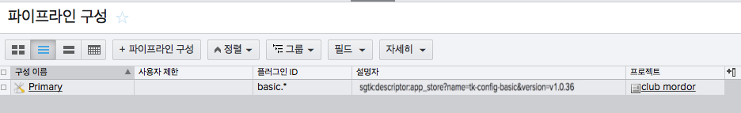

#  통합 관리자 안내서

## 소개

이 문서는  통합 관리자를 위한 안내서 역할을 합니다. 사용자 안내서, 관리자 안내서, 개발자 안내서 중 하나입니다. [사용자 안내서](https://support.shotgunsoftware.com/hc/ko/articles/115000068574)는 일상적인 워크플로우에서  통합의 최종 사용자가 될 아티스트를 위한 것이며 [개발자 안내서](https://support.shotgunsoftware.com/hc/ko/articles/115000067513)는 Python 코드를 작성하여 기능을 확장하려는 개발자를 위한 기술 문서입니다. 이 문서는 이 두 지점 사이에 존재합니다. 스튜디오에서  통합을 구현하고, 소프트웨어 버전을 관리하며 게시된 파일의 저장소를 결정하는 사용자를 위해 작성되었습니다.

## 표준 파이프라인 구성

툴킷 설정의 중심에는 파이프라인 구성이 있습니다. 파이프라인 구성은 설치된 앱부터 소프트웨어 버전까지 모든 것을 관리하는 YAML 파일 세트이며, 프로덕션 디렉토리 구조 및 파일 이름을 설정하기 위한 템플릿까지 보유하는 경우도 있습니다. 파이프라인 구성은 매우 세부적인 사항까지 커스터마이즈할 수 있지만 두 가지 시작 지점이 제공됩니다.

### 기초 구성

기본 제공 통합은 구성 파일을 설정하거나 수정할 필요 없이 실행할 수 있도록 디자인되었습니다. 기본 제공 통합을 사용할 때에는 관리할 필요가 없습니다. 하지만 툴킷이 내부에서 함축된 파이프라인 구성을 사용하는 경우에는 이 파이프라인 구성을 기초 구성이라고 합니다. 기초 구성은 지원되는 모든 소프트웨어 패키지에서 사용할 수 있는 3개의 툴킷 앱(Panel, Publisher 및 Loader)을 구성하며, 의 소프트웨어 엔티티를 고려하여  데스크톱에 표시할 소프트웨어 패키지를 결정합니다. 기초 구성에는 파일 시스템 위치 지원이 포함되지 않습니다. 프로젝트에서 기본 제공 통합을 사용할 때에는 데스크톱을 시작할 때마다 기초 구성 사본이 자동으로 업데이트되므로 통합을 항상 최신 버전으로 유지할 수 있습니다. [여기에서 릴리즈 정보를 구독](https://support.shotgunsoftware.com/hc/en-us/sections/115000020494-Integrations)하고 [여기에서 Github의 기초 구성을 확인](https://github.com/shotgunsoftware/tk-config-basic/)할 수 있습니다.

### 기본 구성

고급 프로젝트 설정의 기본 시작 지점입니다. 여기에는 [파일 시스템 위치 지원](https://support.shotgunsoftware.com/hc/ko/articles/219039868-Integrations-File-System-Reference)과 다양한 툴킷 앱 및 엔진이 포함됩니다.

[여기에서 Github의 기본 구성을 확인](https://github.com/shotgunsoftware/tk-config-default2)할 수 있습니다. 기본 구성 구조에 대한 자세한 정보는 파이프라인 구성에 있는 `config/env/README.md` 파일을 참조하거나 [Github에서 확인](https://github.com/shotgunsoftware/tk-config-default2/blob/master/env/README.md)하십시오.

이전의 기본 구성 구조에 익숙한 경우 [기본 구성 업데이트 FAQ](https://support.shotgunsoftware.com/hc/en-us/community/posts/115003376154-Default-Configuration-Update-FAQ)를 참조하십시오.



## Publisher

Publisher는 기본 제공 워크플로우와 전체 파이프라인 구성 간에 쉽게 전환할 수 있도록 설계되었었습니다. 기본 제공 설정의 경우 파일이 즉시 게시되기 때문에 템플릿 또는 파일 시스템 스키마를 정의할 필요가 없습니다. 프로젝트가 고급 설정 단계를 지나 전체 파이프라인 구성을 갖추고 나면 동일한 게시 플러그인이 앱 설정으로의 템플릿 도입을 인식하고 게시 전에 파일을 지정된 게시 위치로 복사하기 시작합니다. 그러면 스튜디오는 전체 구성을 가진 프로젝트에 필요한 대로 환경별 또는 DCC 기준별로 템플릿 기반 설정을 도입할 수 있습니다. 기본 구성은 템플릿 기반 워크플로우에 대해 완전히 구성된 상태로 제공되며 Publish 앱에서 템플릿을 어떻게 구성할 수 있는지 살펴볼 수 있는 좋은 참조가 됩니다. 자세한 정보는 Github의 기본 구성에 있는 [tk-multi-publish2.yml 파일](https://github.com/shotgunsoftware/tk-config-default2/blob/master/env/includes/settings/tk-multi-publish2.yml)을 참조하십시오.

Publisher용 플러그인 작성에 대한 자세한 정보는 [개발자 안내서의 게시자 섹션](https://support.shotgunsoftware.com/hc/ko/articles/115000067513-Integrations-Developer-Guide#Publisher)을 참조하십시오.

## 소프트웨어 시작 구성

이 시스템에 있는 호스트 응용프로그램을 자동으로 탐지하는 기능에 맡기면 됩니다.  데스크톱을 시작하고 프로젝트만 선택하면 데스크톱에 지원되는 모든 소프트웨어 패키지(표준 응용프로그램 디렉토리에서 확인 가능)의 시작 관리자가 표시됩니다. 스튜디오에서 보다 세밀하게 소프트웨어를 관리할 수 있는 견고한 도구도 역시 제공됩니다. 응용프로그램 가시성을 특정 프로젝트, 그룹 또는 개별 사용자로도 제한할 수 있습니다. 버전을 지정하고 전체 사이트에서 특정 소프트웨어 패키지를 비활성화하며 소프트웨어 패키지 그룹을 지정할 수 있습니다. 이 모든 것이 의 소프트웨어 엔티티를 통해 관리됩니다.

새  사이트를 만들면 기본 소프트웨어 엔티티 세트가 설정됩니다(지원되는 호스트 응용프로그램에 대해 각각 하나씩). 이러한 엔티티를 수정하고 자체 엔티티를 추가하여 데스크톱에 나타나는 소프트웨어를 원하는 방식으로 관리할 수 있습니다.

의 소프트웨어 엔티티를 보려면 화면 오른쪽 위에 있는 프로파일 아이콘을 클릭하여 관리자(Admin) 메뉴를 열고 `Software`를 선택합니다.

소프트웨어 엔티티에는 다음과 같은 필드가 있습니다.

- **소프트웨어 이름(Software Name):** 데스크톱에 표시되는 소프트웨어 이름입니다.
- **썸네일(Thumbnail):** 데스크톱 아이콘용으로 업로드된 이미지 파일입니다.
- **상태(Status):** 소프트웨어 사용 가능 여부를 제어합니다.
- **엔진(Engine):** 컨텐츠 생성 도구용 통합의 이름입니다.
- **제품(Products):** 변형(예: Houdini와 Houdini FX)이 포함된 소프트웨어 패키지의 경우 여기에서 쉼표로 구분된 목록을 지정할 수 있습니다. 수동 모드가 아닌 자동 탐지 모드에서만 유효합니다.
- **버전(Versions):** 표시할 특정 소프트웨어 버전을 지정합니다. 여기에서 쉼표로 구분된 목록을 지정할 수 있습니다. 수동 모드가 아닌 자동 탐지 모드에서만 유효합니다.
- **그룹(Group):** `Group` 필드의 값이 동일한 엔티티는 데스크톱의 경우 단일 아이콘 아래에 그리고 의 경우 단일 메뉴 아래에 그룹 지정됩니다. 예를 들어, Houdini 및 Nuke를 포함하는 FX 그룹을 만들 수 있습니다.
- **그룹 기본값(Group Default)**: 그룹의 한 구성원이 `Group Default`을 선택한 경우 해당 그룹의 아이콘 또는 메뉴 항목을 클릭하면 이 소프트웨어가 시작됩니다.
- **프로젝트(Projects):** 소프트웨어를 특정 프로젝트로 제한하는 방법입니다.
- **사용자 제한(User Restrictions):** 소프트웨어를 특정 사용자 또는 그룹으로 제한하는 방법입니다.
- **Linux/Mac/Windows 경로(Linux/Mac/Windows Path):** 이 필드를 사용하여 소프트웨어에 대한 OS별 경로를 명시적으로 지정합니다.
- **Linux/Mac/Windows 인자(Linux/Mac/Windows Args):** 소프트웨어 시작 시 명령에 추가할 명령행 인자입니다.

이러한 필드를 사용하는 몇 가지 방법을 살펴봄으로써 이러한 필드가 함께 작동하는 방식에 대해 많은 것을 배울 수 있습니다.

### 예: 동일한 응용프로그램 버전 그룹 지정, 자동 탐지

파일 시스템에 세 가지 버전의 Maya(Maya 2016, Maya 2017 및 Maya 2018)가 있는 경우 아티스트는 이러한 버전을 모두 사용할 수 있으며 이들을 데스크톱에 있는 단일 아이콘 아래에 그룹으로 지정할 수 있습니다.

이러한 세 가지 버전의 Maya가 파일 시스템에 있는 표준 위치에 설치된 경우에는 그룹 지정이 모두 자동으로 이루어집니다. 데스크톱에서 프로젝트를 선택하면 로컬 컴퓨터에 있는 표준 응용프로그램 디렉토리를 스캔하여 세 버전을 찾습니다. 이미 에는 Maya 소프트웨어 엔티티가 있기 때문에 특정 버전 또는 경로를 지정하지 않아도 데스크톱에서 찾은 모든 버전이 표시됩니다.


몇 가지 참고 사항:

- 가 소프트웨어를 자동 탐지하면 단일 소프트웨어 엔티티가 모든 버전에 대한 메뉴 항목을 생성합니다.
- 어느 경로 필드에도 값이 지정되지 않습니다. 소프트웨어 엔티티는 자동 탐지 모드이므로 앱은 표준 위치에 있는 것으로 간주됩니다.

이러한 항목은 여기서 보는 것처럼 데스크톱에도 표시됩니다(사용 가능한 모든 버전을 나열하는 드롭다운이 있는 단일 Maya 아이콘). 아이콘을 클릭한 경우 최신 버전의 Maya가 시작됩니다.

### 예: 동일한 응용프로그램 버전 그룹 지정, 수동 모드

스튜디오의 비표준 위치에 Maya를 저장하기에 완벽한 조건입니다. 자체 소프트웨어 엔티티를 만든 다음 에서 소프트웨어를 어디서 찾아야 하는지 알 수 있도록 경로를 지정하기만 하면 됩니다. 설정은 다음과 같을 수 있습니다.


몇 가지 참고 사항:

- 자동 탐지 모드와는 달리, 여기에서는 특정 소프트웨어 패키지의 각 버전마다 소프트웨어 엔티티가 있습니다.
- 이를 그룹으로 지정하려면 `Group` 및 `Group Default` 필드를 사용합니다. `Group`에 대해 동일한 값을 공유하는 소프트웨어 엔티티는 데스크톱에서 단일 아이콘 아래에 드롭다운 형태로 그룹 지정되며 해당 이름으로 `Group` 값을 사용합니다.
- 아이콘을 클릭하면 `Group Default`이 선택된 그룹 내에서 소프트웨어가 시작됩니다.
- **소프트웨어 엔티티에서 Linux 경로, Mac 경로 또는 Windows 경로에 대해 _어떤_ 값이라도 지정한 경우 해당 엔티티가 수동 모드로 전환됩니다.** 경로 필드가 비어 있을 때 소프트웨어가 데스크톱에 _표시되는_ 자동 탐지 모드와 달리 수동 모드에서는 해당 운영 체제에 대해 경로가 지정되어 있고, 파일이 지정된 경로에 존재하는 _경우에만_ 해당 운영 체제에 소프트웨어 패키지가 표시됩니다.
- 이 예에서는 `Windows Path`가 지정되지 않았기 때문에 Windows상의 데스크톱에 세 가지 Maya 버전 중 어느 것도 표시되지 않습니다.

### 예: 사용자 또는 그룹별로 제한

현재 마지막 예에서 언급한 것처럼 아직 모든 사용자가 Maya 2018을 사용하도록 할 준비가 되지 않았습니다. 하지만 TD, 개발자, QA 엔지니어, Tessa 테스터는 액세스할 수 있어야 합니다. 이는 `User Restrictions` 필드를 통해 처리할 수 있습니다. 다음은 예입니다.


마지막 예에서 다음과 같이 몇 가지 사항을 변경했습니다.

- 그룹 기본값은 현재 Maya 2017입니다. 여기서는 프로덕션 버전을 원하기 때문에 해당 체크박스를 선택한 상태에서 Maya 아이콘을 클릭하면 이제 이 버전으로 이동합니다.
- `User Restrictions` 필드에 일부 값을 추가했습니다. 이는 사용자 및 그룹 모두에 적용될 수 있고 Dev 및 TD 그룹뿐만 아니라 사용자 Tessa 테스터도 추가했습니다. 이제 이 사람들만이 데스크톱에서 Maya 2018을 확인할 수 있습니다.

### 예: 프로젝트별 소프트웨어 버전 제한

스튜디오의 프로젝트 전체에서 좀 더 복잡한 버전 관리를 해야 하는 경우가 있습니다. 신속하게 전달해야 하는 프로젝트가 있을 경우 새 소프트웨어 버전을 차단해야 하는데, 그와 동시에 후속 버전이 시작되어 최신 버전을 평가할 수 있게 될 수도 있습니다. 이런 경우 다음과 같이 소프트웨어 엔티티를 설정해야 할 수 있습니다.


몇 가지 중요 참고 사항:

- 여기에서 `Group` 및 `Group Default` 값은 제거되었는데, 특정 환경에서는 하나의 Maya 버전만 데스크톱에 표시되기 때문입니다.
- 세 "Maya" 버전 모두에 대해 `Software Name`을 설정했습니다. 이렇게 하면 모든 프로젝트에서 사용자에게 동일한 이름의 아이콘이 표시되지만 여기에서 구성한 내용에 따라 다른 버전을 가리키게 됩니다.
- Maya 2016의 `Status` 필드를 `Disabled`로 설정했습니다. 스튜디오에서는 더 이상 이 버전을 사용하지 않으며 이 필드는 모든 프로젝트에 대해 전역 가시성을 전환합니다.
- Maya 2017 및 Maya 2018에 대해 `Projects`의 값을 지정했습니다. 이 `Projects` 필드는 제한 역할을 합니다. Maya 2017은 _오직_ Chicken Planet 프로젝트에만 표시되고 Maya 2018은 Chicken Planet II에만 표시됩니다.
- 소프트웨어 엔티티에 대해 `Projects`의 값을 지정하면 해당 소프트웨어는 여러분이 지정한 프로젝트에만 표시됩니다. 따라서 스튜디오에 Chicken Planet 시리즈 외에 다른 프로젝트가 있을 경우 해당 프로젝트에 대해 명시적으로 소프트웨어를 지정해야 합니다.

### 예: 보유 중인 소프트웨어 추가

새 소프트웨어 엔티티를 추가하는 데에는  데스크톱이 시스템에서 자동 탐지한 것 외에도 다음과 같은 몇 가지 이유가 있습니다.

- 사용자가 데스크톱을 통해 사용할 수 있는 엔진이 없는 응용프로그램을 만들고 싶습니다.
- 직접 엔진을 작성한 내부 소프트웨어 또는 해당 통합이 없는 타사 소프트웨어를 보유하고 있습니다.
- 소프트웨어가 표준 위치에 있지 않으므로 수동으로 이 이를 가리키도록 하고 싶습니다. (이 사례는 위에 있는 "동일한 응용프로그램 버전 그룹 지정, 수동 모드" 예에서 설명했습니다.)

이런 경우 보유 중인 소프트웨어 엔티티를 추가할 수 있습니다. `Software Name` 필드의 값을 입력해야 합니다. 소프트웨어용 내부 엔진을 사용 중인 경우 `Engine` 필드에 엔진 이름을 지정합니다. 일부 스튜디오에서는 아티스트의 편의를 위해 데스크톱에  통합이 없는 앱을 포함할 수 있습니다. 아티스트는 데스크톱에서 해당 앱을 바로 시작할 수 있습니다. 위 설정을 모두 사용하여 버전을 관리하고 사용을 제한할 수도 있습니다. 이 경우 `Engine` 필드는 비워 두고, 대신 `Mac Path`, `Linux Path` 및 `Windows Path` 중 적어도 하나의 값을 지정해야 합니다.

## 게시된 파일 경로 해석 구성

파일을 게시하면 Publisher가 에 PublishedFile 엔티티를 만드는데, 여기에는 `Path`라 불리는 [파일/링크](https://support.shotgunsoftware.com/hc/ko/articles/219031008-Field-types)가 포함됩니다. 나중에 다른 사용자가 Loader를 사용하여 자신의 작업 세션에 이 파일을 로드하려고 할 수 있습니다. Loader는 복잡한 로직을 사용하여 전체 운영 체제에서 PublishedFile의 유효한 로컬 경로를 해석합니다.

Loader가 게시 데이터를 경로로 해석하려고 시도하는 방법은 해당 게시가 로컬 파일 링크 또는 `file://` URL과 연결되어 있는지 여부에 따라 다릅니다.

### 로컬 파일 링크 해석

게시 중인 경로가  사이트 기본 설정에서 정의한 로컬 저장소와 일치하는 경우 게시할 때 로컬 파일 링크가 자동으로 생성됩니다. 게시가 로컬 파일 링크인 경우에는 해당 로컬 운영 체제 표현이 사용됩니다. 로컬 파일 링크에 대한 자세한 정보는 [여기](https://support.shotgunsoftware.com/hc/ko/articles/219030938-Linking-to-local-files)를 참조하십시오.

로컬 저장소가 현재 사용 중인 운영 체제의 경로를 정의하지 않는 경우에는 환경 변수를 사용하여 로컬 저장소 루트를 지정할 수 있습니다. 환경 변수 이름은 `SHOTGUN_PATH_<WINDOWS|MAC|LINUX>_<STORAGENAME>` 형식이어야 합니다. 따라서, Mac에 "Renders"라고 하는 저장소 루트에 대한 경로를 정의하려면 `SHOTGUN_PATH_MAC_RENDERS` 환경 변수를 만들어야 합니다. 이 예를 더 구체적으로 살펴보겠습니다.

-  사이트에 경로가 다음과 같이 지정된 "Renders"라고 하는 저장소 루트가 있다고 가정합니다.
- Linux 경로: `/studio/renders/`
- Windows 경로: `S:\renders\`
- Mac 경로: `<blank>`

- 현재 Mac을 사용 중입니다.

- 경로 `/studio/renders/sq100/sh001/bg/bg.001.exr`의 게시를 세션에 로드하려고 합니다.

Loader는 해당 경로를 구문 분석하여 `/studio/renders/`가 저장소 루트의 일부이지만 Mac에 대해 정의되어 있는 저장소 루트가 없다는 것을 추론할 수 있습니다. 따라서 `SHOTGUN_PATH_MAC_RENDERS` 환경 변수를 찾게 되고, 이를 찾는 경우 경로에 있는 `/studio/renders`를 해당 값으로 대체합니다.

**참고:** `SHOTGUN_PATH_MAC_RENDERS` 환경 변수를 정의하고 로컬 저장소 렌더에 Mac 경로가 설정되어 있는 경우 해당 로컬 저장소 값이 사용되고 경고가 기록됩니다.

**참고:** 현재 운영 체제에 대한 저장소를 해석할 수 없는 경우 `PublishPathNotDefinedError`가 발생합니다.

### 파일 URL 해석

Loader는 `file://` URL 해석도 지원합니다. 게시할 때 게시 중인 경로가 사이트의 로컬 저장소와 일치하지 않는 경우 경로는 `file://` URL로 저장됩니다. 로컬 파일 링크와는 달리, 이러한 경로는 다중 OS 표현으로 저장되지 않으며 해당 링크가 만들어진 운영 체제에 대해서만 정의됩니다.

해당 URL이 만들어진 운영 체제와 다른 운영 체제에서 `file://` URL을 해석하려는 경우 Loader는 다음과 같은 일련의 접근 방식을 사용하여 유효한 경로로 URL을 해석하려고 시도합니다.

- 먼저 세 가지 환경 변수 `SHOTGUN_PATH_WINDOWS`, `SHOTGUN_PATH_MAC` 및 `SHOTGUN_PATH_LINUX`를 찾습니다. 이러한 환경 변수가 정의되어 있으면 방식이 이런 식으로 경로를 변환하려고 시도합니다. 예를 들어, Windows에서 `file:///prod/proj_x/assets/bush/file.txt`를 해석하려는 경우 경로를 해석해야 하는 방법에 대한 힌트를 제공하기 위해 `SHOTGUN_PATH_WINDOWS=P:\prod` 및 `SHOTGUN_PATH_LINUX=/prod`를 설정할 수 있습니다.
- 둘 이상의 환경 변수 세트를 사용하려는 경우 여러 저장소를 표현하려면 위 변수 이름 구문을 다음 접미사로 확장하면 됩니다.
- 렌더용 저장소가 있는 경우 `SHOTGUN_PATH_LINUX_RENDERS`, `SHOTGUN_PATH_MAC_RENDERS` 및 `SHOTGUN_PATH_WINDOWS_RENDERS` 등을 정의하여 게시된 모든 `file://` URL에 대해 렌더 저장소 내부의 데이터를 참조하는 변환 메커니즘을 제공할 수 있습니다.
- 그런 다음 편집 데이터를 위한 저장소도 있는 경우 `SHOTGUN_PATH_LINUX_EDITORIAL`, `SHOTGUN_PATH_MAC_EDITORIAL` 및 `SHOTGUN_PATH_WINDOWS_EDITORIAL`을 정의하여 편집 저장소 루트에 변환 메커니즘을 제공할 수 있습니다.

이러한 환경 변수를 표준화하고 나면 이를  로컬 저장소로 변환하는 것을 고려할 수 있습니다.  기본 설정에서 이 환경 변수를 정의하고 나면 자동으로 선택되기 때문에 환경 변수가 필요하지 않습니다.

- 위 내용 외에도  기본 설정에 정의되어 있는 모든 로컬 저장소는 동일한 방식으로 처리됩니다.
- 로컬 저장소는 정의되었지만 운영 체제가 없는 경우 환경 변수를 통해 제공할 수 있습니다. 예를 들어, Linux 및 Windows에서 정의되어 있는 `Renders`라는 로컬 저장소가 있는 경우 이름이 `SHOTGUN_PATH_MAC_RENDERS`인 환경 변수를 생성하여 Mac을 지원하도록 확장할 수 있습니다. 이에 대한 일반 구문은 `SHOTGUN_PATH_<WINDOWS|MAC|LINUX>_<STORAGENAME>`입니다.
- 일치하는 루트가 없는 경우 해당 파일 경로는 그대로 반환됩니다.

다음은 예입니다.

`/projects/some/file.txt` 파일을 Linux에 게시했고 URL이 `file:///projects/some/file.txt`인  게시가 생성되었다고 가정해 보겠습니다. 스튜디오에서 Linux 경로 `/projects`는 Windows의 `Q:\projects`와 동일하기 때문에 전체 경로가 `Q:\projects\some\file.txt`로 변환될 것으로 예상할 수 있습니다.

다음 설정은 모두 이를 처리합니다.

- 일반 환경 기반 재정의:
- `SHOTGUN_PATH_LINUX=/projects`
- `SHOTGUN_PATH_WINDOWS=Q:\projects`
- `SHOTGUN_PATH_MAC=/projects`

- 다음과 같이 설정된 "Projects"라고 하는  로컬 저장소:

- Linux 경로: `/projects`
- Windows 경로: `Q:\projects`
- Mac 경로: `/projects`

- 다음 환경 변수를 인자로 가지는 "Projects"라고 하는  로컬 저장소:

- Linux 경로: `/projects`
- 'Windows 경로:''
- `Mac Path:`/projects`
- `SHOTGUN_PATH_WINDOWS_PROJECTS=Q:\projects`

**참고:** 에서 `Linux path` 설정을 통해 로컬 저장소 `Renders`를 정의했고 `SHOTGUN_PATH_LINUX_RENDERS` 환경 변수도 정의한 경우 해당 저장소가 우선 순위를 가지고, 환경 변수는 무시되며 경고가 기록됩니다. 일반적으로 로컬 저장소 정의는 항상 환경 변수보다 우선 순위를 가집니다.

### 고급 구성

PublishedFile 경로 해석을 수행하는 기본 방법에 대한 자세한 정보는 [개발자 참조 문서](http://developer.shotgunsoftware.com/tk-core/utils.html#sgtk.util.resolve_publish_path)를 참조하십시오.

고급 프로젝트 설정을 사용하는 경우 `resolve_publish` 코어 후크를 커스터마이즈하는 방식으로 로컬 파일 링크 및 `file://` URL 이상의 지원을 추가할 수 있습니다. 가능한 커스터마이즈 항목은 다음과 같습니다.

- 관련 업로드 파일과 함께 게시된 항목은 코어 후크에 의해 캐시 위치에 자동으로 다운로드되고 해당 경로가 반환됩니다.
- 커스텀 URL 구성표(예: `perforce://`)는 로컬 경로로 해석될 수 있습니다.

## 브라우저 통합

 툴킷의 브라우저 통합 덕분에  웹 응용프로그램의 상황에 맞는 메뉴를 마우스 오른쪽 버튼으로 클릭하여 툴킷 앱 및 시작 관리자에 액세스할 수 있습니다. 위에 표시된 예와 같이 이러한 메뉴에는 다양한 엔티티 유형에 대해 구성된 액션이 있습니다. 한 프로젝트에 여러 파이프라인 구성을 사용하는 경우 액션은 파이프라인 구성별로 구성됩니다. 브라우저 통합을 통해 Maya 또는 Nuke와 같이  컨텍스트를 인식하고 있는 컨텐츠 생성 소프트웨어를 브라우저에서 바로 시작할 수 있습니다.


### 간단한 브라우저 통합 내역

지난 몇 년간,  툴킷의 브라우저 통합은 여러 형태를 거쳤습니다. 기술 및 보안 요구사항이 발전함에 따라 브라우저 통합을 구현하는 접근 방식이 필요합니다.

**Java 애플릿(더 이상 사용되지 않음)**

첫 번째 구현은  웹 응용프로그램에서 로컬 데스크톱에 액세스할 수 있게 해 주는 Java 애플릿으로 구성됩니다. Java 애플릿은 악용될 수 있는 보안 위험 요소로 인식되었기 때문에 선호도가 낮아져 이제는 더 이상 사용되지 않습니다.

**브라우저 플러그인(더 이상 사용되지 않음)**

더 이상 사용되지 않는 Java 애플릿을 대체한 것은 브라우저 플러그인으로, NPAPI를 사용하여  웹 응용프로그램에서 로컬 데스크톱으로 액세스할 수 있었습니다. NPAPI도 보안 위험 요소로 인식되었기 때문에 주요 웹 브라우저에서 사용을 중단하기 시작했습니다. 이로 인해 브라우저 플러그인은 더 이상 사용하지 않게 되었습니다.

** 데스크톱을 통한 Websockets v1(레거시)**

 데스크톱 앱에서 Websocket 서버를 호스트하는 방식은 과거에도, 그리고 현재에도  웹 응용프로그램에서 로컬 데스크톱과 통신하는 방식입니다. 이 Websocket 서버의 RPC API를 이용한 첫 번째 구현에는 이전에 Java 애플릿 및 브라우저 플러그인을 위해 개발된 것과 동일한 기반 기술이 활용되었습니다. 서버가 로부터 요청을 받으면 관련 프로젝트의 파이프라인 구성에 있는 탱크 명령을 사용하여 액션 메뉴에 표시할 명령 목록을 가져옵니다.

** 데스크톱을 통한 Websockets v2**

Websocket 서버의 RPC API를 이용한 두 번째 반복은 툴킷 액션을 가져오고, 캐싱 및 실행하는 데 사용되는 기반 메커니즘을 변경합니다. 이 구현은 이전의 브라우저 통합과 관련된 많은 성능 문제를 해결하고 액션 메뉴의 시각적 구성을 개선하며 명시적으로 툴킷을 구성하지 않아도 작동하는 [기본적인  통합](https://support.shotgunsoftware.com/hc/ko/articles/115000068574-User-Guide#Getting%20started%20with%20Shotgun%20Desktop)에 대한 지원을 추가합니다. 이것이 현재 구현되어 있는 브라우저 통합입니다.

### 구성

각 엔티티 유형마다 사용자에게 표시되는 액션을 제어하려면 프로젝트의 파이프라인 구성에서 YAML 환경 파일을 수정합니다. 처음 커스터마이즈를 시도할 때 이해하고 고려할 몇 가지 사항이 있습니다.

**구성할 엔진**

 웹 앱 내에서 툴킷 액션을 관리하는 툴킷 엔진은 `tk-shotgun`이므로 이것이 액션 메뉴에 표시되는 항목을 제어하는 이 엔진의 구성입니다.


위의 [tk-config-basic](https://github.com/shotgunsoftware/tk-config-basic/) 예에는 많은 엔진 명령이 메뉴 액션으로 바뀌게 되는 두 가지 앱이 구성되어 있습니다. 툴킷 앱은 액션 메뉴에 포함될 명령을 등록합니다. 여기에는  사이트의 [소프트웨어 엔티티](https://support.shotgunsoftware.com/hc/ko/articles/115000067493#Configuring%20software%20launches) 목록에 해당하는 로컬 시스템의 각 소프트웨어 패키지에 대한 시작 관리자 명령이 포함됩니다. 그 결과가 다음과 같이 표시되는 메뉴 액션 목록입니다.


브라우저 통합 코드는 사용자의 시스템에 Houdini, Maya, Nuke 및 Photoshop을 설치할 때 찾을 수 있으며 이러한 각 통합을 시작하기 위한 메뉴 액션이 됩니다. 특정 환경 구성 파일에서 해당 소프트웨어의 시작 관리자가 해당 환경의 엔티티를 표시하도록 하려면 소프트웨어 엔티티의 _엔진_이 있어야 합니다. 따라서 이 예에서는 이 코드 조각을 가져온 파일에 `tk-houdini`, `tk-maya`, `tk-nuke` 및 `tk-photoshopcc` 엔진이 모두 있어야 합니다. 예를 들어, 이 엔티티에 있는 시작 관리자 목록에서 Maya를 제거하려면 환경 구성 파일에서 `tk-maya` 엔진 블록만 제거하면 됩니다.

이러한 시작 관리자뿐만 아니라 Publish 앱의 "게시...(Publish...)" 명령도 메뉴에 포함됩니다.

**YML 파일이란 무엇입니까?**

기본 환경 구성(`config/env/*.yml`)을 활용하며 구성의 [pick_environment.py core hook](https://github.com/shotgunsoftware/tk-core/blob/master/hooks/pick_environment.py)에 의해 제어되는 경로와 [tk-config-default](https://github.com/shotgunsoftware/tk-config-default/)에 의해 적용된 레거시 접근 방식(`config/env/shotgun_<entity_type>.yml` 파일 사용)을 활용하는 경로 중 하나를 사용할 수 있습니다.

표준 환경 파일이 사용된 경우 브라우저 통합은 `pick_environment` 코어 후크를 사용하여 특정 엔티티의 액션 메뉴에 사용할 환경 구성 파일을 결정합니다. 가장 간단한 사례에서는 환경이 곧 엔티티 유형에 해당합니다. 예를 들어, 샷을 마우스 오른쪽 버튼으로 클릭하면 최종 액션 메뉴가 `tk-shotgun` 블록에 의해 `config/env/shot.yml`에 구성됩니다. `pick_environment` 후크를 커스터마이즈하여 보다 복잡한 로직을 사용할 수 있습니다. 표준 환경 파일에는 `tk-shotgun` 엔진을 구성해서는 안 됩니다. `shotgun_<entity_type>.yml` 파일이 있으면 대체될 수 있습니다. 이렇게 하면 브라우저 통합이 엔티티 특정 환경 파일을 사용하는 레거시 구성과 연동될 수 있습니다.

**_팁: tk-config-default2를 사용하여 브라우저 시작 관리자에서 소프트웨어 제거_**

 브라우저에서 소프트웨어를 시작하기 위한 구성을 업데이트하는 작업은 tk-config-default부터 tk-config-default2까지 다양합니다.

tk-config-default2를 사용하면 업데이트를 config/env/includes/settings/[`tk-shotgun.yml`](https://github.com/shotgunsoftware/tk-config-default2/blob/v1.1.10/env/includes/settings/tk-shotgun.yml)에 적용해야 합니다. 반면에 tk-config-default에서는 업데이트를 config/env/`shotgun_task.yml`에 적용했습니다.

예를 들어 브라우저를 통해 에셋에서 실행할 때 옵션 목록에서 Mari를 제거해 보겠습니다.

먼저 [`config/env/asset.yml`](https://github.com/shotgunsoftware/tk-config-default2/blob/v1.1.10/env/asset.yml#L47)로 이동하여 `tk-shotgun` 엔진 블록이 어떻게 [`@settings.tk-shotgun.asset`](https://github.com/shotgunsoftware/tk-config-default2/blob/v1.1.10/env/asset.yml#L47)을 가리키는지 확인합니다. `@` 기호는 구성 값이 포함된 파일에서 제공된 것임을 나타냅니다. 즉, 업데이트하려면 [env/includes/settings/`tk-shotgun.yml`](https://github.com/shotgunsoftware/tk-config-default2/blob/v1.1.10/env/includes/settings/tk-shotgun.yml)로 이동해야 합니다.

`env/includes/settings/tk-shotgun.yml`에서 각 블록이 엔티티에 대해 어떻게 되는지 확인하십시오. 예를 들어 에셋은 먼저 다음과 같이 됩니다.
```
<a name="asset"></a>
# asset
settings.tk-shotgun.asset:
  apps:
    tk-multi-launchapp: "@settings.tk-multi-launchapp"
    tk-multi-launchmari: "@settings.tk-multi-launchapp.mari"
    tk-multi-launchmotionbuilder: "@settings.tk-multi-launchapp.motionbuilder"
    tk-multi-publish2: "@settings.tk-multi-publish2.standalone"
    tk-multi-screeningroom: "@settings.tk-multi-screeningroom.rv"
    tk-shotgun-folders: "@settings.tk-shotgun-folders"
    tk-shotgun-launchfolder: "@settings.tk-shotgun-launchfolder"
  location: "@engines.tk-shotgun.location"
```

브라우저의 에셋에 대한 옵션 목록에서 Mari를 제거하려면 Mari 행([`tk-multi-launchmari: "@settings.tk-multi-launchapp.mari"`](https://github.com/shotgunsoftware/tk-config-default2/blob/master/env/includes/settings/tk-shotgun.yml#L29))을 제거합니다.

```
<a name="asset"></a>
# asset
settings.tk-shotgun.asset:
  apps:
    tk-multi-launchapp: "@settings.tk-multi-launchapp"
    tk-multi-launchmotionbuilder: "@settings.tk-multi-launchapp.motionbuilder"
    tk-multi-publish2: "@settings.tk-multi-publish2.standalone"
    tk-multi-screeningroom: "@settings.tk-multi-screeningroom.rv"
    tk-shotgun-folders: "@settings.tk-shotgun-folders"
    tk-shotgun-launchfolder: "@settings.tk-shotgun-launchfolder"
  location: "@engines.tk-shotgun.location"
```

그런 다음  브라우저에서 특정 소프트웨어를 시작하는 기능을 제거하려는 각 엔티티(Shot과 같은)에 대해 동일한 지침을 따릅니다. 파일을 저장하고 나면 잠시 기다렸다가 브라우저를 새로 고침하여 적용해야 할 수 있습니다.

### 캐싱

브라우저 통합의 강력한 캐싱 메커니즘을 통해 사용자에게 메뉴 액션을 최대한 빨리 표시할 수 있습니다. 캐싱이 필요한 이유는 툴킷 부트스트래핑 및 엔진 명령 목록 가져오기 프로세스에 많은 시간이 소요될 수 있기 때문입니다.

**캐시가 무효화되는 경우는 언제입니까?**

Websocket 서버의 RPC API는 두 가지(YAML 파일 수정 시간 및 사이트의 소프트웨어 엔티티 컨텐츠)를 확인하여 캐시된 데이터가 여전히 유효한지 여부를 결정합니다. 캐시 데이터가 작성된 이후 특정 구성의 환경 YAML 파일 중 하나가 수정된 경우 필수 데이터가 다시 캐시되어 새 데이터가  웹 응용프로그램으로 반환됩니다. 마찬가지로, 해당 데이터가 캐시된 이후 에서 소프트웨어 엔티티에 있는 필드가 수정된 경우 툴킷은 부트스트래핑되고 새 데이터가 캐시됩니다.

**디스크에서 캐시 파일은 어디에 위치합니까?**

캐시 파일 위치는 운영 체제에 따라 다릅니다.

```
OS X: ~/Library/Caches/Shotgun/<site_name>/site.basic.desktop/tk-desktop
Windows: %APPDATA%\Shotgun\<site_name>\site.basic.desktop\tk-desktop
Linux: ~/.shotgun\<site_name>\site.basic.desktop\tk-desktop
```

### 후크 방법

`browser_integration.py` 후크는 `tk-framework-desktopserver`에 포함되어 있으며 다음과 같은 후크 방법을 제공합니다.

- `get_cache_key`: 이 방법을 통해 특정 구성 URI, 프로젝트 엔티티 및 엔티티 유형에 대한 캐시 항목 키를 확인합니다. 기본 구현에서는 구성 URI와 엔티티 유형을 결합합니다.
- `get_site_state_data`: 이 방법은 의 추가 쿼리 데이터를 캐시된 데이터의 유효성을 테스트하는 데 사용된 해시에 포함할 때 사용할 수 있습니다. 기본적으로 사이트에 존재하는 모든 소프트웨어 엔티티의 현재 상태 그대로 사용되지만 해시에 추가 데이터를 포함해야 하는 경우 이 후크 방법으로 구현할 수 있습니다.
- `process_commands`: 이 방법을 사용해  웹 응용프로그램으로 반환되는 명령을 커스터마이즈 또는 변경할 수 있습니다. 이 방법에 제공되는 데이터의 구조는 사전 목록으로, 각 사전은 단일 메뉴 액션을 나타냅니다. 데이터는 변경하거나, 필터링하거나, 아니면 그대로 목록에 추가할 수 있으며 즉각적인 툴킷 액션을 요청하는 메뉴에 반영됩니다.

### 로그

브라우저 통합 로그는 툴킷의 [표준 로그 위치](https://developer.shotgunsoftware.com/38c5c024/)에서 확인할 수 있습니다. 관련 로그 파일은 `tk-desktop.log` 및 `tk-shotgun.log`입니다. 또한 Google Chrome을 사용하는 경우 브라우저의 개발자 콘솔에서 몇 가지 관련 로그 출력을 사용할 수도 있습니다.

### 문제 해결

웹 응용프로그램과 로컬 데스크톱 사이의 통신은 복잡하기 때문에 그 과정에서 장애가 발생할 수도 있습니다. 다음은 그러한 몇 가지 상황과 장애 발생 시 취해야 하는 첫 번째 단계의 제안 사항입니다.

**액션 메뉴에 " 데스크톱을 열거나 설치...(Open or install Shotgun Desktop...)"가 표시됨**


다음 세 가지 중 하나를 의미합니다.

1. 현재 로컬 컴퓨터에서  데스크톱이 실행되고 있지 않습니다. 실행되는 것처럼 보이더라도 반드시 다시 확인할 필요가 있습니다.

2. Chrome 또는 Python Websocket 서버가 연결을 거부했기 때문에  웹 응용프로그램에서  데스크톱과 통신할 수 없습니다. 이 상황은 대부분 자체 서명된 인증서와 관련되어 있으며 요청 시 연결을 설정할 수 있습니다. 이러한 인증서를 처음부터 다시 생성하면 문제가 해결되기도 하며 다음과 같이  데스크톱에서 트리거할 수 있습니다.


1. 시작 시  데스크톱의 Websocket 서버를 시작하지 못했습니다. 이 상황은 잘못된 Websocket 서버 릴리즈가 사용자에게 공개된 경우에만 해당되며 거의 발생하지 않습니다. 이 상황에서, 로깅은 오류에 대해 설명하는 [tk-desktop.log](https://developer.shotgunsoftware.com/38c5c024/)에 표시되며 이 내용은 [의 지원 팀으로 전송](https://support.shotgunsoftware.com/hc/ko/requests/new)될 수 있습니다.

**액션 메뉴에 표시되는 액션이 없음**


이 엔티티 유형에 대한 액션이 예상되었던 경우 구성에 문제가 있음을 의미합니다. 몇 가지 가능한 문제:

1. `tk-shotgun` 엔진이 올바른 환경 YAML 파일에서 구성되었지만 해당 구성에 앱이 없습니다. 이 경우, 이 엔티티 유형에 대한 액션이 없는 것이 의도된 것일 수 있습니다.

2. `tk-shotgun` 엔진이 올바른 환경 YAML 파일에서 구성되었고 앱도 있지만 메뉴에 여전히 액션이 표시되지 않습니다. 앱을 초기화하지 못한 것이 원인일 가능성이 높습니다. 이 경우 [tk-shotgun.log and tk-desktop.log](https://developer.shotgunsoftware.com/38c5c024/)에 해당 문제를 설명하는 정보가 있을 것입니다.

3. 이 엔티티 유형에 해당하는 환경에 `tk-shotgun`에 대한 구성이 포함되어 있지 않습니다. 최종 결과는 이 목록에 있는 1번과 동일합니다. 이 경우, 파이프라인 구성의 `pick_environment` 후크를 살펴보고 이 엔티티 유형에 대해 로드되고 있는 환경을 살펴본 후에 거기에서 `tk-shotgun`의 구성을 검증하면 됩니다.

4. 디스크에 캐시된 메뉴 액션 목록이 비어 있습니다. 강제로 캐시를 다시 생성할 수 있는 몇 가지 방법이 있습니다.

   - 프로젝트 구성에서 YAML 파일의 수정 시간을 업데이트합니다. 이렇게 하면 다음에 에서 요청했을 때 메뉴 액션이 다시 캐시됩니다. 단, 이 방법을 사용하면 해당 프로젝트에서 작업 중인 _모든_ 사용자를 다시 캐시합니다.
   -  사이트에서 소프트웨어 엔티티의 필드 값을 업데이트합니다. 여기서 수행되는 작업은 YAML 파일 수정 시간에 관한 위 옵션과 동일하지만  사이트에서 _모든_ 프로젝트의 모든 사용자에 대해 캐시된 데이터를 무효화합니다. 소프트웨어 엔티티는 비 프로젝트 엔티티이므로 모든 프로젝트에서 공유됩니다. 소프트웨어 엔티티의 데이터를 변경하면 모든 프로젝트가 영향을 받습니다.
   - 문제가 발생한 호스트에 있는 캐시 파일은 삭제할 수 있습니다. 일반적으로 캐시는 제거해도 문제가 없으며 각 호스트에 로컬로 저장되기 때문에 해당 시스템에서 데이터만 처음부터 다시 캐시합니다. 캐시는  캐시 위치 내부의 다음 SQLite 파일에 저장됩니다. `<site-name>/site.basic.desktop/tk-desktop/shotgun_engine_commands_v1.sqlite`

**"툴킷: 액션 검색 중...(Toolkit: Retrieving actions...)"이 메뉴 액션으로 대체되지 않음**


이 문제가 발생할 수 있는 몇 가지 원인이 있습니다.

1. Websocket 서버가 아직 캐싱 액션을 완료하지 않았습니다. 이번이 프로젝트 구성에 대한 중요한 업데이트 후 검색하는 첫 번째 액션인 경우 프로세스를 완료하는 데 시간이 약간 걸릴 수 있습니다. 조금 더 기다리다가 아직 진행 중인지 확인하려면 `tk-desktop.log`의 내용을 살펴봅니다.

2. Websocket 서버가 계속 응답하지 않습니다. 이런 상황은 드물게 나타나지만 `tk-desktop.log`를 살펴보았을 때 액션 요청의 결과로 발생하는 추가 프로세스가 없는 것이 확실하다면, [ShotGrid 지원 팀에 문의](https://support.shotgunsoftware.com/hc/ko/requests/new)하고 관련 로그 데이터를 제공합니다.

3. 사용자가 두 개 이상의  사이트에서 작업 중입니다. 단일 사이트에서  데스크톱을 인증한 상태에서 두 번째  사이트에서 메뉴 액션을 요청하면 사용자에게  데스크톱을 다시 시작하여 새 사이트에 로그인하라는 메시지가 표시됩니다. 해당 요청을 무시하면 두 번째 사이트는 메뉴 액션 목록을 받을 수 없습니다.


## 툴킷 구성 파일

스튜디오에서 프록시 서버를 사용하는 경우, 초기 로그인 화면에 몇 가지 값을 미리 입력해 두려는 경우 또는 브라우저 기반 응용프로그램 시작 관리자가  데스크톱과 상호 작용하는 방식을 변경하려는 경우에 사용할 수 있는 `toolkit.ini`라는 특수 구성 파일이 있습니다.  데스크톱을 실행하는 데는 이 파일이 필요하지 않으며 데스크톱의 동작을 구성해야 하는 경우에만 필요합니다. 툴킷은 다음과 같은 순서로 여러 위치에서 이 파일을 찾습니다.

1. 파일 경로를 가리키는 `SGTK_PREFERENCES_LOCATION`이라는 환경 변수
2.  툴킷 기본 설정 폴더 내: (이 파일은 기본적으로 이러한 위치에 없으며 직접 생성해야 함)
   - Windows: `%APPDATA%\Shotgun\Preferences\toolkit.ini`
   - macOS: `~/Library/Preferences/Shotgun/toolkit.ini`
   - Linux: `~/.shotgun/preferences/toolkit.ini`

`SGTK_PREFERENCES_LOCATION` 환경 변수 옵션을 사용하면 컴퓨터 또는 네트워크의 다른 곳에 구성 파일을 저장할 수 있습니다. `toolkit.ini`가 현재 표준 파일 이름입니다. `config.ini`를 사용 중인 경우 아래 _"레거시 위치"_ 섹션을 확인하십시오.

[여기](https://raw.githubusercontent.com/shotgunsoftware/tk-framework-desktopstartup/master/config.ini.example)에서 설명된 구성 파일의 예를 확인할 수 있습니다.

이 예제 파일은 `config.ini`라고 하지만 `toolkit.ini`로 이름을 바꿀 수도 있습니다.

또한 이 파일에서 환경 변수는 물론 하드 코딩된 값도 사용할 수 있습니다. 예를 들면, Windows에 있는 USERNAME 변수를 통해 사용자에게 제안할 기본 사용자 이름을 선택할 수 있습니다.


**레거시 위치(더 이상 사용되지 않음)**

`toolkit.ini`가 현재 표준 파일 이름이지만 이전에는 `config.ini` 파일을 동일한 용도로 사용했습니다. `toolkit.ini` 및 `config.ini`의 내용은 동일합니다. 더 이상 사용되지 않는 다음 위치를 사용하면 `config.ini`가 검색됩니다.

1. 파일을 가리키는 `SGTK_DESKTOP_CONFIG_LOCATION`이라는 환경 변수
2. 다음 경로:
   - Windows: `%APPDATA%\Shotgun\desktop\config\config.ini`
   - macOS: `~/Library/Caches/Shotgun/desktop/config/config.ini`
   - Linux: `~/shotgun/desktop/config/config.ini`

**프록시 구성**

스튜디오에서 프록시를 통해 인터넷에 액세스하는 경우 인터넷에 액세스할 때 이 프록시를 사용하도록 툴킷을 설정해야 합니다. 그렇게 하려면 프록시를 `http_proxy` 설정 값으로 지정하면 됩니다.

`http_proxy: <proxy_server_address>`

**로컬에서 호스팅되는 사이트를 통해  데스크톱 실행**

 사이트 URL이 `shotgunstudio.com` 또는 `shotgrid.autodesk.com`으로 끝나지 않는 경우 로컬  사이트에서 실행 중임을 의미합니다. 이 경우 아직 사이트가  통합에 맞춰 완벽하게 준비되지 않았을 가능성이 있기 때문에  팀에서 현장을 방문하여 통합을 진행하기 전에 약간의 조정 작업을 해야 할 수 있습니다! 이 경우 [티켓을 제출](https://support.shotgunsoftware.com/hc/en-us/requests/new)하면 준비를 지원해 드리겠습니다.

**로컬에서 호스팅되는 사이트를 통해 앱 스토어에 연결**

로컬  사이트를 사용하여 프록시를 통해 인터넷에 액세스하는 경우 로컬  웹 사이트가 아닌 앱 스토어에 액세스하도록 HTTP 프록시를 설정할 수 있습니다. 이렇게 하려면 다음 행을 `toolkit.ini`에 추가하면 됩니다.

`app_store_http_proxy: <proxy_server_address>`

여기서 `<proxy_server_address>`는 [개발자 문서](http://developer.shotgridsoftware.com/python-api/reference.html?highlight=reference%20methods#shotgun-methods)

프로젝트에 따라 이 설정을 재지정해야 하는 경우 프로젝트의 파이프라인 구성에 있는 `config/core/shotgun.yml`에서 수행할 수 있습니다.

## 오프라인 사용 시나리오

일반적 사용 시  데스크톱은 시작할 때 데스크톱 앱, tk-desktop 엔진 및 기초 구성에 대한 업데이트를 자동으로 확인합니다. 그러나 오프라인 상태 또는 인터넷 연결이 완전히 해제된 컴퓨터에서 통합을 실행해야 하는 경우도 있습니다. 다음 섹션에서는 이러한 각 시나리오에서의 해결 방법에 대해 설명합니다.

###  Create

이 문서에 설명된 오프라인 사용 시나리오의 해결 방법은 [ Create](https://support.shotgunsoftware.com/hc/ko/articles/360012554734)에서 제공하는 통합 기능에도 적용됩니다.  툴킷의 동작을 맞춤 설정하는 데 사용되는 다양한 환경 변수(예: `SHOTGUN_BUNDLE_CACHE_FALLBACK_PATHS`)는  Create를  데스크톱과 동일한 방법으로 사용하는 경우 적용됩니다.

### 오프라인 상태에서 통합 실행

_시나리오:  통합을 실행하고 싶지만 인터넷에 연결되어 있지 않습니다. 로컬  설치가 가능합니다._

**솔루션**

- 일시적으로 인터넷에 연결할 수 있는 경우 그냥  데스크톱을 다운로드합니다. 여기에는 일련의 [통합 항목](https://support.shotgunsoftware.com/hc/ko/articles/115000068574-User-Guide#Introduction)이 미리 패키징되어 있으며 지원되는 모든 DCC에서  통합에 필요한 모든 앱과 엔진을 사전 번들로 제공합니다. 데스크톱을 시작하면 자동으로 업그레이드를 검색합니다. 하지만,  앱 스토어에 연결할 수 없는 경우 로컬에 있는 가장 최신 버전을 실행합니다.

**유용한 정보**

- 일부 툴킷 작업(예: 게시 등록)을 사용하려면  사이트에 액세스해야 합니다. 따라서 이 솔루션은 로컬에서 호스팅되는 사이트에서만 유효합니다.
- 업데이트는 로컬 컴퓨터에 다운로드됩니다.
- 연결과 연결 해제 사이를 오가는 경우 데스크톱뿐만 아니라 Maya 및 Nuke에 있는 앱 내 통합도 시작 시 업그레이드를 다운로드합니다(연결되어 있을 때마다).

### 수동 다운로드를 통해 업데이트 관리

_시나리오: 아티스트의 워크스테이션이 인터넷에 연결되어 있지 않기 때문에 데스크톱에서 자동 업데이트를 사용할 수 없습니다. 업데이트를 다운로드하고 싶지만 단일 온라인 컴퓨터를 통해 다운로드한 다음 이를 수동으로 아티스트의 컴퓨터 또는 중앙 위치로 전송해야 합니다._

**솔루션**

- 인터넷에 연결된 워크스테이션에서  데스크톱을 실행합니다. 시작할 때 최신 업그레이드가 자동으로 다운로드됩니다.
- 옵션 1: 공유 데스크톱 번들
- [번들 캐시](https://developer.shotgunsoftware.com/7c9867c0/)를 모든 컴퓨터가 액세스할 수 있는 공유 위치에 복사합니다.
- 오프라인 컴퓨터에서 `SHOTGUN_BUNDLE_CACHE_FALLBACK_PATHS` 환경 변수가 이 위치를 가리키도록 설정합니다.
- 오프라인 컴퓨터에서 데스크톱을 시작하면 번들 캐시에서 사용할 수 있는 최신 업그레이드를 선택합니다.
- 옵션 2: 로컬 배포
- 업데이트된 번들 캐시를 각 로컬 컴퓨터의 올바른 번들 캐시 위치에 배포합니다.

**유용한 정보**

- 옵션 1을 사용하면 `SHOTGUN_BUNDLE_CACHE_FALLBACK_PATHS`에 정의된 위치에서 툴킷 코드가 로드됩니다. 이 위치가 공유 저장소인 경우 작은 파일을 여러 개 로드할 수 있는지 확인합니다.
- Windows 설정에서는 이 옵션이 적합하지 않은 경우가 많습니다. 여기서는 옵션 2를 권장합니다.

## 업데이트 잠그기

데스크톱의 자동 업데이트는 항상 최신 버전을 사용할 수 있다는 점에서 편리하지만, 간혹 프로젝트 또는 사이트 전체를 동결하고 특정 버전으로 잠그거나 모든 업데이트를 차단해야 하는 경우가 있을 수도 있습니다.

### 단일 프로젝트에 대한 업데이트 중지

_시나리오: 프로젝트가 거의 마무리 단계인데  통합 업데이트가 자동으로 다운로드되지 않도록 프로젝트를 동결하려고 합니다._

**솔루션**

- 프로젝트를 잠글 버전을 결정합니다. [통합 릴리즈는 여기에서 확인할 수 있습니다.](https://support.shotgunsoftware.com/hc/en-us/sections/115000020494-Integrations)
- 에서 잠그려는 프로젝트에 대한 파이프라인 구성 엔티티를 만들고 다음 필드를 입력합니다(이 예에서는 v1.0.36의 통합을 사용하도록 구성을 잠금).
- 이름: `Primary`
- 프로젝트: 잠그려는 프로젝트
- 플러그인 ID: `basic.*`
- 디스크립터: `sgtk:descriptor:app_store?name=tk-config-basic&version=v1.0.36`

- 이제 프로젝트에서  데스크톱을 시작하는 모든 사람은 항상 v1.0.36을 사용하게 됩니다. 프로젝트에서 작업을 시작하는 새 사용자도 v1.0.36을 받게 됩니다.




**유용한 정보**

- 업데이트는 로컬 컴퓨터에 다운로드됩니다.
- 다음에 사용자가 인터넷에 연결된 상태에서 데스크톱을 시작하면 기초 구성 `v1.0.36` 및 해당 기초 구성의 모든 관련 코드가 컴퓨터로 다운로드됩니다.
- `basic.*`은 기초 구성에 있는 모든 플러그인이 이 재정의를 선택하게 됨을 의미합니다. 예를 들어, Nuke 및 Maya 통합만 중지하려는 경우 `basic.maya, basic.nuke`를 지정하면 됩니다.
- 테스트하려면 이 파이프라인 구성 엔티티를 복제한 다음 `User Restrictions` 필드에 사용자 이름을 추가하면 됩니다. 이렇게 하면 엔티티를 제한하게 되는데, 사용자에게만 적용되고 다른 사용자에게는 영향을 주지 않습니다. 그런 다음 이 복제 구성에서 Maya 또는 다른 소프트웨어를 시작하여 예상 통합 버전을 실행 중인지 확인할 수 있습니다.

**알려진 문제**

- Flame 통합의 네임스페이스는 `basic.flame`으로 지정되기 때문에 `basic.*`의 일부로 생각될 수 있습니다. 그러나 실제로 Flame 통합은 기초 구성에 포함되지 않습니다. 따라서 프로젝트에 Flame을 사용 중이고 이 재정의를 구현하는 경우 Flame 통합의 작동이 중지됩니다.
- 이 솔루션은 특히 Flame에 있어 추가 파이프라인 구성 재정의를 생성하게 됩니다.
- 이름: `Primary`
- 프로젝트: 잠그려는 프로젝트(또는 모든 프로젝트에 대해 "없음(None)")
- 플러그인 ID: `basic.flame`
- 디스크립터: `sgtk:descriptor:app_store?name=tk-config-flameplugin`

### 사이트에 대한 업데이트 중지

_시나리오: 업데이트를 하고 싶지 않습니다. 다운로드되는 항목과 스튜디오의 모든 프로젝트에서 사용되는 항목을 완전하게 제어하고 싶습니다._

**솔루션**

- 위의 예에 있는 단계를 따르고 `Project` 필드만 비워 둡니다. `Project` 필드를 재정의하지 않은 상태에서 이 파이프라인 구성 엔티티는 "사이트" 프로젝트(즉, 프로젝트 외부에 있는 데스크톱에서 사용되는 사이트 구성)를 포함한 모든 프로젝트에 적용됩니다.


**유용한 정보**

- 이는 "사이트 구성을 잠그려는" 경우 사용할 워크플로우입니다. 이렇게 하면 모든 항목이 잠기며 이제 데스크톱 메뉴를 통해 고급 프로젝트 설정으로 진행할 수 있습니다.
- 사용할 사이트 전체를 잠글 경우에도(예: `v1.2.3`) 개별 프로젝트를 잠근 후 다른 구성을 사용할 수 있습니다.

**알려진 문제**

- 이 작업은 Flame에 영향을 줍니다. 솔루션은 위 시나리오의 ‘알려진 문제’ 섹션을 참조하십시오.

### 하나만 제외하고 모든 프로젝트에 대한 업데이트 중지

_시나리오: 자동 업데이트를 계속 허용할 테스트 프로젝트를 제외하고 사이트에 있는 모든 프로젝트를 잠그려고 합니다._


**솔루션**

- 위 섹션에서 설명한 대로 사이트에 대한 업데이트를 중지합니다.
- 예외 프로젝트의 파이프라인 구성 엔티티가 다음 필드 값을 갖도록 구성합니다.
- 이름: `Primary`
- 프로젝트: 잠그지 _않으려는_ 프로젝트
- 플러그인 ID: `basic.*`
- 디스크립터: `sgtk:descriptor:app_store?name=tk-config-basic`

**유용한 정보**

- 프로젝트의 디스크립터 필드에서 버전 번호를 생략했습니다. 따라서 프로젝트가 최신 기초 구성 릴리즈를 추적하게 됩니다.

### 잠긴 사이트 안전하게 업그레이드

- 시나리오: 현재 v1.0.0으로 잠근 상태인데 v2.0.0으로 업그레이드하려고 합니다. 하지만 스튜디오로 배포하기 전에 먼저 새 버전을 테스트하려고 합니다.*

**솔루션**

- 에서 파이프라인 구성 엔티티를 마우스 오른쪽 버튼으로 클릭하고 "선택 항목 복제(Duplicate Selected)"를 선택하여 복제합니다.
- 복제한 구성 이름을 "update test"로 지정하고 자신을 사용자 제한(User Restrictions) 필드에 할당합니다.
- 이제 이 파이프라인 구성을 사용하기 시작합니다.
- 테스트할 버전을 가리키도록 디스크립터를 변경합니다.
- 테스트에 참여하게 하려는 모든 사용자를 사용자 제한(User Restrictions) 필드에 추가하면 초대할 수 있습니다.
- 테스트에 만족한 경우 기본 파이프라인 구성이 해당 버전을 사용하도록 업데이트하기만 하면 됩니다.
- 사용자가 데스크톱 또는 DCC를 다시 시작하면 해당 업데이트가 선택됩니다.

## 파이프라인 구성 가져오기

구성을 전혀 설정하지 않고 기본  통합 항목을 즉시 가져올 수 있습니다. 이 문서에서는 이러한 기본 제공 통합에서 수행 가능한 관리 작업 유형에 대해 설명합니다. 이 기본 설정은 의 툴킷 플랫폼을 기반으로 하기 때문에 훨씬 더 다양한 커스터마이즈를 지원합니다. 데스크톱의 툴킷 프로젝트 설정 마법사가 프로젝트에서 커스터마이즈 가능한 파이프라인 구성을 완벽하게 생성하는 프로세스를 안내합니다.

아래의 각 섹션에서는 설정 방법을 잘 모르는 사용자를 위해 적절한 기본값에 대한 예시 및 제안 사항과 함께 마법사의 각 단계를 자세히 설명합니다.

#### 데스크톱에서 설정 마법사 시작


프로젝트로 이동하면 데스크톱 오른쪽 아래 사용자 메뉴에 "고급 프로젝트 설정...(Advanced Project Setup...)" 메뉴 항목이 있습니다. 이 메뉴 항목을 클릭하여 툴킷 설정 마법사를 시작합니다.

#### 구성 유형 선택


새 프로젝트 구성을 시작할 때 가장 먼저 결정해야 할 사항은 _사용할 구성 템플릿_입니다. 구성 템플릿은 기본적으로 프로젝트를 실행하는 데 필요한 모든 설정, 파일 시스템 템플릿, 앱 및 로직이 포함된 완전한 프로젝트 구성입니다.

- 프로젝트를 처음 사용하는 경우  기본값으로 시작하는 것이 좋습니다.
- 이전 프로젝트에서 이미 프로젝트 및 구성을 구성한 경험이 있는 경우 기존 프로젝트를 기반으로 새 프로젝트를 만들면 이러한 항목을 쉽게 다시 사용할 수 있습니다.
- 고급 워크플로우의 경우 외부 구성이나 git 리포지토리에 저장된 구성을 사용할 수 있습니다.

#### 기본 구성 템플릿


처음부터 시작하려는 경우 가야 할 곳입니다. 기본 구성에는 기본 파일 구조 및 파일 명명 규칙으로 설정된 모든 최신 앱과 엔진이 포함되어 있습니다.

기본 구성을 설치하면 구성 파일을 수동으로 변경하고 파이프라인의 특정 요구 사항에 맞게 커스터마이즈할 수 있습니다. 프로젝트를 실행한 후에는 이 구성을 기반으로 다음 프로젝트를 진행할 수 있습니다.

##### 기본 구성

기본 툴킷 VFX 구성이며 일반적으로 설정을 시작할 때 유용한 시작점이 됩니다. 기본 구성은 3dsmax, Flame, Houdini, Nuke, Mari, Maya, Motionbuilder 및 Photoshop 설정과 함께 제공되며 단순하고 간편한 디스크 폴더 설정이 포함됩니다.

구성에는 다음과 같은 다양한 항목이 포함됩니다.

- 파일 시스템 설정
- 디스크의 주요 위치를 식별하기 위한 일련의 템플릿
- 워크플로우에 함께 연결되어 있는 미리 구성된 일련의 엔진 및 앱

**파일 시스템 개요**

표준 구성은 에서 에셋 및 샷을 처리합니다. 표준 구성은 파이프라인을 단계별로 나눕니다. 파이프라인 단계는 부서와 유사합니다. 각 파이프라인 단계에는 지원되는 다양한 응용프로그램에 대한 작업 및 게시 영역이 포함됩니다. 샷 구조는 다음과 같은 형태입니다.


**응용프로그램 및 워크플로우**

구성에는 다음과 같은 구성 요소가 포함됩니다.

- Maya, Mari, Nuke, 3dsmax, Flame, Houdini, Photoshop 및 Motionbuilder 지원
-  응용프로그램 시작 관리자
- 게시, 스냅샷 만들기 및 버전 제어
- Nuke 커스텀 Write Node
-  통합
- 기타 수많은 도구 및 유틸리티

위에 나온 앱 외에도 구성을 설치하면 추가 앱과 엔진을 쉽게 설치할 수 있습니다.

#### 기존 프로젝트를 기반으로 새 프로젝트 만들기


이전 프로젝트에서 사용했던 모든 기본값과 설정으로 새 프로젝트를 실행할 수 있는 빠르고 간편한 방법입니다. 툴킷에서 이전 설정의 모든 구성을 새 프로젝트로 간단하게 복사합니다. 이는 구성을 발전시키는 간단하고 실용적인 방법입니다(각각의 새 프로젝트는 기존 프로젝트를 기반으로 함).

파이프라인 구성을 발전시키고 유지하는 방법에 대한 자세한 내용과 문서는 다음을 참조하십시오.

[프로젝트 구성 관리](https://support.shotgunsoftware.com/hc/ko/articles/219033168#Inheriting%20the%20config%20from%20your%20previous%20project)

#### git의 구성 템플릿 사용


소스 제어에 연결된 프로젝트 구성을 유지하려는 경우 이 옵션을 사용합니다. 원격 git 또는 github 리포지토리에 대한 URL을 지정하면 설정 프로세스가 이를 복제합니다. 이는 단지 github뿐만 아니라 모든 git 리포지토리에서도 작동합니다. 리포지토리 경로가 `.git`으로 끝나기만 하면 툴킷이 이를 git 설정으로 처리하려고 시도합니다. 프로젝트 구성은 git 리포지토리이기 때문에 마스터 리포지토리를 변경하고 해당 변경 사항을 푸시할 수 있으며 이후 다른 프로젝트에서도 가능합니다. github 기반 구성을 사용하면 여러 툴킷 프로젝트를 지속적으로 동기화할 수 있습니다. 다음에서 자세한 내용을 확인할 수 있습니다.

[프로젝트 구성 관리](https://support.shotgunsoftware.com/hc/ko/articles/219033168#A%20studio%20configuration%20in%20git%20source%20control)

Windows에서 실행 중인 경우 컴퓨터에 git를 설치하고 `PATH`에서 액세스할 수 있어야 합니다. Linux 및 Mac OS X에서는 기본적으로 설치되어 있습니다.

#### 구성 템플릿 찾아보기


디스크에 구성이 있는 경우 이 옵션을 사용합니다(폴더로 또는 zip 파일로 압축). 이 옵션은 다른 사람이 이메일로 구성을 보냈거나 모든 프로젝트의 기반이 되는 마스터 구성을 디스크에 유지하는 경우 유용할 수 있습니다. 이는 일반적으로 전문가 옵션이며 다른 프로젝트의 구성을 사용하거나 앱 스토어 기본 구성 중 하나를 사용하는 것이 좋습니다.

#### 저장소 설정

각 툴킷 프로젝트는 모든 파일 및 데이터를 디스크에 있는 하나 이상의 공유 저장소 위치에 씁니다. 예를 들어, 구성에서 텍스처를 유지할 저장소 하나, 렌더를 유지할 저장소 하나 그리고 씬 파일을 저장할 저장소 하나를 요구할 수도 있습니다. 일반적으로 이러한 저장소는  사이트 기본 설정의 파일 관리(_File Management_) 탭에서 제어됩니다.

툴킷 설정 마법사는 구성에 필요한 각 저장소 루트를 의 로컬 저장소에 매핑하도록 요청합니다.


필수 루트는 설명(구성의 `roots.yml` 파일에 정의된 대로)과 함께 왼쪽에 나열됩니다. 오른쪽에는 기존  로컬 저장소 목록이 나열됩니다. 필수 루트마다 저장소를 선택하고 현재 OS의 경로가 에 없는 경우 해당 경로를 입력해야 합니다.

또한 정의되지 않은 다른 운영 체제에 대한 경로를 추가할 수 있습니다. 기존 경로는 잘못해서 해당 저장소 경로를 사용하는 다른 프로젝트에 영향을 주지 않도록 잠겨 있습니다. 마법사의 매핑 페이지를 통해 각 필수 루트를 매핑했으며 각 매핑이 유효한지 확인합니다.

저장소 선택 목록 끝에 있는 `+New` 항목을 선택하여 마법사에서 새 로컬 저장소를 만들 수도 있습니다. 현재 OS의 로컬 저장소 이름과 경로를 묻는 메시지가 나타납니다.

프로젝트가 설정되면 툴킷에서 각 저장소 위치에 각 새 프로젝트에 대한 폴더를 생성합니다. 예를 들어, 기본 저장소 위치가 `/mnt/projects`인 경우 _The Edwardian Cry_라는 프로젝트는 `/mnt/projects/the_edwardian_cry`에 생성됩니다. 그리고 구성에서 기본 저장소 외에 더 많은 저장소를 사용하는 경우 각 저장소는 `the_edwardian_cry` 폴더에 생성됩니다.

기본 저장소 위치는 일반적으로 `/mnt/projects` 또는 `\\studio\projects`와 유사한 형태이며 보통 이미 프로젝트 데이터를 프로젝트별로 그룹 지정하여 저장하고 있는 위치입니다. 이 위치는 거의 항상 공유 네트워크 저장소입니다.

#### 프로젝트 폴더 이름 선택


이제 프로젝트의 디스크 이름을 선택할 시간입니다. 이 폴더는 구성에서 필요로 하는 서로 다른 모든 저장소에 생성됩니다. 저장소는 UI에서 빠르게 미리 볼 수 있습니다. 대부분의 구성은 기본 저장소만 미리 볼 수 있지만 다중 루트 구성을 사용 중인 경우 추가 저장소도 표시됩니다. 툴킷은 에서의 이름을 기반으로 기본 프로젝트 이름을 제안하지만, 각자의 설정에 맞게 원하는 대로 이름을 바꿀 수 있습니다.

#### 구성 위치 선택


마지막으로 디스크에서 구성 파일을 저장할 위치를 결정하십시오. 툴킷은 이전 프로젝트를 기반으로 위치를 제안하기 때문에 모든 구성 파일은 동일한 디스크 위치에 저장됩니다.

일반적으로 구성은 공유 저장소 또는 디스크에 있으므로 스튜디오에서 이를 필요로 하는 모든 사용자가 액세스할 수 있습니다. 이 프로젝트에서 둘 이상의 운영 체제 사용을 계획 중인 경우 필요한 모든 경로를 입력해야 합니다. 모든 경로는 동일한 디스크 위치를 나타내야 합니다. 종종 Mac OS X과 Linux에서는 경로가 같을 수 있지만 Windows에서는 다릅니다.

이번이 첫 번째 프로젝트라면 대개의 경우 향후 모든 파이프라인 구성을 저장할 디스크의 공유 영역을 확인해야 할 것입니다. 일반적으로 이 위치는 스튜디오 전체에서 공유하는 소프트웨어 또는 소프트웨어 설정을 저장하는 위치입니다. 형식은 `/mnt/software/shotgun`과 비슷할 수 있으며, 스튜디오 네트워크 및 파일 명명 규칙에 따라 다를 수 있습니다.

첫 번째 구성을 설정할 때는 스튜디오에서 사용하는 모든 플랫폼에 대한 경로로 설정합니다. 이렇게 하면 나중에 모든 컴퓨터에서 액세스할 수 있는 환경을 쉽게 생성할 수 있습니다. 예를 들면, 프로젝트 이름이 _Golden Circle_인 경우 다음 세 경로를 입력할 수 있습니다.
```
linux:   /mnt/software/shotgun/golden_circle
macosx:  /servers/production/software/shotgun/golden_circle
windows: \\prod\software\shotgun\golden_circle
```

#### 구성을 완료하면 어떤 작업을 수행할 수 있습니까?

첫 번째 구성을 완료 및 실행했으면 '다음 단계' 문서로 이동하여 스튜디오 요구 사항에 더 잘 맞게 툴킷을 구성 및 조정하는 방법에 대해 알아보십시오.

[첫 번째 프로젝트 실행 이후 작업](https://support.shotgunsoftware.com/hc/ko/articles/219040688)

[고급 프로젝트 설정 문서](https://support.shotgunsoftware.com/hc/ko/articles/219039808-Index-of-Documentation)에서도 자세한 내용을 확인할 수 있습니다.

## 고급 기능

### 자동 설치

Windows 네트워크를 사용하는 경우 "/S" 인자를 사용하여 .exe  데스크톱 설치 프로그램이 자동 설치를 수행하도록 할 수 있습니다. 그런 다음 실행 파일 단축키 사본을 시작 폴더로 푸시하면 됩니다.
