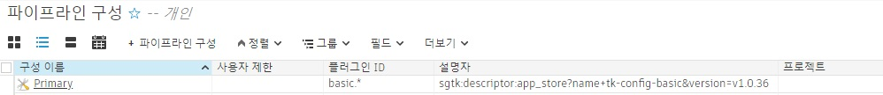
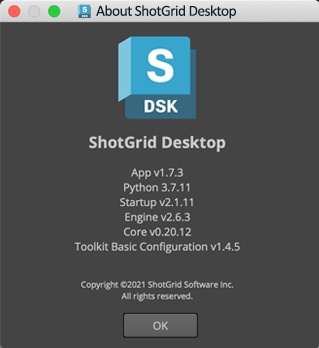
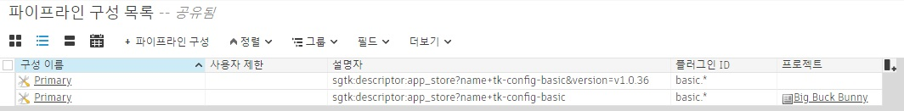

# 오프라인 사용 및 자동 업데이트 비활성화

- [자동 업데이트](#auto-updates)
   - [자동 업데이트되는 부분](#what-parts-auto-update)
   - [자동으로 업데이트되지 않는 부분](#what-doesnt-auto-update)
- [오프라인으로 통합 실행](#running-the-integrations-offline)
   - [초기 설정](#initial-setup)
   - [업데이트 관리](#managing-updates)
- [자동 업데이트 비활성화](#disabling-auto-updates)
   - [프로젝트 또는 사이트 수준에서 업데이트 비활성화](#disabling-updates-at-a-project-or-site-level)
   - [한 프로젝트만 제외하고 모든 프로젝트에 대한 업데이트 비활성화](#disabling-updates-for-all-but-one-project)
   - [업그레이드](#upgrading)

## 자동 업데이트
### 자동 업데이트되는 부분

기본적으로 Shotgun 데스크톱은 업데이트를 자동으로 확인하고, 업데이트가 있을 경우 로컬 컴퓨터에 설치합니다.

다음 두 구성요소에 대한 업데이트를 확인합니다.

- `tk-framework-desktopstartup` - Shotgun 데스크톱 시작을 지원하는 프레임 작업입니다.
- `tk-config-basic` - 기본 사이트 구성입니다.

구성은 Shotgun 데스크톱에서 사용해야 하는 앱, 엔진, 프레임워크 및 코어 버전의 매니페스트 역할을 합니다.
구성을 업데이트해야 이러한 구성요소도 업데이트할 수 있게 됩니다.
업데이트가 검색되면 다운로드되어 Shotgun 데스크톱에 설치된 원래 파일을 수정하지 않고 사용자의 로컬 캐시에 저장됩니다.

응용프로그램인 Shotgun Create는 Shotgun 데스크톱과는 별개의 자체 업데이트 메커니즘을 보유하고 있습니다(여기서는 다루지 않음).
그러나 Shotgun Create에서 제공되는 통합 기능은 유사한 방식으로 작동하며 `tk-config-basic`도 동일한 사용자 캐시로 자동 업데이트됩니다.

### 자동으로 업데이트되지 않는 부분

- 사이트 구성을 인계받은 경우 `tk-config-basic`에 새로운 업데이트가 있는지 확인하지 않고 그 아래 단위에서만 [추가 사항](#disabling-updates-at-a-project-or-site-level)을 확인합니다.

- 기본 사이트 구성을 사용하지 않는 프로젝트(예: 툴킷 고급 설정 마법사를 실행한 프로젝트)에서는 해당 구성이 자동 업데이트되지 않습니다.

- Shotgun 데스크톱과 함께 번들로 제공되는 Python 및 QT와 같은 리소스는 자동 업데이트되지 않습니다.
   이러한 부분을 업데이트해야 할 경우에는 새 Shotgun 데스크톱 설치 프로그램을 릴리즈해야 합니다.

## 오프라인으로 통합 실행

### 초기 설정

스튜디오에서 인터넷 액세스를 제한했거나 인터넷에 액세스할 수 없는 경우 필요한 모든 부분이 로컬로 캐시되어야 합니다.
Shotgun Create 또는 Shotgun 데스크톱을 다운로드하려면 인터넷에 연결할 수 있는 컴퓨터가 한 대 있어야 합니다.

Shotgun 데스크톱에는 기본 통합을 실행하는 데 필요한 모든 종속 요소가 미리 패키징되어 있습니다.
또한 Shotgun Create는 종속 요소와 함께 번들로 제공되지만 [업데이트 관리](#managing-updates)에 설명된 단계도 따라야 합니다.

둘 중 하나를 시작하면 자동으로 업그레이드를 검색합니다. Shotgun 앱 스토어에 연결할 수 없는 경우에는 로컬에 있는 가장 최신 버전을 실행합니다.

설치 프로그램과 함께 번들로 제공되는 구성요소가 최신 버전이 아닐 수도 있으므로 Shotgun 데스크톱을 설치한 후에는 [업데이트 관리](#managing-updates) 단계를 따르는 것이 좋습니다.





### 업데이트 관리

`tk-framework-desktopstartup` 구성요소를 업데이트하려면 [최신 버전을 다운로드](https://github.com/shotgunsoftware/tk-framework-desktopstartup/releases)하고 디스크의 해당 위치를 가리키도록 `SGTK_DESKTOP_STARTUP_LOCATION` 환경 변수를 설정해야 합니다(Shotgun 데스크톱에만 적용됨).

`tk-config-basic` 구성요소의 경우 모든 종속성으로 인해 약간 더 까다로워집니다.

1. 인터넷에 연결된 워크스테이션에서 Shotgun 데스크톱 또는 Shotgun Create를 실행합니다. 시작할 때 최신 업그레이드가 자동으로 다운로드됩니다.
   (이 컴퓨터에 `SHOTGUN_DISABLE_APPSTORE_ACCESS` 항목이 설정되어 있지 않은 것을 확인하십시오.)
2. 번들 캐시를 모든 컴퓨터가 액세스할 수 있는 공유 위치에 복사합니다.
3. 오프라인 컴퓨터에서 `SHOTGUN_BUNDLE_CACHE_FALLBACK_PATHS` 환경 변수가 이 위치를 가리키도록 설정합니다.
4. 오프라인 컴퓨터에서 Shotgun 데스크톱 또는 Shotgun Create를 시작하면 오프라인 컴퓨터가 번들 캐시에 있는 최신 업그레이드를 선택합니다.



## 자동 업데이트 비활성화

### 프로젝트 또는 사이트 수준에서 업데이트 비활성화



통합에 대한 자동 업데이트를 비활성화하려면 다음 단계를 수행하십시오.

1. 유지할 버전을 결정합니다. 통합 릴리즈는 [여기](https://support.shotgunsoftware.com/hc/en-us/sections/115000020494-Integrations)에서 찾을 수 있습니다.
2. Shotgun의 프로젝트 또는 전역 페이지에서 파이프라인 구성 엔티티를 만들고 다음 필드를 입력합니다(이 예에서는 v1.0.36의 통합을 사용하도록 구성을 잠금).

   1. 이름: `Primary`
   2. 프로젝트: 모든 프로젝트에 대해 업데이트를 비활성화하려면 비어 있는 상태로 두고, 단일 프로젝트에 대해서만 잠그려면 특정 프로젝트를 선택합니다.
   3. 플러그인 ID: `basic.*`
   4. 디스크립터: `sgtk:descriptor:app_store?name=tk-config-basic&version=v1.0.36`

   
3. Shotgun 데스크톱을 시작합니다. 프로젝트 필드를 비워 둔 경우에는 Shotgun 데스크톱이 이 버전을 사용하도록 전환됩니다(아직 사용하지 않은 경우).

   

   프로젝트를 설정한 경우 해당 프로젝트만 영향을 받으며 Shotgun 데스크톱 정보 창에 변경 사항이 표시되지 않습니다.
4. [선택 사항] `tk-framework-desktopstartup` 버전을 잠그려면 [최신 버전을 다운로드](https://github.com/shotgunsoftware/tk-framework-desktopstartup/releases)하고 디스크의 해당 위치를 가리키도록 `SGTK_DESKTOP_STARTUP_LOCATION` 환경 변수를 설정해야 합니다(Shotgun 데스크톱에만 적용됨).

대부분의 기능은 이전 단계에서 잠글 수 있는 구성에 의해 제어되지만 "자동 업데이트되는 부분" 섹션에서 설명한 대로 구성요소도 업데이트되며 구성과 별도로 처리됩니다. 이 또한 Shotgun 데스크톱에만 적용됩니다.

#### 유용한 정보

- 구성의 릴리즈를 수동으로 다운로드할 필요가 없으며, Shotgun 데스크톱은 이 구성이 실행되거나 프로젝트를 시작할 때 이 문제를 처리합니다.
- `basic.*`은 기초 구성에 있는 모든 플러그인이 이 재정의를 선택하게 됨을 의미합니다. 예를 들어 Nuke 및 Maya 통합만 중지하려는 경우 `basic.maya`, `basic.nuke`를 지정하면 됩니다.
- 테스트하려면 이 파이프라인 구성 엔티티를 복제한 다음 `User Restrictions` 필드에 사용자 이름을 추가하면 됩니다. 이렇게 하면 엔티티를 제한하게 되는데, 사용자에게만 적용되고 다른 사용자에게는 영향을 주지 않습니다. 그런 다음 이 복제 구성에서 Maya 또는 다른 소프트웨어를 시작하여 예상 통합 버전을 실행 중인지 확인할 수 있습니다.
- 프로젝트 필드를 비워 두면 사이트 구성을 사용하는 것입니다. Shotgun 데스크톱은 프로젝트 외부에서 작동하므로 사이트 구성을 사용합니다. Shotgun 데스크톱에서 프로젝트를 선택하면 프로젝트 구성도 로드됩니다.

- Flame 통합의 네임스페이스는 `basic.flame`으로 지정되기 때문에 `basic.*`의 일부로 생각될 수 있습니다.
   그러나 실제로 Flame 통합은 기초 구성에 포함되지 않습니다. 따라서 프로젝트에 Flame을 사용 중이고 이 재정의를 구현하는 경우 Flame 통합의 작동이 중지됩니다.
   이 솔루션은 특히 Flame에 있어 추가 파이프라인 구성 재정의를 생성하게 됩니다.
   - 이름: `Primary`
   - 프로젝트: 잠그려는 프로젝트(또는 모든 프로젝트에 대해 "없음")
   - 플러그인 ID: `basic.flame`
   - 디스크립터: `sgtk:descriptor:app_store?name=tk-config-flameplugin`

### 한 프로젝트만 제외하고 모든 프로젝트에 대한 업데이트 비활성화

위의 예에서 설명한 대로 모든 프로젝트에 대한 업데이트를 비활성화했지만 특정 프로젝트에 대한 업데이트를 사용하려는 경우 다음을 수행할 수 있습니다.

1. 위 섹션에서 설명한 대로 사이트에 대한 업데이트를 비활성화합니다.
2. 예외 프로젝트의 파이프라인 구성 엔티티가 다음 필드 값을 갖도록 구성합니다.
   - 이름: `Primary`
   - 프로젝트: 잠그지 않으려는 프로젝트
   - 플러그인 ID: `basic.*`
   - 디스크립터: `sgtk:descriptor:app_store?name=tk-config-basic`
      디스크립터 필드에서 생략한 버전 번호로 이제 프로젝트는 기본 구성의 최신 릴리즈를 추적합니다.

### 업그레이드

구성을 업데이트하게 되면 모든 사용자에게 롤아웃하기 전에 최신 버전을 테스트할 수 있습니다.

1. Shotgun에서 파이프라인 구성 엔티티를 마우스 오른쪽 버튼으로 클릭하고 **"선택 항목 복제(Duplicate Selected)"**를 선택하여 복제합니다.
2. 복제한 구성 이름을 "update test"로 지정하고 자신을 사용자 제한(User Restrictions) 필드에 할당합니다.
3. 이제 이 파이프라인 구성을 사용하기 시작합니다.
4. 테스트할 버전을 가리키도록 디스크립터를 변경합니다.
4. 테스트에 참여하게 하려는 모든 사용자를 `User Restrictions` 필드에 추가하면 초대할 수 있습니다.
5. 테스트에 만족한 경우 기본 파이프라인 구성이 해당 버전을 사용하도록 업데이트하기만 하면 됩니다.
6. 사용자가 Shotgun 데스크톱을 다시 시작하고 Shotgun 통합이 실행 중인 상태에서 현재 열려 있는 소프트웨어를 다시 시작하면 업데이트가 선택됩니다.
