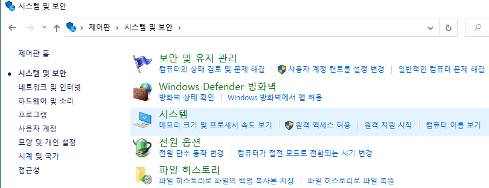
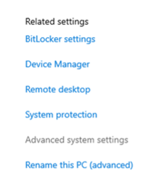
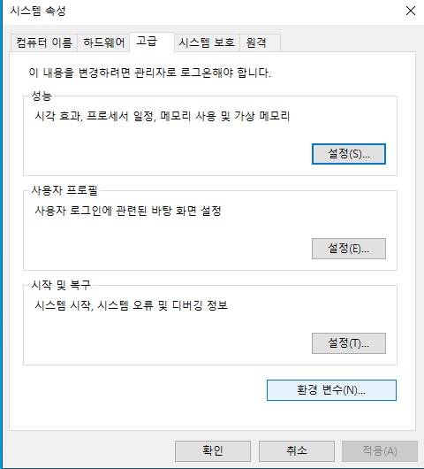
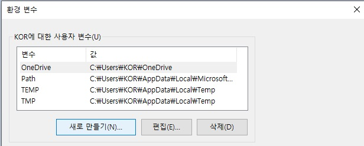
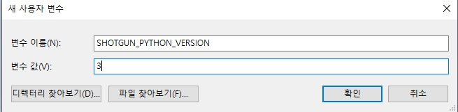

# Python 2를  데스크톱의 기본 Python 버전으로 설정

**참고:** Python 2는 2022년 11월 1일까지 제거됩니다. [여기](https://community.shotgridsoftware.com/t/important-notice-upcoming-removal-of-python-2-7-and-3-7-interpreter-in-shotgrid-desktop/15166)에서 알림을 확인할 수 있습니다.

- [Windows](#windows)
- [MacOS](#macos)
- [CentOS 7](#centos-7)

## Windows

### Windows에서 `SHOTGUN_PYTHON_VERSION` 환경을 2로 수동 설정

- Windows 작업 표시줄에서 Windows 아이콘을 마우스 오른쪽 버튼으로 클릭하고 **시스템**을 선택한 다음 **제어판/시스템 및 보안/시스템**으로 이동합니다. 



- **고급 시스템 설정**을 선택합니다.



- 시스템 속성에서 **환경 변수**를 선택합니다.



- **환경 변수** 창에서 **새로 만들기...**를 선택하여 경로를 추가/편집할 수 있습니다. 



- **변수 이름**으로 `SHOTGUN_PYTHON_VERSION`을 추가하고 **변수 값**을 `2`으로 설정합니다. 



-  데스크톱 응용프로그램을 다시 시작합니다. 이제 Python 2를 실행하도록 Python 버전이 업데이트된 것을 볼 수 있습니다. 


## MacOS

### MacOS에서 `SHOTGUN_PYTHON_VERSION` 환경을 2로 설정

- 이름이 `my.startup.plist`인 `~/Library/LaunchAgents/`에서 특성 파일 작성  

```
$ vi my.startup.plist
```

- 다음을 `my.startup.plist`에 추가하고 **저장**합니다.

```
<?xml version="1.0" encoding="UTF-8"?> 
<!DOCTYPE plist PUBLIC "-//Apple//DTD PLIST 1.0//EN" "http://www.apple.com/DTDs/PropertyList-1.0.dtd"> 
<plist version="1.0"> 
<dict> 
  <key>Label</key> 
  <string>my.startup</string> 
  <key>ProgramArguments</key> 
  <array> 
    <string>sh</string> 
    <string>-c</string> 
    <string>launchctl setenv SHOTGUN_PYTHON_VERSION 2</string> 
  </array> 
  <key>RunAtLoad</key> 
  <true/> 
</dict> 
</plist>
```

- Mac을 재부팅하면 새 환경 변수가 활성 상태로 유지됩니다.

-  데스크톱 응용프로그램을 다시 시작합니다. 이제 Python 2를 실행하도록 Python 버전이 업데이트된 것을 볼 수 있습니다. 


## CentOS 7

### CentOS 7에서 `SHOTGUN_PYTHON_VERSION` 환경을 2로 설정

- `~/.bashrc` 파일에 다음을 추가합니다. 

```
export SHOTGUN_PYTHON_VERSION="2"
```

- 다음을 실행하여 OS를 재부팅합니다.  

```
$ sudo reboot 
```

-  데스크톱 응용프로그램을 다시 시작합니다. 이제 Python 2를 실행하도록 Python 버전이 업데이트된 것을 볼 수 있습니다. 


