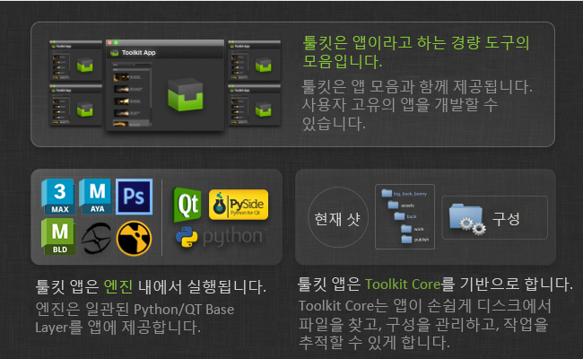
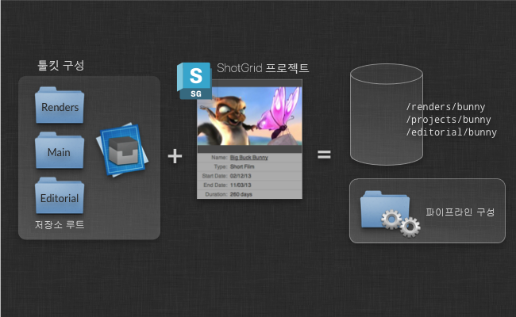
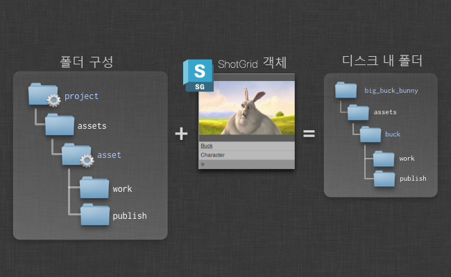
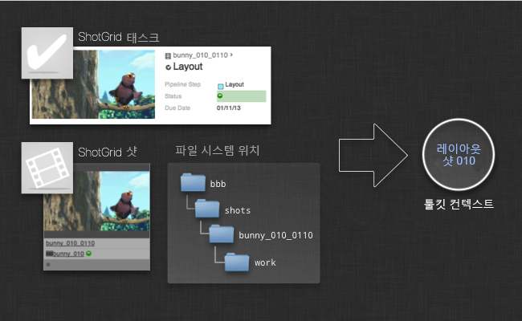
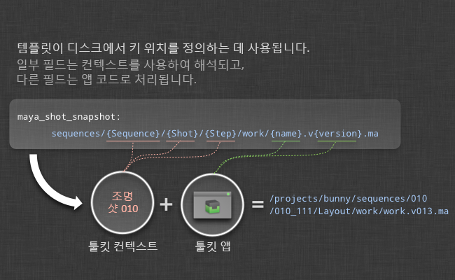
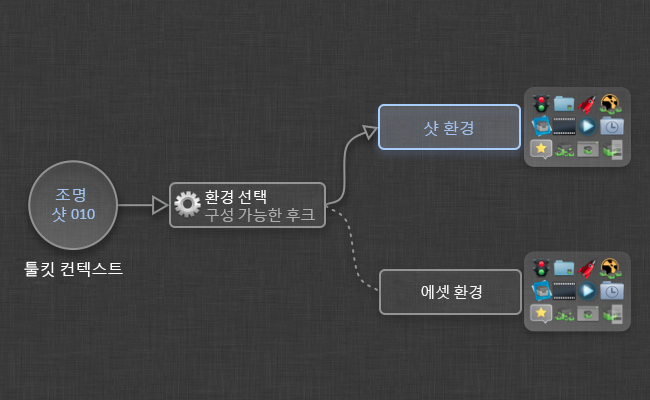
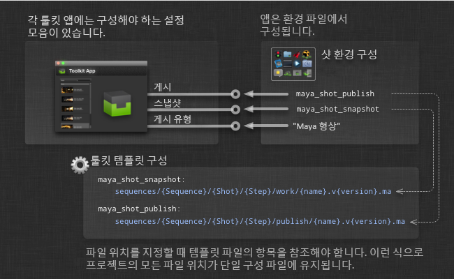
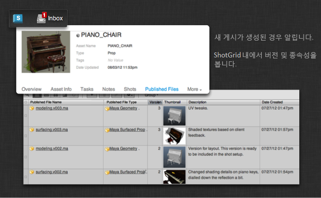

# 툴킷 개요


#  Pipeline Toolkit의 다양한 개념에 대한 개요입니다.

여기에서는 앱 및 엔진의 작동 방식, 툴킷의 시작 방법 및 현재 컨텍스트(작업 영역) 관리, 디스크에서 폴더를 만드는 방법 등의 주요 개념에 대해 자세히 설명합니다. 구성 또는 개발에 관련된 사람은 여기에서 시작하는 것이 좋습니다.

_이 문서에서는 툴킷 구성에 대한 제어 권한을 갖고 있는 경우에만 사용할 수 있는 기능에 대해 설명합니다. 자세한 내용은 [ 통합 관리자 안내서](https://support.shotgunsoftware.com/hc/ko/articles/115000067493)를 참조하십시오._

# 소개

이 문서에서는 몇 가지 핵심 기능에 대해 자세히 설명합니다. 설명, 예제 및 간단한 데모를 통해 툴킷에 대한 모든 것을 보여 줍니다. 이 문서는 툴킷을 익히거나 툴킷을 통해 스튜디오의 가치를 높일 수 있는 방법을 알고 싶은 경우에 좋은 시작점입니다. 이 문서를 읽고 나면 주요 개념과 실제로 어떻게 작동하는지 이해할 수 있게 됩니다.



아래는 툴킷(SGTK)에 대한 간단한 설명입니다.

- 툴킷은  플랫폼 기반의 _파이프라인 툴킷_입니다. 이 툴킷을 사용하면 스튜디오용 도구를 쉽게 작성하고 설치할 수 있습니다.
- 툴킷은 파일 시스템을 기반으로 합니다. 디스크에서 항목의 저장 위치를 정리하여 디스크에 있는 항목을 깔끔하게 구성할 수 있습니다.
- 툴킷은 보조적인 역할을 합니다. 파이프라인에서 데이터를 인수하거나 추상화하지는 않지만, 아티스트에게 정보를 쉽게 찾고 오류를 방지할 수 있는 강력한 도구를 제공합니다.
- 툴킷을 통해 에 모든 게시를 저장하여 작업을 공유할 수 있습니다. 툴킷을 사용하면 프로덕션 전반에 걸쳐 발생하는 업데이트 및 작업을 쉽게 공유할 수 있습니다.

다음 섹션에서는 툴킷과 그 작동 방식을 자세히 살펴보겠습니다.

# 프로젝트 및 구성

툴킷에서는 모든 항목이 프로젝트 중심입니다. 일반적으로 프로젝트는  내부에서 수명 주기를 시작하고 입찰 및 사전 프로덕션 단계를 거쳐 컨텐츠 생성 단계에 대해 준비되면 툴킷을 해당 프로젝트에 맞게 설정할 수 있습니다.



새 프로젝트를 설정할 때 _템플릿 구성_을 사용합니다. 이는 엔진 및 앱, 파일 시스템 구성, 기타 설정이 포함된 사전 정의된 구성입니다. 툴킷으로 시작하는 경우 예제 구성을 탐색의 시작점으로 사용할 수 있습니다. 다른 프로젝트에서 툴킷을 사용하고 있는 경우, 해당 구성을 새 프로젝트의 시작점으로 사용하는 것이 좋습니다. 그렇게 하면 스튜디오 구성을 개선시켜 각각의 새로운 프로젝트에 맞게 조정할 수 있습니다. 물론 스튜디오 구성을 개별적으로 유지 관리하고 이를 모든 새 프로젝트의 템플릿으로 사용할 수도 있습니다.

각 구성은 여러 _저장 지점_을 정의합니다. 표준 샘플 구성인 `tk-config-default`의 경우 _기본_이라는 단일 저장소 지점을 정의합니다. 즉, 모든 프로덕션 데이터가 단일 파일 시스템 프로젝트 루트 아래에 있음을 의미합니다. 두 개 이상의 파일 시스템 루트를 사용하여 구성을 설정할 수도 있습니다. 이를 _다중 루트 구성_이라고 합니다. 다중 루트 구성이 필요한 경우에는 렌더링과 편집을 위해 별도의 저장소가 있어야 할 경우 등이 있습니다. 이러한 저장 지점은 각각 의 _로컬 파일 저장소_여야 하며 사이트 기본 설정(Site Preferences)의 _파일 관리_(File Management) 탭 아래에서 설정할 수 있습니다.

툴킷은 원하는 위치에 실제 프로젝트 구성을 설치합니다. 일반적으로 프로젝트 데이터 영역 자체가 아니라 디스크의 _소프트웨어 설치_ 영역으로 이동됩니다.

## 스튜디오 구성 개선

새 프로젝트를 설정할 때 기존 프로젝트를 기반으로 시작할 수 있습니다. 툴킷은 해당 프로젝트의 구성 폴더를 새 프로젝트로 복사합니다. 즉, 새 프로젝트는 기반이 되는 프로젝트와 동일한 버전의 앱과 엔진, 동일한 설정 및 동일한 커스터마이제이션을 가져옵니다. 이 기능은 _파이프라인을 개선_시키고 기존 프로덕션의 개선 및 조정 사항을 활용하려는 경우 유용할 수 있습니다.

또는 해당 프로젝트 설정에 만족하는 경우 프로젝트의 구성 폴더를 가져와서 중앙 위치에 저장할 수 있습니다. 그러면 이 구성을 스튜디오 템플릿으로 사용할 수 있으며 새 프로젝트를 만들 때마다 이 구성을 기반으로 설정할 수 있습니다. 원하는 경우, git 또는 이와 유사한 리비전 제어 시스템을 사용하여 이 스튜디오 템플릿 구성을 소스 제어할 수도 있으며, 파이프라인 구성 템플릿이 시간이 지남에 따라 어떻게 개선되는지를 간단하고 투명하게 트래킹할 수 있습니다. 업데이트할 때마다 프로젝트 중 하나에서 구성을 복사하고 변경 사항을 커밋합니다.

구성 관리에 대한 자세한 정보는 다음 상세 문서를 확인하십시오.

[프로젝트 구성 관리.](https://support.shotgunsoftware.com/hc/ko/articles/219033168)

## 각 프로젝트의 파이프라인 구성

프로젝트에 대한 툴킷을 설정할 때마다 파이프라인 구성이 만들어집니다. 이 구성에는 프로젝트에 필요한 모든 설정과 파일이 포함됩니다. 구성에는 프로젝트를 직접 지정하려는 경우 셸에서 실행할 수 있는 전용 `tank` 명령이 있습니다(모든 프로젝트에서 작동하는 전역 tank 명령도 있음). 에서는 프로젝트 구성이 디스크에 상주하는 위치를 쉽게 트래킹할 수 있도록 파이프라인 구성이 특수 파이프라인 구성 엔티티로 등록되었습니다.

프로젝트가 설정될 때 생성되는 마스터 구성 외에도 프로젝트에 대한 추가 구성을 만들 수 있습니다. 이 기능은 프로젝트의 다른 사람들에게 영향을 주지 않고 구성을 변경하려는 경우에 유용합니다. 이 작업을 수행하려면 의 파이프라인 구성으로 이동하고 이를 마우스 오른쪽 버튼으로 클릭하여 복제하도록 선택할 수 있습니다. 이렇게 하면 다른 프로젝트를 기반으로 한 프로젝트의 새로운 파이프라인 구성이 만들어지며 새로운 구성을 사용하여 다른 사용자에게 영향을 주지 않고 새로운 앱을 안전하게 테스트할 수 있습니다.

프로젝트의 기본 구성의 이름을 `Primary`로 지정해야 합니다. 이름을 바꾸거나 수정하거나 삭제하면 예상대로 작동하지 않을 수 있습니다. 에 저장된 파이프라인 구성은 수동이 아니라 다양한 `tank` 관리 명령을 통해 조작되도록 고안되었습니다.

예:

[구성을 복제하는 방법](https://support.shotgunsoftware.com/hc/ko/articles/219033168-Configuration-staging-and-rollout#Cloning%20your%20Configuration)

## 업데이트 확인

다른 App Store와 마찬가지로, 툴킷 App Store는 앱과 엔진을 위한 새로운 버전을 지속적으로 제공합니다. 이러한 새 버전에는 중요한 버그 수정이나 흥미로운 새 기능이 포함될 수 있습니다. 앱과 엔진을 업그레이드하는 것은 전적으로 선택 사항입니다. 일반적으로 빠른 프로세스이며 업그레이드 스크립트는 변경하기 전에 항상 메시지를 표시합니다. 마찬가지로, 실수로 설치한 버전이 만족스럽지 않은 경우 간단히 롤백할 수 있습니다.

단일 명령으로 업그레이드 프로세스를 처리합니다. 프로젝트 구성 폴더에 있는 `tank` 명령을 실행하고 `updates` 매개변수를 추가하기만 하면 됩니다.

```shell
/software/shotgun/bug_buck_bunny/tank updates
```

매개변수 없이 이 명령을 실행하면 모든 환경, 엔진 및 앱이 검사되므로 이 작업에는 시간이 오래 걸릴 수 있지만 설치된 앱 및 엔진의 하위 세트에 대해 업데이트 프로그램을 실행할 수도 있습니다.

일반 구문:

```shell
tank updates [environment_name] [engine_name] [app_name]
```

특수 키워드 `ALL`을 사용하여 한 범주의 모든 항목을 나타낼 수 있습니다.

예:
- 모든 항목 검사: `tank updates`
- 샷 환경 검사: `tank updates Shot`
- 모든 환경의 모든 Maya 앱 검사: `tank updates ALL tk-maya`
- 샷 환경의 모든 Maya 앱 검사: `tank updates Shot tk-maya`
- 모든 위치에서 Loader 앱이 최신 버전인지 확인: `tank updates ALL ALL tk-multi-loader`
- Maya에서 Loader 앱이 최신 버전인지 확인: `tank updates ALL tk-maya tk-multi-loader`

이 스크립트는 App Store를 확인하는 것 외에도 등록된 다른 위치를 모두 확인하므로 앱을 배포한 위치에 따라 로컬 git, Github 리포지토리, 디스크의 파일 및 App Store를 쿼리할 수 있습니다.

새 버전의 앱이 앱 구성을 변경할 수 있습니다. 예를 들어 새 기능에 새로운 구성 매개변수가 필요할 수 있습니다. 이 경우 `tank` 업그레이드 스크립트는 이러한 매개변수의 값을 입력하라는 메시지를 표시합니다.

## Core API에 대한 업데이트 확인

Toolkit Core API의 새 버전이 릴리즈될 때가 있습니다. Core API를 업데이트하는 데는 별도의 명령이 사용됩니다. 이 경우 명령은 `tank core`입니다.

# 디스크에 폴더 만들기

프로젝트에 툴킷이 설정되면 이를 사용하여 일관된 폴더 구조를 만들 수 있습니다. 이 폴더 구조는 디스크에 있는 파이프라인 구성의 일부로 파일 시스템 템플릿을 작성하여 구성됩니다. 이 폴더 구조에서 일부 경로는 동적입니다. 예를 들어  에셋을 나타내는 `asset`이라는 폴더가 있을 수 있습니다. 이러한 동적 폴더는  쿼리 및 기타 여러 항목에 연결할 수 있습니다.



툴킷은 다양한 설정과 시나리오를 처리하는 다양한 동적 폴더 유형을 제공합니다. 폴더 생성을 설정할 때 표준  API 쿼리 구문을 사용할 수 있습니다. 따라서 파일 시스템을 구성하여 자산 유형이 다른 에셋이 파일 시스템의 다른 폴더에 저장되도록 할 수 있습니다.

이러한 작업 방법에 대한 자세한 정보는 관리자 안내서를 참조하십시오.

[ Pipeline Toolkit 관리](https://support.shotgunsoftware.com/hc/ko/articles/219033178)

툴킷 폴더 생성은 두 가지 패스로 진행됩니다. 즉, 언제든지 다른 사람이 실행할 수 있는 직접 패스와 일반적으로 응용프로그램 시작 직전에 아티스트가 실행하는 유예 패스입니다. 이 유예 패스는 완전히 자동으로 이루어지며 응용프로그램별 폴더 및 사용자 샌드박스를 설정하는 데 사용할 수 있습니다.

# 현재 컨텍스트

파일 시스템 구조가 만들어지면 툴킷은 디스크상의 폴더와 폴더를 가져온  객체 사이의 관계를 인식합니다. 이는 경로를 게시, 로드 또는 확인할 때 툴킷이 의 객체를 폴더, 디스크 또는 파일과 쉽게 연관시킬 수 있기 때문에 중요합니다. 또한 _컨텍스트_ 또는 _현재 작업 영역_과도 연관됩니다. 컨텍스트 객체는 Toolkit Core의 일부이며 작업 중인 현재 항목을 트래킹합니다. 이는 툴킷이 파일 시스템 경로를 확인할 때의 중앙 메커니즘입니다.



컨텍스트는 태스크, 에셋 또는 샷과 같은  객체 또는 디스크의 경로에서 만들 수 있습니다. 앱이 실행 중일 때 항상 컨텍스트에 액세스할 수 있으므로 파일 시스템 명명 규칙이나 앱이 에셋 또는 샷 파이프라인에서 사용되는지 여부를 몰라도 앱을 쉽게 만들 수 있습니다. 이러한 사항은 모두 Toolkit Core API와 컨텍스트에 의해 처리됩니다.

# 파일 시스템 템플릿

Toolkit Core에는 파일 경로를 처리하는 시스템이 있습니다. 이를 _템플릿 시스템_이라고 합니다. 툴킷은 파일 시스템 기반이므로, 앱에서 디스크의 데이터를 읽거나 쓸 필요가 있을 때마다 파일 경로를 확인해야 합니다. 앱은 파일 시스템 구조로부터 독립적입니다. 즉, 파일 시스템이 어떻게 구성되어 있는지 모릅니다. 이러한 사항은 템플릿 시스템에서 처리합니다.

템플릿 시스템의 핵심에는 _템플릿 구성 파일_이 있습니다. 이 파일에는 프로젝트의 중요한 파일 시스템 위치가 모두 들어 있습니다. _템플릿_의 모양은 다음과 같습니다.

```yaml
maya_shot_publish: 'shots/{Shot}/{Step}/pub/{name}.v{version}.ma'
```

특정 동적 필드를 포함하는 경로를 정의합니다. 각 필드는 유효성 확인 및 입력을 통해 구성될 수 있습니다. 예를 들어 위 템플릿의 `{version}` 필드를 3개의 0으로 채워진 정수(예: `001`, `012`, `132`)로 정의할 수 있습니다. 앱이 디스크에서 쓰거나 읽을 필요가 있을 때마다 해당 위치를 설명하기 위해 템플릿 파일에 템플릿이 추가됩니다. 앱은 종종 파이프라인을 형성하도록 설정되기 때문에 한 앱(예: 게시 앱)의 출력 템플릿은 종종 다른 앱(예: 로딩 앱)의 입력 템플릿이 됩니다. 이것이 모든 파일 시스템 위치가 단일 파일에 보관되는 이유입니다.

템플릿 API를 사용하면 경로와 필드 값 목록 사이를 이동할 수 있습니다.

```python
# get a template object from the API
>>> template_obj = sgtk.templates["maya_shot_publish"]
<SGTK Template maya_asset_project: shots/{Shot}/{Step}/pub/{name}.v{version}.ma>

# we can use the template object to turn a path into a set of fields...
>>> path = '/projects/bbb/shots/001_002/comp/pub/main_scene.v003.ma'
>>> fields = template_obj.get_fields(path)

{'Shot': '001_002',
 'Step': 'comp',
 'name': 'main_scene',
 'version': 3}

# alternatively, we can take a fields dictionary and make a path
>>> template_obj.apply_fields(fields)
'/projects/bbb/shots/001_002/comp/pub/main_scene.v003.ma'
```

위의 경로와 템플릿에는 두 가지 유형의 필드가 있음에 유의하십시오. `Shot` 및 `Step` 필드는 에서 동일한 오브젝트(샷 및 파이프라인 단계)를 가진 상위 수준 필드이며 여기서 `name` 및 `version` 필드는 이 특정 유형의 템플릿에 대해 매우 구체적입니다. 샷이 아닌 에셋의 게시 경로를 설명하려면 `name`과 `version` 필드가 있어야 합니다. 이는 데이터 유형에 상관없이 모든 게시에 필요하기 때문입니다. 그러나 `Shot` 및 `Step` 필드는 없습니다. 대신 `Asset`과 `Step` 필드가 있을 수 있습니다. Asset 필드는 의 에셋과 연결됩니다.

게시를 수행하는 앱을 개발하는 경우 샷 게시 앱과 에셋 게시 앱을 별도로 개발하는 것보다 단일 게시 앱에서 시퀀스, 샷, 에셋 중 무엇인지와 상관없이 모든 항목에 대한 게시 시나리오를 처리하는 것이 좋습니다.



이를 위해 _툴킷 컨텍스트_가 개입됩니다. 툴킷 컨텍스트를 사용하면 템플릿 필드를 두 개의 개별 그룹으로 나눌 수 있습니다. 컨텍스트 필드(`Shot`, `Step`, `Asset` 등)는 앱 로직이 샷 및 에셋과 같은 개념을 특별히 처리하는 코드를 가질 필요가 없도록 앱 밖에서 확인되는 필드입니다. 대신 앱은 앱의 특정 _비즈니스 로직_과 직접 연관된 필드에 정보를 입력해야 합니다. Publish 앱의 이 예에서는 비즈니스 로직이 `name` 및 `version` 필드로 구성됩니다. 위의 그림에서 알 수 있듯이 툴킷은 필드 확인을 두 개의 진행단계로 나눕니다. 일부 필드는 컨텍스트에 의해 입력되고 일부 필드는 앱 내부의 비즈니스 로직에 의해 입력됩니다. 이렇게 하면 특정 파일 시스템 레이아웃에 연결되지 않은 앱을 설계할 수 있습니다. 이는 좋은 파이프라인 도구를 만드는 중요한 요소입니다.

경로 확인을 처리하는 앱 코드는 일반적으로 다음과 같습니다.

```python
# start with an empty fields dictionary
fields = {}

# first let the context populate all its fields
fields.update( self.context.as_template_fields( publish_template_obj ) )
# fields is now {'Shot': '001_002', 'Step': 'comp' }

# now the app can add its business logic
fields["name"] = "main_scene"
fields["version"] = 234

# and finally the app can produce the path it needs in
# order to save out the file
path = publish_template_obj.apply_fields(fields)
```
템플릿 API를 구성하고 사용하는 방법에 대한 자세한 정보는 다음을 참조하십시오.

[파일 시스템 구성 참조](https://support.shotgunsoftware.com/hc/ko/articles/219039868)

[Core API 참조](https://support.shotgunsoftware.com/hc/ko/articles/219039848)

# 실행할 엔진 및 앱 선택

Toolkit Core의 또 다른 중요한 역할은 _사용자에게 어떤 앱을 제공할지_ 결정하는 것입니다. 캐릭터 리깅 작업을 하고 Maya를 시작하는 경우 한 샷에 집중할 때보다 다른 앱 컬렉션을 원할 것입니다. 또한 앱 작동 방법에 따라 앱을 다르게 구성할 수 있습니다. 즉, 리깅을 위한 리뷰 앱은 턴테이블을 생성하고 동일한 리뷰 앱을 애니메이터가 실행할 경우 해당 앱이 샷 카메라를 사용하여 playblast를 만들 수 있습니다.

이러한 유연성을 고려하여 툴킷 프로젝트 구성에는 여러 _환경_ 컬렉션이 포함되어 있습니다. 환경은 앱 및 엔진 컬렉션과 모든 구성 매개변수를 정의하는 구성 파일입니다.

툴킷이 시작되면 _어떤_ 환경을 초기화할지 결정해야 합니다. 이 과정은 고유한 비즈니스 로직을 추가할 수 있는 Python 코드 조각, 즉 _후크_를 통해 수행됩니다. _컨텍스트_ 객체가 이 코드 조각으로 전달되며 이는 종종 사용할 환경을 결정하는 데 사용됩니다.



이렇게 하면 파이프라인의 다른 부분에 대해 별도의 앱 컬렉션을 구성할 수 있습니다. 또한 이들을 독립적으로 업데이트할 수 있으며 각기 다른 감독이 별도로 관리할 수도 있습니다.

## 기본 구성의 환경

환경의 작동 방법과 구조에 대한 실질적 예제를 제공하기 위해 기본 구성과 함께 제공되는 환경을 살펴보겠습니다.

- `project.yml` - 컨텍스트에 프로젝트만 포함된 경우 실행할 앱 및 엔진
- `shot_and_asset.yml` - 컨텍스트에 샷 또는 에셋이 포함된 경우 실행할 앱 및 엔진
- `shot_step.yml` - 컨텍스트에 샷 및 파이프라인 단계가 포함된 경우 실행할 앱 및 엔진
- `asset_step.yml` - 컨텍스트에 에셋 및 파이프라인 단계가 포함된 경우 실행할 앱 및 엔진

기본 구성은 파이프라인 단계를 기반으로 해당 파일 시스템을 구성했습니다. 즉, 샷 위치에서 Modeling, Rigging 등의 폴더를 찾을 수 있습니다. 기본적으로 작업 중인 각 파이프라인 단계마다 하나의 폴더가 있습니다. 디스크의 이러한 각 폴더에는 자체 작업 및 게시 영역이 있습니다. 게시 템플릿은 다음과 같이 표시될 수 있습니다.

```yaml
maya_shot_publish: 'sequences/{Sequence}/{Shot}/{Step}/pub/{name}.v{version}.ma'
```

이 템플릿을 사용하려면 컨텍스트에 엔티티와 파이프라인 단계가 모두 포함되어야 합니다. 시퀀스 `ABC`의 하위인 샷 `1122`와 파이프라인 단계 `Modeling`의 경우 위의 템플릿은 `sequences/ABC/1122/Modeling/...`로 해석됩니다. 즉, 샷은 있지만 파이프라인 단계는 포함하지 않은 컨텍스트는 위의 템플릿을 채우기에 충분하지 않습니다. 샷만 있는 컨텍스트에서 위의 템플릿을 사용하여 Maya를 시작할 수는 없습니다. 작동시키기 위해서는 단계를 수행해야 합니다.

그 결과 위와 같이 환경이 분할됩니다. 기본 구성에 정의된 파일 시스템 구조는 단계를 중심으로 하므로 모든 기본 앱은 단계가 정의된 컨텍스트에서 실행해야 합니다. 이러한 두 환경은 기본 구성인 `asset_step.yml` 파일과 `shot_step.yml` 파일에서 정의합니다. 이러한 각 파일에는 Maya, Nuke, 3dsmax, Motionbuilder, Photoshop 등 여러 DCC 엔진이 포함되어 있습니다.  내부의 태스크에서 Maya를 시작하면 환경 선택 후크는 `shot_step` 환경을 선택하고 Maya를 시작한 다음 Maya 앱 구성을 로드합니다.

 내부의 샷 객체에서 직접 Maya를 시작하는 것도 유용할 수 있습니다. 특히 콘솔 `tank Shot 1122 launch_maya`에 입력할 수 있는 것이 매우 유용합니다. 여기에서 `shot` 및 `asset` 환경이 개입됩니다. 샷 또는 에셋은 있지만 파이프라인 단계가 없는 컨텍스트로 Maya를 로드하면 이러한 환경 중 하나가 로드됩니다. 파일 시스템 구조는 모두 파이프라인 단계별로 구성되기 때문에 컨텍스트에 해당 정보가 누락된 경우 로드 또는 게시를 수행할 수 없습니다. Maya는 대신 _Workfiles_ 앱만 포함하는 기본 구성으로 시작됩니다. 이 앱을 사용하면 작업할 태스크를 선택할 수 있습니다. 일단 태스크를 선택하면 툴킷이 컨텍스트를 전환하고 엔진을 다시 시작하며 모든 범위의 앱으로 `shot_step` 환경을 로드합니다.

마찬가지로, `project` 환경은 다목적 폴백이며 _Workfiles_ 앱만 포함합니다. 이렇게 하면 프로젝트 내부의 거의 모든 곳에서 Maya를 시작할 수 있으며 툴킷이 최소 상태로 초기화되므로 _Workfiles_ 앱을 사용하여 유효한 작업 영역으로 바로 이동할 수 있습니다.

# 앱 구성

각 앱에는 지정해야 하는 여러 구성 매개변수가 있습니다. 앱을 설치하거나 업그레이드할 때 툴킷은 필요한 모든 설정을 지정했는지 확인합니다.

문자열 또는 정수 등의 간단한 설정 값은 환경 구성에서 직접 지정됩니다. 템플릿은 서로 다르고 툴킷에서는 모든 템플릿을 한 곳에 보관하려고 하므로 환경 파일은 템플릿 파일에 정의된 템플릿을 가리키기만 하면 됩니다. 각 앱은 해당 구성에서 사용하는 템플릿에 각기 다른 필드가 있어야 합니다. 앞의 예제의 Publish 앱에서는 디스크에 출력 파일을 만들 때 `name` 및 `version` 필드가 있는 템플릿을 사용했습니다. 따라서 이 앱에는 `name` 및 `version` 필드가 포함된 템플릿을 요구하는 구성 설정이 필요합니다.



컨텍스트 필드(`name` 및 `version`) 외의 필드가 있는 템플릿을 사용하여 앱을 구성하려는 경우 앱이 이러한 추가 필드를 채우는 방법을 모르기 때문에 해당 템플릿에서 경로를 생성할 수 없습니다. 마찬가지로, 필드 중 하나가 누락된 템플릿을 제공한 경우 혼란스러운 결과가 발생할 수 있습니다. 이 경우 앱에서 버전 번호가 작성되지 않습니다. 따라서 툴킷은 시작할 때 구성을 확인하여 모든 템플릿에 필요한 필드가 제공되었는지 확인합니다. 또한 툴킷은 기본값과 선택적 필드를 사용하는 몇 가지 방법을 지원합니다.

전체 참조를 보려면 다음 링크를 확인하십시오.

[앱 및 엔진 구성 참조](https://support.shotgunsoftware.com/hc/ko/articles/219039878)

[파일 시스템 구성 참조](https://support.shotgunsoftware.com/hc/ko/articles/219039868)

## 후크

툴킷은 템플릿을 사용하는 앱 설정 외에도 _후크_라는 개념을 지원합니다. 후크는 Python 코드의 작은 조각이므로 구성의 일부로 앱 일부를 커스터마이즈할 수 있습니다.

다음은 작동 방식과 유용성에 대한 설명입니다.

앱은 여러 엔진과 프로젝트에서 재사용할 수 있기 때문에 강력합니다. 그러나 앱에 작은 조각의 일부 엔진별 로직이 필요할 수 있습니다. 예를 들어 Nuke와 Maya에서 모두 작동하는 Loader 앱을 빌드하는 경우 _실제 파일 로드_를 처리하는 코드가 있어야 합니다. 이 코드는 Nuke 및 Maya에서 달라야 합니다. 모든 엔진과 함께 이 앱을 사용할 수 있다면 더욱 좋을 것입니다. 또한 스튜디오마다 씬에 항목을 로드하는 방법이 다를 수 있습니다. 어떤 스튜디오에서는 커스텀 Maya 참조 노드를 지원해야 하고 어떤 스튜디오에서는 가져오기만 수행할 수도 있습니다.

이 상황은 툴킷에서 _후크_를 사용하여 처리됩니다. 후크는 커스터마이즈 가능한 코드 조각입니다. 앱은 기본 레벨의 구현을 포함하는 기본 후크와 함께 제공됩니다. 즉, 앱은 즉시 사용이 가능합니다. 그러나 동작을 커스터마이즈하려는 경우 해당 후크 파일을 구성에 복사하면 툴킷이 해당 코드를 대신 사용합니다.

[관리자 안내서에서 후크 작업 방법에 대해 읽기.](https://support.shotgunsoftware.com/hc/ko/articles/219033178)

#  및 셸에서 실행

툴킷이 설치되면 몇 가지 기본 진입점에서 액세스할 수 있습니다.

-  액션은 의 마우스 오른쪽 버튼 클릭 메뉴에 나타납니다.
- 시작 아이콘은  데스크톱 앱의 프로젝트에 대해 나타납니다.
- 콘솔에서 `tank` 명령을 사용할 수 있습니다.
- 툴킷 Python API는 응용프로그램과 셸 모두에서 사용할 수 있습니다.

일반적으로 응용프로그램을 시작하고 태스크를 수행하려면 에서 툴킷을 실행합니다. 는  데스크톱을 사용하여 컴퓨터에서 로컬 툴킷 설치와 통신하고 로컬 Python을 사용하여 툴킷 명령을 실행합니다. 즉,  내부에서 바로 폴더 생성과 같은 로컬 작업을 실행할 수 있습니다.

셸에서 툴킷에 액세스할 수도 있습니다. 각 프로젝트 구성은 자체 `tank` 명령과 함께 제공됩니다. 프로젝트 구성 루트로 이동하여 `./tank` 명령을 실행하기만 하면 됩니다.

마지막으로 `PYTHONPATH` 환경 변수에 툴킷 API를 추가하고 가져올 수 있습니다. API 사용은 간단합니다. 예를 들어 Maya 내부에서 툴킷을 수동으로 시작하거나,  데스크톱을 사용하지 않고 기존 스튜디오 시작 시스템의 일부로 시작하려면 몇 가지 간단한 명령을 실행하기만 하면 됩니다.

# 게시

다른 사람들과 작업 중인 파일을 공유하려면 해당 파일을 게시하면 됩니다. 이는 다른 사용자가 툴킷의 Loader 앱을 사용하여 가져올 수 있는 `PublishedFile` 엔티티가 에서 생성된다는 의미입니다.



데이터 관리 측면에서 이러한 의미에 대한 자세한 내용(디스크 항목이 저장된 위치, 파일에 포함된 내용 등)은 실제 작업을 수행하는 앱에 따라 달라집니다. 툴킷 API는 개발자가  내부에 쉽게 게시를 생성하고 이러한 게시를 올바른 객체에 링크할 수 있도록 함으로써 이 모든 올바른 작업자에게 알림을 전달할 수 있도록 합니다. 다용도로 구성할 수 있는 기본 Publish 앱도 제공하지만 이 앱이 툴킷을 사용하여 버전 제어를 구현하는 유일한 방법은 아닙니다. 툴킷은 확장 가능하므로 원하는 경우 툴킷을 사용하여 자체 커스텀 버전 제어 및 게시 시스템을 빌드할 수 있습니다.

그러나 시작점으로 아래 Publish 앱을 권장합니다.

[기본 다중 Publish 앱.](https://support.shotgunsoftware.com/hc/ko/articles/219032998)

# 재사용 가능한 앱 빌드

툴킷은 단순히 앱 및 엔진의 컬렉션이 아닙니다. 자체 도구 및 기술을 개발하는 데 사용할 수 있는 프레임워크이기도 합니다. 툴킷에는 유용한 스튜디오 개발 플랫폼으로 사용할 수 있도록 많은 기능이 포함되었습니다. 스스로 기본 파이프라인을 빌드하는 대신 툴킷을 기반으로 당면한 문제에 집중할 수 있습니다. 개발자는 아티스트의 파이프라인에 영향을 주지 않고 소프트웨어를 빌드, 평가 및 릴리즈할 수 있습니다.

- 엔진을 사용하면 기본 기반에 관계없이 Python 및 Qt(PySide/PySide2)로 앱을 작성할 수 있습니다. 이는 일부 엔진은 매우 간단하지만 일부 엔진은 제공된 API에 따라 더 복잡하다는 의미입니다. 즉, 간단하고 일관된 방법으로 스튜디오용 도구를 개발할 수 있습니다. 경험에 따르면 Python과 Qt는 개발 환경 스튜디오에서 사용되는 경우가 많으며 많은 TD가 이에 익숙합니다.
- 엔진 레이어는 또한 앱을 한 번 작성한 다음 여러 환경에 배포할 수 있음을 의미합니다. 당사는 표준 앱 제품군을 _다중 앱_으로 개발했습니다. 이는 동일한 앱이 모든 엔진에서 사용된다는 것을 의미합니다. 특정 코드는 반드시 각 DCC 응용프로그램이 노출하는 특정 API로 작업하도록 작성되어야 하지만 일반적으로 하나 이상의 후크에 포함되어 있기 때문에 앱을 쉽게 재활용할 수 있습니다. 이와 같은 다중 앱을 만들 수 있기 때문에 생기는 또 다른 결과는 새로운 엔진이 개발될 때 모든 표준 앱이 새로운 엔진과 작동하도록 쉽게 구성할 수 있다는 것입니다.
- 파이프라인 구성 및 복제를 통해 개발 샌드박스를 쉽게 만들 수 있기 때문에 개발자는 일상적인 프로덕션 액티비티를 방해하지 않고 프로덕션에서 작업을 수행할 수 있습니다. 도구를 배포할 준비가 되면 기본 프로젝트 구성을 쉽게 업데이트하고 도구를 모든 아티스트에게 롤아웃할 수 있습니다.
- 앱은 엔진 내부에서 실행되므로 쉽게 다시 로드할 수 있습니다. 새 코드 변경을 테스트할 때마다 Nuke 또는 Maya를 다시 시작하지 않고 툴킷에서 다시 로드 버튼을 누르기만 하면 최신 코드가 로드됩니다.

앱 개발에 대한 더 자세한 소개는 다음 문서를 참조하십시오.

[툴킷 앱 개발 소개.](https://support.shotgunsoftware.com/hc/ko/articles/219033158)

[툴킷 API 참조](https://support.shotgunsoftware.com/hc/ko/articles/219039858)

[앱 및 엔진 구성 참조](https://support.shotgunsoftware.com/hc/ko/articles/219039878)
