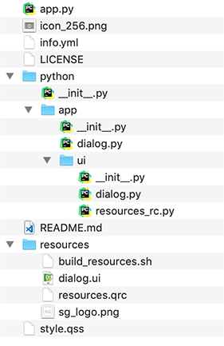
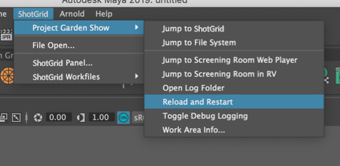
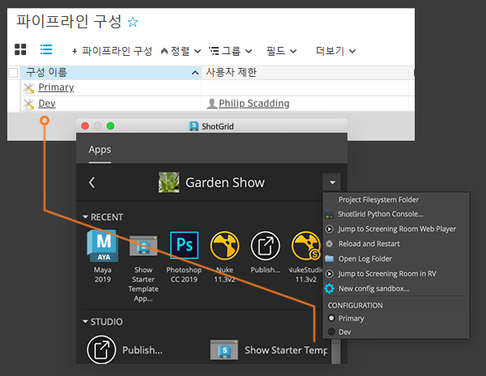

# 자체 앱 개발

## 소개

이 안내서에서는 툴킷 앱의 정의, 툴킷 앱을 만드는 방법 및 앱 개발과 관련한 몇 가지 기본적인 사항에 대해 설명합니다.
Shotgun Pipeline Toolkit은 Shotgun 소프트웨어가 관리하는 앱과 엔진의 모음일 뿐 아니라 커스텀 파이프라인 도구를 빠르고 쉽게 빌드할 수 있게 해 주는 개발 플랫폼이기도 합니다!

- [툴킷 앱이란?](#what-is-a-toolkit-app)
- [자체 앱 만들기](#creating-your-own-app)

단계:
1. [개발 샌드박스 생성](#part-1-creating-a-development-sandbox)
2. [스타터 앱 리포지토리 포크(fork) 또는 다운로드](#part-2-forking-or-downloading-the-starter-app-repository)
3. [구성에 앱 추가](#part-3-adding-the-app-to-your-config)
4. [앱 개발](#part-4-developing-the-app)
   - [템플릿 스타터 앱의 구조](#anatomy-of-the-template-starter-app)
   - [구성 설정](#configuration-settings)
   - [프레임워크](#frameworks)
   - [변경 사항 다시 로드](#reloading-your-changes)
5. [테스트](#part-5-testing)
6. [첫 번째 릴리즈 준비](#part-6-preparing-your-first-release)

추가 정보:
- [기존 앱 수정](#modifying-an-existing-app)
   - [기여](#contributing)

## 툴킷 앱이란?

툴킷 앱은 다음과 같이 정의할 수 있습니다.

- 일반적으로 최종 사용자가 Shotgun 통합을 통해 실행하는 도구입니다.
- 앱은 대개 사용자가 앱의 작업을 안내할 수 있는 그래픽 사용자 인터페이스를 갖추고 있지만 필수 사항은 아닙니다. 또한 앱은 통합에 등록된 명령일 수 있습니다. 이러한 명령은 호스트 소프트웨어의 Shotgun 메뉴에서 사용자가 실행할 수 있습니다.
- 다른 프로세스 또는 앱이 상호 작용할 수 있는 API/공용 방식을 가질 수 있습니다.
- 다중 플랫폼에 기반하며 소프트웨어에 구속받지 않습니다.
- 툴킷 앱은 [환경](https://developer.shotgunsoftware.com/ko/487a9f2c/#%ED%99%98%EA%B2%BD%EC%9D%B4%EB%9E%80)별로 다르게 구성할 수 있습니다.
- 컨텍스트를 인식할 수 있습니다. 예를 들어 앱은 사용자가 작업 중인 태스크를 인식하고 그에 따라 작업을 수행할 수 있습니다.
- 툴킷 엔진에서만 실행할 수 있습니다.

툴킷 앱은 툴킷 엔진에 의해 초기화됩니다. [엔진](https://developer.shotgunsoftware.com/tk-core/platform.html#engines)은 특정 소프트웨어 환경에서 실행되도록 설계되었으며 툴킷 앱을 실행할 인터페이스를 제공합니다. 엔진은 앱에서 다양한 소프트웨어 환경을 처리하는 데 필요한 복잡성을 추상화합니다.
따라서 앱은 해당 목적을 이행하기 위한 기능을 제공하는 데만 중점을 두며 창 부모-자식 관리, 사용자의 컨텍스트 추적 또는 앱 시작 단축키 등의 기능을 처리할 필요가 없습니다.

## 자체 앱 만들기
Shotgun 소프트웨어를 통해 관리 및 릴리즈되는 모든 앱과 엔진은 오픈 소스로, [GitHub](https://github.com/shotgunsoftware)에서 찾아볼 수 있습니다.

이 섹션에서는 스타터 템플릿을 사용하여 새 앱을 생성하는 방법을 살펴봅니다.
사용자들이 이미 GitHub 및 git 워크플로우에 익숙할 것으로 생각되기는 하지만 git을 소스 제어 솔루션으로 사용하고 있지 않더라도 툴킷 개발은 얼마든지 진행할 수 있습니다.


## 1부: 개발 샌드박스 생성
시작하기 전에 [프로젝트 구성을 복제하여 개발 샌드박스를 설정](../getting-started/installing_app.md#clone-the-pipeline-configuration-you-want-to-add-an-app-to)하는 것이 좋습니다.
이렇게 하면 프로덕션에 참여하는 다른 누구에게도 영향을 미치지 않고 코드 개발 및 변경 사항 테스트를 수행할 수 있는 별도의 구성이 만들어집니다.

## 2부: 스타터 앱 리포지토리 포크(fork) 또는 다운로드
자체 앱의 시작점으로 사용할 수 있는 [템플릿 스타터 앱](https://github.com/shotgunsoftware/tk-multi-starterapp)을 제공합니다.
이 앱을 사용하면 본인에게 맞게 설정된 모든 표준 툴킷 보일러플레이트(boilerplate) 코드 및 기본 예제 GUI를 가져올 수 있습니다.


이 방식을 사용하려면 git 리포지토리를 포크(fork)한 다음 디스크의 로컬 dev 영역에 복제하거나, 이 단계에서 git 소스 제어를 사용하지 않으려면 GitHub에서 파일을 zip 파일로 다운로드하고 로컬에 압축을 풀면 됩니다(나중에 언제든지 git 리포지토리를 설정할 수 있음).
어느 방법을 사용하든 목표는 스타터 앱 코드의 로컬 사본을 만들어 수정할 수 있도록 하는 것입니다.

## 3부: 구성에 앱 추가
구성에 앱을 추가하는 방법에 대한 자세한 내용은 "[앱 추가](../getting-started/installing_app.md)" 안내서를 참조하십시오.

앱을 구성에 추가할 때는 앱이 사용되는 위치(예: Nuke에서만 사용, 여러 다른 소프트웨어 또는 Shotgun 데스크톱에서 독립 실행형으로 사용)를 고려해야 합니다.
또한 앱의 기반 컨텍스트도 고려해야 합니다.
예를 들어 사용자가 작업 중인 태스크에 대해 알고 있는 경우에만 앱을 실행하거나, 알려진 프로젝트에서만 실행할 수 있습니까?
이을 알면 그에 맞게 앱 설정을 추가해야 하는 환경 YAML 및 엔진을 지정합니다.

확실하지 않을 경우에는 먼저 프로젝트 환경의 `tk-shell` 엔진에 추가해 두는 것이 좋습니다.
이 방법을 사용하면 [IDE에서 실행](./sgtk-developer-bootstrapping.md)하거나, [중앙 집중식 구성](https://developer.shotgunsoftware.com/tk-core/initializing.html#centralized-configurations)이 있는 경우에는 tank 명령을 사용하여 명령행을 통해 실행할 수 있습니다. 이렇게 하면 개발 속도가 빨라집니다.

시작하려면 앱 위치에 대한 [dev 디스크립터](https://developer.shotgunsoftware.com/tk-core/descriptor.html#pointing-to-a-path-on-disk)를 사용하십시오.

```yaml
tk-multi-starterapp:
  location:
    type: dev
    path: /path/to/source_code/tk-multi-starterapp
```
이렇게 하면 코드를 변경하고 싶은 경우에는 언제든지, 툴킷이 개발에 용이한 지정된 위치의 디스크에서 직접 앱 코드를 로드합니다.
나중에 앱을 프로덕션 구성에 추가할 때는 다른 디스크립터를 사용할 수 있습니다.

이제 앱을 환경에 추가했으니 앱을 실행할 수 있습니다. 실행하는 방법은 정의한 엔진 및 환경에 따라 다릅니다.

## 4부: 앱 개발

이제 앱 개발을 시작할 준비가 되었습니다.

### 템플릿 스타터 앱의 구조

[템플릿 스타터 앱](https://github.com/shotgunsoftware/tk-multi-starterapp)의 기본 구조는 다음과 같습니다.



- **app.py** - 앱 진입점 및 메뉴 등록은 `app.py` 파일에서 찾을 수 있습니다. 이 파일에서 보통 클래스를 설정하고, 항목을 초기화하고, 메뉴 항목을 등록합니다.
- **info.yml** - 매니페스트 파일이라고도 합니다. 앱 설치 시 필요한 다른 모든 설정과 해당하는 기본값(제공할 경우)을 정의합니다.
   재사용 가능한 앱을 원하고, 앱 자체에서는 어떠한 값도 하드 코딩하고 싶지 않은 경우 대개 이러한 설정이 유용합니다.
- **python/app/dialog.py** - 여기에는 메인 앱 창을 생성하는 로직 및 이벤트 콜백 등이 포함됩니다.
- **python/app/ui** - 이 폴더에는 자동 생성된 UI 코드 및 리소스 파일이 포함됩니다. 이 파일을 직접 편집하지 말고, 대신 `resources` 폴더의 Qt UI 파일을 편집하십시오.
- **resources/** - resources 폴더에 있는 `dialog.ui` 파일은 사용자가 열어서 앱의 모양을 빠르게 디자인하고 정의하는 데 사용할 수 있는 QT Designer 파일입니다.
   변경한 후에는 `build_resources.sh` 스크립트를 실행하여 UI 파일을 Python 코드로 변환하고 `/python/app/ui/dialog.py`로 저장해야 합니다.
- **style.qss** - 이 파일에서 UI에 대한 QSS(Qt 스타일 시트)를 정의할 수 있습니다.



### 구성 설정
매니페스트 파일 내에 `configuration` 섹션이 있어야 하며, 여기서 앱 설정을 정의할 수 있습니다.

매니페스트 파일의 설정을 정의하면 환경 YAML 파일에서 앱에 대해 다른 설정 값을 구성할 수 있습니다.
이 기능은 앱이 환경에 따라 다르게 동작해야 하는 경우에 유용합니다.

예를 들어 파일을 저장할 때 사용할 템플릿을 정의하는 설정을 지정할 수 있습니다.
```yaml
save_template:
    type: template
    default_value: "maya_asset_work"
    description: The template to use when building the path to save the file into
    allows_empty: False
```
이 설정을 지정하면 앱 코드에서 템플릿 이름을 하드 코딩할 필요가 없고 대신 `info.yml`에 기본적으로 정의되거나 환경 YAML 파일에서 재정의된 설정에서 [값을 가져올](https://developer.shotgunsoftware.com/tk-core/platform.html#sgtk.platform.Application.get_setting) 수 있습니다.

```python
template = app.get_setting("save_template")
```
즉, 앱이 실행되는 환경에 따라 다른 템플릿을 사용하도록 앱을 구성할 수 있습니다.

[참조 문서](https://developer.shotgunsoftware.com/tk-core/platform.html#the-configuration-section)에서 구성 설정에 대한 자세한 내용을 확인할 수 있습니다.

### 프레임워크

앞으로 프레임워크를 사용할 것이라면 프레임워크를 매니페스트 파일에 추가할 수 있습니다.

예를 들어 Qt Widgets 및 Shotgun 유틸리티 프레임워크를 앱에 사용할 것이라면 다음을 `info.yml`에 추가하십시오.

```python
# the frameworks required to run this app
frameworks:
    - {"name": "tk-framework-shotgunutils", "version": "v2.x.x"}
    - {"name": "tk-framework-qtwidgets", "version": "v1.x.x"}
```

#### 최소한으로 필요한 프레임워크 버전
최소한으로 필요한 프레임워크 버전이 있다면 minimum_version 설정을 `info.yml`에서 사용할 수 있습니다.

```python
# the frameworks required to run this app
frameworks:
    - {"name": "tk-framework-shotgunutils", "version": "v2.x.x"}
    - {"name": "tk-framework-qtwidgets", "version": "v1.x.x", "minimum_version": "v1.5.0"}
```

위 내용은 `tk-framework-qtwidgets`의 `v1.5.0`을 앱에 사용할 수 있도록 해줍니다.
그렇지 않으면 앱이 시작 시 로드되지 않고, 콘솔에 오류가 표시됩니다.
`tank updates`를 사용하여 앱을 업데이트하면 구성되어 있는 프레임워크 중 최소한으로 필요한 버전을 충족하지 않는 프레임워크는 자동으로 앱과 함께 업데이트됩니다.

프레임워크와 그 유용성에 대한 자세한 정보는 다음 링크에서 확인하십시오.

- [Qt Widgets 프레임워크](https://developer.shotgunsoftware.com/tk-framework-qtwidgets/)
- [Shotgun 유틸리티 프레임워크](https://developer.shotgunsoftware.com/tk-framework-shotgunutils/)

### 변경 사항 다시 로드

Maya 등의 소프트웨어 내에서 앱을 테스트하는 경우, 구성에 하나 이상의 dev 항목을 추가한 즉시 툴킷에서 자동으로 Shotgun 메뉴에 **다시 로드 및 다시 시작**(Reload and Restart) 옵션을 추가합니다.


이 버튼을 클릭하면 구성 및 코드가 다시 로드되고 엔진이 다시 시작됩니다.
즉, Maya를 시작하고, 시도해 보려는 코드나 구성 변경을 적용할 때마다 **다시 로드 및 다시 시작**(Reload and Restart) 버튼을 누르기만 하면 변경 사항을 가져오는 과정을 빠르게 반복할 수 있습니다.



## 5부: 테스트
코드를 테스트하려면 다른 사용자들을 Shotgun에서 `PipelineConfiguration` 엔티티의 `User Restrictions` 필드에 추가하여 dev 샌드박스로 초대하기만 하면 됩니다.
사용자를 추가하면 바로 Shotgun Create 및 브라우저 액션 내의 메뉴에 새 항목이 표시되고, Shotgun 데스크톱 내부에서 구성을 선택하는 옵션도 제공됩니다.





## 6부: 첫 번째 릴리즈 준비

[3부](#part-3---adding-the-app-to-your-config)에서는 dev 디스크립터를 사용하여 앱을 가리키도록 구성을 설정했습니다.
릴리즈한 소프트웨어의 경우 모든 사용자가 앱에 액세스할 수 있고 안전하고 쉽게 업그레이드할 수 있도록 버전이 지정되어야 할 것입니다.

Shotgun에서 제공하는 모든 앱은 툴킷 앱 스토어를 사용하여 업데이트 및 릴리즈를 트래킹합니다. 앱은 다음과 비슷한 형식의 위치 태그를 가집니다.

```yaml
location:
   name: tk-multi-setframerange
   type: app_store
   version: v0.1.7
```
이 태그를 통해 툴킷(예: `tank updates` 명령)은 업데이트가 제공될 때 이를 확인하여 매우 안전한 방식으로 구성을 업데이트 및 관리할 수 있습니다.
업데이트 명령이 실행되고 새 버전이 나올 때마다 툴킷은 코드를 다운로드하여, 디스크의 로컬 "번들 캐시"에 배치하고, 사용자가 여기에 액세스할 수 있도록 합니다.

앱 릴리즈를 소싱하는 몇 가지 옵션이 있습니다.

- [Git](https://developer.shotgunsoftware.com/tk-core/descriptor.html#tracking-against-tags-in-git) 및 [GitHub](https://developer.shotgunsoftware.com/tk-core/descriptor.html#tracking-against-releases-on-github)
- [Shotgun 업로드](https://developer.shotgunsoftware.com/tk-core/descriptor.html#pointing-at-a-file-attachment-in-shotgun)
- [로컬 경로](https://developer.shotgunsoftware.com/tk-core/descriptor.html#pointing-to-a-path-on-disk)

프로덕션 구성에서 앱을 추가하고 필요에 맞는 디스크립터를 사용하도록 전환합니다.

### Git 기반 디스크립터

git 디스크립터 사용 여부에 관계없이 소스 제어를 사용하여 변경 사항이 트래킹되게 하는 것이 좋습니다.

툴킷은 기본적으로 git(http://git-scm.com/)을 지원하므로 구성에서 `tank updates`를 실행할 경우에도 앱 스토어 디스크립터와 마찬가지로 git 리포지토리에서 최신 릴리즈를 확인하고 구성을 업데이트할 수 있습니다.

이에 대한 요구 사항은 다음과 같습니다.

- git 리포지토리에는 단일 앱만 포함되어야 합니다.
- git 리포지토리는 [스타터 앱 리포지토리](https://github.com/shotgunsoftware/tk-multi-starterapp)와 동일한 구조를 가져야 합니다.
- 태그를 생성할 때는 [시맨틱(Semantic) 버전](https://semver.org/lang/ko/)을 사용해야 합니다.
   툴킷은 이 버전 번호를 사용하여 어느 버전이 최신인지 판단하고 `vX.Y.Z` 규칙을 따릅니다.

git에 첫 번째 태그를 생성하고 나면(예: `v1.0.0`) 태그를 가리키는 git 디스크립터를 사용하도록 구성을 설정할 수 있습니다.
설정하고 나면 `tank updates`를 간단히 실행할 수 있고, 새 태그가 생성되었다면 업그레이드할지 묻는 메시지가 나타납니다.
이제 워크플로우는 공식 앱 스토어 앱의 경우와 동일합니다.



## 기존 앱 수정
빈 스타터 템플릿으로 시작하는 것보다 기존 앱(예: Shotgun 소프트웨어의 표준 앱 중 하나)에 작은 기능을 추가하는 것이 좋을 때도 있습니다.
수정된 버전의 앱으로 작업할 때에는 보통 소스 앱과 비교하여 차이점을 '트래킹'하면서 변경 사항이나 버그 픽스를 정기적으로 끌어오는 방식을 사용합니다.

이러한 유형의 개발을 진행할 때에는 부모 코드를 픽업한 다음 일부 변경 사항을 적용하고, 이를 파이프라인에 릴리즈합니다.
릴리즈는 실질적으로 앱의 기본 버전과 여러분이 적용한 로컬 변경 사항으로 구성됩니다.
기존 버전 번호에 버전 접미사를 추가하는 것이 좋습니다.
이렇게 하면 툴킷과 매끄럽게 연동되고, 비교적 직관적인 방법입니다.
다음 워크플로우는 진행 방식을 보여 줍니다.

- 부모 앱을 포크(fork)하고, 자체 리포지토리를 생성합니다. 포크(fork)를 통해 모든 git 태그를 가져옵니다.
   최신 태그는 `v0.2.12`이며, 마스터 분기는 기본적으로 이 태그의 컨텐츠와 동일하다고 가정해 보겠습니다.
- 변경 사항을 적용하고 마스터 분기로 커밋합니다. 이제 `v0.2.12` 및 변경 사항이 준비되었습니다.
   이를 프로덕션으로 릴리즈할 때 태그를 생성해야 합니다. 태그 이름을 `v0.2.12.1`로 지정하여 코드가 `v0.2.12`를 기반으로 하고 있으며, 이것이 첫 번째 릴리즈임을 나타냅니다.
- 누군가가 수정 사항에서 버그를 발견합니다. 버그를 수정하고, 태그를 지정한 다음 `v0.2.12.2`를 릴리즈합니다.
- 다수의 중요한 버그 픽스가 부모 리포지토리에 릴리즈되었습니다.
   이를 여러분의 리포지토리로 끌어옵니다. 이제 가장 최신 태그는 부모 리포지토리에서 이루어진 릴리즈로 인해 `v0.2.15`가 됩니다.
   변경 사항을 마스터와 병합하고, 테스트합니다. 이제 기본적으로 부모 앱 `v0.2.15`에 변경 사항이 병합됩니다. `v0.2.15.1`에 태그를 지정합니다.

위에서 설명한 태그 지정 체계를 따르면 툴킷 업데이트가 올바로 작동하고, 포크(fork)의 각 태그가 어느 코드를 기반으로 하는지 쉽고 빠르게 확인할 수 있습니다.

### 기여
저희는 여러분들의 요청을 환영합니다. 다른 사람에게도 도움이 될 만한 변경 사항이 있다면 주저하지 말고 사용자 요청으로 알려 주십시오.
피드백을 앱의 메인 버전에 적용할 수도 있을 것입니다.
[로드맵 페이지](https://www.shotgunsoftware.com/roadmap/)에서 새 아이디어에 대한 제안을 추가해 주셔도 좋습니다.

전체 앱을 커뮤니티와 공유하려면 [포럼](https://community.shotgunsoftware.com/)을 통해 알려 주십시오!
