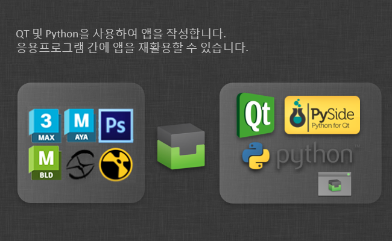

# 통합 개발자 가이드

## 패널

패널 액션 예는 [https://github.com/shotgunsoftware/tk-multi-shotgunpanel/tree/master/hooks](https://github.com/shotgunsoftware/tk-multi-shotgunpanel/tree/master/hooks)를 참조하십시오.

### 표시 내용 구성

상세 정보 영역의 값과 목록은 둘 다 `shotgun_fields` 후크를 통해 구성할 수 있습니다. 이 후크를 소분류하고, 그 구현 결과를 변경하여 원하는 정확한 값을 표시할 수 있습니다.

**템플릿 시스템**

후크는 간단한 템플릿 언어를 지원하므로 유연성이 뛰어납니다. 또한 Qt에서 지원하는 HTML 하위 세트를 지원하므로 표시되는 값의 색상, 글꼴 크기, 두께 등을 제어할 수 있습니다.

템플릿 언어는 다음과 같은 방식으로 작동합니다.

-  값은 `{brackets}`로 묶여 있습니다(예: `<b>Description:</b> {description}`). 이 템플릿이 렌더링되면 `{description}` 부분은 설명 필드 값으로 대체됩니다.

- 값의 선택적 접두사 또는 접미사(값이 비어 있지 않은 경우에만 표시)를 원한다면 `{[Prefix]sg_field[suffix]}` 구문을 사용하면 됩니다. 템플릿 `{[Start: ]start_date} {[End: ]end_date}`는 두 값이 모두 입력될 경우 `Start: 12 July 2009 End: 14 July 2012`를 렌더링하지만 종료 날짜가 설정되지 않은 경우 `Start: 12 July 2009`를 렌더링합니다.

- 일부 값이 설정되지 않은 경우에는 폴백을 정의할 수 있습니다.  버전의 경우 제작자가 아티스트 대신 버전을 제출하는 워크플로우를 지원하기 위해 `artist` 필드가 `created_by` 필드보다 우선권을 가집니다. 이 경우, 버전은 제작자에 의해 생성되지만 `artist` 필드는 아티스트로 설정됩니다. 그러나 항상 그렇지는 않습니다. 아티스트가 자신의 작업을 제출하는 파이프라인에 아티스트를 비워 두는 경우도 있습니다. 따라서 버전을 표시할 때에는 `artist` 필드를 먼저 확인하고, 이 필드가 설정되어 있지 않은 경우에는 `created_by` 필드로 폴백할 수 있도록 하는 것이 좋습니다. 이 작업은 `{field1|field2}` 구문을 사용하여 수행할 수 있습니다(예: `Created By: {artist|created_by}`). 이 구문을 선택적 필드(예: `{[Created By: ]artist|created_by}`)와 결합할 수도 있습니다.

이 후크에는 다음 방식이 포함됩니다.

**목록에 표시되는 항목 제어**

`get_list_item_definition()` 방식은  엔티티 유형이 지정된 다양한 목록의 항목 모양을 제어하는 사전을 반환합니다. `top_left`, `top_right` 및 `body` 키가 포함된 사전을 반환합니다. 예를 들면 다음과 같습니다.

```python
{
 "top_left": "<big>{code}</big>",
 "top_right": "{updated_at}",
 "body": "By: {created_by}<br>Description: {description}"
}
```

**상단 상세 정보 영역 제어**

`get_main_view_definition()` 방식은  엔티티 유형에 따라 키 `title` 및 `body`를 사용하여 사전을 반환합니다. 이 값은 상세 정보 영역의 객체 모양을 제어합니다. 예를 들면 다음과 같습니다.

```python
{
 "title": "{type} {code}",
 "body": "By: {created_by}<br>Description: {description}"
}
```

**정보(Info) 탭에 표시되는 필드 제어**

`get_all_fields()` 방식은 정보(Info) 탭에 렌더링될 때 해당하는 엔티티에 따라 표시할 필드의 목록을 반환합니다.

### 액션 구성

액션은  데이터에서 작동하는 작은 코드 조각입니다. 다음과 같은 예를 들 수 있습니다.

- 지정된  버전에 대해 RV를 시작하는 액션
- 사용자가 지정된 태스크에 자신을 할당할 수 있는 액션
- Maya에  게시를 Maya 참조로 로드하는 액션

액션의 실제 페이로드는 _액션 후크_에 정의됩니다. 액션 로직을 정의한 후에는 앱 구성에서 해당 액션을  객체에 매핑할 수 있습니다. 이 액션 매핑은 다음 예와 같은 모습입니다.

```yaml
action_mappings:
  PublishedFile:
  - actions: [reference, import]
    filters: {published_file_type: Maya Scene}
  - actions: [texture_node]
    filters: {published_file_type: Rendered Image}
  Task:
  - actions: [assign_task]
    filters: {}
  Version:
  - actions: [play_in_rv]
    filters: {}
```

위의 예에서는 `reference`, `import`, `texture_node`, `assign_task` 및 `play_in_rv` 액션을 사용합니다. 다음으로 다양한  객체 및 조건에 액션을 매핑합니다. 예를 들어 모든 Maya 씬 게시 유형에 `import` 액션을 표시하려고 합니다.

객체가 패널에 로드되면 위의 액션 구성을 확인하고 분석합니다. 현재 객체에 대한 적절한 액션 목록이 판별되고 `generate_actions()` 후크 방식이 실행됩니다. 이때 지정된 엔티티의  데이터가 후크로 전달되므로 후크 코드가 이 특정  객체에 대한 액션을 실행할 수 있는지 확인할 수 있습니다. 이렇게 하면 각 후크가 표시되기 전에 검사를 실행할 수 있습니다. 예를 들어 `play_in_rv` 후크는 로컬에서 사용할 수 있는 미디어가 있는 경우에만 관련될 수 있고 구성에서 설정된 액션 매핑은 지정된  엔티티에 대해 활성화할 액션을 패널에 알려 주지만 `generate_actions()` 방식이 지정된 객체에 적합하지 않다고 판단할 수 있으므로 모두 표시되지 않을 수 있습니다.

`generate_actions()` 방식에서 반환되는 액션은 액션 메뉴에 표시되고 사용자가 이를 클릭하면 `execute_acton()` 후크 방식이 호출되어 액션을 실행합니다.

패널이 지원하는 각 응용프로그램에 대해 적절한 액션을 구현하는 액션 후크가 있습니다. 예를 들어 Maya 등을 사용하면 기본 후크가 `reference`, `import` 및 `texture_node` 액션을 구현하고 각각 특정 Maya 명령을 수행하여 현재 Maya 씬으로 게시를 가져옵니다. 모든 후크와 마찬가지로 재정의 및 변경이 완벽히 가능하고, 기본 제공 후크로부터 파생되는 후크를 생성하는 것 역시 가능하기 때문에 많은 코드를 복제할 필요 없이 기본 제공 후크에 다른 액션을 쉽게 추가할 수 있습니다.

패널은 툴킷의 2세대 후크 인터페이스를 사용하기 때문에 그 유연성이 뛰어납니다. 이 후크 형식은 향상된 구문을 사용합니다. 기본 구성 설정에서 다음과 같은 형식을 볼 수 있습니다.

```yaml
actions_hook: '{self}/tk-maya_actions.py'
```

`{self}` 키워드를 통해 툴킷은 앱의 `hooks` 폴더에서 후크를 찾을 수 있습니다. 이 후크를 사용자 구현으로 재지정하려면 값을 `{config}/panel/maya_actions.py`로 변경합니다. 이렇게 하면 툴킷이 구성 폴더에 있는 `hooks/panel/maya_actions.py`라는 후크를 사용하게 됩니다.

자세한 정보는 앱과 함께 제공되는 후크 파일을 참조하십시오. 후크는 또한 상속을 이용합니다. 즉, 후크의 모든 사항을 재지정할 필요는 없지만 다양한 방식으로 기본 후크를 좀 더 쉽게 확장하거나 확대하여 보다 쉽게 후크를 관리할 수 있습니다.

[2세대 후크 형식에 대한 자세한 정보는 여기를 참조하십시오.](https://support.shotgunsoftware.com/hc/ko/articles/219039878#The%20hook%20data%20type)

후크에서 상속을 사용하면 다음과 같은 기본 후크에 액션을 추가할 수 있습니다.

```python
import sgtk
import os

# toolkit will automatically resolve the base class for you
# this means that you will derive from the default hook that comes with the app
HookBaseClass = sgtk.get_hook_baseclass()

class MyActions(HookBaseClass):

    def generate_actions(self, sg_data, actions, ui_area):
        """
 Returns a list of action instances for a particular object.
 The data returned from this hook will be used to populate the
 actions menu.

 The mapping between  objects and actions are kept in a different place
 (in the configuration) so at the point when this hook is called, the app
 has already established *which* actions are appropriate for this object.

 This method needs to return detailed data for those actions, in the form of a list
 of dictionaries, each with name, params, caption and description keys.

 Because you are operating on a particular object, you may tailor the output
 (caption, tooltip etc) to contain custom information suitable for this publish.

 The ui_area parameter is a string and indicates where the publish is to be shown.

 - If it will be shown in the main browsing area, "main" is passed.
 - If it will be shown in the details area, "details" is passed.

 :param sg_data:  data dictionary with all the standard publish fields.
 :param actions: List of action strings which have been defined in the app configuration.
 :param ui_area: String denoting the UI Area (see above).
 :returns List of dictionaries, each with keys name, params, caption and description
 """

        # get the actions from the base class first
        action_instances = super(MyActions, self).generate_actions(sg_data, actions, ui_area)

        if "my_new_action" in actions:
            action_instances.append( {"name": "my_new_action",
                                      "params": None,
                                      "caption": "My New Action",
                                      "description": "My New Action."} )

        return action_instances

    def execute_action(self, name, params, sg_data):
        """
 Execute a given action. The data sent to this be method will
 represent one of the actions enumerated by the generate_actions method.

 :param name: Action name string representing one of the items returned by generate_actions.
 :param params: Params data, as specified by generate_actions.
 :param sg_data:  data dictionary with all the standard publish fields.
 :returns: No return value expected.
 """

        if name == "my_new_action":
            # do some stuff here!

        else:
            # call base class implementation
            super(MyActions, self).execute_action(name, params, sg_data)
```

그런 다음 이 새 액션을 구성의 게시 유형 세트에 바인딩할 수 있습니다.

```yaml
action_mappings:
  PublishedFile:
  - actions: [reference, import, my_new_action]
    filters: {published_file_type: Maya Scene}
  Version:
  - actions: [play_in_rv]
    filters: {}
```

위의 그림과 같이 후크에서 파생된 커스텀 후크 코드는 유지 관리 및 업데이트가 보다 쉽도록 실제 추가된 비즈니스 로직만 포함하면 됩니다.

## Publisher

Publish 앱은 퍼블리싱을 위해 항목이 아티스트에게 제공되는 방식과 해당 항목이 그 이후 처리되는 방식을 제어하는 후크를 통해 커스터마이즈할 수 있는 범위가 매우 넓습니다.

Publisher 앱의 전체 개발자 문서를 이제 [툴킷 개발자 사이트](http://developer.shotgunsoftware.com/tk-multi-publish2)에서 살펴볼 수 있습니다.

Publish 앱을 사용하는 자세한 방법은 [사용자 안내서](https://support.shotgunsoftware.com/hc/ko/articles/115000067513-Integrations-Developer-Guide#User_guide_link)를 참조하십시오. 1세대 Publisher에 대한 자세한 내용을 보려면 [클래식 게시자 문서](https://support.shotgunsoftware.com/hc/ko/articles/115000067513-Integrations-Developer-Guide#classic_publisher_link)를 참조하십시오.

## Loader

로드 액션 예는 [https://github.com/shotgunsoftware/tk-multi-loader2/tree/master/hooks](https://github.com/shotgunsoftware/tk-multi-loader2/tree/master/hooks)를 참조하십시오.

## 고급 기능

## 도구를 쉽게 개발할 수 있도록 해 주는  툴킷

앱을 직접 작성할 수 있다는 것을 알려 드렸나요? 각 엔진이 Python 및 PySide 기반의 일관된 인터페이스를 표시하기 때문에 Nuke, Photoshop 및 3dsmax에서 모두 작동하는 단일 앱을 작성할 수 있습니다. Core API 기능을 이용하면 스튜디오용 대규모 파이프라인 스택을 빌드할 필요가 없고, 대신 프로덕션 문제 해결에 dev 리소스를 집중할 수 있습니다. 이 툴킷 덕분에 프로젝트마다 도구를 재사용하는 것도 쉽습니다. 파일 명명 규칙이나 기타 요구 사항이 바뀌는 경우에는 앱을 재구성하기만 하면 됩니다. 툴킷의 기본 제공 Git 및 Github 지원을 통해 도구를 안전하게 롤아웃하고, 개발 시에는 빠르게 코드를 핫로드하십시오. 자체 Dev Sandbox에서 작업하고, 코드를 프로젝트 구성원 모두에게 롤아웃할 필요 없이 TD 및 얼리 어답터를 초대해 코드를 테스트할 수 있습니다.

