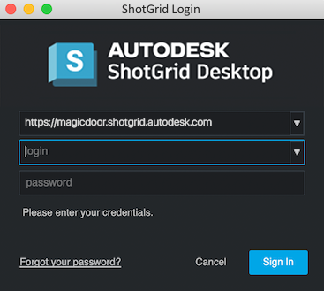
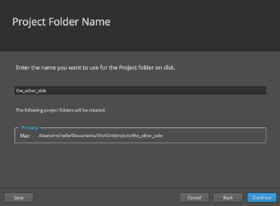

# 구성 시작하기

이 안내서를 완료하면 구성에 프로젝트 정보를 추가하고, 구성을 프로젝트와 연결하고, 커스터마이즈할 파이프라인 구성을 준비하는 기본적인 지식을 갖출 수 있습니다.

## 안내서 정보

이 안내서에서는  데스크톱에서 **고급 프로젝트 설정 마법사**를 사용하여 디지털 컨텐츠 생성 파이프라인의 구성을 생성하는 방법에 대해 설명합니다. 구성 도구에 대해 간단히 살펴보고, 마법사를 사용하는 방법을 설명하며, 자세한 내용을 확인할 수 있는 자료도 제공합니다. 마법사를 사용하면 프로젝트에 대한 파이프라인 구성이 생성되고 파이프라인의 각 단계를 지원하기 위해 편집 및 확장할 수 있는 준비가 이루어집니다. 이 구성은 UI,  앱 및 프로덕션 파이프라인을 지원하는 데 필요한 다양한 도구의 여러 측면을 제어합니다. 마법사를 사용하는 것은 구성을 확장하는 한 가지 방법에 불과합니다. 마법사에서는 파이프라인의 각 단계에 설정을 추가하고 소프트웨어 응용프로그램과의 통합도 추가할 수 있습니다. 이 안내서에서는 툴킷의 기본 구성을 기반으로 프로젝트의 구성을 설정할 것입니다.

이 안내서를 학습하는 사용자는 다음과 같은 준비를 갖추어야 합니다.

1. 고급 프로젝트 설정 마법사를 사용한 적이 없음
2.  사용 방법에 대한 기초적인 지식을 갖추고 있음
3.  툴킷을 처음 접함

### 이 문서 사용

이 안내서를 사용하고 프로젝트에 대해 커스터마이즈 가능한 구성을 생성하려면 다음과 같은 준비가 필요합니다.

1. 유효한  사이트. [여기서 에 등록](https://www.shotgridsoftware.com/signup/?utm_source=autodesk.com&utm_medium=referral&utm_campaign=creative-project-management)하면 30일 무료 체험판을 다운로드해 직접 체험해 볼 수 있습니다.
2.  데스크톱. 데스크톱이 설치되어 있지 않은 경우 [이 링크를 따라 시작할 수 있습니다.](https://support.shotgunsoftware.com/hc/ko/articles/115000068574-Integrations-user-guide#Installation%20of%20Desktop)
3. 프로젝트 파일과 파이프라인 구성을 저장할 수 있는 파일 시스템. 파일 시스템에 `Shotgun` 폴더를 생성하고, 이 폴더 안에 `projects` 및 `configs` 폴더를 생성합니다.

## 고급 프로젝트 설정 마법사 정보

 데스크톱의 고급 프로젝트 설정(Advanced Project Setup) 마법사는 기본 구성을 기반으로 파이프라인 구성을 생성합니다. 기본 구성을 사용하면 탄탄한 기초를 토대로 파이프라인 프로세스를 지원하는 커스터마이즈 가능한 설정, 앱 및 UI 요소를 작성할 수 있습니다. 이 마법사를 통해 생성되는 구성은 프로젝트의 파이프라인 요구사항을 충족하도록 편집 및 확장할 수 있습니다.

기본 구성에는 다음이 포함됩니다.
* 디스크에서 파일이 저장되는 위치를 결정하는 기본 파일 시스템 스키마 및 템플릿
* 사용자의 소프트웨어 응용프로그램에서 바로  및 파이프라인 기능과 상호 작용할 수 있게 해 주는, 모든 지원되는 [소프트웨어 통합](https://support.shotgunsoftware.com/hc/ko/articles/219039798-Integrations-Apps-and-Engines)

커스터마이즈 수준은 상상력과 기발함, 그리고 프로그래밍 지식 또는  커뮤니티의 다른 사용자가 만든 것을 가져다 쓸 수 있는 능력 등에 따라 달라질 수 있습니다.

### 구성 만들기

모든 프로젝트에는 구성이 필요합니다.  데스크톱을 통해 프로젝트에 처음 액세스하면 기초 구성이 다운로드되고 설정됩니다. 이 기초 구성에서는 사용자의 시스템에서 지원되는 컨텐츠 생성 소프트웨어를 자동으로 탐지하고 구성을 프로젝트와 연결합니다. 지원되는 소프트웨어 응용프로그램 내 통합은 파이프라인 구성의 설정에 의해 제어됩니다. [Panel](https://support.shotgunsoftware.com/hc/ko/articles/219033098-Shotgun-Panel) 앱에는 의 프로젝트 정보가 표시되므로 아티스트가 작업 세션을 떠나지 않고도 노트에 회신하고 버전을 볼 수 있습니다. [Publisher](https://support.shotgunsoftware.com/hc/ko/articles/219032998-Publishing-your-work) 앱에서는 자신의 작업물을 팀의 다른 작업자와 공유할 수 있으며 [Loader](https://support.shotgunsoftware.com/hc/ko/articles/219033078-Load-Published-Files-) 앱을 통해서는 팀원이 게시한 파일을 로드할 수 있습니다. 기초 구성에는 파일 시스템 관리 설정이나 파일 및 디렉토리의 디스크 내 명명 방식을 템플릿 개발 등이 포함되지 않습니다. 또한, 기본 구성이 설정될 때 추가되는 다양한 앱도 포함되지 않습니다. 기초 구성은 구성 파일을 직접 편집하지 않고도 툴킷을 바로 실행할 수 있게 해주는 단순한 구성입니다. 이 마법사는 기초 구성을 기본 구성으로 변환합니다. 또한, 사용자의 작업을 지원하기 위해 추가적인 앱과 소프트웨어 통합을 제공합니다. 기초 구성도 편집 가능하기는 하지만, 고급 설정을 통해 프로젝트를 커스터마이즈할 수 있도록 설정할 때까지는 편집할 수 없습니다.

### 기초 구성과 기본 구성의 차이점

| 기능 | 기초 구성 | 기본 구성 |
| ------- | ------------------- | --------------------- |
| 다운로드 | 프로젝트에 액세스하면 자동으로 다운로드됨 | 고급 설정 마법사를 통해 생성됨 |
| 접근성 | 시스템 위치에 저장됨 | 수동으로 편집 가능한 파일 |
| 업데이트 | 자동으로 업데이트됨 | 수동으로 업데이트됨 |
| 파일 시스템 지원 | 파일 시스템 스키마 지원 안 함 | 폴더 구조와 파일 명명 표준을 지원하는 도구 포함 |
| 소프트웨어 통합 | 3ds Max, Houdini, Maya, Nuke, Photoshop, Flame | 기초 구성 + Hiero, Motionbulder, Mari |
| 툴킷 앱 |  Panel, Publisher, Loader | 기초 구성 + Workfiles, Snap Shot, Scene Breakdown, Nuke Write Node, Houdini Mantra Node 등 |

이 안내서에서는  데스크톱의 마법사를 사용하여 기본 구성을 기반으로 프로젝트의 파이프라인 구성을 생성합니다. 이 구성을 생성하면 자체 프로덕션 파이프라인을 지원하는 데 필요한 커스터마이즈를 수행할 수 있게 됩니다.

## 연습 시작

### 기본 구성 사용 준비

**1단계:** 에 "the_other_side"라는 프로젝트를 생성합니다.

**2단계:**  데스크톱 앱을 실행하고  사이트의 사용자 이름 및 암호를 사용하여 로그인합니다.

**3단계:** 썸네일 이미지를 선택하여 마법사를 실행할 프로젝트로 이동합니다.



### 기본 구성 액세스

프로젝트에 액세스할 때 기초 구성이 다운로드되고 설정되었습니다. Publish 앱 및 지원되는 소프트웨어 패키지가 탐지되어  데스크톱의 **앱**(Apps) 창에 자동으로 추가되었습니다.

**4단계:** 프로젝트가 로드되면 화면 오른쪽 아래에 있는 프로파일 **아바타**를 선택합니다. 팝업 메뉴에서 **고급 프로젝트 설정…**(Advanced project setup…)을 선택하여 마법사를 시작합니다.

네 개의 옵션이 있고 그중에 Shotgun 기본값( Default)이 선택되어 있는 대화상자가 표시됩니다. 여기서 프로젝트의 파이프라인 구성을 기존 프로젝트의 구성, git 리포지토리의 구성, 디스크의 경로 중 무엇을 기반으로 할지 선택할 수 있습니다.

이 연습에서는 ** 기본값(Shotgun Default)**을 선택하겠습니다. 이 옵션을 선택하면 의 기본 구성을 기반으로 프로젝트의 파이프라인 구성이 생성됩니다.

**5단계:** **계속**(Continue)을 선택합니다.

두 개의 옵션이 있고 그중에서 **기본값**(Default)이 선택되어 있는 대화상자가 표시됩니다. 이 대화상자에는 레거시(Legacy) 기본 구성 설정을 선택할 수 있는 옵션이 있습니다. 이 구성 설정은 이전 버전의 를 계속 사용하는 스튜디오를 위해 제공되는 이전 버전의 설정입니다. 이 연습에서는 기본값(Default)을 사용하겠습니다.

**6단계:** **계속**(Continue)을 선택합니다.

### 프로젝트 파일의 저장소 위치 정의

`Storage:`라는 단어 옆에 드롭다운 메뉴가 표시되는 대화상자가 나타납니다.

**7단계:** 이 프로젝트에 대한 프로젝트 데이터를 저장할 위치를 나타냅니다. 대화상자 맨 위에 있는 드롭다운에서 **+ 신규**(+ New)를 선택하고 필드에 **프로젝트**(projects)를 입력합니다.

 툴킷은 세 개의 운영 체제인 Linux, Mac, Windows를 지원합니다.

**8단계:** 프로젝트 데이터를 저장하는 데 사용되는 운영 체제 옆에 있는 필드를 선택합니다. 폴더 아이콘을 선택하고 이 연습을 진행하기 전에 파일 시스템에 생성한 프로젝트 폴더로 이동합니다.

이 설정을 진행하면 프로덕션 데이터 저장 위치로 지정한 폴더에만 가 액세스할 수 있게 됩니다. 이 연습의 준비 과정에서  루트 디렉토리에 `projects/` 디렉토리를 추가했습니다. `projects/` 디렉토리는 툴킷이 로컬 프로젝트 관련 정보를 저장할 위치입니다.

**9단계:** **저장**(Save)을 선택하여 프로젝트 데이터를 저장할 프로젝트 폴더를 지정합니다.

프로젝트 데이터가 저장되는 경로를 나타내도록 운영 체제 경로가 자동으로 업데이트됩니다.

**10단계:** **계속**(Continue)을 선택합니다.

### 프로젝트 폴더의 이름 지정

텍스트 필드에 프로젝트 이름이 입력된 상태로 대화상자가 표시됩니다. 이 이름은 프로젝트 정보에서 가져와서 자동으로 입력되며 경로도 자동으로 업데이트됩니다.

툴킷은 파이프라인 구성이 에 업로드되고 각 사용자에 대해 로컬로 캐시되는 분산 설정이나 사용자가 디스크에서 공유된 위치에 있는 단일 구성에 액세스하는 중앙 집중식 설정에서도 작동할 수 있습니다. 이 연습에서는 중앙 집중식 설정을 사용하겠습니다. [분산 설정에 대한 자세한 내용은 여기서 확인할 수 있습니다](https://developer.shotgridsoftware.com/tk-core/initializing.html#distributed-configurations).

마지막 단계에서는 프로젝트와 관련된 구성을 생성하기 위해 적합한 폴더, 파일 및 데이터를 생성합니다.

**11단계:** 해당하는 운영 체제에서 **찾아보기...**(Browse...)를 선택하고 이 연습을 준비할 때 생성한 구성 폴더 `configs`로 이동한 후 프로젝트 이름 **the_other_side**를 입력합니다. 그러면 폴더가 생성되고, 이 폴더에 프로젝트 구성이 저장됩니다. **설정 실행**(Run Setup)을 선택하고 설정이 완료될 때까지 기다립니다.

**12단계:** **완료**(Done)를 선택하여 프로젝트 창에 나타나는 새 아이콘을 표시합니다.

**팁:**  데스크톱에 신속하게 액세스하기 위해 메뉴 막대에 앱을 고정할 수 있습니다. 이렇게 하려면 **아바타**를 선택하고 **메뉴에 고정(Pin to Menu)**을 선택하십시오.

다 되었습니다. 프로젝트 설정이 완료되었습니다. 이제 기본 구성을 기반으로 지정한 위치에 프로젝트에 대한 툴킷 파이프라인 구성이 생성되었으므로 커스터마이즈 작업을 시작할 수 있습니다.

`configs` 폴더를 살펴보면 여러 폴더와 파일을 보실 수 있을 것입니다. 어떠한 것들이 있는지 잠시 살펴보시기 바랍니다.

이제 정말로 재미있는 내용으로, 구성으로 수행할 수 있는 모든 작업에 대해 살펴보겠습니다. 여기서 살펴볼 고급 항목은 다음과 같습니다.

## 고급 항목

 툴킷에서는 구성을 간편하게 편집하고 복제하고 가져올 수 있는 방법을 다양하게 제공합니다. 기존의 구성을 확장하면 시간을 절약할 수 있으며 네트워크에 있는 다른 작업자가 만든 모든 멋진 구성을 이용할 수 있습니다. 필요한 구성을 찾기 위해 방대한  [커뮤니티](https://groups.google.com/a/shotgunsoftware.com/forum/?fromgroups&hl=ko#!forum/shotgun-dev)를 활용할 수 있습니다.  커뮤니티는 정보를 공유하는 커뮤니티이므로 서로에게 친절하게 대하고, 작업에 도움이 되는 구성을 발견하면 작성자의 공로를 인정하고 감사의 인사를 전해 주시기 바랍니다. 그리고  사용자들에게 도움이 될 새로운 정보를 게시하는 것도 잊지 마십시오. 이런 식으로 우리는 서로를 도와가며 특별한 커뮤니티를 만들어 가고 있습니다!

다음은 재미있게 구성 관련 작업을 진행할 수 있는 몇 가지 방법입니다.

### 명령행을 사용하여 기본 구성 생성

프로젝트 구성에서 `tank` 명령을 사용하여 터미널에서 관리자 명령을 실행할 수 있습니다. 프로젝트마다 고유한 전용 `tank` 명령이 있습니다. `tank setup_project` 명령의 기능은 고급 설정 마법사와 유사합니다. 이 명령은 기존 프로젝트의 구성이나 기본 구성을 기반으로 디스크에 프로젝트에 대한 편집 가능한 구성을 생성합니다. [`tank setup_project`를 실행하는 방법에 대한 자세한 내용은 여기서 확인](https://support.shotgunsoftware.com/hc/ko/articles/219033178-Administering-Toolkit#setup_project)하고 [`tank` 명령에 대한 자세한 내용은 여기서 확인](https://support.shotgunsoftware.com/hc/ko/articles/219033178-Administering-Toolkit#Using%20the%20tank%20command)할 수 있습니다.

### 프로덕션 단계에 적용된 구성 편집

현재 프로덕션 단계에 적용된 구성을 수정하고 싶지만 아티스트가 사용하는 동안에는 편집하고 싶지 않은 경우가 있습니다. 에서는 단 몇 개의 명령으로 기존 구성을 복사하여 수정된 구성을 프로덕션에 적용하기 전에 안전하게 수정 사항을 테스트해 볼 수 있습니다. 이 프로세스에서는 프로덕션 구성을 새 구성으로 교체하고 이전 구성은 자동으로 백업합니다.

구성의 복사본을 작성하는 것은 대개 다음과 같은 이유 때문입니다.

1. 구성 업데이트
2. 라이브로 적용하기 전에 수정 사항 테스트
3. 일부 앱 업그레이드 또는 추가
4. 테스트 후 개발 진행 및 롤아웃

구성을 복제하는 방법과 구성 관리에 대한 기타 기본 사항을 알아보려면 [구성 스테이징 및 롤아웃 문서](https://support.shotgunsoftware.com/hc/ko/articles/219033168-Configuration-staging-and-rollout#Cloning%20your%20Configuration)를 참조하십시오.

### 파이프라인 구성의 클라우드 배포

이 안내서에서는 공유 네트워크 위치에 있으면서 모든 사용자가 액세스하게 되는 파이프라인 구성의 단일 사본인 **중앙 집중식 구성**을 생성하는 과정을 살펴봅니다. 하지만 작업 인력이 여러 위치 및 네트워크에 분산되어 있는 경우 파이프라인 구성의 단일 사본을 공유하는 것이 가능하지 않을 수 있습니다. 이 시나리오의 툴킷을 사용하면 **분산 구성** 옵션을 통해 파이프라인 구성을 에 업로드할 수 있으며 사용자가 프로젝트에 액세스할 때마다 구성이 다운로드되고 로컬로 캐시됩니다. [Core API 개발자 문서](https://developer.shotgunsoftware.com/tk-core/initializing.html#distributed-configurations)에서 분산 구성에 대한 자세한 내용을 알아볼 수 있습니다.

### 둘 이상의 루트 폴더 사용

스튜디오에서 대개 특정한 작업에 맞게 최적화하는 것을 이상적으로 여깁니다. 둘 이상의 루트 폴더를 사용하여 한 서버에서는 데일리를 위한 비디오 재생과 같은 작업을, 다른 서버에서는 대화식 처리를 수행하는 식으로 작업을 최적화할 수 있습니다. 툴킷에서는 이와 같은 워크플로우를 용이하게 하기 위해 둘 이상의 저장소 루트를 사용할 수 있도록 허용합니다. [단일 루트에서 다중 루트 구성으로 변환하는 방법](../../../quick-answers/administering/convert-from-single-root-to-multi.md)을 확인하십시오.

프로젝트에 대한 파이프라인 구성을 갖추었으므로 편집을 시작해 보시기 바랍니다. 다음 안내서인 [파이프라인 구성 편집](editing_app_setting.md)으로 이동하여 방법을 알아보십시오.
