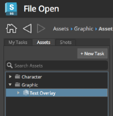

# 파이프라인 구성 편집
이 안내서를 통해 다음과 같은 기본 사항을 익힐 수 있습니다.

* 특정 툴킷 앱의 구성 설정 찾기
* 설정 편집
* 구성 설정에서 확장할 수 있는 다른 기능 살펴보기

## 안내서 정보

이 안내서에서는 기존 파이프라인 구성 내에서 설정을 프로젝트 파이프라인의 요구 사항에 맞게 편집하는 방법에 대해 설명합니다. 첫 번째 안내서인 **[구성 시작하기](./advanced_config.md)**에서는 편집을 위해 파이프라인 구성을 준비하는 방법을 설명합니다. 편집 가능한 프로젝트 구성을 만드는 데 익숙하지 않다면 먼저 **구성 시작하기**를 전체적으로 검토하십시오.

기본 구성을 확장하는 방법으로  툴킷에서 파이프라인 워크플로우 내의 태스크를 커스터마이즈할 수 있습니다. 커스터마이즈의 간단한 예로, 하나 이상의 소프트웨어 패키지 내에서 툴킷 앱의 버튼을 활성화 또는 비활성화하여 사용자들이 툴킷의 기능과 상호 작용하는 방식을 변경할 수 있습니다. 툴킷은 독자적인 구성을 지원하므로 커스텀 워크플로우를 생성하고, 반복적이고 일상적인 태스크를 자동화하고, 후크를 수정하고, 툴킷 플랫폼에 커스텀 도구를 추가함으로써 더 스마트하고 빠르게 작업할 수 있습니다. 그러나  소프트웨어 통합을 통해서만 액세스할 수 있으며 일상적인 작업용으로는 아직 출시되지 않았습니다.

이 안내서의 연습을 통해  소프트웨어 통합 내에서 구성 설정 제어 액션을 찾는 방법과 설정이 존재하는 위치, 설정을 편집하는 방법을 익힐 수 있습니다. 특히 Maya 내에서 프로젝트 작업 중에 아티스트가 새 태스크를 생성하지 못하도록 **+새 태스크**(+New Task) 버튼의 동작을 관리하는 Workfiles 앱의 설정을 편집해 보겠습니다.

## 이 문서 사용

이 안내서를 사용하고 파이프라인 구성에 대한 편집을 수행하려면 다음이 필요합니다.

1. 활성 [](https://www.shotgridsoftware.com/signup/?utm_source=autodesk.com&utm_medium=referral&utm_campaign=creative-project-management) 사이트
2. 하나 이상의 에셋이 있는 프로젝트. 첫 번째 안내서에서 생성한 the_other_side 프로젝트에 에셋을 추가할 수 있습니다. [구성 시작하기](./advanced_config.md) 안내서에서 프로젝트의 에셋을 생성하는 방법을 익힐 수 있습니다.
3. 식별된 프로젝트에 대한 파이프라인 구성이나 [구성 시작하기](./advanced_config.md) 안내서를 완료하고 해당 연습에서 생성한 구성을 사용합니다.
4. 파이프라인 구성이 저장된 파일 시스템에 대해 읽기 및 쓰기 권한을 적절하게 설정합니다.
5.  데스크톱이 시스템에 설치되어 있어야 합니다.
6. 활성 상태의 Maya 서브스크립션. Maya의 30일 체험판은 [여기](https://www.autodesk.co.kr/products/maya/free-trial)에서 구할 수 있습니다.



## Workfiles 앱 정보

Workfiles 앱은  소프트웨어 통합에서 파일 관리를 제어하고, 작업 파일을 검색하고 열고 저장하는 기능에 대한 액세스를 제어합니다. **+새 태스크(+New Task)** 버튼은 사용자가 이 작업을 수행하기 위해 로 이동할 필요 없이 태스크를 추가할 수 있게 해 주는 Workfiles 앱의 동작입니다. 구성은 환경별 파일로 나뉩니다. 이를 통해 파일을 생성하고, 파일에 이름을 지정하고, 파일을 저장하는 시기 또는 태스크를 실행하거나 특정 기능을 수행하는 시기를 제어하는 등 파이프라인의 여러 단계와 관련된 기능을 관리할 수 있습니다. 이러한 구성은 Workfiles 앱의 모든 기능과 연관되며 앱 또는 엔진의 설정을 수정할 때도 적용됩니다. 자세한 내용은 이 문서의 끝부분에 있는 [고급 항목](#advanced-topics)을 참조하십시오.

## 구성 파일 익히기

의 파이프라인 구성 목록을 사용하여 작업 중인 프로젝트의 파이프라인 구성이 저장된 위치를 찾을 수 있습니다. 저장된 위치를 아는 경우 <a href="#step5">5단계</a>로 건너뛸 수 있습니다.

## 파이프라인 구성 찾기

**1단계:** 이 연습에서 사용하게 될 프로젝트를 관리하는 ** 사이트**를 엽니다.

**2단계:** ** 사이트**의 **프로젝트 페이지**에서 프로젝트를 선택하여 액세스합니다.


**3단계:** 오른쪽 상단에 있는 **아바타**를 선택하여 **관리자**(ADMIN) 메뉴를 표시하고 아래로 스크롤하여 **기본 레이아웃(Default Layouts) > 파이프라인 구성(Pipeline Configuration) > 파이프라인 구성 목록(Pipeline Configuration List)**을 선택합니다.


**4단계:** **파이프라인 구성 목록**(Pipeline Configuration List)이 표시되면 열 헤더 맨 오른쪽의 **+** 기호를 선택하여 다른 열을 추가합니다. 드롭다운 목록에서 적절한 운영 체제 경로를 선택합니다.


경로가 새 필드에 표시됩니다.


**5단계:** 터미널 또는 파일 관리자에서 프로젝트의 파이프라인 구성이 저장된 폴더를 찾아 폴더를 엽니다.

툴킷 구성 루트 폴더에는 **cache**, **config** 및 **install**이라는 3개의 하위 폴더가 있습니다. **config** 폴더를 열면 몇 개의 하위 폴더와 파일이 중첩되어 있음을 확인할 수 있습니다.


**env** 폴더는 아티스트가 작업하는 환경을 지원하는 통합 설정을 저장합니다. 환경을 통해 파이프라인의 여러 단계에서 구성을 커스터마이즈할 수 있습니다. 기본 구성이 일련의 미리 정의된 환경과 함께 제공되지만 이 구성은 파이프라인을 더 세부적으로 설정하기 위해 수정할 수 있습니다.

**6단계:** **env** 폴더를 엽니다.

툴킷은 YAML 파일을 사용하여 기능을 구성합니다. YAML은 툴킷 내의 파일 형식을 읽기 쉽고 간단하고 단순한 방식으로 커스터마이즈할 수 있기 때문에 YAML이 구성 언어로 선택되었습니다. YAML에 대한 자세한 내용은 [여기](https://yaml.org/)를 참조하십시오. 구성은 식별자 엔진, 앱 및 프레임워크를 제공하는 중첩된 YAML 파일로 구성됩니다. 구성은 적용할 액션을 제어하는 특정 코드 번들로 안내하는 일종의 로드맵입니다.

## 구성 파일 편집

 툴킷을 통해 다양한 소프트웨어 패키지 내에 통합된 앱으로 변경할 수 있습니다. Workfiles 앱의 기능 중 하나는 **+새 태스크**(+New Task) 버튼으로, 사용자가 **파일 열기**(File Open) 대화상자에서 새 태스크를 추가할 수 있게 해 줍니다. 기본적으로 이 기능은 모든 사용자에 대해 프로젝트의 모든 진행단계에서 활성화되어 있습니다. 그러나 이 기능을 제한하고 싶은 스튜디오도 있을 수 있습니다. 특정 명명 규칙이 있거나 프로젝트의 프로덕션 관리 팀만 태스크를 생성할 수 있도록 제한하려는 경우에 그렇습니다. 이 경우 아티스트가 Maya에서 작업할 파이프라인의 모든 지점에 대해 **+새 태스크**(+New Task) 버튼을 비활성화하면 됩니다.

## Maya에서 프로젝트에 대해 +새 태스크(+New Task) 버튼 비활성화

**7단계:** ** 데스크톱**을 엽니다.

**8단계:** 편집할 구성의 프로젝트를 선택합니다.


**9단계:**  데스크톱에서 Maya를 시작합니다.


**** 메뉴가 완전히 로드될 때까지 기다립니다. 인터넷 연결 속도가 느릴 경우 메뉴가 로드되는 동안 커피 한 잔 준비하는 것도 좋습니다.

Maya와 가 완전히 로드되면 **파일 열기(File Open)** 대화상자가 자동으로 열립니다.  데스크톱에서 Maya를 실행하면 **프로젝트** 환경에서 Maya가 시작되고 툴킷 워크플로우의 구성이 `config/env/project.yml` 파일에 의해 구동됩니다. 기본 구성에서 식별되는 환경은 `project`, `sequence`, `shot`, `shot_step`, `asset`, `asset_step`입니다.

**10단계:** **파일 열기**(File Open) 대화상자의 왼쪽 창에서 **에셋**(Assets) 탭을 선택합니다. 검색 결과에 표시되는 폴더 내의 모든 에셋을 선택합니다.



**+새 태스크**(+New Task) 버튼이 활성화되어 있습니다.

## +새 태스크(+New Task) 버튼을 제어하는 설정 찾기

파이프라인 요구 사항을 충족하기 위해 툴킷 파이프라인 구성을 사용하여 사용자 환경을 커스터마이즈할 수 있습니다. 파이프라인 구성은 프로젝트 파이프라인의 요구 사항에 맞게 필요에 따라 기본  통합 설정을 재정의할 수 있습니다.  코어 코드의 기본값과 다른 설정만 추가하여 구성을 간단하게 생성할 수 있는 구조입니다. 이 연습에서는 Workfiles 앱의 **+새 태스크**(+New Task) 버튼을 사용할 수 없게 할 예정이지만 그전에 이 버튼을 제어하는 구성 설정을 확인해야 합니다.

**11단계:** **프로젝트(프로젝트 이름)**(Project(프로젝트 이름)) 옆에 있는 **파일 열기**(File Open) 창의 오른쪽 상단에서 **>**를 선택합니다.

이 참조 상자는 **파일 열기**(File Open) 창의 기능을 제어하는 구성 설정에 대한 상세한 정보를 보여 줍니다. 툴킷의 일부 앱에는 앱에 사용된 설정과 기본 설정을 보여 주는 참조 상자가 있습니다. **위치:**(Location:) 식별자는 **tk-multi-workfiles2**입니다. 이 식별자는 Workfiles 앱을 만드는 코드 번들의 식별자입니다. 파이프라인 구성을 검색할 때 이 이름으로 앱의 설정이 있는 위치를 확인할 수 있습니다.  통합에서 사용할 수 있는 모든 구성 설정, 앱 및 엔진이 나열된 [앱 및 엔진 페이지](https://support.shotgunsoftware.com/hc/ko/articles/219039798-Integrations-Apps-and-Engines)가 있습니다.


이 특정 환경에 대한 설정을 찾으려면 **구성**(Configuration) 헤더 아래를 확인하십시오.




설정 **allow_task_creation**까지 아래로 스크롤합니다. 이 설정의 기본값은 **True**이므로 사용자가 Maya 프로젝트 환경에 있는 동안 새 태스크를 생성할 수 있습니다.


설정을 검색할 때 다음 사항을 고려해야 합니다.

* 실행 중인 소프트웨어 응용프로그램
* 작업 중인 파일과 환경. 이 부분은 앱의 참조 상자에서 확인할 수 있습니다.
* 호출되는 설정. 이 부분은 앱의 참조 상자 또는 [앱 및 엔진 페이지](https://support.shotgunsoftware.com/hc/ko/articles/219039798-Integrations-Apps-and-Engines)에서 확인할 수 있습니다.
* 확장할 YAML 파일. YAML 파일에 자세히 나와 있는 식별자와 로드맵으로 설정이 있는 위치를 확인할 수 있습니다.
* 확장할 YAML 파일 내의 특정 블록. 이는 로드맵에서 확인할 수 있습니다.
* YAML 파일에서 사용되는 식별자 및 기호.
* 현재 프로젝트의 구성이 저장된 위치(가장 중요).

설정은 파이프라인 구성 내의 여러 곳에서 활용될 수 있습니다. 적용할 소프트웨어 통합 및 변경할 파이프라인 프로세스에 따라 활용 방법이 결정됩니다.

## `allow_task_creation` 값을 설정할 위치 찾기

**12단계:** 기본 Maya 창을 앞으로 가져옵니다.

**13단계:** Maya 창의 오른쪽 상단에서 **** 메뉴 항목을 찾습니다.


**팁:** 메뉴가 표시되지 않을 경우 일부 숨겨진 메뉴 항목을 볼 수 있는 **>>**가 표시됩니다. **>>**를 선택하여  메뉴를 표시하거나 Maya 창을 넓히면 됩니다.

**14단계:** 메뉴 오른쪽 상단에서 ** > 프로젝트 the_other_side(Project the_other_side) > 작업 영역 정보…(Work Area Info…)**를 선택합니다.


**작업 영역 정보**(Work Area Info) 대화상자에는 현재 작업 영역이 어떻게 돌아가는지 및 상세 정보가 표시됩니다. 여기에는 작업 중인 환경 및 설정이 위치한 환경 구성 파일의 경로도 포함됩니다.

**15단계:** **현재 작업 영역**(Your Current Work Area) 대화상자에서 아래에 있는 **환경**(Environment) 탭을 선택합니다.

첫 번째 항목에서 사용 중인 엔진이 확인됩니다. 엔진은 특정 소프트웨어 응용프로그램 내에서  도구를 통합하는 기능을 구동합니다. 여기에는 각 소프트웨어 통합에 해당하는 로직이 포함됩니다. 창에 표시된 두 번째 항목은 현재 프로젝트 환경이 위치한 경로를 보여 줍니다.


마지막 두 폴더는 `project.yml`이고 그 다음에 `config/env/`이 표시됩니다. `project.yml` 파일은 현재 환경에 대한 설정이 있는 위치를 안내하는 로드맵의 시작입니다.

**16단계:** 즐겨 사용하는 텍스트 편집기에서 `project.yml`을 엽니다.

```yaml
description: Apps and Engines when launching with a project only context.

################################################################################

includes:
- ./includes/frameworks.yml
- ./includes/settings/tk-3dsmaxplus.yml
- ./includes/settings/tk-desktop.yml
- ./includes/settings/tk-flame.yml
- ./includes/settings/tk-houdini.yml
- ./includes/settings/tk-mari.yml
- ./includes/settings/tk-maya.yml
- ./includes/settings/tk-motionbuilder.yml
- ./includes/settings/tk-nuke.yml
- ./includes/settings/tk-photoshopcc.yml
- ./includes/settings/tk-shell.yml
- ./includes/settings/tk-shotgun.yml

################################################################################
# configuration for all engines to load in a project context

engines:
  tk-3dsmaxplus: "@settings.tk-3dsmaxplus.project"
  tk-desktop: "@settings.tk-desktop.project"
  tk-flame: "@settings.tk-flame.project"
  tk-hiero: "@settings.tk-nuke.hiero.project"
  tk-houdini: "@settings.tk-houdini.project"
  tk-mari: "@settings.tk-mari.project"
  tk-maya: "@settings.tk-maya.project"
  tk-motionbuilder: "@settings.tk-motionbuilder.project"
  tk-nuke: "@settings.tk-nuke.project"
  tk-nukestudio: "@settings.tk-nuke.nukestudio.project"
  tk-photoshopcc: "@settings.tk-photoshopcc.project"
  tk-shell: "@settings.tk-shell.project"
  tk-shotgun: "@settings.tk-shotgun.project"

################################################################################
# reference all of the common frameworks

frameworks: "@frameworks"

```

<!---->

`project.yml` 내에는 설명 아래 세 가지 섹션 `includes`, `engines` 및 `frameworks`가 있습니다. `includes` 섹션은 구성에서 다른 YAML 파일을 *참조*하는 파일 포인터의 목록입니다. 기본 구성의 아키텍처에서는 파일을 간단하게 유지하기 위한 또 다른 방법으로 파일 중첩 및 포인터를 활용합니다. **includes**를 따라가면 원하는 구성 설정을 찾을 때까지 다음 파일로 이동합니다. 이는 적절한 구성 설정을 찾을 때까지 계속해서 내부에 포개진 인형이 하나씩 열리는 러시아 마트료시카 인형과 비슷합니다.

모든 엔진은 `tk-<name of software application>`으로 식별됩니다. Maya에서 설정을 적용하려고 하므로 찾아야 할 식별자는 `tk-maya`입니다.

`project.yml` 파일의 `includes:` 섹션에서 `./includes/settings/tk-maya.yml` 행을 찾습니다. 이 행은 **settings** 폴더 내의 **includes** 폴더에 중첩된, Maya 엔진의 **설정**을 제어하는 구성 `tk-maya`를 나타냅니다.

`engines:` 섹션에서 `tk-maya` 값을 찾습니다.

`tk-maya: "@settings.tk-maya.project"`

이 `@` 기호는 값이 포함된 파일에서 제공되었음을 나타냅니다.

`settings` 및 `project`는 프로젝트의 설정임을 나타냅니다. 이는 식별하는 데 도움이 되는 기본 구성 내의 명명 규칙입니다.

이 전체 행은 Maya 엔진의 구성 설정인 `tk-maya`를 찾기 위해 포함된 파일에서 `settings.tk-maya.project` 블록을 찾는다는 것을 나타냅니다.

 툴킷은 YAML 파일에서 간단한 용어를 사용하여 설정의 이름과 설정으로 이동하는 경로를 나타냅니다. **+새 태스크**(+New Task) 버튼 수행 방식을 제어하는 코드 번들이 `tk-multi-workfiles2`로 식별되는 것은 Maya **파일 열기**(File Open) 참조 상자를 볼 때 이미 알고 있습니다. 툴킷 번들은 이러한 식별자를 사용하여 YAML 파일에서 참조됩니다. ‘tk-multi-workfiles2’는 Workfiles 앱 코드 번들의 식별자이며 **+새 태스크**(+New Task) 버튼은 Workfiles 앱의 기능입니다.

tk-maya.yml에서 Workfiles 앱 설정 찾기

**17단계:** 파일 브라우저에서 **env/includes/settings** 폴더를 찾아 `tk-maya.yml`을 엽니다.


**18단계:** `project.yml`에서 include를 따라가면서 `tk-maya.yml` 파일에서 `settings.tk-maya.project`를 찾습니다. 구체적으로는 특정 프로젝트의 프로젝트 환경에서 **+새 태스크** (+New Task) 버튼을 비활성화하려고 합니다. 현재 해당 프로젝트에 대한 구성에 있으며 프로젝트 환경에 있는 동안 위치 정보를 얻었습니다.

```yaml
# project
settings.tk-maya.project:
  apps:
    tk-multi-about:
      location: "@apps.tk-multi-about.location"
    tk-multi-screeningroom: "@settings.tk-multi-screeningroom.rv"
    tk-multi-shotgunpanel: "@settings.tk-multi-shotgunpanel"
    tk-multi-workfiles2: "@settings.tk-multi-workfiles2.launch_at_startup"
  menu_favourites:
  - {app_instance: tk-multi-workfiles2, name: File Open...}
  location: "@engines.tk-maya.location"
```

<!---->

`settings.tk-maya.projects` 아래에 `tk-multi-workfiles2` 앱 설정이 다음과 같이 나열됩니다.

`tk-multi-workfiles2: "@settings.tk-multi-workfiles2.launch_at_startup"`

`@` 기호는 `tk-multi-workfiles2` 값이 포함된 파일에서 제공된 것임을 나타냅니다. `tk-maya.yml`의 맨 위에 있는 `includes` 섹션에서 다음을 확인할 수 있습니다.

```yaml
includes:
...
- ./tk-multi-workfiles2.yml
```

현재 파일 `config/env/includes/settings`와 동일한 디렉토리에 있는 `tk-multi-workfiles2.yml` 파일에서 `settings.tk-multi-workfiles2.launch_at_startup`을 찾아야 합니다.

**19단계:** `tk-multi-workfiles2.yml` 파일을 열고 `settings.tk-multi-workfiles2.launch_at_startup`을 찾습니다.

```yaml
# launches at startup.
settings.tk-multi-workfiles2.launch_at_startup:
  launch_at_startup: true
  entities:
```

<!---->

`allow_task_creation` 설정을 나타내는 Maya 참조 상자에서 기본값은 `true`입니다. 가장 좋은 방법은 파이프라인 구성에 기본 설정을 반영하지 않는 것입니다. 이렇게 하면 **스파스** 형식이 허용되어 기본 코드와 다른 설정만 구성에 추가됩니다. 설정이 명시적으로 제공되지 않는 경우 해당 설정이 액세스하는 모든 호출이 기본값을 받습니다. 툴킷이 구성을 읽고 환경을 빌드하면 해당 환경에서 실행되는 앱, 엔진 및 프레임워크는 해당 프로젝트의 파이프라인 구성 설정을 사용하고 구성에 있는 항목을 기반으로 모든 기본 설정을 재정의합니다.

**20단계:** `tk-multi-workfiles2.yml`에서 `settings.tk-multi-workfiles2.launch_at_startup:` 아래 `allow_task_creation`을 추가하고 값을 `false`로 설정합니다.

```yaml
# launches at startup.
settings.tk-multi-workfiles2.launch_at_startup:
  allow_task_creation: false
  launch_at_startup: true
  entities:
```

<!---->

**참고:** 툴킷 기본 구성 설정은 특정 설정을 찾기 쉽도록 알파벳순으로 구성됩니다. 이 규칙을 유지해야 구성이 복잡해질 경우에도 처리하기가 편리합니다.

**21단계:** 파일을 저장합니다.

## 구성 다시 로드

**22단계:** Maya 내의 **파일 열기**(File Open) 대화상자에서 참조 상자를 열고 **엔진 및 앱 다시 로드**(Reload Engines and Apps)를 선택합니다.


그러면 구성 설정이 다시 로드됩니다.

## 변경 사항 보기

**23단계:** **파일 열기**(File Open) 대화상자로 이동하여 에셋을 선택합니다.


**+새 태스크**(+New Task) 버튼이 표시되지 않습니다.

Workfiles 앱의 구성 설정을 수정하여 프로젝트 환경의 버튼 동작을 변경했습니다. 이 프로젝트 환경의 해당 설정만 수정했기 때문에 다른 환경에서 작업을 시작하면 **+새 태스크**(+New Task) 버튼에 대한 설정은 여전히 활성 상태입니다. 예를 들어 실제 프로덕션에서 *모든*환경에 대해 지금처럼 변경할 수 있습니다.

## 환경 변경

**24단계:** 에셋(Assets) 검색 결과에서 폴더를 열고 작업할 에셋을 선택합니다.


**25단계:** **+새 파일**(+New File)을 선택합니다.

**+새 파일**(+New File)을 선택하여 새 에셋에 대한 작업을 시작했으며 Maya에서 `asset_step` 환경이 로드되었습니다. 아티스트가 에셋 태스크를 선택하고 새 파일을 생성하거나 기존 파일을 열면 `asset_step` 환경이 자동으로 로드되어 파이프라인의 해당 단계에 구성된 도구 및 기능이 제공됩니다.

## 작업 중인 환경 검색

**26단계:** Maya 메뉴 오른쪽 상단에서 ****를 선택합니다.


**아트, 에셋**(Art, Asset)은 지금 작업 중이라는 것과 현재 환경을 알려 줍니다.

**27단계:** **아트, 에셋((Art, Asset) > 작업 영역 정보…(Work Area Info…)**를 선택하여 현재 작업 영역에 어떤 매개변수가 있는지 표시합니다.

**28단계:** 아래에 있는 **환경**(Environment) 탭을 선택합니다.


각 환경은 파이프라인 구성에서 설정이 있는 위치를 확인할 수 있도록 필요한 정보를 표시합니다. 아티스트가 새 태스크를 추가하지 않도록 하려면 아티스트가 작업하는 모든 환경에 대해 **+새 태스크**(+New Task) 버튼을 비활성화해야 합니다. 각 환경에 대해 위에 설명한 것과 동일한 단계를 사용하여 적절하게 구성을 편집합니다.

참고: 각 환경은 독립적이며 프로젝트는 전용 구성을 사용하고 소프트웨어 통합은 프로젝트가 로드될 때 파이프라인 구성에서 해당 특정 소프트웨어의 설정만 읽습니다.

지금까지 파이프라인 구성을 편집하여 앱 설정을 변경했습니다. 이제 본격적으로  툴킷 환경에서 수행할 수 있는 모든 작업에 대해 알아보겠습니다. 다음은 살펴볼 몇 가지 고급 항목입니다.

## 고급 항목

이 안내서에서는 단일 엔진(`tk-maya`) 및 단일 환경(`project`)에서 앱의 구성 설정을 간단하게 변경했습니다. 툴킷은 환경별로 구성되고, 모든 소프트웨어 구현에 있어 각 환경은 고유하며, 정의된 파이프라인 지점에서 아티스트가 특정 기능을 사용할 수 있도록 프로젝트 및 태스크별로 초점을 맞추는 것에 대해 학습했습니다. 간단한 변경 사항을 일반화하면 툴킷 파이프라인 구성을 얼마든지 커스터마이즈할 수 있습니다.

### 기타 엔진

Workfiles 앱의 시스템 이름은 `tk-multi-workfiles2`이고 여기서 `multi`는 이 앱이 **다중 앱**임을 암시합니다. 다중 앱은 소프트웨어에 구속받지 않는 앱으로, Maya, Nuke, Houdini에서 실행하든 기타 지원되는 앱에서 실행하든 앱의 기능이 동일합니다. 모든 소프트웨어 패키지의 Workfiles에서 태스크 생성을 비활성화하려면 모든 **엔진**(`tk-nuke`, `tk-houdini` 등)에 대해 이 안내서의 단계를 수행합니다.

### 기타 환경

여기서는 프로젝트 환경에서 태스크 생성을 비활성화했지만 실제 스튜디오 환경에서는 아티스트가 작업 중인 모든 환경에 대해 태스크 생성을 비활성화하고 싶을 수 있습니다. 이를 위해서는 안내서의 단계를 수행하되 `project.yml`에서 시작하는 대신 `asset_step.yml`, `shot_step.yml` 등에서 시작합니다.

### 커스텀 환경 생성

기본 구성은 일련의 미리 정의된 파이프라인 단계(`project`, `sequence`, `shot`, `shot_step`, `asset` 및 `asset_step`)와 함께 제공됩니다. 그러나 스튜디오에서는 파이프라인 단계(`asset_step_rig`, `asset_step_model`, `shot_step_anim`, `shot_step_light` 등)마다 다른 구성 설정을 원할 수 있습니다. 툴킷은 커스텀 환경을 지원합니다. 자세한 내용은 [환경 구성 참조의 "커스텀 환경" 섹션](../../../reference/pipeline-integrations/env-config-ref.md#custom-environments)을 참조하십시오.

### 비디오 리소스

* SIGGRAPH 2018 Developer Day의 [툴킷 구성 소개](https://www.youtube.com/watch?v=7qZfy7KXXX0&t=1961s)
* [기본 구성 이해 웨비나](https://www.youtube.com/watch?v=eKHaC1dZCeE)

앱 구성 설정을 수정하는 방법에 대해 알아보았습니다. 이제 [툴킷 구성에 앱을 추가](installing_app.md)해 보십시오.
