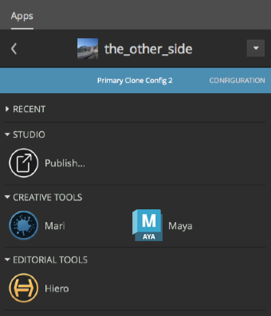

# 앱 추가

이 안내서를 마치면 툴킷의 구성 관리 도구를 간단히 익히고 다음과 같은 작업을 수행하는 방법을 익힐 수 있습니다.

* 활성 파이프라인 구성의 복사본을 안전하게 생성
* 앱을 구성에 추가
* 특정 환경에서 앱을 사용하는 데 필요한 설정 추가
* 활성 구성에 변경 사항 다시 적용

## 안내서 정보

이 안내서에서는 Shotgun 툴킷 앱을 기존 파이프라인 구성에 추가하는 방법을 살펴보고 구성 관리 도구에 대해 간단히 알아보겠습니다.

여기서 추가할 앱은 Shotgun Python 콘솔 앱입니다. Maya에는 자체 Python 콘솔이 있지만 이 툴킷 앱에는 Maya 콘솔에 없는 일부 기능이 있습니다.

이 안내서에서는 [파이프라인 구성 편집](./editing_app_setting.md)안내서에서 생성한 파이프라인 구성을 활용합니다. 이 안내서를 완료하지 않았다면 기존 파이프라인 구성을 사용하여 앱을 추가할 수 있습니다.

## 이 문서 사용

이 안내서를 사용하고 툴킷 앱을 설치하려면 다음이 필요합니다.

1. 유효한 [Shotgun](https://www.shotgunsoftware.com/kr/signup/) 사이트.
2. 지정한 프로젝트에 대한 파이프라인 구성. 또는 [구성 시작하기 안내서](./advanced_config.md)의 연습에서 생성한 구성을 사용하십시오.
3. 파이프라인 구성이 저장된 파일 시스템에 대해 읽기 및 쓰기 권한을 적절하게 설정합니다.
4. Shotgun 데스크톱이 시스템에 설치되어 있어야 합니다.
5. 활성 상태의 Maya 멤버쉽. [여기](https://www.autodesk.co.kr/products/maya/free-trial)에서 Maya 30일 체험판을 다운로드하십시오.



## Shotgun 툴킷 앱 정보

### Toolkit 앱의 작동 방식

파이프라인 구성에서 참조하는 앱은 다양한 위치에서 가져온 것일 수 있습니다. 기본 구성에서 표준인 앱은 Shotgun 앱 스토어에서 가져온 것입니다. 파이프라인 구성의 파일은 툴킷에 "주소록에서 Python 콘솔 앱의 주소를 찾아줄래?"라고 묻는 것처럼 Shotgun 통합이 앱에 액세스하는 방법을 지정합니다. 파이프라인 구성 파일은 툴킷에 특정 앱에 활용되는 코드의 번들을 찾는 위치를 알려줍니다.

기본 구성에서 툴킷 앱의 "주소"는 `config/env/includes/app_locations.yml` 파일에 나열되어 있으며 코드를 찾는 위치를 지정합니다. 이러한 "주소"를 [디스크립터](https://developer.shotgunsoftware.com/tk-core/descriptor.html)라고 합니다. Shotgun 통합은 앱에 대한 코드 번들을 찾는 위치뿐 아니라 앱을 사용하는 환경도 알아야 합니다.

다음은 앱 설치 방법과 Shotgun 통합에 앱을 사용하는 위치를 알리는 방법에 대한 개념적인 개요입니다. 여기서는 구성을 확장하고 툴킷에 디스크립터를 조회하도록 요청하고 Shotgun에 앱을 사용하는 위치를 알리는 단계를 간략하게 설명합니다. 이 안내서에서는 다음 단계를 자세히 살펴봅니다.

1. 추가하려는 앱의 디스크립터를 결정합니다.
2. 앱 디스크립터를 추가하려는 활성 파이프라인 구성의 복사본을 생성합니다.
3. 앱의 디스크립터가 구성에 존재하는지 확인하고, 존재하지 않는 경우 추가합니다.
4. 들여쓰기에 탭이 아니라 공백을 사용하여 YAML 파일의 서식을 올바르게 지정합니다.
5. 앱이 사용되는 환경을 결정합니다.
6. 이러한 환경 내에서 Shotgun이 앱을 사용할 수 있도록 허용하는 설정을 추가합니다.
7. 새 구성을 테스트합니다.
8. 확장된 구성을 라이브로 적용합니다.

### Python 콘솔 앱에 대한 위치 디스크립터 찾기

**1단계:** [앱 및 엔진 페이지](https://support.shotgunsoftware.com/hc/ko/articles/219039798-Applications-that-Toolkit-Integrates-with#tk-maya)를 열고 Maya에서 Shotgun Python 콘솔에 대한 정보를 찾습니다. 제목을 선택합니다.


그러면 주소록에 필요한 항목이 모두 포함된 [앱 관련 정보](https://support.shotgunsoftware.com/hc/ko/articles/219033108)가 표시됩니다.


**시스템 이름**이 주 식별자이며 `tk-multi-pythonconsole`입니다. 또한 **최신 버전:** v1.1.2도 필요합니다.

### Maya의 프로젝트 환경에서 Python 콘솔 앱이 없음을 확인

**2단계:** Maya를 실행하고 Shotgun 메뉴 **Shotgun > 프로젝트 the_other_side**(Project the_other_side)를 선택하면 프로젝트 환경에 해당 프로젝트에 사용할 수 있는 앱 목록이 표시됩니다.


## 구성 확장

프로덕션 단계에 적용된 구성을 편집하려면 복사본을 먼저 생성한 후 편집해야 합니다. 그러면 라이브 구성에 영향을 미치지 않고 편집한 구성을 라이브로 적용하기 전에 테스트할 수 있는 안전한 공간이 만들어집니다. 스테이징 샌드박스를 생성하면 현재 프로덕션에서 사용되는 파이프라인 구성의 복사본을 시험해 볼 수 있습니다. 샌드박스에서 구성의 복사본을 변경한 후 변경 사항을 프로덕션에 라이브로 적용하기 전에 테스트해 볼 수 있습니다.

파이프라인 구성을 복제하면 새 구성을 라이브 프로덕션에 적용하기 전에 복사본을 시험해 볼 수 있는 샌드박스를 구축하여 복사본 생성 프로세스를 자동화할 수 있습니다.

## 앱을 추가하려는 파이프라인 구성 복제

### 파이프라인 구성 목록으로 이동합니다.

**3단계:** Shotgun을 열고 오른쪽 위에서 **관리자(Admin) 메뉴(아바타) > 기본 레이아웃(Default Layouts) > 파이프라인 구성(Pipeline Configuration) > 파이프라인 구성 목록(Pipeline Configuration List)**을 선택합니다.


이렇게 하면 Shotgun 사이트의 파이프라인 구성이 모두 포함된 상세 목록이 표시됩니다.

**4단계:** 파이프라인 구성 목록이 표시되면 열 헤더의 맨 오른쪽에 있는 **+** 기호를 선택하고 **프로젝트**(Projects) 열을 추가합니다.


### 프로젝트 구성의 위치 리뷰

**5단계:** 또한, 운영 체제에 적합한 **경로**(Path) 필드를 추가합니다.


그러면 구성 파일의 경로가 표시됩니다.


**6단계:** **기본**(Primary) 행 항목 옆에 있는 빈 공간을 **마우스 오른쪽 버튼으로 클릭**하고 상황에 맞는 메뉴에서 **이 구성 복제…**(Clone this Configuration…)를 선택합니다.


**7단계:** 구성 목록의 구성과 디렉토리의 파일의 이름을 각각 "Primary Clone Config 2"와 "the_other_side_clone2"로 지정합니다. **확인**(OK)을 선택합니다.


구성에 포함된 모든 파일 및 폴더가 복사되고 앱에 대한 캐시가 생성될 때까지 기다립니다. 이제 앱을 사용할 수 있으므로 입에서 살살 녹는 크로아상과 함께 에스프레소를 마시면서 여유를 즐기십시오.


완료되면 구성 목록에 복제된 구성 관련 정보가 업데이트되고 새 구성이 로컬 구성 폴더에 추가됩니다.



## 복제된 구성을 프로젝트와 연결

**8단계:** Shotgun 데스크톱을 열고 복제된 구성을 생성한 프로젝트를 선택합니다. 오른쪽 위에 있는 **아래쪽 화살표**를 선택하여 이 프로젝트와 연결된 구성을 표시하고 방금 생성한 **Primary Clone Config 2**를 선택합니다.


Shotgun 데스크톱이 이제 이 프로젝트에 대해 복제된 구성을 사용합니다.

## 파이프라인 구성 편집

**9단계:** 파일 시스템에서 복제된 구성을 생성할 때 지정한 경로에서 해당 구성을 찾습니다. `config/env/includes/app_locations.yml` 파일을 봅니다.


`app_locations.yml` 파일이 기본 구성의 주소록이며 앱의 디스크립터가 이 파일에 나열되어 있습니다. 이 파일에 앱의 위치가 지정되며 이 파일을 사용하여 앱에 대한 설정을 생성할 수 있습니다.

사용하려는 앱이 이 주소록에서 참조되지 않을 경우 툴킷에 앱을 찾을 위치를 알려야 합니다.

## 툴킷에 앱을 찾을 위치 알리기

**10단계:** 파일에서 `pythonconsole`을 검색합니다. 프로젝트에 기본 구성을 사용한 경우 Python 콘솔 앱에 대한 디스크립터가 이 파일에 나열되어 있는 것을 볼 수 있습니다. 이 디스크립터는 이 과정을 시작할 때 살펴본 Maya 앱의 [목록](https://support.shotgunsoftware.com/hc/ko/articles/219039798-Integrations-Apps-and-Engines)에 있는 설명과 일치해야 합니다. 버전이 Maya 앱 목록에서 확인한 항목과 일치하는지 확인합니다.

```yaml
apps.tk-multi-pythonconsole.location:
	type: app_store
	name: tk-multi-pythonconsole
	version: v1.1.2

```



모든 앱과 엔진에는 디스크립터가 있습니다. [Core API 문서의 디스크립터 섹션](https://developer.shotgunsoftware.com/tk-core/descriptor.html#descriptor-types)에서 디스크립터의 작동 방식과 `type:`을 설정하는 방법을 확인할 수 있습니다.

## 툴킷에 디스크립터를 사용하도록 지시

이제 Maya의 프로젝트 환경에 있는 동안 툴킷에 디스크립터를 사용하여 Python 콘솔 앱을 찾아 사용하도록 지시해야 합니다.

**11단계:** 복제된 구성에서 `config/env/project.yml` 파일을 열고 `tk-maya` 엔진에 대한 설정을 찾습니다.

```yaml
# configuration for all engines to load in a project context

engines:
  tk-3dsmaxplus: "@settings.tk-3dsmaxplus.project"
  tk-desktop: "@settings.tk-desktop.project"
  tk-flame: "@settings.tk-flame.project"
  tk-hiero: "@settings.tk-nuke.hiero.project"
  tk-houdini: "@settings.tk-houdini.project"
  tk-mari: "@settings.tk-mari.project"
  tk-maya: "@settings.tk-maya.project"
  tk-motionbuilder: "@settings.tk-motionbuilder.project"
  tk-nuke: "@settings.tk-nuke.project"
  tk-nukestudio: "@settings.tk-nuke.nukestudio.project"
  tk-photoshopcc: "@settings.tk-photoshopcc.project"
  tk-shell: "@settings.tk-shell.project"
  tk-shotgun: "@settings.tk-shotgun.project"

```

`@settings`를 사용하는 `tk-maya: “@settings.tk-maya.project”` 행은 설정이 포함된 파일에 있음을 나타냅니다. `tk-maya`는 Maya 엔진을 나타내고 `project`는 환경을 나타냅니다.

### YAML 파일

Shotgun 툴킷 파이프라인 구성은 [YAML](https://yaml.org/spec/1.2/spec.html) 파일에서 단순한 용어를 사용하여 앱과 엔진의 위치와 해당 설정을 식별합니다.

이 블록에서

* `settings`는 기본 구성에 대해 설정 폴더의 참조로 선택된 항목입니다.
* `project`는 기본 구성에 대해 프로젝트 환경의 참조로 선택된 항목입니다.
* `tk-maya`는 Maya에 대한 툴킷 엔진의 식별자입니다.
* `@`은 설정 값을 포함된 파일에서 가져온다는 것을 나타내는 데 사용되는 툴킷 용어입니다.

YAML 파일은 Shotgun 통합으로 통하는 창입니다. 이 파일을 사용하면 파이프라인의 요구사항을 충족하는 작업 환경을 더욱 손쉽게 구성할 수 있습니다.

### 구성이 툴킷 번들을 참조하는 방식

Shotgun 통합의 코드는 앱, 엔진 및 프레임워크에 대한 번들로 구성됩니다. 번들은 툴킷의 YAML 파일에서 `tk-maya`, `tk-multi-pythonconsole` 등과 같은 식별자로 참조됩니다. YAML에서 각 번들에 해당하는 블록에는 식별된 번들의 액세스 및 활용 방식을 제어하는 설정이 포함됩니다.

## Python 콘솔에 대한 설정을 추가할 위치

기본 구성의 이 블록에서 'tk-maya.project'는 프로젝트 환경에서 Maya 엔진을 나타내는 식별자입니다. 여기서 목표는 Python 콘솔 앱 코드 번들을 프로젝트 환경의 Maya 엔진에 추가하는 것입니다. 사용된 용어를 보면 `tk-maya.yml`은 프로젝트 환경의 설정이 위치한 YAML 파일의 이름입니다. `tk-maya.yml` 파일에서 `apps`에 대한 `settings.tk-maya.project`를 찾습니다.

**13단계:** 파일을 찾기 위해 엔진 위에 있는 includes 섹션에서 `tk-maya.yml`을 찾습니다.

`./includes/settings/tk-maya.yml`

**14단계:** 복제된 구성에서 텍스트 편집기로 `config/env/includes/settings/tk-maya.yml`을 열고 `settings.tk-maya.project`를 검색합니다.


**15단계:** 다음 아래에 위치 디스크립터를 추가합니다.

```yaml
settings.tk-maya.project:
  apps:
```

위치 디스크립터를 추가하는 방법에 대한 가이드로 `about` 앱인 `tk-multi-about:`을 사용한 후 파일을 저장합니다.



```yaml
# project
settings.tk-maya.project:
  apps:
    tk-multi-about:
      location: "@apps.tk-multi-about.location"
    tk-multi-pythonconsole:
      location: "@apps.tk-multi-pythonconsole.location"
    tk-multi-screeningroom: "@settings.tk-multi-screeningroom.rv"
    tk-multi-shotgunpanel: "@settings.tk-multi-shotgunpanel"
    tk-multi-workfiles2: "@settings.tk-multi-workfiles2.launch_at_startup"
```

**Screening Room, Shotgun 패널 및 Workfiles2** 앱의 위치 식별자가 포함된 다른 파일에 나열되어 있고 **About** 앱과 다르게 액세스되는 것을 알 수 있습니다. 이러한 앱에는 추가 설정이 있으므로 정리를 위해 포함된 설정 폴더로 분리되었습니다.



## Maya에서 변경 사항 보기

**16단계:** Shotgun 데스크톱을 열고 작업하는 프로젝트를 선택한 후 복제된 구성을 사용하고 있는지 확인합니다.

프로젝트 이름 아래, 생성된 복제본의 이름에 파란색 막대가 표시됩니다.





**17단계:** 데스크톱에서 Maya를 실행하고 **Shotgun > 프로젝트(Project) > …** 메뉴를 선택합니다.

다음에 해당하는 경우:

* 방금 편집한 복제된 구성을 사용합니다.
* 복제된 구성이 올바르게 확장되었습니다.
* 확장된 파일을 저장했습니다.
* 복제된 구성과 프로젝트를 연결했습니다.
* Shotgun 데스크톱에서 Maya를 다시 실행했습니다.

Python 콘솔 앱을 Maya에서 사용할 수 있습니다.


## 변경 사항을 프로덕션에 적용

Python 콘솔 앱이 올바르게 추가된 것을 확인하고 나면 변경 사항을 라이브로 적용할 수 있습니다.

**18단계:** 터미널을 열고 복제된 구성이 저장된 위치를 찾습니다. 복제된 구성의 루트 폴더에서 다음 명령을 실행합니다.

Linux 또는 Mac:

`./tank push_configuration`

Windows:

`tank.bat push_configuration`

프롬프트에 따라 변경 사항을 적용하려는 구성인 프로젝트 기본 구성의 ID를 입력합니다.

```

$ ls
cache		config		install		tank		tank.bat
$ ./tank push_configuration

Welcome to the Shotgun Pipeline Toolkit!
For documentation, see https://support.shotgunsoftware.com
Starting Toolkit for your current path
'/Users/michelle/Documents/Shotgun/configs/the_other_side_clone2'
- The path is not associated with any Shotgun object.
- Falling back on default project settings.
- Running as user 'Michelle'
- Using configuration 'Primary Clone Config 2' and Core v0.18.159
- Setting the Context to Project the_other_side.
- Running command push_configuration...


----------------------------------------------------------------------
Command: Push configuration
----------------------------------------------------------------------

This command will push the configuration in the current pipeline configuration
('Primary Clone Config 2') to another pipeline configuration in the project.
By default, the data will be copied to the target config folder. If pass a
--symlink parameter, it will create a symlink instead.

Your existing configuration will be backed up.

The following pipeline configurations are available to push to:
 - [1] Primary (/Users/michelle/Documents/Shotgun/configs/the_other_side)

Please type in the id of the configuration to push to (ENTER to exit):

```

복제된 구성을 적용할 수 있는 사용 가능한 파이프라인 구성 목록이 표시됩니다. 구성을 업데이트하려는 프로젝트에 대한 기본 파이프라인 구성의 ID를 입력합니다.




ID를 입력하면 Shotgun에서 다음 작업을 수행합니다.

* 기본 구성 백업
* 복제된 구성 복사
* 복제본을 그대로 둔 상태로 복제된 구성의 복사본을 프로젝트와 연결
* 기본 구성이 저장된 위치 표시
* 다운로드하고 캐시해야 할 앱이 있는지 여부 확인

```
Please type in the id of the configuration to push to (ENTER to exit): 1
Hold on, pushing config…
Your old configuration has been backed up into the following folder:
/Users/michelle/Documents/Shotgun/configs/the_other_side/config.bak.20190118_111627
Checking if there are any apps that need downloading…

Push Complete!
```

## 기본 구성에서 수행한 변경 사항 표시

**19단계:** Shotgun 데스크톱의 오른쪽 위에 있는 화살표를 클릭하고 **구성**(CONFIGURATION) 목록에서 **기본**(Primary)을 선택합니다.


**20단계:** 데스크톱에서 Maya를 실행하고 **Shotgun > 프로젝트(Project) > …** 메뉴에서 Shotgun Python 콘솔...(Shotgun Python Console...)을 찾습니다.


Python 콘솔 앱이 선택한 프로젝트의 프로젝트 환경에 추가되었습니다. 두 번째 안내서인 "[구성 편집](./editing_app_setting.md)"에서 각 환경은 서로 독립적이고, 프로젝트마다 전용 구성이 있으며, 프로젝트가 로드될 때 소프트웨어 통합이 파이프라인 구성에서 설정을 수집한다는 것을 살펴봤습니다. 환경에서 Python 콘솔을 사용할 수 있으려면 `app_locations.yml` 파일에서 위치 디스크립터를 찾는 지침이 환경에 제공되어야 합니다. 이 점을 고려해 볼 때 파이프라인에서 Python 콘솔 앱을 사용할 수 있게 할 위치에 "여기서 Python 콘솔 앱 사용"과 같은 설정을 지정해야 합니다.

## 고급 항목

### Shotgun 개발자 커뮤니티

툴킷의 놀라운 특징 중 하나는 모든 작업자가 툴킷 앱을 작성할 수 있다는 점입니다. 앱을 전용 앱으로 사용할 수도 있지만, Shotgun 도구에 추가할 수 있도록 [Shotgun 커뮤니티](https://support.shotgunsoftware.com/hc/ko/articles/219039828)에서 공유할 수도 있습니다. 뛰어난 앱을 만들었으며, 이 앱을 Shotgun 커뮤니티 페이지에서 공유하고 싶다면 [support@shotgunsoftware.com](mailto:support@shotgunsoftware.com)으로 이메일을 보내 주시기 바랍니다.

표준 툴킷 앱과 Shotgun 커뮤니티에서 생성된 앱에 대한 활발한 논의가 **[shotgun-dev Google 그룹](https://groups.google.com/a/shotgunsoftware.com/forum/?fromgroups&hl=ko#!forum/shotgun-dev)**에서 진행되고 있습니다. Shotgun 커뮤니티에 새로운 정보 제공 사례가 늘어남에 따라 이러한 기술 및 도구 기반은 끊임없이 확장되고 있습니다.

### 구성을 확장하는 방법 연구

프로젝트에 사용할 구성을 선택할 때 Python 콘솔 앱을 Shotgun 데스크톱 드롭다운에서 찾을 수 있다는 것을 아셨을 것입니다.


파이프라인 구성에 추가하려는 앱을 사용하고 있는 환경이 있다면 간단한 탐색 작업을 거쳐 앱을 구성에 추가하는 데 필요한 정보를 찾을 수 있습니다. 환경의 구성 파일에서 앱이 사용되는 위치를 파악하면 앱 위치 디스크립터와 설정을 추가하는 방법을 확인할 수 있습니다.

데스크톱 앱은 프로젝트 환경에서 열리므로 `project.yml` 파일에서 `tk-desktop`을 찾습니다.

`config/env/project.yml`을 엽니다.

{% include info title="참고" content='엔진 블록에서 `tk-desktop`은 포함된 컨텐츠를 가리킵니다.

```yaml
includes:
  - ./includes/settings/tk-desktop.yml

engines:
  tk-desktop: "@settings.tk-desktop.project"
```

include의 경로를 따라 `config/env/includes/settings/tk-desktop.yml`을 열고 `settings.tk-desktop.project` 블록을 찾습니다. 해당 블록에서 다음을 확인할 수 있습니다.<br/><br/>

```yaml
apps:
  tk-multi-pythonconsole:
  location: "@apps.tk-multi-pythonconsole.location"
```

이러한 블록은 프로젝트 단계에서 Python 콘솔 앱을 데스크톱 엔진에 추가합니다.

include의 경로를 `../includes/app_locations.yml`까지 따라가 `apps.tk-multi-pythonconsole.location`을 검색하여 다음을 확인합니다.<br/><br/>

```yaml
# pythonconsole
apps.tk-multi-pythonconsole.location:
  type: app_store
  name: tk-multi-pythonconsole
  version: v1.1.2
```' %}

모든 앱, 엔진 및 프레임워크에는 툴킷에 특정 번들에 액세스하는 위치를 알리는 데 사용되는 위치 설명자가 있습니다. 대부분의 앱 설명자는 `app_locations.yml` 파일에 있지만, Python 콘솔 앱에서 확인한 것처럼 원하는 위치에서 참조되지 않을 수도 있습니다. 모든 표준 앱 및 엔진이 [앱 및 엔진 페이지](https://support.shotgunsoftware.com/hc/ko/articles/219039798-Integrations-Apps-and-Engines)에 정리되어 있습니다.

Shotgun에서 지원하는 적합한 소프트웨어 통합에 앱을 추가할 수도 있고, 자신만의 전용 응용프로그램을 자체 툴킷 도구에 추가할 수도 있습니다. 지원되는 모든 소프트웨어 응용프로그램도 통합의 [앱 및 엔진 페이지](https://support.shotgunsoftware.com/hc/ko/articles/219039798-Integrations-Apps-and-Engines)에 정리되어 있습니다. 

원하는 앱을 찾을 수 없는 경우 직접 작성할 수 있습니다. 다른 Shotgun 사용자도 동일한 기능을 필요로 할 수 있으므로 새로 만든 앱을 공유하는 것도 Shotgun 커뮤니티에 기여하는 한 가지 방법입니다. 

다음 안내서에서는 스튜디오의 [구조에 따라 프로덕션 폴더 구조를 커스터마이즈하는 방법을 알아봅니다](./dynamic_filesystem_configuration.md).


