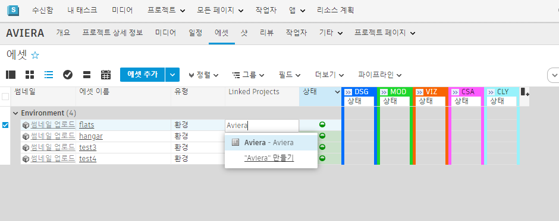

# 프로젝트 간 워크플로우

## 모범 사례

의 프로젝트 간 워크플로우를 이용하면 여러 프로젝트에서 에셋을 재사용 및 공유하여 작업을 수행할 수 있습니다. 에셋을 재사용하는 가장 일반적인 방법은 단일 "에셋 라이브러리" 프로젝트를 소스 프로젝트로 사용하는 것입니다. 단순함을 유지하기 위해 단일 "라이브러리" 프로젝트를 사용하는 쪽이 권장되지만 를 사용해 모든 활성 프로젝트 전반에서 에셋을 링크할 수도 있습니다.

에셋을 재사용하는 두 가지 주요 방법이 있습니다. 보다 민첩한 접근 방식은 소스 에셋을 "있는 그대로" 재사용하는 것입니다(직접 참조). 하지만 프로젝트와 파이프라인에 따라 한계나 제한 사항이 있을 수 있으므로 소스 에셋을 프로젝트에 복사하는 것도 방법일 수 있습니다(복제 또는 포크(Fork)).

* **직접 참조** - 소스 에셋을 그대로 재사용합니다. 에셋이 변경되면 현재 버전을 유지하거나 최신 버전으로 업데이트할 수 있습니다.
* **복제 또는 포크** - 다른 프로젝트에서 소스 에셋을 가져와(소스에 대한 모든 연결을 끊음) 이를 토대로 구축하거나 현재 프로젝트에서 제어 및 저장합니다.

# 프로젝트 간/라이브러리 프로젝트 워크플로우
이 튜토리얼에서는  툴킷을 사용하여 여러 프로젝트 간에 에셋을 재사용하고 스튜디오에서 아티스트가 쉽게 액세스할 수 있는 에셋 라이브러리를 구성하는 방법을 안내합니다. 이 작업을 시작하고 실행하기 위한 세 가지 주요 단계를 살펴보겠습니다.

1. **프로젝트 간에 링크된 ShotGrid 에셋** - **링크된 프로젝트(Linked Projects)** 필드를 사용하여 에셋과 프로젝트 간에 링크
2. **씬에 에셋 로드/참조** - Loader의 동적 탭 사용
3. **에셋을 최신 상태로 유지** - Scene Breakdown 앱 사용

## 1단계 - 에셋 링크

에셋을 재사용하는 첫 번째 단계는 에서 소스 에셋을 사용하려는 다른 프로젝트를 인식하게 만드는 것입니다.

재사용하려는 원래 에셋이 있는 소스 프로젝트에서 에셋(Assets) 페이지로 이동합니다.
**링크된 프로젝트(Linked Projects)** 필드를 에셋(Assets) 페이지에 추가합니다(아직 표시되지 않는 경우). 그런 다음 에셋을 재사용할 프로젝트를 지정합니다.

*자세한 내용은* [여기](https://help.autodesk.com/view/SGSUB/KOR/?guid=SG_Administrator_ar_site_configuration_ar_cross_project_asset_linking_html)에 있는 상세 문서를 참조하십시오.

## 2단계 - 에셋 로드
**링크된 프로젝트(Linked Projects)** 필드를 통해 에셋이 제대로 링크되면 Loader에 간단하고 동적인 탭이 생겨 링크되고 재사용된 에셋을 표시합니다. 이를 통해 아티스트와 크리에이티브 팀은 여러 프로젝트에서 에셋을 간편하게 재사용할 수 있습니다.

에셋이 제대로 링크되면 다음을 수행할 수 있습니다.
* 원하는 컨텐츠 제작 소프트웨어(Maya, Houdini, Alias 등) 실행
* 작업 씬을 열거나 저장해 컨텍스트 설정
* 씬 컨텍스트가 설정되면  메뉴에서 Loader를 시작
* 이제 **에셋 - 링크됨(Assets - Linked)**이라는 탭이 표시되며 이를 이용해 프로젝트 간의 에셋에 대한 게시된 파일에 액세스할 수 있습니다.

*구성의 Loader에 이 탭을 추가하려면 [여기](https://developer.shotgridsoftware.com/ko/2088a677/)에서 상세한 지침을 참조하십시오.*

여기에서는 컨텐츠 제작 소프트웨어 Loader 작업을 활용해 가져오기 등의 작업을 수행할 수 있습니다. 에셋을 복제하거나 포크할 계획이라면 소스에 대한 모든 연결을 끊거나 이 에셋의 현재 버전과 후속 버전에 대한 지속적인 연결을 위해 에셋을 참조하십시오.

## 3단계 - 에셋 업데이트
소스에 대한 연결을 유지하면서 에셋을 참조하도록 선택하는 경우 해당 소스 에셋에 대한 업데이트 및 변경 사항을 확인해야 할 것입니다. 이 경우, 다른 팀이 소스 에셋에 대해 반복적으로 작업을 수행하는 것이 일반적이며 따라서 사용자에게는 최신 버전이 필요합니다.

구성에서 Scene Breakdown 2 앱을 사용하면 씬에서 현재 참조된 모든 항목을 볼 수 있습니다. 이러한 참조가 업데이트되면 Scene Breakdown이 충돌을 표시하고 변경된 내용에 대한 게시된 파일(Published File) 노트를 공유하며 게시된 파일의 최신 버전 또는 다른 버전으로 업데이트할 수 있게 해줍니다.

*참고: 에셋 업데이트는 고급 구성을 사용하는 경우에만 적용됩니다. 스튜디오에서 기본 구성을 사용하는 경우 이 Scene Breakdown 앱에 액세스할 수 없습니다.*

