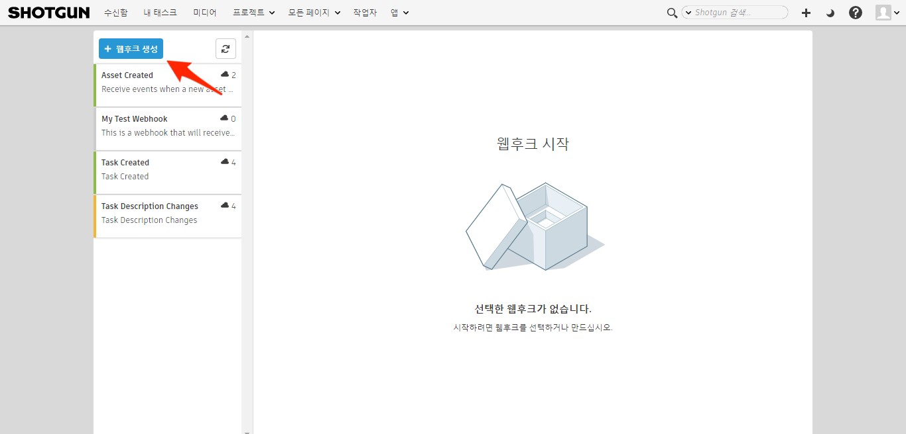
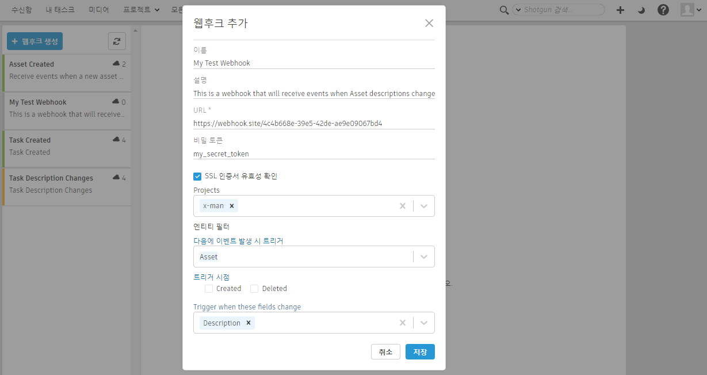
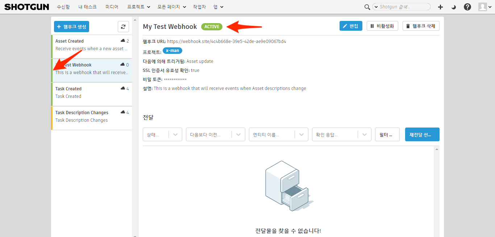
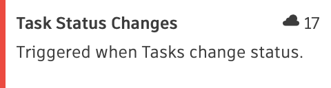
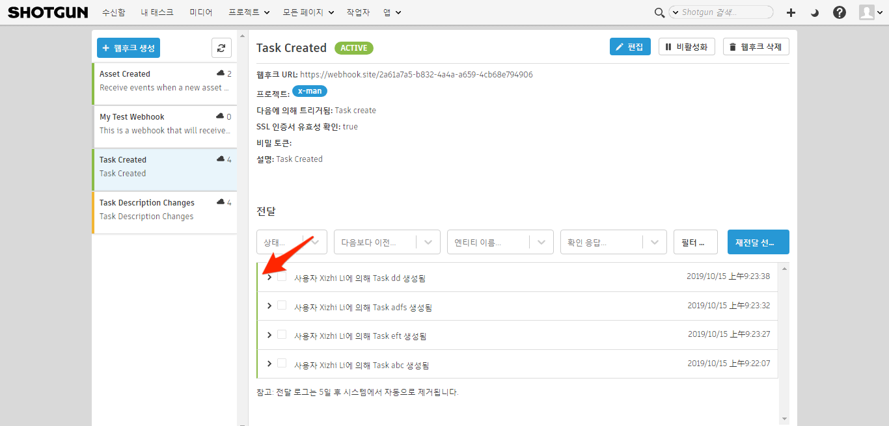
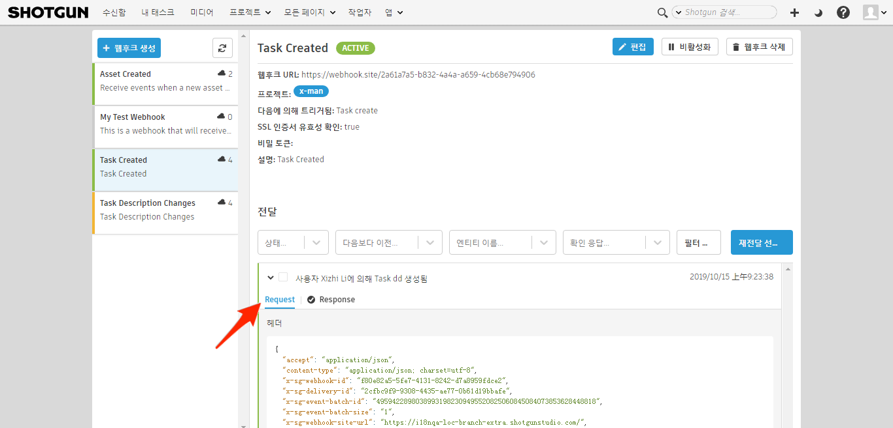

# 웹후크



웹후크를 사용하면 사용자가 제어하는 서비스는 Shotgun에서 발생하는 이벤트에 대한 알림을 받을 수 있습니다. 웹후크를 만들 때 관심 있는 이벤트 유형을 지정하고 이벤트가 트리거될 때 데이터를 보낼 URL을 Shotgun에 알려 주십시오. Shotgun에서 관련 이벤트가 발생하면 이벤트를 정의하는 데이터 페이로드가 웹후크의 URL로 전송됩니다. 이런 방법으로 Shotgun과의 긴밀한 통합을 구축하고 워크플로우의 일부를 자동화할 수 있습니다.

## 웹후크 사용 방법에는 어떤 것이 있습니까?

다양한 웹후크 사용 사례가 있습니다. 설득력 있는 몇 가지 사례가 이 문서에 개략적으로 설명되어 있지만 이러한 몇 가지 예에 국한되지는 않습니다.

### 엔티티 생성 시 디스크에 디렉토리 구조 만들기

우리가 여러 번 확인한 워크플로우 중에는 Shotgun에서 새 엔티티가 생성될 때 디스크에 디렉토리 구조를 생성하는 것이 있습니다. Shotgun에서 엔티티가 생성되면 자동으로 아티스트 작업을 위한 새 샷이 준비되도록 할 수 있습니다.

### 상태 관리 자동화

애니메이션 팀이 작업을 완료하면, 후속 작업을 시작할 준비가 되었음을 나타내도록 동일한 샷의 다운스트림 태스크 상태를 변경할 수 있습니다. 이 방법을 통해 여러 분야에서 할당된 아티스트에게 작업을 시작할 수 있음을 자동으로 통지할 수 있습니다.

상태 관리 자동화의 또 다른 좋은 예는 새 `Note`가 작성될 때 `Task` 엔티티의 상태 변경을 트리거하는 것입니다. 아티스트 및 프로덕션 팀에게 감독이 리뷰 세션 후에 현재 작업에 대한 변경 또는 수정을 요청했음을 알려 주기에 좋은 방법입니다.

## 언제 Shotgun 이벤트 데몬 대신 웹후크를 사용해야 합니까?

웹후크와 [Shotgun 이벤트 데몬](https://github.com/shotgunsoftware/shotgunEvents/wiki)은 비슷한 기능을 제공하지만 몇 가지 중요한 차이점이 있습니다. 이벤트 데몬을 사용하려면 사용자 고유의 서비스를 실행, 모니터링 및 유지 관리해야 합니다. 모든 사용자 코드는 Python으로 작성해야 하며 그래야 Shotgun에 대한 사용자 고유의 연결을 시작할 수 있습니다. 웹후크는 이와 달리 연결에 응답하며 모든 프로그래밍 언어로 작성할 수 있습니다. 웹후크는 [AWS Lambda](https://aws.amazon.com/ko/lambda/)와 같은 서버리스 환경에서 호스트되거나 [Zapier](https://zapier.com) 및 [IFTTT](https://ifttt.com)와 같이 온라인으로 사용 가능한 모든 자동화 플랫폼을 트리거할 수 있습니다. 웹후크를 사용한 경우에는 이 솔루션을 사용하는 것이 좋습니다.

## 웹후크 생성

웹후크 생성을 시작하려면 웹후크 페이지로 이동한 다음 웹후크 목록 위에 있는 버튼으로 이동합니다.



다음으로 새 웹후크를 생성하는 데 필요한 정보를 입력합니다.



### 비밀 토큰

웹후크에 비밀 토큰을 할당하는 것은 선택 사항입니다. 비밀 토큰을 제공한 경우, 해당 웹후크 URL에 전송된 모든 요청은 해당 토큰을 사용하여 서명됩니다. 토큰 값은 요청과 함께 `X-SG-SIGNATURE`라는 이름의 헤더로 전송됩니다. 서명은 SHA1과 함께 HMAC를 사용하여 계산되고 서명된 메시지는 요청의 JSON 본문입니다.

#### 헤더 형식

`<algorithm>=<signature>`

#### 비밀 토큰을 사용하는 이유는 무엇입니까?

꼭 필요한 것은 아니지만 비밀 토큰을 제공하면 웹후크 URL로 전송된 페이로드가 서명됩니다. 이를 통해 사용자 서비스는 예상한 소스에서 데이터가 생성되었으며 전송 중에 페이로드가 변경되지 않았음을 확인할 수 있습니다.

#### 서명 확인

Python을 사용한 페이로드 서명 확인 방법의 예가 아래에 나와 있습니다.

```
>>> import hmac
>>> import hashlib
>>> body | `<json body>'
>>> token | `mytoken'
>>> 'sha1=' + hmac.new(token, body, hashlib.sha1).hexdigest()  == 'sha1=32824e0ea4b3f1ae37ba8d67ec40042f3ff02f6c'
True
```

### SSL 인증서 유효성 확인

SSL 인증서 유효성 확인은 웹후크의 사용자 URL에 대한 모든 연결의 보안을 유지하는 데 도움이 되는 선택적 기능입니다. 이 옵션이 설정된 경우 웹후크의 URL로 전달이 이루어지면 Shotgun은 OpenSSL 인증서 유효성 확인 루틴을 사용하여 인증서를 확인합니다.

## 웹후크 상태

웹후크의 상태는 여러 가지 중 하나이며 계속해서 전달을 받을 수 있는 기능 및 상태를 나타냅니다.



| 상태 | 예시 | 설명 |
|--------|:-------:|:-----------:|
| 활성(Active) |  | 웹후크가 안정적인 방식으로 작동합니다. 지난 24시간 동안 이 웹후크에 전달이 없으면 해당 대상에 도달하지 못한 것입니다. |
| 불안정(Unstable) |  | 웹후크가 불안정한 방식으로 작동합니다. 지난 24시간 동안 일부 전달이 대상에 도달하지 못했지만 Shotgun에서 웹후크가 작동하지 않는 것으로 간주할 정도는 아닙니다. |
| 실패(Failed) |  | 웹후크가 작동하지 않는 것으로 간주되고 더 이상 전달을 시도하지 않습니다. 이는 짧은 기간 동안 너무 많은 전달 실패에 따른 결과이며 시스템은 웹후크가 더 이상 실행 가능하지 않은 것으로 판단합니다. **지난 24시간 동안 10번의 전달에 실패한 경우 웹후크가 실패로 간주됩니다**. |
| 비활성화됨(Disabled) |  | 웹후크가 비활성화된 상태이며 다시 활성 상태가 될 때까지 전달이 더 이상 시도되지 않습니다. |

## 전달

웹후크 목록에서 웹후크를 선택하면 5일 전까지 수행된 해당 웹후크의 모든 전달이 표시됩니다.



### 전달 상태

전달 상태는 웹후크의 URL로 성공적으로 전달되었는지 여부를 나타냅니다.



### 전달 상세 정보

전달을 확장하여 웹후크 URL로 전송한 요청과 해당 요청에 대한 응답의 상세 정보를 표시할 수 있습니다.



#### 페이로드

웹후크 URL로 전송한 페이로드에는 Shotgun에서 발생한 이벤트 및 이벤트를 트리거한 사용자에 대한 정보가 포함됩니다. JSON 형식으로 제공됩니다.



##### 페이로드 예시

```json
{
  "data": {
    "id": "95.0",
    "meta": {
      "type": "attribute_change",
      "entity_id": 758,
      "new_value": "This is the newest description ever!!",
      "old_value": "This is the old description!",
      "entity_type": "Asset",
      "attribute_name": "description",
      "field_data_type": "text"
    },
    "user": {
      "id": 113,
      "type": "HumanUser"
    },
    "entity": {
      "id": 758,
      "type": "Asset"
    },
    "project": {
      "id": 65,
      "type": "Project"
    },
    "operation": "update",
    "created_at": "2019-07-12 21:14:36.598835",
    "event_type": "Shotgun_Asset_Change",
    "session_uuid": "07473c00-a4ea-11e9-b3b8-0242ac110006",
    "attribute_name": "description",
    "event_log_entry_id": 248249
  }
}
```

##### 세션 UUID

Shotgun에서 이벤트를 트리거한 `session_uuid`가 이벤트 페이로드의 일부로 제공됩니다. 이 값은 [Shotgun의 Python API](https://developer.shotgunsoftware.com/python-api/reference.html?highlight=session_uuid#shotgun_api3.shotgun.Shotgun.set_session_uuid)에 제공될 수 있으며, 그러면 이 session_uuid를 사용하여 열려 있는 모든 브라우저 세션에 API에서 생성한 이벤트에 대한 업데이트가 표시됩니다.

### 확인 응답

확인 응답을 포함하도록 전달을 업데이트할 수 있습니다. 전달이 만들어지면 요청의 일부로 헤더가 제공됩니다. 이러한 헤더에는 `x-sg-delivery-id` 키에 저장된 전달 레코드의 ID가 포함됩니다. 이 ID는 [Shotgun REST API](https://developer.shotgunsoftware.com/rest-api)를 사용하여 확인 응답이 포함되도록 전달 레코드를 업데이트하는 데 사용할 수 있습니다.



#### 헤더 예시

```json
{
  "accept": "application/json",
  "content-type": "application/json; charset=utf-8",
  "x-sg-webhook-id": "30f279a0-42a6-4cf2-bb5e-6fc550d187c8",
  "x-sg-delivery-id": "dea7a71d-4896-482f-b238-b61820df8b65",
  "x-sg-event-batch-id": "1",
  "x-sg-event-batch-size": "4",
  "x-sg-webhook-site-url": "http://yoursite.shotgunstudio.com/",
  "x-sg-event-batch-index": "3"
}
```

#### 확인 응답의 역할은 무엇입니까?

확인 응답은 웹후크의 URL에서 성공적으로 수신한 전달 처리의 성공 또는 실패에 대한 대역 외 상세 보고를 허용합니다. 이를 통해 Shotgun에서 전달 수신 상태를, 해당 전달과 관련된 이벤트 처리의 성공 또는 실패와 구분할 수 있습니다. 이런 방법으로, 성공적으로 전달된 이벤트에서 디버깅을 위해 유용한 추가 정보를 포함할 수 있습니다. `Asset` 엔티티 생성 시 트리거되는 웹후크가 좋은 예입니다. 이 웹후크의 역할이 새로운 각 `Asset`에 대해 디스크에 디렉토리 구조를 만드는 것인 경우 웹후크의 URL을 성공적으로 전달받을 수 있지만 디스크 또는 네트워크 문제로 인해 관련 디렉토리를 만들지 못할 수도 있습니다. 이 경우 디렉토리 구조가 생성되지 않은 사실과 그 원인을 나타내는 자세한 오류 메시지와 함께 전달 레코드가 업데이트됩니다.

## 웹후크 테스트

자유롭게 사용할 수 있는 온라인 웹후크 URL 생성기 중 하나를 테스트용으로 사용할 수 있습니다. 이러한 서비스는 특별히 웹후크 및 기타 유형의 HTTP 요청 테스트에 사용해야 합니다. 이 방법은 고유의 네트워크에 인프라를 설정할 필요 없이 웹후크를 배우기 시작할 때 좋습니다.

### webhook.site 사용

[webhook.site](https://webhook.site)를 사용하는 것이 권장됩니다. 이는 웹후크에 복사하여 붙여넣을 수 있는 고유한 URL로, 해당 주소에 대한 전달을 실시간으로 보여 줍니다. 전달에 응답할 때 특정 상태 코드 및 본문을 사용하도록 이 페이지를 사용자 지정하여, 전달 성공 및 실패를 테스트할 수 있습니다.

webhook.site의 서비스는 매우 속도에 제한적입니다. 즉, 일부 전달이 거부되거나 불안정해지거나 실패한 웹후크 상황에서 쉽게 종료될 수 있습니다. 테스트할 때는 프로덕션의 라이브 데이터 대신, 알려져 있으며 제어 가능한 프로젝트 환경을 사용하는 것이 좋습니다.



### 전달에 대한 응답

시스템에서 성공적인 전달로 간주하려면 사용자 서비스가 전달에 응답해야 합니다.



#### 상태 코드

| 상태 | 코드 | 설명 |
|--------|:----:|:-----------:|
| 성공 | < 400 | 전달이 수신되고 성공적으로 처리되었습니다. |
| 오류 | >= 400 | 전달이 수신되었지만 성공적으로 처리되지 않았습니다. |
| 리디렉션 | 3xx | 전달이 수신되었지만 다른 URL로 리디렉션해야 합니다. |
