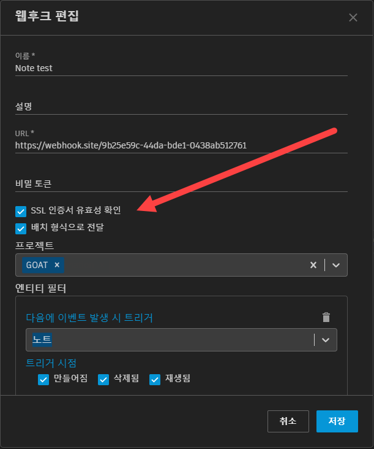

# 배치 전달

## 배치 전달(Batch) 활성화

"배치 형식으로 전달(Deliver in Batched Format)" 옵션을 선택하면 배치 페이로드 형식으로 요청할 수 있도록 웹후크를 구성할 수 있습니다.
이 옵션이 활성화된 경우 각 요청의 형식이 지정되면 해당 페이로드에 보류 중인 전달이 최대 50개까지 일괄 처리됩니다.

짧은 시간 내에 많은 SG 이벤트가 발생하는 경우 이 방법은 대량의 전달 처리를 관리하는 데 도움을 줍니다. 일반적인 시스템 작업 중에 구독 이벤트가 2초에 두 번 이상 생성되는 경우에는 페이로드당 여러 건의 전달이 발생합니다.



## 전달에 대한 응답

배치(Batch) 전달을 활성화한 경우, 수신 서비스가 이벤트당 1초 이하의 빠른 응답 속도를 보장하도록 설계하는 것이 좋습니다. 그러지 않으면 배치가 큰 경우에 시간 초과 및 웹후크 오류 위험이 증가합니다.



#### 비배치 전달 웹후크
* 시간 초과 허용치는 전달당 6초입니다. 즉, 웹후크 엔드포인트는 6초 내에 각 요청에 응답해야 합니다.

#### 배치 전달 웹후크
* 배치에서 시간 초과 허용치의 최대값은 6초, 또는 배치 내 이벤트당 1초입니다.
* 스로틀링 한계로는 모든 웹후크에서 Shotgun 사이트별로 분당 1분의 웹후크 엔드포인트 응답 시간이 적용됩니다.

## 웹후크 전달 형식 비교

#### 비배치 전달 웹후크 메시지 본문(항상 1개의 전달):

```json
{
  "data":{
    "id":"119.110.0",
    "event_log_entry_id":479004,
    "event_type":"Shotgun_Asset_Change",
    "operation":"update",
    "user":{"type":"HumanUser","id":24},
    "entity":{"type":"Asset","id":1419},
    "project":{"type":"Project","id":127},
    "meta":{
      "type":"attribute_change",
      "attribute_name":"code",
      "entity_type":"Asset",
      "entity_id":1419,
      "field_data_type":"text",
      "old_value":"Cypress test asset for Webhooks deliveries",
      "new_value":"Revised test asset for Webhooks deliveries"
    },
    "created_at":"2021-02-22 17:40:23.202136",
    "attribute_name":"code",
    "session_uuid":null,
  },
  "timestamp":"2021-02-22T17:40:27Z"
}
```

#### 배치 전달 웹후크 메시지 본문(1~50개의 전달이 포함될 수 있음)

배치가 활성화된 경우 배치에 이벤트가 하나만 있어도 `deliveries` 키가 항상 존재합니다. 이 값은 개별 이벤트 전달 데이터의 배열이며 각 전달에 제공된 정보는 배치 해제 모드와 동일합니다.

```json
{
  "timestamp":"2021-02-22T18:04:40.140Z",
  "data":{
    "deliveries":[
      {
        "id":"170.141.0",
        "event_log_entry_id":480850,
        "event_type":"Shotgun_Asset_Change",
        "operation":"update",
        "user":{"type":"HumanUser","id":24},
        "entity":{"type":"Asset","id":1424},
        "project":{"type":"Project","id":132},
        "meta":{
          "type":"attribute_change",
          "attribute_name":"code",
          "entity_type":"Asset",
          "entity_id":1424,
          "field_data_type":"text",
          "old_value":"Cypress test asset for Webhooks deliveries",
          "new_value":"Revised test asset for Webhooks deliveries"
        },
        "created_at":"2021-02-22 18:04:39.198641",
        "attribute_name":"code",
        "session_uuid":null,
      },
      {
        "id":"170.141.1",
        "event_log_entry_id":480851,
        "event_type":"Shotgun_Asset_Change",
        "operation":"update",
        "user":{"type":"HumanUser","id":24},
        "entity":{"type":"Asset","id":1424},
        "project":{"type":"Project","id":132},
        "meta":{
          "type":"attribute_change",
          "attribute_name":"description",
          "entity_type":"Asset",
          "entity_id":1424,
          "field_data_type":"text",
          "old_value":null,
          "new_value":"Some other *description*"
        },
        "created_at":"2021-02-22 18:04:39.212032",
        "attribute_name":"description",
        "session_uuid":null,
      },
    ]
  }
}
```
