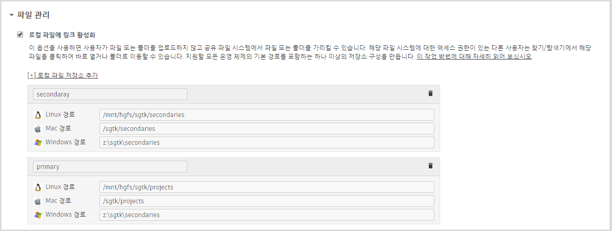

# 여러 개의 저장소 루트를 사용하도록 구성을 수정하려면 어떻게 해야 합니까?

기본 구성은 단일 로컬 저장소 루트를 사용하도록 설정됩니다(즉, 모든 프로젝트 파일이 `/sgtk/projects` 같은 단일 루트 지점에 저장됨). 그리고 일부 프로젝트 파일을 저장할 새 저장소 루트를 추가할 수 있습니다. 보통 디스크 공간이 부족하거나 일부 미디어를 더 빠른 저장소에 저장하고 싶을 때 이렇게 하게 됩니다.
그럼 이제 이름이 "secondary"인 다른 루트를 추가해 보겠습니다. 수행해야 할 단계는 다음과 같습니다.

## 의 로컬 저장소 추가

- 에서 관리자(Admin) > 사이트 기본 설정(Site Preferences)** 페이지로 이동**
- **파일 관리(File Management)** 섹션 열기
- **[+] 로컬 파일 저장소 추가([+] Add Local File Storage)** 클릭
- 해당하는 모든 플랫폼에서 이름("secondary") 및 저장소 루트 경로 입력. *특정 플랫폼을 사용하고 있지 않다면 그냥 비워 두어도 됩니다.*
- 페이지 위나 아래에 있는 **페이지 저장(Save Page)** 버튼 클릭

## 파이프라인 구성에 새 루트 추가

툴킷은 파이프라인 구성에서 사용되는 로컬 저장소에 관한 정보를 `config/core/roots.yml` 파일에 캐시합니다. 에서 지금 막 생성한 새로운 **보조** 저장소 루트를 추가하려면 이 파일을 편집합니다.

    primary: {
        linux_path: /mnt/hgfs/sgtk/projects,
        mac_path: /sgtk/projects,
        windows_path: 'z:\sgtk\projects'
    }
    secondary: {
        linux_path: /mnt/hgfs/sgtk/secondaries,
        mac_path: /sgtk/secondaries,
        windows_path: 'z:\sgtk\secondaries'
    }



## 새 로컬 저장소 루트를 사용하도록 스키마 수정

이제 새 저장소 루트를 정의하고 툴킷에 이를 알렸으므로 앞으로 디렉토리 구조에서 어떻게 사용할 것인지 결정해야 합니다. 이 예에서는 모든 에셋 작업이 secondary 저장소에 저장되고, 모든 샷 작업이 primary 저장소에 저장된다고 가정해 보겠습니다. `config/core/schema`에서 다음과 같이 스키마를 설정해야 할 것입니다.

**config/core/schema/project.yml**

    # the type of dynamic content
    type: "project"

    # name of project root as defined in roots.yml
    root_name: "primary"

**config/core/schema/secondary.yml**

    # the type of dynamic content
    type: "project"

    # name of project root as defined in roots.yml
    root_name: "secondary"

해당 필터에서 이 루트를 참조하는 모든 YAML 파일도 수정해야 합니다.
예를 들어, secondary 폴더 아래 어딘가에 asset.yml이 있다면 필터를 업데이트하여 secondary 폴더 값을 기준으로 해당 프로젝트를 필터링해야 합니다.

    filters:
        - { "path": "project", "relation": "is", "values": [ "$secondary" ] }
        - { "path": "sg_asset_type", "relation": "is", "values": [ "$asset_type"] }

## 템플릿 경로를 업데이트하여 사용할 루트 지정

끝으로 `config/core/templates.yml` 파일에 정의되어 있는 경로를 업데이트하여1 어느 저장소 루트를 사용할지 지정하고, 필요 시 모든 경로를 업데이트해야 합니다. 템플릿 경로는 스키마의 '절친'이기 때문에 둘은 일치되어야 한다는 점을 기억하십시오. 템플릿 경로가 스키마에 정의되어 있는 경로와 올바로 일치되지 않도록 정의되어 있으면 오류가 발생합니다.

예를 들어, 여기에서는 모든 에셋 작업을 secondary 저장소에 저장하려고 하기 때문에 maya_asset_work 템플릿 경로를 업데이트하려면 이를 다음과 같이 수정해야 합니다.

    maya_asset_work:
        definition: '@asset_root/work/maya/{name}.v{version}.ma'
        root_name: 'secondary'

`config/core/templates.yml` 파일의 각 템플릿 경로에 대해 이와 같은 패턴을 따라야 합니다. 각각에 대해 올바른 `root_name`을 지정합니다(**'primary'** 또는 **'secondary'**).



1 *새 값을 설정하고 나면 툴킷이 이전 값을 사용하여 생성된 모든 이전 파일에 액세스할 수 없게 되기 때문에 경로를 업데이트하는 것이 반드시 이상적이라고 할 수는 없습니다. 즉, 템플릿 경로를 변경하고 나면 툴킷이 이전 작업 파일을 찾을 수 없습니다. 이것이 우려된다면 새 위치를 지정하여 새 템플릿(예: houdini_shot_publish_v2)을 생성한 다음, 새 버전을 사용하도록 앱을 업그레이드하면 됩니다. 모든 앱이 이 같은 폴백 컨셉을 처리할 수 있는 것은 아니지만 일부 앱이라도 이전 파일을 인식할 수 있게 됩니다. 게시는 항상 의 게시에 링크되어 있기 때문에 영향을 받지 않습니다.*
