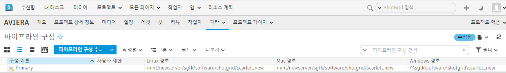

# 파이프라인 구성을 새 위치로 이동하려면 어떻게 해야 합니까?



파이프라인 구성을 새 위치로 옮길 수 있는 가장 쉬운 방법은 `tank move_configuration` 명령을 사용하는 것입니다. 이렇게 하면 파일을 이동하고, 를 업데이트하고, 새 위치를 가리키도록 구성 파일을 업데이트하는 작업이 모두 이루어집니다.

이 명령은 단일 운영 체제의 위치만 옮기거나 이전에는 특정 운영 체제를 사용하지 않았지만 이제 운영 체제를 추가하고 싶은 경우에도 유용합니다. 이동하거나 추가해야 하는 항목과 그렇지 않은 항목은 툴킷이 감지하여 진행할 작업을 미리 보여 주기 때문에 진행하기 전에 확인할 수 있습니다.

- [tank move_configuration 명령 사용](#using-the-tank-move_configuration-command)
- [수동으로 파이프라인 구성 이동](#manually-moving-your-pipeline-configuration)



## tank move_configuration 명령 사용:

        $ cd /sgtk/software/shotgun/scarlet
        $ ./tank move_configuration

        Welcome to the  Pipeline Toolkit!
        For documentation, see https://toolkit.shotgunsoftware.com
        Starting Toolkit for your current path '/sgtk/software/shotgun/scarlet'
        - The path is not associated with any  object.
        - Falling back on default project settings.
        - Using configuration 'Primary' and Core v0.15.22
        - Setting the Context to Scarlet.
        - Running command move_configuration...

        ----------------------------------------------------------------------
        Command: Move configuration
        ----------------------------------------------------------------------

        Syntax: move_configuration linux_path windows_path mac_path

        This will move the location of the given pipeline configuration.
        You can also use this command to add a new platform to the pipeline
        configuration.

        Current Paths
        --------------------------------------------------------------

        Current Linux Path:   '/mnt/hgfs/sgtk/software/shotgun/scarlet'
        Current Windows Path: 'z:\sgtk\software\shotgun\scarlet'
        Current Mac Path:     '/sgtk/software/shotgun/scarlet'

        You typically need to quote your paths, like this:

        > tank move_configuration "/linux_root/my_config" "p:\configs\my_config"
        "/mac_root/my_config"

        If you want to leave a platform blank, just just empty quotes. For example, if
        you want a configuration which only works on windows, do like this:

        > tank move_configuration "" "p:\configs\my_config" ""

### 예시:

        $ cd /sgtk/software/shotgun/scarlet
        $ ./tank move_configuration "/mnt/hgfs/sgtk/software/shotgun/scarlet_new" "z:\sgtk\software\shotgun\scarlet_new" "/sgtk/software/shotgun/scarlet_new"

        Welcome to the  Pipeline Toolkit!

        For documentation, see https://toolkit.shotgunsoftware.com
        Starting toolkit for path '/sgtk/software/shotgun/scarlet'
        - The path is not associated with any  object.

        - Falling back on default project settings.
        - Using configuration 'Primary' and Core v0.15.22
        - Setting the Context to Scarlet.
        - Running command move_configuration...

        ----------------------------------------------------------------------
        Command: Move configuration
        ----------------------------------------------------------------------

        Current Paths
        --------------------------------------------------------------
        Current Linux Path:   '/sgtk/software/shotgun/scarlet'
        Current Windows Path: 'z:\sgtk\software\shotgun\scarlet'
        Current Mac Path:     '/sgtk/software/shotgun/scarlet'

        New Paths
        --------------------------------------------------------------
        New Linux Path:   '/mnt/hgfs/sgtk/software/shotgun/scarlet_new'
        New Windows Path: 'z:\sgtk\software\shotgun\scarlet_new'
        New Mac Path:     '/sgtk/software/shotgun/scarlet_new'

        The configuration will be moved to reflect the specified path changes.

        Note for advanced users: If your configuration is localized and you have other
        projects which are linked to the core API embedded in this configuration,
        these links must be manually updated after the move operation.

        Are you sure you want to move your configuration? [Yes/No] yes
        Copying '/sgtk/software/shotgun/scarlet' -> '/sgtk/software/shotgun/scarlet_new'
        Copying /sgtk/software/shotgun/scarlet/cache...
        Copying /sgtk/software/shotgun/scarlet/config...
        Copying /sgtk/software/shotgun/scarlet/config/core...
        Copying /sgtk/software/shotgun/scarlet/config/core/hooks...
        Copying /sgtk/software/shotgun/scarlet/config/core/schema...
        Copying /sgtk/software/shotgun/scarlet/config/env...
        Copying /sgtk/software/shotgun/scarlet/config/env/includes...
        Copying /sgtk/software/shotgun/scarlet/config/hooks...
        Copying /sgtk/software/shotgun/scarlet/config/icons...
        Copying /sgtk/software/shotgun/scarlet/install...
        Copying /sgtk/software/shotgun/scarlet/install/apps...
        Copying /sgtk/software/shotgun/scarlet/install/apps/app_store...
        Copying /sgtk/software/shotgun/scarlet/install/core...
        Copying /sgtk/software/shotgun/scarlet/install/core/python...
        Copying /sgtk/software/shotgun/scarlet/install/core.backup...
        Copying /sgtk/software/shotgun/scarlet/install/core.backup/20150518_143244...
        Copying /sgtk/software/shotgun/scarlet/install/core.backup/20150518_143940...
        Copying /sgtk/software/shotgun/scarlet/install/engines...
        Copying /sgtk/software/shotgun/scarlet/install/engines/app_store...
        Copying /sgtk/software/shotgun/scarlet/install/frameworks...
        Copying /sgtk/software/shotgun/scarlet/install/frameworks/app_store...
        Updating cached locations in /sgtk/software/shotgun/scarlet_new/config/core/install_location.yml...
        Updating  Configuration Record...
        Deleting original configuration files...

        All done! Your configuration has been successfully moved.

## 수동으로 파이프라인 구성 이동



이미 수동 이동을 시작했는데 중간에 막혀 버렸다면 툴킷이 이제 새 위치에 있는 파이프라인 구성을 통해 계속 작동하도록 하기 위해 변경해야 하는 사항들이 있습니다.

1. 파이프라인 구성 파일을 새 위치로 이동

        $ mv /sgtk/software/shotgun/scarlet /mnt/newserver/sgtk/software/shotgun/scarlet_new

2. 툴킷이 파이프라인 구성의 위치를 파악하는 데 도움을 주도록 `install_location.yml`을 편집:

        $ vi /mnt/newserver/sgtk/software/shotgun/scarlet_new/config/core/install_location.yml

   해당하는 모든 플랫폼에서 이 파일의 경로가 새 파이프라인 구성 위치를 가리키도록 업데이트합니다. 플랫폼을 사용하고 있지 않다면 빈 문자열 `''`을 입력합니다.

        #  Pipeline Toolkit configuration file
        # This file was automatically created by setup_project
        # This file reflects the paths in the primary pipeline

        # configuration defined for this project.

        Windows: 'Y:\sgtk\software\shotgun\scarlet_new'
        Darwin: '/mnt/newserver/sgtk/software/shotgun/scarlet_new'
        Linux: ''

        # End of file.

3. 에서 이 프로젝트에 대한 해당 파이프라인 구성 엔티티를 찾아 Linux 경로, Mac 경로 및 Windows 경로 필드 값이 위에서 변경한 사항과 일치하도록 수정합니다.

이제 파이프라인 구성이 새 위치에서 기대한 대로 작동할 것입니다.

