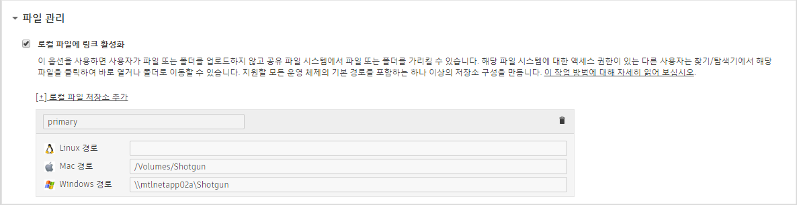

# 내 프로젝트 디렉토리를 새 로컬 저장소 루트로 어떻게 옮깁니까?



간혹 프로젝트 파일(씬 파일, 렌더 등)을 새 루트 저장소 위치로 옮겨야 할 때가 있습니다(예: `/mnt/smalldrive`에서 `/mnt/bigdrive/foo`로). 이동은 단일 루트 구성을 사용 중이든 다중 루트 구성을 사용 중이든 상관없이 가능합니다. 이름이 **"asset_storage"**인 저장소를 옮기는 예를 살펴보겠습니다.

- 이전 위치에서 새 위치로 프로젝트 파일을 복사(또는 이동)합니다.
- 에서 **관리자(Admin) > 사이트 기본 설정(Site Preferences)** 페이지로 이동해 **파일 관리(File Management)** 섹션을 엽니다.
   
- 각 플랫폼의 경로와 함께 이름이 "primary"인 로컬 파일 저장소를 프로젝트 파일의 새 저장소로 업데이트합니다. 특정 플랫폼을 사용하고 있지 않다면 그냥 비워 두십시오.
- 페이지 위나 아래에 있는 **"변경 사항 저장(Save Changes)"** 버튼을 클릭합니다.
- 지금 막 에 저장한 새로운 경로 값과 일치하도록 프로젝트 구성의 `config/core/roots.yml` 파일을 업데이트합니다.

툴킷이 게시 경로를 저장소 루트의 상대 경로로 저장합니다. 이전 저장소 루트도 마찬가지로 경로가 다음과 같이 확장되었습니다.

    [asset_storage]/assets/Character/betty => /mnt/smalldrive/assets/Character/betty

새 저장소 루트 정의의 경우에는 이제 경로가 다음과 같이 확장됩니다.

    [asset-storage]/assets/Character/betty => /mnt/bigdrive/foo/assets/Character/betty

그리고  또는 툴킷에서 어떤 다른 게시 정보를 업데이트하는 일은 신경 쓸 필요가 없습니다!



## 참조

어떤 씬 파일에 이전 경로를 가리키는 참조가 있는 경우에는 직접 해당 참조를 업데이트하거나 참조가 올바로 해석되도록 심볼릭 링크를 만들어야 합니다.

## 버전

에 이 변경 사항의 영향을 받는 영상 경로 또는 프레임 경로 필드에 정보를 저장하는 버전 엔티티가 있는 경우 이 필드는 미디어에 대한 절대 경로를 포함하고 있는 문자열 필드이기 때문에 해당 버전 역시 새 위치를 가리키도록 업데이트되어야 합니다.