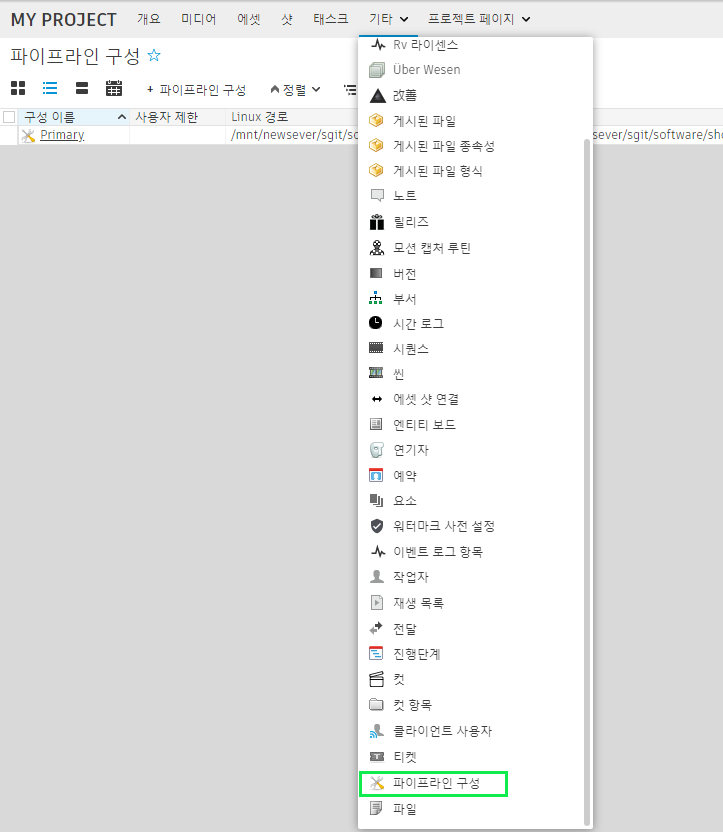
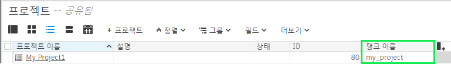

#  데스크톱을 사용하여 툴킷 프로젝트를 다시 설정하려면 어떻게 해야 합니까?

프로젝트에 대한 툴킷 구성을 이미 설정하고 새로 시작해야 하는 경우  데스크톱의 고급 설정 마법사는 이전의 설정 구성을 제거하기 전에는 프로젝트를 다시 설정할 수 없습니다.

수동으로 해당 설정을 제거하는 단계는 다음과 같습니다.

1. 에서 프로젝트에 연결된 모든 `PipelineConfiguration` 엔티티를 삭제합니다.    
2. 의 `Project` 엔티티에서 `Tank Name` 필드를 빈 값으로 설정합니다.    
3. 디스크에서 해당하는 파이프라인 구성 디렉토리를 모두 제거합니다.
4.  데스크톱에서 설정할 프로젝트를 선택합니다.  *프로젝트를 보고 있던 중이라면 프로젝트 목록 보기로 이동했다가 다시 프로젝트로 돌아옵니다.*
6. 이제 프로젝트 설정 프로세스를 다시 실행할 수 있습니다.

**대체 방법**

명령줄을 사용하여 `tank setup_project` 명령으로 프로젝트를 설정한 경우 명령 끝에 `--force` 인자를 추가할 수 있습니다. 이렇게 하면 위에 나열된 단계를 수동으로 수행하지 않고도 이전에 설정한 프로젝트를 설정할 수 있습니다.

    tank setup_project --force"

