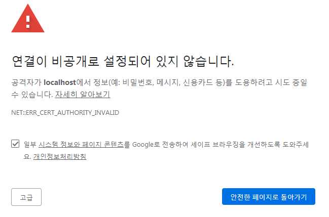
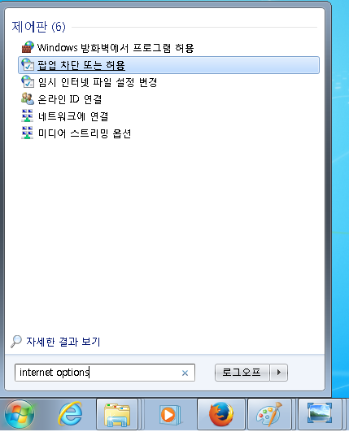
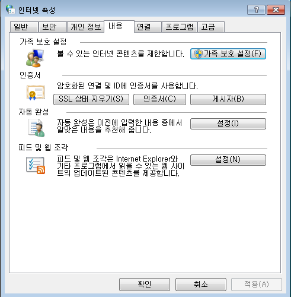
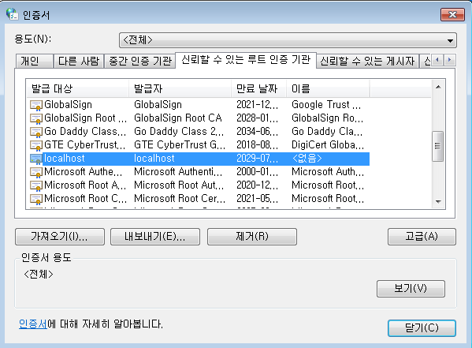
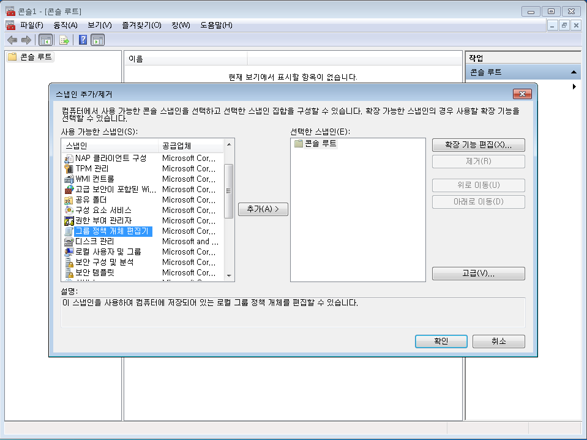
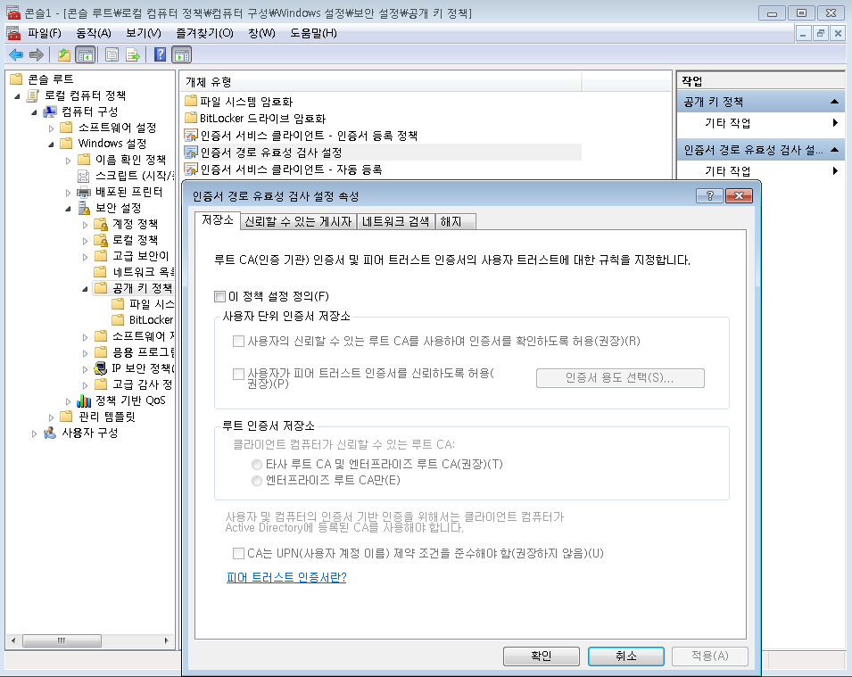

# Chrome에서 로컬 파일 링크를 사용할 수 없으며, 툴킷 응용프로그램도 실행할 수 없습니다

## 개요

간혹 의 액션 메뉴에 사용 가능한 툴킷 응용프로그램 목록이 표시되지 않거나,  데스크톱이 실행 중인데도 로컬 파일 링크를 사용하면 오류가 발생할 수 있습니다. 이 문서는 Chrome에서  데스크톱의 브라우저 통합 문제를 해결하고, 원하는 기능들이 제대로 작동하도록 지원하는 안내서입니다. [Firefox](./cant-use-file-linking-toolkit-app-firefox.md)의 경우 별도의 안내서가 있습니다.

- [문제 진단](#diagnosing-the-issue)
- [인증서 문제를 빠르게 해결하는 방법](#how-to-quickly-fix-certificate-issues)
- [모든 플랫폼에서 ERR_CERT_COMMON_NAME_INVALID 또는 ERR_SSL_SERVER_CERT_BAD_FORMAT 해결](fixing-neterr_cert_common_name_invalid-and-err_ssl_server_cert_bad_format-on-all-platforms)
- [Windows에서 ERR_CERT_AUTHORITY_INVALID 해결](#fixing-neterr_cert_authority_invalid-on-windows)

## 문제 진단

###  데스크톱이 실행 중입니까?

예, 알고 있습니다. 이미 확인하셨을 것이라 생각했지만 다시 한번 확인했습니다. :)

###  데스크톱을 시작한 후에 Chrome을 다시 시작했습니까?

 데스크톱이 인증서를 등록( 데스크톱을 처음 실행할 때에만 등록하면 되고, 이후부터는 문제 없음)하기 전에 Chrome을 실행했다면 Chrome이 오래된 인증서 사본을 사용하면서  데스크톱 연결을 거부합니다. 모든 탭을 닫는다고 해서 Chrome까지 닫히는 것은 아니므로 주소 표시줄에 [chrome://restart](chrome://restart/)를 입력하고 Enter 키를 누르는 것이 좋습니다. 이렇게 하면 모든 Chrome 관련 프로세스가 종료되고, Chrome이 다시 시작됩니다.

### 방화벽 소프트웨어를 사용 중입니까?

방화벽 소프트웨어가 localhost 또는 포트 9000 접속을 차단 중이지 않은지 확인하십시오.

### Chrome이 인증서를 거부합니까?

https://localhost:9000으로 이동하여 Chrome이 인증서를 수락하는지 확인할 수 있습니다. 이 주소는  웹 사이트가 로컬 파일 링크를 수행하고 툴킷 응용프로그램을 실행하기 위해 액세스하는 주소입니다. 보통 다음 메시지가 나타나야 합니다.

이와 달리 다음 메시지 중 하나가 표시된다면 인증서 등록 프로세스에 문제가 발생했다는 의미입니다.

## 인증서 문제를 빠르게 해결하는 방법

이 문제를 방지하는 가장 쉬운 방법은 **고급(ADVANCED)**, **localhost로 진행(Proceed to localhost)**(안전하지 않음)을 클릭하는 것입니다. 이렇게 하면 Chrome에서 여러분이 인증서를 수락하려고 한다는 것을 인식하고,  웹 사이트가  데스크톱과 통신하도록 허용합니다.





## 모든 플랫폼에서 NET::ERR_CERT_COMMON_NAME_INVALID 및 ERR_SSL_SERVER_CERT_BAD_FORMAT 해결

Chrome은 자체 서명 인증서에 관한 보안을 정기적으로 업그레이드하며, 이 업데이트로 인해 종종 브라우저 통합이 끊어집니다. 불행히도 이런 종류의 문제는 인증서의 certificate_path를 다시 생성하는 방법으로만 해결할 수 있습니다.

인증서를 다시 생성하려면  데스크톱의 사용자 메뉴에 있는 **고급(Advanced)** 섹션에서 **인증서 재생성(Regenerate Certificates)** 옵션을 선택해야 합니다. (이 옵션이 보이지 않으면 `tk-desktop` 엔진을 업데이트하여 잠금 해제합니다.)

인증서 재생성을 확인하고 나면 인증서를 처음 생성했을 때처럼 일련의 대화상자가 나타납니다. Windows 및 macOS에서는 Windows 인증서 저장소 또는 macOS 키체인을 업데이트하라는 메시지가 두 번 나타납니다. 한 번은 이전 인증서를 제거하라는 메시지가 나타나고, 새 인증서를 등록하라는 메시지가 한 번 더 나타납니다. Linux에서는 등록이 자동으로 이루어집니다. 등록이 끝나면  데스크톱을 다시 시작합니다.

 데스크톱이 다시 시작되어 실행되면 주소 표시줄에 [chrome://restart](chrome://restart/)를 입력해 Chrome을 다시 시작함으로써 Chrome이 완전히 종료되고 인증서 캐시가 지워지도록 하는 것이 좋습니다.

컴퓨터가 인터넷에 연결되어 있지 않아 업데이트를 다운로드할 수 없는 경우 [지원 사이트](https://knowledge.autodesk.com/ko/contact-support)에서 도움을 요청하십시오.

## Windows에서 NET::ERR_CERT_AUTHORITY_INVALID 해결

경우에 따라 Windows가 인증서를 성공적으로 가져왔다고 보고하는데 인증서가 필요한 응용프로그램에 이를 사용할 수 없을 때가 있습니다. 이는 Windows에서 인증서 대화상자로 이동하여 확인할 수 있습니다. 대화상자에 액세스하려면 Windows 키를 누르고 **인터넷 옵션**을 입력합니다. **인터넷 속성** 대화상자에서 **내용** 탭으로 이동한 다음 **인증서** 버튼을 클릭합니다. 마지막으로 **신뢰할 수 있는 루트 인증 기관**을 클릭하고 **localhost**를 찾습니다.

해당 항목이 없으면 Windows 도메인 또는 로컬 컴퓨터에 그룹 정책 문제가 있다는 의미일 수 있습니다. 이 문제가 있으면 [지원 팀](https://support.shotgunsoftware.com/hc/requests/new)에 문의하는 것이 좋습니다.

이 경우, 조직의 Windows 컴퓨터 관리자에게 연락하여 Windows로 하여금 자체 서명 인증서를 신뢰하지 않도록 지시하는 그룹 정책이 설정되어 있지 않은지 문의해 보십시오.

## 그룹 정책 문제 조사

컴퓨터가 도메인에 존재한다면 관리자는 [이 StackExchange 게시글](https://superuser.com/questions/145394/windows-7-will-not-install-a-root-certificate/642812#642812)에 나와 있는 단계대로 수행하면 됩니다.

컴퓨터가 도메인에 존재하는 것이 아니라면 컴퓨터가 관리자에 의해 여전히 잠겨 있을 가능성이 있습니다. 다음 단계를 수행하려면 Windows 관리자 계정이 필요합니다.

Windows 키를 클릭하고 **mmc**를 입력한 다음 Enter 키를 누릅니다. 그러면 **Microsoft 관리 콘솔**이 실행됩니다. 이 응용프로그램에서 **파일 메뉴**를 클릭하고 **스냅인 추가/제거**를 선택합니다. 그러면 **스냅인 추가/제거** 대화상자가 나타납니다. 왼쪽에서 **그룹 정책 개체 편집기**를 찾아 **추가 >**를 클릭합니다. 새 대화상자가 나타나면 **마침**을 클릭해 무시하면 됩니다. 끝으로 **스냅인 추가/제거** 대화상자에서 **확인**을 클릭합니다.

마지막으로 메인 대화상자 왼쪽에서 **로컬 컴퓨터 정책/컴퓨터 구성/Windows 설정/보안 설정/공개 키 정책**으로 이동합니다. 가운데 패널에서 **인증서 경로 유효성 검사 설정**을 선택한 다음 두 번 클릭합니다.

다음 대화상자에서 **이 정책 설정 정의**가 선택 해제되어 있는지 확인합니다. 선택되어 있으면 **사용자의 신뢰할 수 있는 루트 CA를 사용하여 인증서를 확인하도록 허용(권장)**이 선택되어 있는지 확인합니다. 마치면 **확인**을 클릭하여 설정을 저장합니다.

이때 모든 Chrome 창을 닫고 Chrome을 다시 시작해야 합니다. 위에서처럼 [chrome://restart](chrome://restart)를 사용하여 다시 시작하는 것이 좋습니다. 이렇게 해야 변경 사항이 제대로 적용됩니다. 이제 인증서 목록을 찾으면 **localhost** 인증서가 보여야 합니다.

이렇게 변경한 후에도 브라우저 통합을 사용할 때 문제가 계속 발생하거나 첫 번째 단계에서 설정이 올바르게 되어 있다면 [지원 팀](https://support.shotgunsoftware.com/hc/requests/new)에 문의하시기 바랍니다.

## 다른 OS에서 문제 해결

다른 OS에서  데스크톱 통합과 관련한 문제가 발생하면 [지원 팀](https://support.shotgunsoftware.com/hc/ko/requests/new)에 연락해 도움을 받고, 이 게시글도 업데이트하도록 해 주십시오.