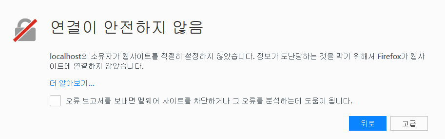
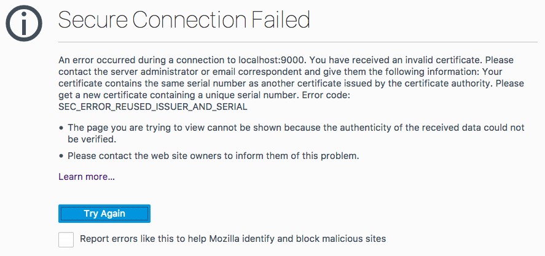
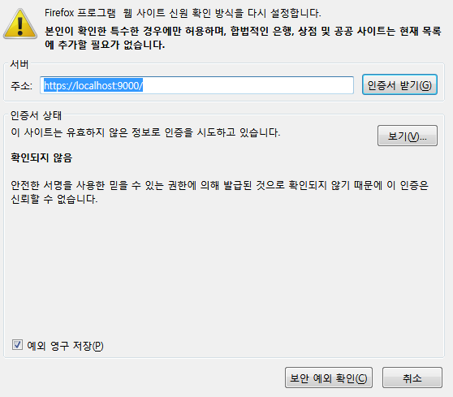
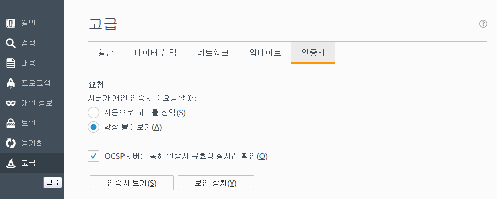
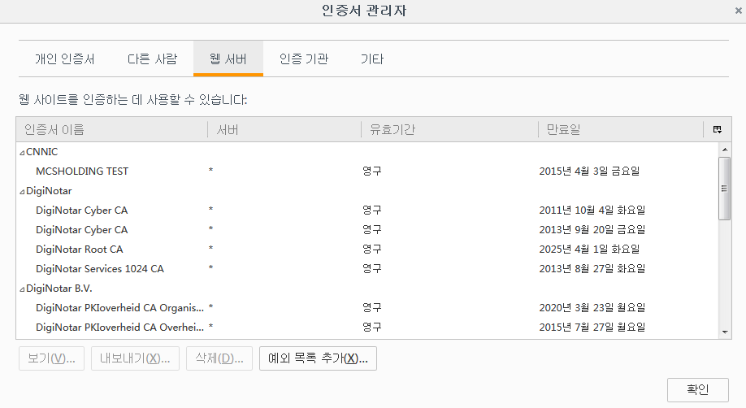

# Firefox에서 로컬 파일 링크를 사용할 수 없으며, 툴킷 응용프로그램도 실행할 수 없습니다.

## 개요

간혹 의 액션 메뉴에 사용 가능한 툴킷 응용프로그램 목록이 표시되지 않거나,  데스크톱이 실행 중인데도 로컬 파일 링크를 사용하면 오류가 발생할 수 있습니다. 이 문서는 Firefox에서  데스크톱의 브라우저 통합 문제를 해결하고, 원하는 기능들이 제대로 작동하도록 하는 데 도움을 주기 위한 안내서입니다. [Chrome](./cant-use-file-linking-toolkit-app-chrome.md)의 경우 별도의 안내서가 있습니다.

## 문제 진단

###  데스크톱이 실행 중입니까?

예, 알고 있습니다. 이미 확인하셨을 것이라 생각했지만 다시 한번 확인했습니다. :)

### 방화벽 소프트웨어를 사용 중입니까?

방화벽 소프트웨어가 **localhost** 또는 포트 **9000** 접속을 차단 중이지 않은지 확인하십시오.

### Firefox가 인증서를 거부합니까?

https://localhost:9000으로 이동하여 Firefox가 인증서를 수락하는지 확인할 수 있습니다. 이 주소는  웹 사이트가 로컬 파일 링크를 수행하고 툴킷 응용프로그램을 실행하기 위해 액세스하려고 시도하는 주소입니다. 보통 다음 메시지가 나타나야 합니다.

이와 달리 다음 두 메시지 중 하나가 표시된다면 인증서 등록 프로세스에 문제가 발생했다는 의미입니다.

## "연결이 안전하지 않음" 문제를 해결하는 방법

인증서가 수락되도록 Firefox 브라우저에 예외를 추가해야 합니다. **https://localhost:9000**을 막 방문한 경우라면 예외를 추가하는 가장 쉬운 방법은 **고급(Advanced)**을 클릭하고 **예외 추가(Add Exception)** 버튼을 클릭하는 것입니다. 대화상자가 나타납니다.

**인증서 가져오기(Get Certificate)**를 클릭한 다음 **보안 예외 확인(Confirm Security Exception)**을 클릭합니다. 인증서를 신뢰할 수 없다는 메시지는 무시해도 됩니다. 인증서가 인증 기관이 아닌  데스크톱에 의해 생성된 경우에 보통 발생하는 일입니다.

이제  사이트에서 로컬 파일 링크에 액세스하고 툴킷 응용프로그램을 실행할 수 있습니다. 예외를 추가하고도 계속 문제가 발생하면 [지원 사이트](https://knowledge.autodesk.com/ko/contact-support)에서 도움을 요청하십시오.

## "보안 연결 실패" 문제를 해결하는 방법

**메뉴 열기(Open Menu)** 버튼을 클릭하고 **기본 설정(Preferences)**을 선택해야 합니다. 그 다음 왼쪽에서 **고급(Advanced)**을 선택하고, **인증서(Certificates)** 그리고 끝으로 **인증서 보기(View Certificates)**를 선택합니다.

**서버(Servers)** 섹션에서 아무 항목이나 클릭하고 `localhost`를 입력하거나 그냥 이름이 **localhost:9000**인 항목이 나올 때까지 스크롤합니다. 이를 삭제합니다. 그런 다음, **기관(Authorities)** 탭으로 이동해 `localhost`를 다시 입력합니다. 역시 그 아래 **localhost** 항목이 있는 **Autodesk** 섹션이 나올 때까지 스크롤해도 됩니다. **localhost** 항목을 제거하면 됩니다. 다 마치면 **확인(OK)**을 클릭해 Firefox를 다시 시작합니다. Firefox가 다시 시작되면 **https://localhost:9000**으로 이동합니다. 이제 다음 메시지가 나타나야 합니다.

이때 위에 설명된 단계에 따라 예외를 추가해야 합니다.

이 화면이 나와 있지 않으면 [지원 사이트](https://knowledge.autodesk.com/ko/contact-support)에서 도움을 요청하십시오.