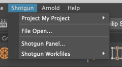

# 제가  데스크톱에서 Nuke/Maya 등을 실행했는데  메뉴에 해당 항목이 없습니다.

 메뉴에 표시되는 액션은 상황에 맞게 구성됩니다. 즉, 사용 가능한 액션 목록은 상황에 따라 다를 수 있습니다.
잘못된 상황에 있기 때문에 앱이 표시되지 않을 수 있습니다.

## 예시

[ 데스크톱](https://support.shotgunsoftware.com/hc/ko/articles/219039818)에서 응용프로그램을 실행하면 기본적으로 프로젝트 환경으로 이동합니다. 이 환경은 `config/env/project.yml`에 있는 파이프라인 구성의 구성 파일에 의해 관리됩니다. 대부분의 사용자 작업이 이 환경에서 수행되지 않을 것이므로 이 환경에는 작업에 사용하는 앱이 대부분 구성되어 있지 않습니다.

**기본 Maya 프로젝트 액션:**

[ Workfiles 앱](https://support.shotgunsoftware.com/hc/ko/articles/219033088-Your-Work-Files)을 사용하여 작업할 에셋, 샷 또는 태스크를 선택할 수 있습니다. 이렇게 하면 적합한 새 환경이 로드되고  메뉴에 더 많은 앱과 메뉴 항목이 활성화됩니다.

**기본 Maya 에셋 태스크 액션**

올바른 환경에 있는데도 액션이 표시되지 않을 경우 다음 단계는 관련 [로그](where-are-my-log-files.md)에 오류가 있는지 확인하는 것입니다.
전체 출력을 얻으려면 [디버그 로깅을 활성화](turn-debug-logging-on.md)해야 합니다.