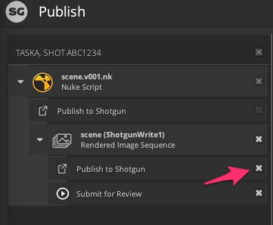
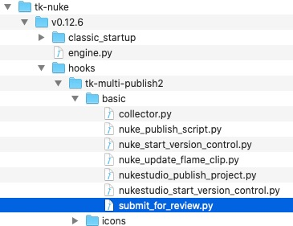

# 예외: 리뷰 제출에 실패했습니다. 리뷰 관련 시퀀스를 렌더링하고 제출할 수 없습니다.

## 활용 사례:

Nuke에서 '게시를 위해 제출'이 작동하지 않았습니다.

**질문 1:**
상속 스트림을 찾는 가장 좋은 방법은 무엇입니까? 'HookBaseClass'까지는 찾았지만 제대로 되지 않았습니다.

현재 문제는 Nuke에서 리뷰를 위해 제출하는 것입니다.

Nuke의 SG 게시 GUI에서 다음 오류가 발생합니다.


    Traceback (most recent call last):

      File "C:\Users\STEVE\AppData\Roaming\Shotgun\bundle_cache\app_store\tk-multi-publish2\v2.4.1\python\tk_multi_publish2\api\plugins\publish_plugin_instance.py", line 282, in _handle_plugin_error

        yield

      File "C:\Users\STEVE\AppData\Roaming\Shotgun\bundle_cache\app_store\tk-multi-publish2\v2.4.1\python\tk_multi_publish2\api\plugins\publish_plugin_instance.py", line 198, in run_publish

        self._hook_instance.publish(settings, item)

      File "C:\Users\STEVE\AppData\Roaming\Shotgun\bundle_cache\app_store\tk-nuke\v0.12.5\hooks\tk-multi-publish2\basic\submit_for_review.py", line 272, in publish

        raise Exception("Review submission failed. Could not render and "

    Exception: Review submission failed. 리뷰 관련 시퀀스를 렌더링하고 제출할 수 없습니다.

다음 예외도 표시됩니다.

`'sg_publish_data' was not found in the item's properties. Review Submission for 'path/to/sequences/AB/AB_001/comp/work/images/AB_001_comp_v002_output/AB_001_comp_v002_output.%04d.jpg' failed. This property must be set by a publish plugin that has run before this one.`


'publish_plugin_instance.py'에서 다음을 찾을 수 있습니다.


    _handle_plugin_error
        yield

    run_publish
        self._hook_instance.publish(settings, item)

이러한 파일은 로컬 Appdata 폴더에서는 찾을 수 있지만 기본 설치에서는 찾을 수 없으므로 이 문제를 해결하려면 'submit_for_review.py'를 찾아야 한다고 생각됩니다.

이 파일에서 상속 체인 'HookBaseClass' 상위 계층의 항목에 대한 설정 및 정보를 확인할 수 있습니다.

'sg_publish_data'가 'submit_for_review.py'에 설정되어 있는 위치를 찾습니다. 225행은 다음과 같습니다. `sg_publish_data = item.properties.get("sg_publish_data")`

**질문 2**
그렇다면 업스트림 'item.properties'는 어디에 설정되어 있습니까? nuke collector.py라고 짐작되지만 'sg_publish_data'가 없고 'HookBaseClass'의 하위이기도 합니다.

## 해결 방법

### 간단한 답변:

커스텀 코드를 추가하지 않았거나 구성을 너무 많이 수정한 경우 리뷰를 위해 제출하는 항목에 대해 `Publish to `를 선택했는지 확인해야 합니다.



### 자세한 답변:

먼저 [여기에 게시자 API에 대한 설명서](https://developer.shotgridsoftware.com/tk-multi-publish2/)가 있습니다. 이 문제를 해결하는 데 관련된 대부분의 개념이 여기에 설명되어 있습니다. 하지만 구체적인 문제에 대한 분석 내용은 아래와 같습니다. 이러한 과정을 거치는 것이 향후 문제를 해결하는 데도 도움이 될 것입니다.

위 스크린샷의 `ShorgunWrite1` 항목 아래에 두 개의 `plugins`이 있습니다. 이러한 플러그인은 구성에 정의된 플러그인에 해당합니다.


이러한 플러그인은 순서대로 실행되며 메모리의 동일한 항목에 대해 작동합니다. 문제의 원인을 파악하기 위해 이 두 플러그인의 코드를 살펴보십시오. `hook` 설정을 보면 이러한 항목이 있는 위치를 확인할 수 있습니다.

`tk-multi-publish2`에 대한 설정을 보고 있으므로 첫 번째 플러그인의 경우 `{self}`는 `tk-multi-publish2`를 나타냅니다. 따라서 다음과 같습니다.
```
{self}/publish_file.py
```
다음과 같이 tk-multi-publish2 앱 폴더에서 찾을 수 있습니다.


파일 시스템에 앱이 있는 위치는 `app_locations.yml`이 구성된 방식에 따라 달라지지만 아무 것도 변경하지 않은 경우 번들 캐시 폴더에서 앱을 찾을 수 있습니다. 필요한 경우 [캐시 위치를 찾는 방법](https://developer.shotgridsoftware.com/7c9867c0/)을 참조하십시오.

두 번째 플러그인의 경우 후크 경로는 다음과 같습니다.
```
{engine}/tk-multi-publish2/basic/submit_for_review.py
```
Nuke에서 `tk-nuke` 엔진을 실행 중이므로 이 게시 후크를 찾으려면 다시 번들 캐시에서 `tk-nuke`를 확인해야 합니다.



이제 코드를 찾을 위치를 알았으므로 [첫 번째 플러그인이 두 번째 플러그인에 존재하는 것으로 예상되는 값을 설정](https://github.com/shotgunsoftware/tk-multi-publish2/blob/a83e35dbf1a85eac7c3abd7e7f5509a42a8b8cf1/hooks/publish_file.py#L425)함을 알 수 있습니다.

이 두 플러그인의 조합은 게시되는 항목을 리뷰하기 위해 제출하는 플러그인이며 변경되지 않습니다. 따라서 워크플로우는 먼저 소스 파일을 게시한 다음 리뷰를 위해 이 파일에서 SG 버전을 만드는 것입니다. 해당 버전은 게시에도 링크됩니다. 첫 번째 플러그인은 파일을 게시하고, 두 번째 게시가 사용할 수 있도록 해당 정보를 항목에 저장합니다.

상속에 대해 언급하셨으므로 이에 대해서도 명확히 밝히고 싶습니다. 설명서에서 언급하는 내용은 Python 상속이 아닌 구성에 의해 구동되는 후크 상속을 의미하는 것 같습니다.

Python 파일에서 모든 후크는 `HookBaseClass`에서 상속됩니다. 그러나 구성의 후크 메커니즘을 통해 기본적으로 이러한 기본 후크를 같이 처리하고 결합하여 코드를 재사용하는 동안 필요한 모든 기능을 얻을 수 있습니다. `tk-multi-publish2` 구성에서 이에 대한 예를 확인할 수 있습니다.

```
settings.tk-multi-publish2.nuke.shot_step:
  collector: "{self}/collector.py:{engine}/tk-multi-publish2/basic/collector.py"
```

여기에 정의된 컬렉터는 Python 파일에 없습니다. 실제로 `tk-multi-publish2`의 `collector.py`와 `tk-nuke`의 `collector.py`가 조합된 것입니다.

빠른 해결 방법으로 충분하지 않고 이러한 후크를 수정해야 하는 경우 [게시 워크플로우 커스터마이즈 동영상](https://developer.shotgridsoftware.com/ko/869a6fab/#shotgrid-toolkit-webinar-videos)을 확인하십시오. 시작하는 데 도움이 될 것입니다.

[커뮤니티에서 전체 스레드를 참조](https://community.shotgridsoftware.com/t/nuke-submit-for-review-py/10026)하십시오.

