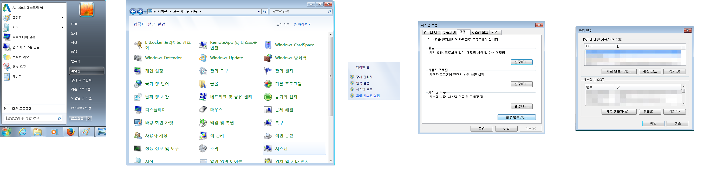

# 디버그 로깅을 어떻게 켭니까?

##  데스크톱을 통해 디버깅 활성화

디버깅을 활성화하는 가장 쉬운 방법은  데스크톱 앱을 통해 켜는 것입니다.  데스크톱에 로그인하고 나면 설정할 수 있습니다. 앱 오른쪽 아래에 있는 프로파일 사진을 클릭하고 **고급(Advanced) -> 디버그 로깅 토글(Toggle Debug Logging)**을 선택합니다. 이 설정은 세션 간에 영속적이기 때문에 작업을 마치면 끄는 것을 잊지 마십시오.


이 기능을 켜면  데스크톱에서 실행한 앱 또는 브라우저 통합을 통한 툴킷 명령도 이 디버그 상태를 상속한다는 점에도 유의하십시오.

## 환경 변수 설정

### 디버그 로깅 영구적으로 켜기
먼저 새 환경 변수 `TK_DEBUG=1`을 설정해야 합니다.



#### Windows 7 사용 예시

- **Windows 아이콘 > 제어판 > 시스템 > 고급 시스템 설정 > 환경 변수... > 새로 만들기...**로 이동하여 디버그 로깅을 영구적으로 켤 수 있습니다.




- **변수 이름**: `TK_DEBUG`
- **변수 값**: `1`
- 확인을 선택합니다.

이제 환경 변수가 올바로 설정되고, 디버그 로깅이 켜졌습니다.



디버그 로깅을 끄고 싶으면 다음을 수행합니다.

a. `TK_DEBUG` 환경 변수 값을 0으로 설정합니다.

b. `TK_DEBUG` 환경 변수를 삭제합니다.

### 이 환경 변수가 이미 설정되어 있는지 확인

이 환경 변수가 이미 설정되어 있는지 확인하려면 터미널을 열고 `set` 명령을 실행합니다.

그런 다음, `TK_DEBUG=1`을 검색합니다.

그러면 데스크톱을 실행하고 나면 디버그 로깅이 켜집니다.

### 디버그 로깅 일시적으로 켜기

대신 세션 동안에만 일시적으로 디버그 로깅을 사용하고 싶다면 터미널을 열고 `set TK_DEBUG=1` 명령을 통해 디버그 로깅을 설정하면 됩니다.

그런 다음, 터미널을 통해 데스크톱을 실행합니다.

{% include info title="참고" content=" 데스크톱과 터미널을 닫으면 디버그 로깅이 더 이상 켜진 상태로 유지되지 않습니다." %}

## 로그 파일에서 디버그 출력 검사

로그 파일을 찾으려면 [로그 파일은 어디에 있습니까?](./where-are-my-log-files.md) 문서를 참조하십시오.

## 고급 구성 디버그 로깅 옵션

고급 설정을 사용 중인 경우 몇 가지 옵션을 더 사용할 수 있습니다. 이 기능은 툴킷 구성에 대한 제어 권한이 있는 경우에만 사용할 수 있습니다.

모든 엔진은 환경 파일에 `debug_logging` 설정이 있습니다. 이 설정을 켜면 추가 디버그 레벨 로그 메시지가 소프트웨어(예: Nuke 또는 Maya의 스크립트 편집기)의 기본 출력으로 전송됩니다. 엔진에서 실행 중인 모든 앱이 이 디버그 레벨 메시지를 전송하기 때문에 엔진에 대해 이 설정을 켜면 결국 모든 앱에 대해서도 켜는 셈입니다.

이렇게 해도 파일로 어떤 로그 메시지를 출력하지는 않습니다. 이를 가능하게 할 추가 표준 로깅 프레임워크를 구현하기 위해 작업 중입니다. 예외는 [SG 데스크톱](https://support.shotgunsoftware.com/hc/ko/articles/219039818-Shotgun-Desktop) 및 [Photoshop 엔진](https://support.shotgunsoftware.com/hc/ko/articles/115000026653-Photoshop-CC)이며 GUI 콘솔과 파일 모두에 출력을 로깅합니다.

### 소프트웨어의 엔진에 대해 디버그 로깅 켜기

예를 들어, 샷 단계 환경의 Nuke 엔진에 대해 디버깅 출력을 켜려면 환경 파일에서 Nuke 엔진(`tk-nuke`) 섹션을 찾아 설정을 `debug_logging: true`로 업데이트합니다.

`config/env/shot_step.yml`을 편집합니다.

```yaml
engines:
  ...
  ...
  tk-nuke:
    apps:
      ...
      ...
    compatibility_dialog_min_version: 9
    debug_logging: true
    favourite_directories: []
    location: {name: tk-nuke, type: app_store, version: v0.2.23}
    ...
   ...
```

파일을 저장하고 샷 단계 환경에서 Nuke를 다시 실행합니다. 이제 스크립트 편집기 창에서 디버그 출력을 볼 수 있을 것입니다.

### tank 명령에 대해 디버그 로깅 켜기

tank 명령을 실행 중인데 터미널에서 디버그 출력을 보고 싶다면 실행 중인 명령과 함께 `--debug` 옵션을 사용하면 됩니다. 그러면 해당 명령에 대해 디버그 로깅이 켜집니다.

    ./tank --debug core
    DEBUG [10:11:38 617.835998535]:
    DEBUG [10:11:38 618.768930435]: 디버그 출력을 활성화한 상태에서 실행합니다.
    DEBUG [10:11:38 618.921995163]:
    DEBUG [10:11:38 619.092941284]: Core API는 현지화된 파이프라인 구성 내부에 있습니다.
    DEBUG [10:11:38 619.235992432]: 전체 명령줄이 전달됨:
    ['/sgtk/software/shotgun/scarlet/install/core/scripts/tank_cmd.py',
    '/sgtk/software/shotgun/scarlet', '--debug', 'core']
    DEBUG [10:11:38 619.364023209]:
    DEBUG [10:11:38 619.463920593]:
    DEBUG [10:11:38 619.575977325]: 코드 설치 루트:
    /sgtk/software/shotgun/scarlet
    DEBUG [10:11:38 619.678020477]: 파이프라인 구성 루트:
    /sgtk/software/shotgun/scarlet
    DEBUG [10:11:38 619.756937027]:
    DEBUG [10:11:38 619.826078415]:
    DEBUG [10:11:38 619.905948639]:
    DEBUG [10:11:38 619.978904724]: 컨텍스트 항목:
    ['/sgtk/software/shotgun/scarlet']
    DEBUG [10:11:38 620.06688118]: 명령: core
    DEBUG [10:11:38 620.129108429]: 명령 인수: []
    DEBUG [10:11:38 620.193004608]: Sgtk 파이프라인 구성 위치:
    /sgtk/software/shotgun/scarlet
    DEBUG [10:11:38 620.270967484]: 이 스크립트의 위치(__file__):
    /sgtk/software/shotgun/scarlet/install/core/scripts/tank_cmd.py

    Shotgun Pipeline Toolkit을 시작합니다.
    설명서는 https://toolkit.shotgunsoftware.com을 참조하십시오.
    현재 경로 '/sgtk/software/shotgun/scarlet'에 대해 툴킷 시작
    - 경로가 Shotgun 객체와 연결되어 있지 않음
    - 기본 프로젝트 설정으로 폴백
    DEBUG [10:11:39 125.463962555]: Sgtk API 및 컨텍스트가 완전히 해석합니다.
    DEBUG [10:11:39 126.449108124]: Sgtk API: Sgtk Core v0.15.18, 구성
    /sgtk/software/shotgun/scarlet
    DEBUG [10:11:39 126.588106155]: 컨텍스트: scarlet
    - '기본' 구성 및 Core v0.15.18 사용
    - 컨텍스트를 scarlet으로 설정
    DEBUG [10:11:39 129.276990891]: 이 명령의 경우 엔진을 로드할 필요가 없습니다.
    - 명령 코어 실행...


    ----------------------------------------------------------------------
    명령: Core
    ----------------------------------------------------------------------


    Shotgun Pipeline Toolkit 업데이트 검사 프로그램을 시작합니다.
    이 스크립트는 /sgtk/software/shotgun/scarlet에 설치된
    Toolkit Core API가 최신인지
    확인합니다.

    Core API 업그레이드 시 일반적으로 둘 이상의 프로젝트에 영향을
    미칩니다. 여러 프로젝트에 롤아웃하기 전에 별개로 Core API 업그레이드를
    테스트하려면 *현지화된* 특수 파이프라인 구성을 생성하는 것이
    좋습니다. 자세한 내용은 툴킷 문서를
    참조하십시오.


    현재 Shotgun Pipeline Toolkit v0.15.18 버전을 실행 중입니다.
    지금은 Toolkit Core API를 업데이트할 필요가 없습니다.
    DEBUG [10:11:39 981.74405098]: 종료 코드를 사용한 종료가 없음
