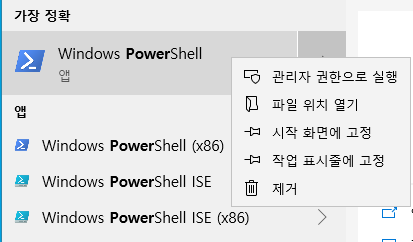
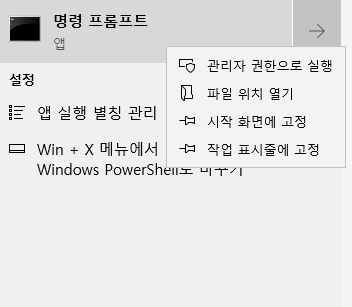

# [SSL: CERTIFICATE_VERIFY_FAILED] 인증서 확인 실패: 로컬 발급자 인증서를 가져올 수 없음

## 활용 사례

사용자가 Windows의 Python API를 사용하여 Amazon에서 미디어를 업로드 및 다운로드하는 데 문제가 있습니다. 이 문제는 Python API에서 자체적으로 발생하며 다음 오류 메시지가 표시됩니다.

```
shotgun_api3.shotgun.ShotgunFileDownloadError: Failed to open https://xxx.shotgunstudio.com/file_serve/attachment/xyz
<urlopen error [SSL: CERTIFICATE_VERIFY_FAILED] certificate verify failed: unable to get local issuer certificate (_ssl.c:1108)>
```
Amazon이 백엔드에서 일부 인증서를 업데이트했습니다. Windows는 일반적으로 새 인증서가 필요한 웹 페이지를 찾을 때 인증서 저장소를 새로 고칩니다. 정기적인 검색 작업이 없는 컴퓨터에서 실행되는 독립 실행형 Python 스크립트는 인증서 업데이트를 검색하지 않으므로 컴퓨터에 상당수의 누락이 발생할 수 있습니다.

## 해결 방법

문제가 있는 시스템에 GUI 액세스 권한이 있는 경우 현재 S3에 저장된 미디어를 재생하기만 하면 인증서 저장소가 업데이트됩니다. 이 재생 솔루션은 Chrome, Internet Explorer, Edge 또는 기타 Chromium 기반 브라우저에서만 작동합니다. 이 재생 솔루션은 Firefox 또는 Safari에서는 작동하지 않습니다. 이러한 브라우저에서는 인증서 유효성 검사에 Windows의 표준 API를 사용하지 않기 때문입니다.

이 솔루션이 작동하지 않는 사용자 또는 Deadline 렌더 팜과 같이 업데이트할 컴퓨터가 많은 경우 누락된 인증서를 컴퓨터에 추가하는 스크립트도 제공하고 있습니다. [공유한 스크립트에 대한 링크](https://developer.shotgridsoftware.com/ko/c593f0aa/)를 확인하십시오.

Windows 10의 Powershell 또는 Windows 7의 Powershell 3 사용자의 경우 컴퓨터에서 관리자로 다음 스크립트를 실행하여 새 인증서를 가져올 수 있습니다.



```
$cert_url = "https://www.amazontrust.com/repository/AmazonRootCA1.cer"
$cert_file = New-TemporaryFile
Invoke-WebRequest -Uri $cert_url -UseBasicParsing -OutFile $cert_file.FullName
Import-Certificate -FilePath $cert_file.FullName -CertStoreLocation Cert:\LocalMachine\Root
```

명령이 작동할 경우 다음 내용이 표시되어야 합니다.

```
   PSParentPath: Microsoft.PowerShell.Security\Certificate::LocalMachine\Root

Thumbprint                                Subject
----------                                -------
8DA7F965EC5EFC37910F1C6E59FDC1CC6A6EDE16  CN=Amazon Root CA 1, O=Amazon, C=US
```

이렇게 하면 실행되는 컴퓨터의 모든 사용자 계정에 대해 인증서를 사용할 수 있게 됩니다. 관리자 액세스 권한이 없는 경우 마지막 행을 다음과 같이 변경할 수 있습니다.

```
Import-Certificate -FilePath $cert_file.FullName -CertStoreLocation Cert:\CurrentUser\Root
```

그러면 인증서가 현재 사용자에 대해서만 추가됩니다.

아직 `cmd.exe`를 사용하는 경우 `certutil`을 사용할 수도 있습니다. 먼저 `https://www.amazontrust.com/repository/AmazonRootCA1.cer`에서 인증서를 다운로드하여 컴퓨터에 저장해야 합니다.

그런 다음 관리 모드에서 명령 프롬프트를 시작합니다.



다음 행을 실행합니다.

```
certutil -addstore root <path-to-the-cert>
```

이렇게 하면 인증서를 모든 사용자 계정에 사용할 수 있습니다. 관리자 액세스 권한이 없는 경우에는 다음과 같이 `-user`를 추가하여 현재 사용자에 대해서만 인증서를 설치할 수 있습니다.

```
certutil -user -addstore root <path-to-the-cert>
```

## 관련 링크

[커뮤니티에서 전체 스레드 참조](https://community.shotgridsoftware.com/t/certificate-verify-failed-error-on-windows/8860)