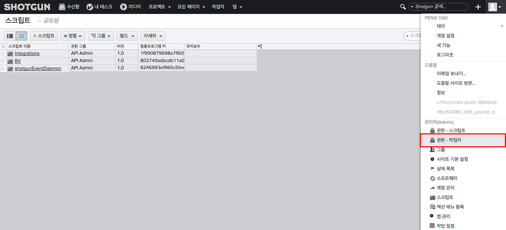
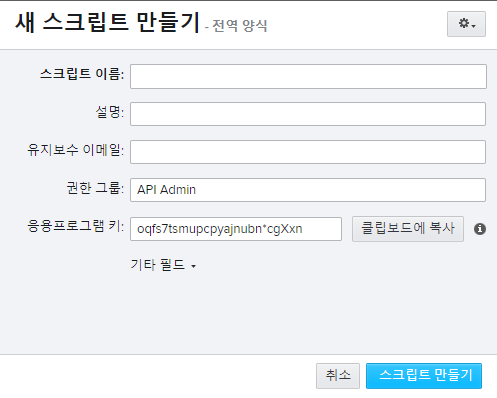

# API 스크립트 만들기 및 관리

아래 단계에 따라 새 스크립트를 만듭니다.

1.  관리자(Admin) 메뉴로 이동하여 "스크립트(Scripts)"를 선택합니다.  
 
2.  "+ 스크립트(+ Script)" 버튼을 사용하여 새 스크립트를 만듭니다.
3.  응용프로그램 키 값을 확인합니다. 에 연결하려면 이 값이 필요합니다.  
   
    
    > **참고:** API 키는 암호처럼 처리되고 생성된 후에는  웹 앱 또는 API를 통해 다시 볼 수 없습니다. 계속하기 전에 키를 복사해야 합니다.
    
4.  이제 스크립트 키를 사용하여 에 연결할 수 있습니다. 스크립트를 사용하여 에 연결하는 방법에 대한 자세한 정보는 API 설명서에 있는 [" 메서드"](https://developer.shotgridsoftware.com/python-api/reference.html#shotgun-methods)를 참조하십시오.

> **팁:** 어떤 이유로 스크립트의 응용프로그램 키를 재설정해야 하는 경우 이를 수행하려면 새  스크립트 엔티티를 만들어야 합니다. 먼저 기존 스크립트의 이름을 변경(예: "[My Script]—OLD")한 다음 이를 삭제합니다. 새 스크립트를 만듭니다. 이전 스크립트의 이름을 변경해야 하는 이유는  소프트웨어가 각 스크립트에 대해 고유한 이름을 요구하기 때문입니다.

## 새 스크립트를 설정해야 하는 경우

스크립트 액션은 기록될 수 있습니다. 개별 스크립트 키를 보다 세밀하게 사용할수록 디버깅용으로 변경되는 스크립트를 쉽게 트래킹할 수 있습니다. 별도의 스크립트를 사용하면 사이트의 변경에 영향을 받는 스크립트 및 스크립트 관리자를 트래킹하기 좋습니다.