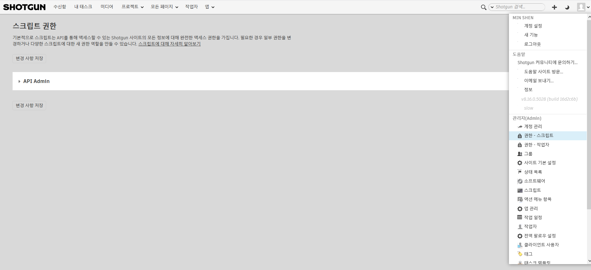

# API 사용자 권한 그룹

API 사용자를 위한 별도의 권한 그룹을 만들어 작업자와 마찬가지로 스크립트 및 키에 다른 권한 레벨을 지정할 수 있습니다.

## API 사용자 페이지 액세스

관리자(Admin) 메뉴로 이동하여 권한 - 스크립트(Permissions - Scripts)를 선택합니다.

사용법은 을 참조하십시오.

## API 사용자 권한 그룹 사용 방법

초기 API 관리자(Admin) 이외의 API 권한 그룹을 만든 후에는 API 스크립트에 사용할 수 있습니다.

1. 관리자(Admin) 메뉴에서 "스크립트(Scripts)"를 선택합니다.
2. 권한 그룹(Permission Group) 열을 표시하고 적절한 권한 그룹을 선택합니다.  
   

## 예

그렇다면 이 권한 그룹을 사용하는 이유는 무엇일까요? 많은 잠재적인 용도가 있지만 다음과 같은 경우에 사용할 수 있습니다.

**예 1:** 전체 관리자(Admin) 권한이 없는 스튜디오의 누군가에게 API 키를 제공할 수 있습니다.

**예 2:** 읽기 전용 API 키를 파트너 스튜디오에 제공하여 내 {{ akn_product_name }} 데이터베이스에서 파트너 스튜디오의 {{ akn_product_name }} 데이터베이스로 단방향 동기화를 수행하고 제한된 엔티티 세트만 노출할 수 있습니다.

**예 3:** 프로젝트당 API 스크립트를 제한할 수 있습니다.

1. 관리자(Admin) 메뉴를 통해 **권한 - 스크립트(Permissions - Scripts)** 페이지로 이동하여 새 역할을 만듭니다. "할당된 프로젝트만 보기(See Assigned Projects Only)" 고급 권한이 활성화되어 있어야 합니다. 필요한 다른 권한을 조정할 수도 있습니다(예: 특정 엔티티/필드에 대해 읽기 액세스 권한만 필요한 경우).
2. 관리자(Admin) 메뉴를 통해 **스크립트(Scripts)** 페이지로 이동합니다. "프로젝트(Projects)" 필드를 노출합니다. 여기서 프로젝트를 입력하여 스크립트 범위를 제한할 수 있습니다.
3. "권한 그룹(Permission Group)" 필드를 통해 1단계에서 만든 새 프로젝트에 해당 스크립트 권한을 할당해야 합니다.