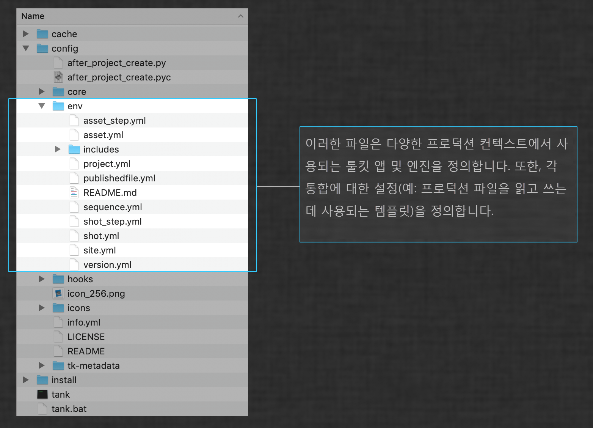
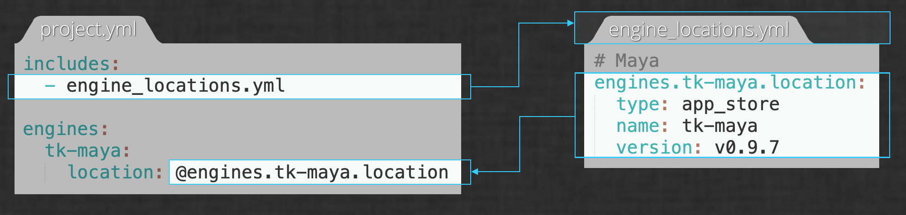

# 환경 구성 참조

## 소개

툴킷 파이프라인의 핵심에는 환경 구성이 있습니다. 툴킷 파이프라인 구성 내에서 환경 구성 파일은 다양한 DCC 내에서 사용할 수 있는 툴킷 앱을 정의하고 각 설정을 커스터마이즈할 수 있는 곳입니다. 이 문서는 환경 구성 파일의 구조 및 기능을 전체적으로 소개하는 완전한 참조 자료입니다. 이 문서에서는 프로젝트 내에서 다양한 워크플로우를 구성할 수 있게 해 주는 툴킷 *환경*의 개념과 커스터마이즈할 수 있는 항목을 찾는 방법에 대해 설명합니다.




## 환경이란?

Shotgun 툴킷 플랫폼은 스튜디오 파이프라인을 구축하는 데 일반적으로 사용되는 컨텐츠 작성 소프트웨어를 위해 완전히 커스터마이즈 가능한 통합 세트를 제공합니다. 프로젝트 구성 내에서 통합이 있는 소프트웨어 패키지, 각각 사용 가능한 툴킷 앱, 각 앱에 대한 옵션을 지정하여 스튜디오의 요구 사항에 맞게 아티스트 워크플로우를 구축할 수 있습니다.

하지만 대부분의 스튜디오 파이프라인에서는 아티스트 유형별로 다른 워크플로우를 사용하는 것이 일반적입니다. 간단한 예로, 에셋 작업 중인 아티스트의 경우 텍스처 페인팅 소프트웨어(예: Mari)를 사용하게 하고 샷 작업 중인 아티스트의 경우에는 컴포지팅 소프트웨어(예: Nuke)를 사용하게 할 수 있습니다.

소프트웨어 패키지뿐 아니라 동일한 툴킷 앱에 대한 설정도 아티스트별로 다르게 지정할 수 있습니다. 예를 들어 샷 아티스트와 에셋 아티스트 둘 다 [Workfiles 앱](https://support.shotgunsoftware.com/hc/ko/articles/219033088)을 사용할 수 있지만 샷 아티스트는 샷 엔티티, 에셋 아티스트는 에셋 엔티티와 관련된 파일로만 파일 탐색을 제한할 수 있습니다.

프로젝트 내에서 이렇게 서로 다른 워크플로우를 지원하기 위해 툴킷은 환경에서 앱과 엔진 구성을 분리합니다. 각 환경에는 소프트웨어 패키지 셋트의 통합과 설정이 모두 공통적으로 포함되어 있습니다.

위의 예에서 에셋 작업 중인 아티스트는 에셋 단계 환경에서 작업하고 샷 작업 중인 아티스트는 샷 단계 환경에서 작업합니다. 각 환경은 서로 독립적으로 구성되므로 한 프로젝트 내에서 각기 다른 워크플로우를 사용할 수 있습니다.

## 툴킷의 기본 구성에 대한 참고 사항

툴킷은 환경을 구성하는 방식에 있어 매우 자유롭습니다. 이 문서에서는 사용 가능한 모든 옵션을 모두 소개하므로 파이프라인 요구 사항에 가장 적합한 선택을 하는 데 필요한 지식을 얻을 수 있습니다.

또한 이 문서에서는 [기본 구성](https://github.com/shotgunsoftware/tk-config-default2)이라는 시작점으로 제공되는 파이프라인 구성의 선택 사항에 대해서도 설명합니다. 파이프라인을 커스터마이즈할 준비가 된 경우 첫 번째 단계는 [프로젝트에 대해 편집 가능한 파이프라인 구성을 만드는 것](../../guides/pipeline-integrations/getting-started/editing_app_setting.md)입니다.

이러한 선택 사항은 일반적인 규칙일 뿐이고 툴킷 워크플로우에 하드코딩되지 않으므로, 기본 구성은 파이프라인을 커스터마이즈한 후 사용할 수 있는 기능을 학습하기 위한 예제로 참조하거나 고유의 구성을 설정하기 위한 모범 사례로 사용하는 것이 좋습니다. 또한 새로운 툴킷 사용자를 위한 시작점으로도 좋으며 몇 가지 규칙을 알아 두면 유용합니다. 이 문서에서는 툴킷 환경 구성의 일반적인 기능과 기본 구성에 특정한 선택 사항을 구분해 두었습니다. 기본 구성의 환경 구조에 대한 자세한 내용은 [읽어보기 파일](https://github.com/shotgunsoftware/tk-config-default2/blob/master/env/README.md)을 참조하십시오.

## 파일 위치

파이프라인 구성에서 `config/` 디렉토리에는 커스터마이즈할 수 있는 모든 파일 및 폴더가 포함됩니다. `config/`에는 세 개의 하위 디렉토리(`cache`, `core` 및 `env`)가 있습니다. `env` 디렉토리에 환경 구성 파일이 있으므로 이 문서에서는 `config/env`의 파일을 참조합니다.



기본 구성의 `config/env/`에는 다음 파일이 있습니다.

```
asset.yml
asset_step.yml
project.yml
sequence.yml
shot.yml
shot_step.yml
```

이러한 각 파일이 환경에 해당하며 별도 파일을 사용하면 각 환경을 별도로 구성할 수 있습니다.

## 툴킷이 현재 환경을 결정하는 방식

툴킷은 [pick_environment](https://github.com/shotgunsoftware/tk-core/blob/master/hooks/pick_environment.py)라는 코어 후크를 사용하여 현재 [컨텍스트](https://developer.shotgunsoftware.com/tk-core/core.html#context)를 기반으로 지정된 시간에 사용할 환경 파일을 결정합니다. `pick_environment` 후크의 반환 값은 환경 구성 파일에 해당합니다. 예를 들어 `pick_environment`가 `shot_step`을 반환하는 경우 툴킷은 `config/env/shot_step.yml`을 사용하여 툴킷 환경을 구성합니다.

## 커스텀 환경

위에 나열된 환경 구성 파일은 기본 구성에서 제공하는 파일입니다. 그러나 일부 스튜디오에서는 다른 환경 또는 추가 환경을 필요로 할 수 있습니다. 예를 들어 스튜디오에서 파이프라인 단계(`asset_step_rig`, `asset_step_model`, `shot_step_anim`, `shot_step_light` 등)마다 다른 구성 설정을 사용해야 할 수 있습니다. 다행히도 사용 가능한 환경을 완전히 커스터마이즈할 수 있습니다.

이렇게 하려면 원하는 환경 구성 파일을 `config/env` 디렉토리에 추가해야 합니다. 그런 다음 `pick_environment` 코어 후크를 재지정하여 새 환경을 사용할 때 정의하는 로직에 추가합니다.

## 기본 구조

툴킷의 구성 파일은 [YAML](https://yaml.org/)로 작성됩니다. 모든 번들(앱, 엔진 또는 프레임워크)의 일반적인 구성은 다음과 같은 구조로 되어 있습니다.

```yaml
bundle_name:
  setting1: value
  setting2: value
  complex_setting:
    sub_setting1: value  
    Sub_setting2: value
  location:
    type: descriptor_type
    descriptor_setting1: value
    descriptor_setting2: value
```

이 구조를 보여 주는 간단한 예제가 아래에 있습니다(단일 엔진이 있고 엔진 내에 단일 앱이 정의된 환경). 다음은 이 구성에서 `project.yml`의 내용이 될 수 있습니다.

```yaml
engines:
  tk-maya:
    apps:
      tk-multi-workfiles2:
        location:
          type: app_store
          name: tk-multi-workfiles2
          version: v0.11.8
    location:
        type: app_store
        name: tk-maya
        version: v0.9.4
```

### 엔진 블록

모든 환경 구성 파일은 `engines` 블록으로 시작합니다. 해당 환경에 대해 정의된 모든 엔진이 이 블록 내에 중첩됩니다.

이 예에서는 하나의 엔진, `tk-maya`만 정의되어 있습니다. 여기에는 두 개의 설정(`apps` 및 `location`)이 나열되어 있습니다.

`location`은 모든 번들에 필요한 특수한 설정입니다. `apps` 설정은 엔진에 대해 정의된 모든 앱의 목록으로, 각 앱에는 자체 설정이 있습니다. 이 예에서는 엔진에 대해 하나의 앱, `tk-multi-workfiles2`만 정의되어 있습니다.


### 위치 디스크립터

모든 툴킷 번들에는 번들의 *디스크립터*라고 불리는 `location` 설정이 있습니다. 디스크립터를 통해 툴킷은 지정된 번들의 위치를 파악하고 해당 유형에 따라 직접 액세스할지 아니면 로컬로 캐시할지 여부를 파악합니다. 툴킷 번들을 가져올 수 있는 위치는 Shotgun 앱 스토어, git 리포지토리, 디스크의 경로 또는 Shotgun 사이트에 업로드된 ZIP 파일 등입니다. 이러한 각 위치에 해당하는 디스크립터 유형이 있으며 여기에는 해당 유형과 관련된 설정이 포함됩니다. 위 예제의 `tk-maya` 엔진에 대한 디스크립터는 다음과 같습니다.

```yaml
    location:
        type: app_store
        name: tk-maya
        version: v0.9.4
```

이 예는 `app_store` 유형의 디스크립터로, 툴킷이 Shotgun 앱 스토어에서 지정된 번들을 가져오도록 합니다. `app_store` 유형의 디스크립터에는 `name` 및 `version` 설정이 있습니다.

한편, 커스텀 번들을 개발 중이고 스튜디오의 특정 워크플로우에 대한 툴킷 앱을 작성 중인 경우 디스크의 경로에서 직접 가져오고 싶을 수 있습니다. 이 경우 다음과 같이 `dev` 유형의 디스크립터를 사용합니다.

```yaml
    location:
        type: dev
        path: /path/to/app
```

`dev` 디스크립터에는 `app_store` 디스크립터와 다른 설정이 있습니다. 다른 설정을 가져올 수 있지만 디스크에 있는 앱 위치를 가리키는 `path` 설정으로 간단하게 설정할 수 있습니다.

사용 가능한 모든 디스크립터 유형 및 해당 설정에 대한 자세한 내용은 [Toolkit Core API 문서의 디스크립터 섹션](https://developer.shotgunsoftware.com/tk-core/descriptor.html)을 참조하십시오.

### 앱 블록

앱은 툴킷의 사용자 도구로, 각 앱은 서로 독립적으로 실행할 수 있습니다. 파이프라인 요구 사항에 맞게 사용할 앱을 선택할 수 있으며 엔진 블록 내의 `apps` 설정은 지정된 엔진에서 사용할 수 있는 앱을 정의하는 곳입니다.

위 예제에서 `apps` 설정은 다음과 같습니다.

```yaml
engines:
  tk-maya:
    apps:
      tk-multi-workfiles2:
        location:
          type: app_store
          name: tk-multi-workfiles2
          version: v0.11.8
```

단일 앱인 `tk-multi-workfiles2` 앱이 정의되어 있는 것을 확인할 수 있습니다. 현재는 하나의 설정(디스크립터)만 정의되어 있습니다.

`project` 환경의 `tk-maya` 엔진에서 다른 앱을 사용할 수 있도록 하려면 여기에 추가합니다. 엔진에 패널 `tk-multi-shotgunpanel` 및 앱 정보 `tk-multi-about`을 추가해 보겠습니다. `project.yml` 예제 파일은 이제 다음과 같이 표시됩니다.

```yaml
engines:
  tk-maya:
    apps:
      tk-multi-about:
        location:
          type: app_store
          name: tk-multi-about
          version: v0.2.8
      tk-multi-shotgunpanel:
        location:
          type: app_store
          name: tk-multi-shotgunpanel
          version: v1.6.3
      tk-multi-workfiles2:
        location:
          type: app_store
          name: tk-multi-workfiles2
          version: v0.11.8
    location:
        type: app_store
        name: tk-maya
        version: v0.9.4
```

이때 다음과 같은 몇 가지 중요 사항에 유의해야 합니다.

* 기본 구성에는 번들이 알파벳순으로 나열되며 이 예에서는 해당 규칙을 따릅니다.
* 파일이 길어지기 시작하고 있지만 아직 어떤 구성 설정도 추가하지 않은 상태입니다.
* 다른 엔진 및 다른 환경에서도 이와 동일한 앱을 사용할 수 있습니다. 예를 들어 다른 엔진(예: Houdini, Nuke 또는 Photoshop) 및 다른 환경(예: `asset_step` 또는 `shot_step`)에도 이 세 개의 앱(Panel 앱, About 앱, Workfiles 앱)이 모두 있을 수 있습니다. 구성에서 여러 곳에 공통 앱 설정을 정의하면 변경 시에도 여러 곳에서 수정해야 합니다.

마지막 두 가지 문제점을 해결하기 위해 툴킷 구성은 *includes*를 지원합니다.

### Includes

*includes*는 구성에서 한 파일의 섹션을 다른 파일에서 참조할 수 있게 해 줍니다. includes를 사용하면 한 곳에서 구성 설정을 설정한 후 여러 환경에서 사용할 수 있습니다.

includes는 두 부분으로 구성됩니다.

* `includes` 목록: 키가 `includes`인 YAML 사전이며 값은 포함할 모든 파일의 목록입니다.
* 구성 설정 내의 참조: 앞에 `@` 기호가 붙고, 포함된 파일에서 참조할 섹션의 이름을 가리키도록 명명됩니다.

위의 예제를 구체화하기 위해 모든 엔진에 대한 위치 디스크립터가 있는 단일 파일이 있다고 가정합니다. 이 파일을 `includes` 하위 폴더에 넣고 `engine_locations.yml`로 지정하겠습니다.

`engine_locations.yml`의 내용은 다음과 같습니다.

`config/env/includes/engine_locations.yml`:

```yaml
engines.tk-maya.location:
  type: app_store
  name: tk-maya
  version: v0.9.4

engines.tk-nuke.location:
  type: app_store
  name: tk-nuke
  version: v0.11.5

...
```

이 파일은 모든 엔진 위치에 대한 단일 소스 역할을 하며 모든 환경 구성에서 참조할 수 있습니다. 이 포함 파일을 사용할 경우 예제는 이제 다음과 같이 표시됩니다.

`config/env/project.yml`:

```yaml
includes:
- includes/engine_locations.yml

engines:
  tk-maya:
    apps:
      tk-multi-about:
        location:
          type: app_store
          name: tk-multi-about
          version: v0.2.8
      tk-multi-shotgunpanel:
        location:
          type: app_store
          name: tk-multi-shotgunpanel
          version: v1.6.3
      tk-multi-workfiles2:
        location:
          type: app_store
          name: tk-multi-workfiles2
          version: v0.11.8
    location: @engines.tk-maya.location
```



`tk-maya` 엔진에 대한 `location` 설정 값이 이제 포함된 YAML 파일의 키에 대한 참조임을 확인할 수 있습니다.



앱 위치에 대한 두 번째 포함 파일을 추가할 수 있으며 사실 기본 구성은 이 작업을 수행합니다. 예제를 확장해 보겠습니다.

`config/env/includes/app_locations.yml:`

```yaml
apps.tk-multi-about.location:
  type: app_store
  name: tk-multi-about
  version: v0.2.8

apps.tk-multi-shotgunpanel.location:
  type: app_store
  name: tk-multi-shotgunpanel
  version: v1.6.3

apps.tk-multi-workfiles2.location:
  type: app_store
  name: tk-multi-workfiles2
  version: v0.11.8
```


`config/env/project.yml`:

```yaml
includes:
- includes/app_locations.yml
- includes/engine_locations.yml

engines:
  tk-maya:
    apps:
      tk-multi-about:
        location: @apps.tk-multi-about.location
      tk-multi-shotgunpanel:
        location: @apps.tk-multi-about.shotgunpanel.location
      tk-multi-workfiles2:
        location: @apps.tk-multi-workfiles2.location
    location: @engines.tk-maya.location
```

이제 포함된 `engine_locations.yml` 파일에서 `tk-maya` 엔진의 디스크립터를 가져오고 포함된 `app_locations.yml` 파일에서 `tk-maya` 엔진에 대해 정의된 각 앱의 디스크립터를 가져옵니다.




## 스파스 구성

모든 툴킷 번들에는 각 기본값이 포함된 일련의 구성 설정이 있습니다. 툴킷은 *스파스* 구성을 허용하므로 환경 구성 파일(및/또는 포함 파일)에 구성 설정이 명시적으로 지정되지 않은 경우에는 번들의 기본값이 사용됩니다.

이 예에서는 `location`을 제외하고 앱에 대한 어떤 설정도 지정하지 않았습니다. 따라서 구성의 현재 상태에서 세 개의 앱은 모든 설정에 대해 기본값을 사용합니다. 그렇다면 어떤 구성 설정을 사용할 수 있는지 어떻게 알 수 있을까요?



## 사용 가능한 구성 설정 확인

스파스 구성의 경우 단순히 구성 파일을 보는 것만으로는 앱에 대해 사용할 수 있는 구성 설정을 바로 확인할 수 없습니다. 사용 가능한 앱 구성 설정을 확인하려면 두 가지 방법이 있습니다.

* **앱 설명서:** 각 앱에는 고유의 설명서 페이지가 있으며 이 각 페이지마다 "구성 옵션" 섹션이 있습니다. 이 섹션에는 각각의 설명 및 기본값을 포함하여 사용 가능한 모든 앱 구성 설정이 나와 있습니다. 예를 들어 [Workfiles 설명서 페이지를 참조](https://support.shotgunsoftware.com/hc/ko/articles/219033088)할 수 있습니다. [앱 및 엔진 페이지](https://support.shotgunsoftware.com/hc/ko/articles/219033088)에는 모든 앱 및 엔진에 대한 문서 페이지가 나열되어 있습니다.
* **매니페스트:** 모든 툴킷 번들에는 루트 디렉토리에 `info.yml`  파일이 포함되어 있습니다. 이 파일을 번들의 *매니페스트*라고 하며 각각의 설명 및 기본값을 포함하여 번들에 대해 사용 가능한 모든 구성 설정을 정의합니다. 매니페스트는 번들의 자체 캐시(예: 파이프라인 구성 내의 `install/app_store/tk-multi-workfiles2/v0.11.8/info.yml`) 또는 GitHub([Workfiles용](https://github.com/shotgunsoftware/tk-multi-workfiles2/blob/master/info.yml))에서 찾을 수 있습니다.

## 구성 설정 수정

기본값에서 구성을 수정하려면 파이프라인의 구성에서 적절한 환경의 적절한 블록에 추가하고 값을 설정하면 됩니다.

예제로 돌아가 프로젝트 환경에서 Maya를 시작할 때 `tk-multi-workfiles2`가 자동으로 시작되도록 구성한다고 가정해 보겠습니다. [앱의 매니페스트](https://github.com/shotgunsoftware/tk-multi-workfiles2/blob/v0.11.10/info.yml#L19-L25)에서 응용프로그램 시작 시 Workfiles UI 시작 여부를 제어하는 `launch_at_startup` 설정이 있고 기본값은 `False`임을 확인할 수 있습니다. 따라서 `launch_at_startup` 옵션을 추가하고 해당 옵션을 `True`로 설정합니다. `project.yml` 파일은 이제 다음과 같이 표시됩니다.

`config/env/project.yml`:

```yaml
includes:
- includes/app_locations.yml
- includes/engine_locations.yml

engines:
  tk-maya:
    apps:
      tk-multi-about:
        location: @apps.tk-multi-about.location
      tk-multi-shotgunpanel:
        location: @apps.tk-multi-about.shotgunpanel.location
      tk-multi-workfiles2:
        launch_at_startup: True
        location: @apps.tk-multi-workfiles2.location
    location: @engines.tk-maya.location
```

`tk-multi-workfiles2`에 대한 설정을 포함 파일에서 가져온 경우 해당 파일에서 설정을 변경해야 합니다.


## 추가 리소스

* [툴킷 기본 사항 안내서: 파이프라인 구성 편집](./learning-resources/guides/editing_app_setting.md)
* [툴킷 기본 사항 안내서: 앱 추가](./learning-resources/guides/installing_app.md)
* [애니메이션 파이프라인 튜토리얼](../../guides/pipeline-integrations/workflows/pipeline-tutorial.md)
* [디스크립터 참조 설명서](https://developer.shotgunsoftware.com/tk-core/descriptor.html#descriptors)
* [웨비나: 툴킷 관리](https://youtu.be/7qZfy7KXXX0)
* [파일 시스템 구성 참조](https://support.shotgunsoftware.com/hc/ko/articles/219039868-Integrations-File-System-Reference)
* [기본 구성 환경 구조 읽어보기](https://github.com/shotgunsoftware/tk-config-default2/blob/master/env/README.md)
