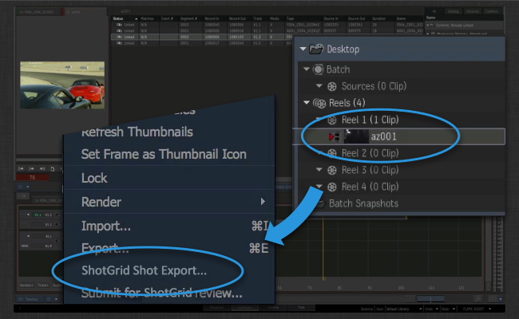
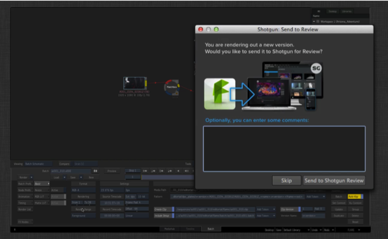

# Flame 내보내기

 Flame 내보내기 앱은 프로젝트를 시작하는 데 도움이 됩니다.

Flame에서 초기 컨폼을 만든 경우 샷 내보내기를 사용하여 에서 컨텐츠를 신속하게 생성하고, 디스크에 플레이트를 렌더링하고, 리뷰할 컨텐츠를 전송할 수 있습니다.

실행하면 내보내기 앱은 Flare 또는 Flame 배치 모드(batch mode)에서 발생하는 모든 렌더를 트래킹하므로 워크플로우의 일부로 리뷰할 컨텐츠를 쉽게 전송할 수 있습니다.

## 로 컨폼 푸시

Flame에서 시퀀스에 대한 컨폼 설정이 있고 타임라인의 모든 세그먼트에 **할당된 샷 이름**이 있는 경우 시퀀스를 선택하고 마우스 오른쪽 버튼으로 클릭하고  Shot Export 옵션을 선택합니다.



그러면 게시에 대한 일부 초기 코멘트를 입력할 수 있는  UI가 나타납니다. 이러한 코멘트는 리뷰를 위해 전송되며 게시 및 기타 컨텐츠에 설명을 추가할 때도 사용됩니다.

설명 외에도 내보낸 플레이트에 사용할 출력 데이터 형식도 선택할 수 있습니다. 이러한 사전 설정은 툴킷 앱 구성의 일부이며 스튜디오의 필요에 맞게 구성할 수 있습니다.


Submit 버튼을 클릭하면 다음과 같이 여러 작업이 즉시 수행됩니다.

- 에 샷 및 태스크가 만들어집니다. 태스크 템플릿 설정을 통해 만들어지는 각각의 새 샷과 연결할 태스크 목록을 구성할 수 있어 일관된 구조를 쉽고 빠르게 만들 수 있습니다. 샷은 기본적으로 시퀀스에 따라 상위로 지정되지만 구성 가능하며 씬 또는 에피소드에 대한 작업을 수행하는 경우 이러한 설정을 대신 사용하여 내보내기를 다시 구성할 수 있습니다.

- 에 올바른 데이터가 포함되면 표준 폴더 생성 메커니즘을 사용하여 디스크에 폴더가 생성됩니다. 따라서 생성되는 모든 샷에 대해 일관된 일련의 폴더를 사용하여 프로젝트를 시작할 수 있습니다.

위의 두 단계가 수행되고 나면 추가 단계를 진행하기 위한 기본 구조를 갖게 됩니다. 이러한 작업은 백그라운드에서 수행됩니다.

- 구성에 정의된 사전 설정에 따라 각 샷에 대한 플레이트가 디스크에 내보내집니다. 파일 위치는 툴킷 템플릿 시스템을 사용하여 정의됩니다. 즉, 이러한 플레이트의 위치는 파이프라인의 다른 도구 다운스트림에 의해 잘 정의되고 파악됩니다.

- 배치(Batch) 파일과 클립 xml 파일이 내보내집니다. Flame에서는 이러한 파일을 사용하여 나중에 Flame의 기본 컨폼으로 가져오는 새 버전을 빠르게 렌더링할 수 있는 반복 워크플로우를 지원합니다.

- Quicktime이 생성되고 리뷰를 위해 에 업로드됩니다.


## Review로 배치(Batch) 렌더 보내기

샷에 대한 Flame 배치(Batch) 파일을 게시하면 해당 샷에서 직접 Flare를 시작하여 렌더 및 출력 설정이 미리 입력된 상태로 배치(Batch) 파일을 열 수 있습니다. 새 버전을 렌더링하려면 Render Range 버튼을 클릭하기만 하면 됩니다.


이때 툴킷은  Review로 렌더를 보낼지 선택할 수 있는 대화상자를 표시합니다.



파일이 에 의해 게시되고 트래킹되며 선택적으로 리뷰를 위해 전송됩니다.

## 자세한 정보

자세한 정보를 보고 이 워크플로우가 작동하는지 확인하려면 Flame 엔진 문서로 이동합니다. 여기에는 다양한 워크플로우의 작동 상태를 보여 주는 몇 가지 동영상 컨텐츠도 있습니다.

LINKBOX_ENGINE:software/tk-flame: Flame 엔진

통합 또는 커스터마이즈에 관한 질문이 있으면 언제든지 [지원 사이트](https://knowledge.autodesk.com/ko/contact-support)를 방문해 주십시오.

# 고급 항목

아래에 구성 및 커스터마이즈와 관련된 고급 상세 정보가 나와 있습니다.

## 내보내기 사전 설정 사용

내보내기는 해당 구성의 *내보내기 사전 설정* 개요를 사용합니다. Flame 내에서 내보내기 UI를 시작하면 사용 가능한 내보내기 사전 설정이 있는 드롭다운이 표시됩니다. 각 사전 설정은 파일을 디스크에 기록하고 에 업로드하는 방법을 구성할 수 있는 구성 옵션입니다. 디스크의 파일 위치와 같은 높은 수준의 설정은 환경 구성에서 직접 제어되므로 파이프라인에서 작동하도록 기본 구성 옵션을 쉽게 조정할 수 있습니다.

Flame을 제어하기 위해 Flame에 전달되는 실제 내보내기 xml 컨텐츠에 대한 고급 설정 및 제어는 각 사전 설정에 대해 동작이 정의된 후크에 의해 처리됩니다. 후크에서, 내보내기로 미디어를 생성하는 방법을 완벽하게 제어할 수 있습니다.

##  서버 측 트랜스코딩 건너뛰기
기본적으로 Quicktime은 `Version.sg_uploaded_movie` 필드를 설정하는 방법으로  Review에 업로드됩니다. 그러면  서버 측 트랜스코딩이 트리거되고 업로드된 Quicktime은 브라우저 및 모바일에서 재생하기에 적합한 `mp4` 및 `webm` 표현으로 변환됩니다. 경우에 따라 이 서버 측 트랜스코딩을 건너뛰는 것이 유익할 수 있습니다. `bypass_shotgun_transcoding` 구성 설정을 설정하면 건너뛸 수 있습니다. true로 설정하면 통합에서 의 `Version.sg_uploaded_movie_mp4` 필드로 직접 업로드하여 서버 측 트랜스코딩을 건너뜁니다. 이 경우 `webm` 버전이 생성되지 않으므로 Firefox에서 리뷰를 재생할 수 없습니다.

자세한 정보는 https://support.shotgunsoftware.com/hc/ko/articles/219030418을 참조하십시오.

## ffmpeg 커스터마이즈

내보내기는 Quicktime을 생성할 때 Flame과 함께 배포되는 ffmpeg 버전을 사용합니다. 내보내기에서 설정 후크를 수정하여 기본 제공 버전 대신 사용할 ffmpeg 추가 버전을 지정할 수 있습니다. Flame과 함께 배포되는 ffmpeg의 버전은 ffmpeg 트랜스코딩 및 성능에 대한 향상된 최신 기능을 트래킹하므로 최신 버전을 사용하면 성능이 향상될 수 있습니다.

h264 매개변수가 ffmpeg로 전달되는 방식이 기본적으로 사용되는 버전과 최신 버전 간에 변경되었습니다. 최신 ffmpeg로 전환하면  측에서 최적의 업로드 및 성능을 제공하는 권장 트랜스코딩 지침을 정확히 구현할 수 있습니다. 이러한 지침은 다음을 참조하십시오.

https://support.shotgunsoftware.com/hc/ko/articles/219030418

고급 사용자인 경우 ffmpeg 버전만 변경하는 것이 좋습니다. 이 경우 다음 단계를 수행합니다.

### 설정 후크 복사

수정할 필요가 있는 모든 설정은 Flame 내보내기 앱과 함께 제공되는 설정 후크에서 찾을 수 있습니다. 이 후크를 수정하려면 먼저 이 후크 파일을 앱 위치 내의 기본 위치에서 현재 구성으로 복사해야 합니다. 프로젝트 구성 내에서 후크 파일은 일반적으로 `install/apps/app_store/tk-flame-export/va.b.c/hooks/settings.py`와 비슷한 위치에 있습니다. 이 파일을 구성 내의 `hooks` 위치(예: `config/hooks`)에 복사합니다. 그냥 `settings.py`보다는 무슨 파일인지 명확하게 알 수 있도록 좀 더 긴 이름으로 바꾸는 것이 좋습니다.

```
install/apps/app_store/tk-flame-export/va.b.c/hooks/settings.py -> config/hooks/flame_export_settings.py
```

이제 Flame 환경 구성 파일을 편집합니다. 이 파일은 일반적으로 `config/env/includes/flame.yml`입니다. `tk-flame-export` 제목 아래, 후크에 대한 경로가 `settings_hook: '{self}/settings.py'`로 정의되어 있음을 알 수 있습니다. 이는 기본적으로 구성이 앱 위치(예: `{self}`) 내의 후크 파일을 검색한다는 것을 의미합니다. 대신 이 경로를 `settings_hook: '{config}/flame_export_settings.py'`로 변경하면 툴킷이 구성 내의 후크 파일을 찾게 됩니다. 요약하면 다음과 같습니다.

```
settings_hook: '{self}/settings.py' -> '{config}/flame_export_settings.py'
```

### 후크 수정

이제 `config/hooks/flame_export_settings.py` 후크를 수정할 준비가 되었습니다. 텍스트 편집기에서 후크를 엽니다. ffmpeg 및 ffmpeg 설정과 관련된 몇 가지 방식이 있습니다. 수정할 첫 번째 항목은 다음과 같습니다.

```
def get_external_ffmpeg_location(self):
    """
    Control which version of ffmpeg you want to use when doing transcoding.
    By default, this hook returns None, indicating that the app should use
    the built-in version of ffmpeg that comes with Flame.

    If you want to use a different version of ffmpeg, simply return the path
    to the ffmpeg binary here.

    :returns: path to ffmpeg as str, or None if the default should be used.
    """
    return None
```

기본적으로 `None`을 반환하면 내보내기는 Flame의 기본 제공 ffmpeg를 사용합니다. ffmpeg에 대한 전체 경로를 반환하도록 이 값을 변경합니다. Backburner 클러스터를 실행하는 경우 ffmpeg는 클러스터 내 어떤 시스템에서든 호출될 수 있으므로 실행 파일이 모든 위치에 설치되어 있는지 확인해야 합니다.

이제 ffmpeg 위치가 업데이트되면 ffmpeg에 전달된 매개변수를 조정해야 할 수 있습니다. 다음 두 가지 방식으로 변경해야 합니다.

- `get_ffmpeg_quicktime_encode_parameters`는 에 업로드할 Quicktime을 생성할 때 사용되는 매개변수를 반환합니다.

- `get_local_quicktime_ffmpeg_encode_parameters`는 Quicktime을 디스크에 작성할 때 사용되는 매개변수를 반환합니다.

 업로드의 경우 시작점으로 기본  인코딩 설정을 사용하는 것이 좋습니다.

```
def get_ffmpeg_quicktime_encode_parameters(self):
    return "-vcodec libx264 -pix_fmt yuv420p -vf 'scale=trunc((a*oh)/2)*2:720' -g 30 -b:v 2000k -vprofile high -bf 0"
```

로컬  트랜스코드의 경우  트랜스코드 설정에서의 설정을 기반으로 하되 해상도 제약 조건을 제거하고 비트 전송률을 높이는 것이 좋습니다.

```
def get_local_quicktime_ffmpeg_encode_parameters(self):
    return "-vcodec libx264 -pix_fmt yuv420p -g 30 -b:v 6000k -vprofile high -bf 0"
```

