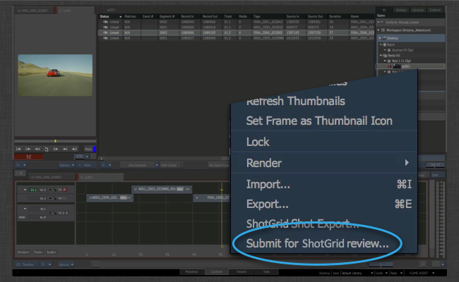
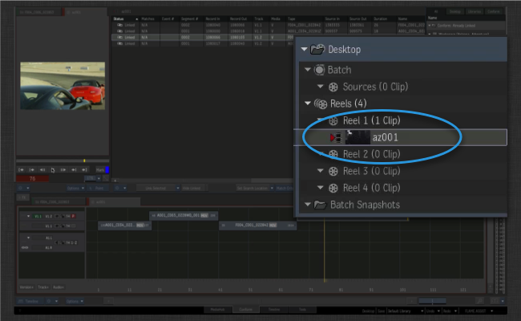
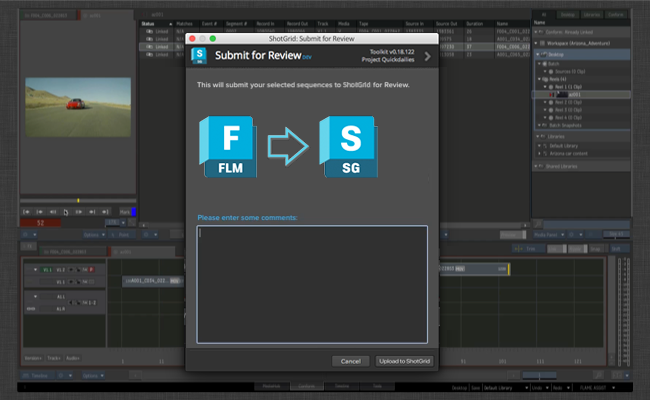

# Flame Review

 Flame Review 앱을 사용하면 Flame에서 하나 이상의 시퀀스를  Review로 쉽게 푸시할 수 있습니다.

리뷰할 하나 이상의 시퀀스를 선택하고 마우스 오른쪽 버튼으로 클릭하기만 하면 됩니다.

 Review 옵션을 선택합니다.

리뷰 노트를 추가할 수 있는 툴킷 UI가 나타납니다.

OK를 클릭하면 백그라운드 작업이 생성되고 모든 작업이 씬 뒤에서 수행됩니다.
다음 단계가 수행됩니다.

- 시퀀스가 Quicktime으로 디스크에 내보내집니다. 이 내보내기는 Flame Quicktime 내보내기로 처리되며 구성 후크를 통해 다양한 설정을 완벽하게 제어할 수 있습니다.

- 시퀀스 완료 후 툴킷이 에 일치하는 시퀀스가 있는지 확인합니다. 없으면 시퀀스가 자동으로 생성됩니다.

- 리뷰 버전이 생성되고 시퀀스와 연결됩니다.

- 마지막으로 Quicktime이 리뷰 버전으로 업로드됩니다.

프로세스는 오디오 트랙, 전환 등을 지원하며 "WYSIWYG"여야 합니다. 이제 에서 Client Review Site 및  iPhone 앱을 비롯한 여러 가지 방법으로 미디어를 리뷰할 수 있습니다.

## 커스터마이즈 및 설정

Flame Review 앱은 여러 가지 방법으로 커스터마이즈할 수 있습니다.

- Flame의 시퀀스를 나타내도록 에서 사용해야 하는 **엔티티 유형**을 제어할 수 있습니다. 예를 들어 에피소드 컨텐츠에서 작업하는 경우 시퀀스가 아닌 의 에피소드에 리뷰 버전을 링크하는 것이 더 효과적일 수 있습니다.

- 에서 만든 새 항목에 앱을 자동으로 추가해야 하는 태스크를 커스터마이즈할 수 있습니다. 이 작업은 태스크 템플릿 설정을 통해 수행되며 만들어지는 구조를 표준화할 수 있습니다.

- 후크를 통해 앱이 Flame 외부에서 Quicktime을 생성하는 데 사용하는 XML 사전 설정을 완벽하게 제어할 수 있습니다.

