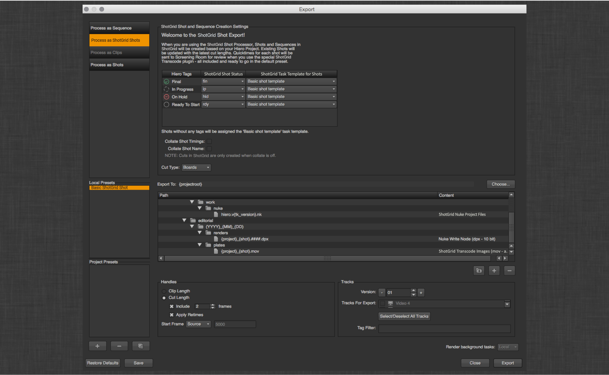
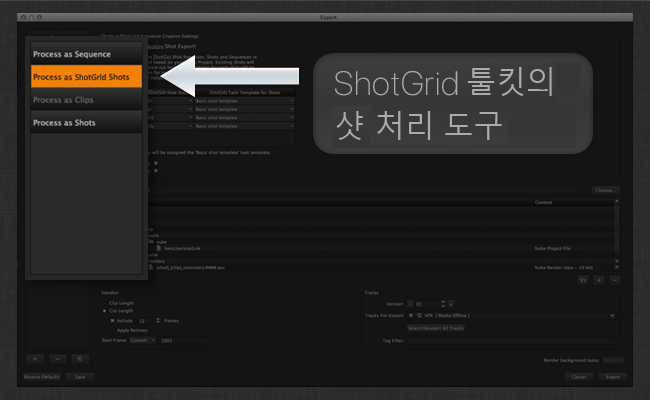
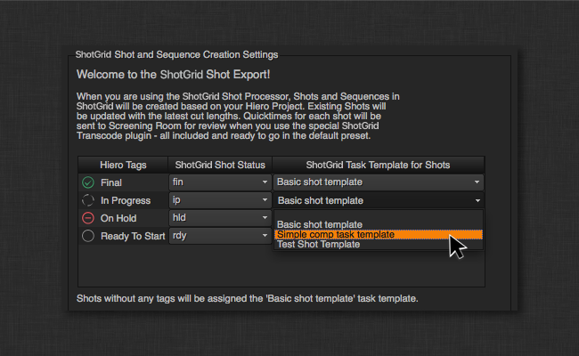
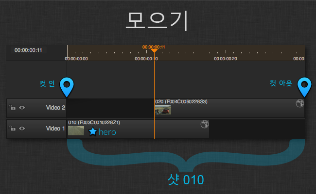
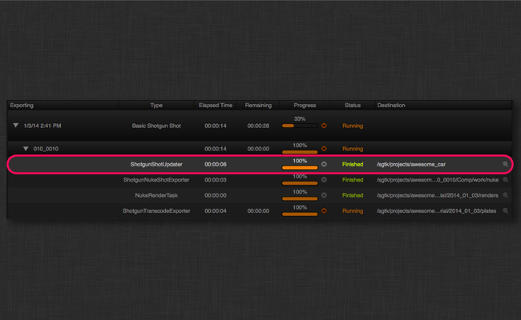
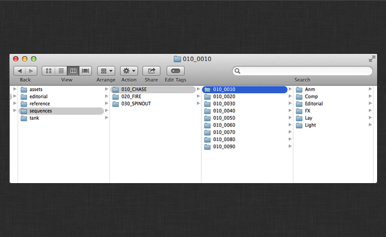

# Hiero/Nuke Studio 내보내기

### 소개

이 앱은 Hiero의 시퀀스에 대한 내보내기 대화상자에  인식 기능을 추가합니다.

#### 개요 동영상 및 데모

 툴킷 또는 Hiero 통합을 처음 사용하는 경우  툴킷 Hiero 통합을 통해 파이프라인에서 수행할 수 있는 작업의 개요를 빠르게 진행하는 다음 동영상을 확인합니다.

툴킷 및 Hiero에 이미 익숙하다면 언제든지 아래의 문서를 계속 진행합니다.

<center>
<iframe src="https://player.vimeo.com/video/82572226" style="font-size: 1em; line-height: 1.45em;" width="500" height="281" frameborder="0"></iframe>
</center>

###  샷 프로세서

이 앱 자체가 활성화되면 Hiero 내보내기 대화상자에 여러 변경 사항이 등록됩니다.



가장 먼저 주목해야 할 항목은 등록된 새 프로세서입니다.



이 프로세서를 클릭할 때 주의해야 할 새로운 사항이 있습니다.

대화상자 상단에는 시퀀스를 내보낸 결과로 에서 샷이 생성/업데이트되는 방식을 제어할 수 있는 추가 UI가 있습니다.



### 태그

드롭다운을 조정하여 다양한 Hiero 태그를  샷 상태 및 샷 태스크 템플릿에 매핑할 수 있습니다. 따라서 Hiero의 태그 지정 워크플로우를 통해  샷을 진행 중으로 설정하거나 그린 스크린, cg 추가 또는 구성에 맞는 샷의 태스크를 설정할 수 있습니다. 이 UI는 후크를 통해 입력되며 추가 기능을 구성하기 쉽습니다.

### 결합

또한 Hiero의 기본 제공 로직을 미러링하여 함께 트랙 항목을 결합할 수 있는 옵션이 있습니다. 샷을 구성하는 항목이 여러 개일 경우(서로 다른 트랙에서 겹치거나 여러 트랙에 동일한 샷 이름이 있는 경우) 이 옵션을 켜야 합니다. 그러면  툴킷 샷 업데이트 프로그램이 일치하는 결합된 항목을 단일 샷으로 처리합니다.


예를 들어 샷 010과 020을 나타내는 두 개의 트랙 항목이 있다고 가정합니다. 010이 먼저 나오고 020은 다른 트랙의 010 끝에 겹칩니다. 010이 먼저 나오므로 Hiero이며 결합이 활성화된 상태에서 는 두 항목을 단일 샷 010으로 처리합니다. 즉, 에 샷 010이 생성되거나 업데이트됨을 의미합니다. 컷 인은 트랙 항목 010의 시작 부분과 일치하고 컷 아웃은 트랙 항목 020의 끝 부분과 일치합니다. 각 항목에 대해 Screening Room에서 바로 사용할 수 있는 버전이 생성되지만 둘 다 샷 010에 링크됩니다. 각 항목에 대해 게시된 파일로 플레이트가 생성되지만 둘 다 샷 010에 링크됩니다. 2개의 읽기 노드를 포함하는 샷 010에 링크된 단일 Nuke 스크립트가 각 항목에 하나씩 게시됩니다. 이 상황에서는 샷 010에 결합되었기 때문에 에서 샷 020에 대한 생성이나 업데이트가 없습니다.



### 경로

아래  UI는 표준 경로 대화상자입니다. 기본적으로 Hiero를 통해 샷에 추가되는 세 가지 항목이 있으며 이는 기본 Nuke 스크립트, 기본 Nuke 쓰기 위치 및 플레이트 트랜스코드의 기본 위치입니다. 이러한 항목의 위치는 앱 구성에 따라 결정되며 템플릿 시스템을 최대한 활용할 수 있습니다.


이 앱은  툴킷용으로 올바르게 형식이 지정되고 버전 문자열로 대체될 `{tk_version}` 토큰을 Hiero에 추가합니다.

### 커스텀 템플릿 필드

`resolve_custom_strings` 후크로 확인되는 `custom_template_fields` 설정에서 정의하는 모든 토큰은 Hiero의 유효한 대체 토큰 목록에 자동으로 추가되며 툴킷 템플릿 경로에서 유효한 대체 토큰으로 간주됩니다.

예를 들어 툴킷 `templates.yml` 파일에서 다음과 같이 키를 정의한다고 가정합니다.

```
    resolution:
        type: str
        filter_by: alphanumeric
```

`project.yml` 설정에서 `tk-hiero-export`는 다음과 같이 정의합니다.

```
  ...
  ...
  tk-hiero:
    apps:
      tk-hiero-export:
        custom_template_fields:
        - {description: Shot Resolution, keyword: resolution}
  ...
  ...
```

그런 후 다음과 같이 `resolve_custom_strings` 후크를 수정합니다.

```
# Copyright (c) 2014  Software Inc.
#
# CONFIDENTIAL AND PROPRIETARY
#
# This work is provided "AS IS" and subject to the  Pipeline Toolkit
# Source Code License included in this distribution package. See LICENSE.
# By accessing, using, copying or modifying this work you indicate your
# agreement to the  Pipeline Toolkit Source Code License. All rights
# not expressly granted therein are reserved by  Software Inc.

from tank import Hook


class HieroResolveCustomStrings(Hook):
    """Translates a keyword string into its resolved value for a given task."""

    RESOLUTION_TOKEN_NAME = "{resolution}"


    def execute(self, task, keyword, **kwargs):
        """
        """

        self.parent.log_debug("attempting to resolve custom keyword: %s" % keyword)
        if keyword == self.RESOLUTION_TOKEN_NAME:
            translated_value = self._clip_resolution_string(task)
        else:
            raise RuntimeError("No translation handler found for custom_template_field: %s" % keyword)

        self.parent.log_debug("Custom resolver: %s -> %s" % (keyword, translated_value))
        return translated_value


    # Handle the {resolution_fs} token
    def _clip_resolution_string(self, task):
        """ returns sequence resolution or task format override"""
        width = ""
        height = ""

        sequence_format = task._sequence.format()

        width = sequence_format.width()
        height = sequence_format.height()

        if "reformat" in task._preset.properties():
            task_reformat_settings = task._preset.properties()["reformat"]
            if task_reformat_settings['to_type'] != "None":
                width = task_reformat_settings['width']
                height = task_reformat_settings['height']

        return "%sx%s" % (width, height)
```

이제 Hiero에서 `resolution` 토큰을 사용할 수 있을 뿐만 아니라 툴킷에서 정의한 모든 템플릿 경로에 대해 유효성을 검사하므로 다음과 같은 위치로 내보낼 수 있습니다.

```
    hiero_plate_path: "sequences/{Sequence}/{Shot}/hiero_plates/{resolution}/v{version}/{project}_{Shot}.mov"
```

###  태스크

두 개의 새로운 태스크 유형이 등록되었습니다.

#####  트랜스코드 이미지

이 유형은 표준 Hiero 트랜스코딩 태스크의 하위 클래스로, 에서 트랜스코드 결과를 게시로 등록합니다. 선택적으로 버전도 에 생성됩니다. 버전이 생성되면 Quicktime도 생성되어 Screening Room 미디어로 업로드됩니다.

#####  Nuke 프로젝트 파일

이 유형은 표준 Hiero Nuke 스크립트 내보내기의 하위 클래스로, 에서 샷에 링크된 결과 Nuke 스크립트를 게시된 파일로 등록합니다. 이 설정을 통해 내보낼 때 파일에 포함할 툴킷 사용 쓰기 노드를 지정할 수 있습니다.


앱 설정 `plate_published_file_type` 및 `nuke_script_published_file_type`을 사용하여 게시된 파일이 등록되는 파일 유형을 제어할 수 있습니다. 또한 `nuke_script_toolkit_write_nodes`를 사용하여 내보내기 대화상자에서 사용 가능한 쓰기 노드 설정을 제어할 수 있습니다.

### 내보내기 프로세스

내보내기가 실행되면 내보내기 대기열에 몇 가지 추가 태스크가 표시됩니다.



각 샷은 에 샷을 생성하고 스키마 구성에 지정된 전체 샷 구조를 생성하는 ShotUpdater 태스크를 실행합니다.



### 의 시퀀스 및 샷 업데이트

Hiero 시퀀스의 이름이 시퀀스 이름으로 사용되며 샷의 컷 정보(컷 순서, 헤드 인, 컷 인, 컷 아웃, 테일 아웃, 컷 기간 및 작업 시간)가 입력됩니다. 또한 샷을 구성하는 항목 또는 시퀀스의 포스터 프레임이 선택되면 샷의 썸네일로 업로드됩니다.

워크플로우에서 **시퀀스** 외의 엔티티를 샷 상위(예: **에피소드**)로 사용하는 경우 `hook_get_shot` 후크에서 `get_shot_parent` 방식을 재지정할 수 있습니다. 기본 구현은 필요한 경우 **시퀀스**를 만들고 반환합니다.

### 컷 스키마 지원

 사이트가 컷 스키마(v7.0.0 이상)를 지원하는 경우 이 앱은 에 해당 **컷 항목**이 있는 **컷**을 자동으로 생성합니다. **컷** 엔티티는 Hiero 시퀀스에 해당하며 **컷 항목**은 시퀀스의 항목에 해당합니다. **컷**은 `hook_get_shot` 후크의 `get_shot_parent` 방식에 의해 반환될 때 상위 엔티티(기본적으로 **시퀀스**)에 링크됩니다. **컷 항목**은 **샷** 엔티티와 연결되고 내보내기 중에 생성된 리뷰 가능한 **버전**에 링크됩니다. 내보내기 후 **컷**은 의 **미디어** 탭 및 **RV**에서 재생할 수 있습니다.

**컷** 및 **컷 항목** 엔티티와 관련된 모든 메타데이터는 내보내기 UI에서 지정할 수 있는 _컷 유형(Cut Type)_ 필드를 제외하고 Hiero에서 추정됩니다.


해당 값은 **컷**의 **유형** 필드에 표시됩니다.

결합 옵션 중 하나가 선택된 경우 컷 스키마가 지원되지 않으며 **컷** 및 **컷 항목** 항목 생성을 건너뜁니다.

또한 컷 스키마는 리타임된 클립을 처리하지 않습니다. 리타임된 클립을 내보낼 때 디버그 경고가 기록됩니다.

### 대체 샷 계층

표준 시퀀스 > 샷 계층에서 작업하지 않지만 에피소드 및/또는 씬을 사용하는 스튜디오의 경우에는 `hiero_get_shot` 후크를 통해 스튜디오에서 사용 중인 모든 샷 계층에서 작동하도록 앱을 구성할 수 있습니다.
