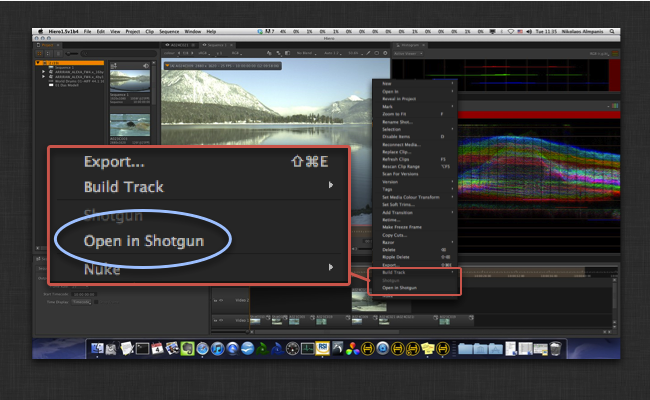

# 에서 Hiero/Nuke Studio 열기

이 앱은 Hiero 스프레드시트 및 타임라인에 상황에 맞는 메뉴를 추가합니다. 사용자는 이 메뉴를 사용하여 해당 항목의 샷이 있는 경우 에서 지정된 트랙 항목을 열 수 있습니다.



일반적으로 Nuke용  엔진 구성에 다음을 추가함으로써 Hiero의 타임라인 및 스프레드시트 메뉴에 추가하여 이 앱을 구성합니다.

```yaml
    timeline_context_menu:
    - {app_instance: tk-hiero-openinshotgun, keep_in_menu: false, name: "Open in ", requires_selection: true}
    spreadsheet_context_menu:
    - {app_instance: tk-hiero-openinshotgun, keep_in_menu: false, name: "Open in ", requires_selection: true}
```


