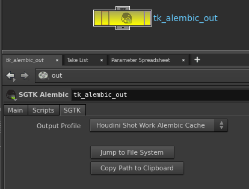

# Houdini Alembic Node

Houdini Alembic Node 앱은 alembic 파일이 출력되는 위치를 쉽게 표준화할 수 있는 커스텀  Alembic Output 노드를 제공합니다. 각 환경에 맞게 구성할 수 있습니다.

## 일반적인 사용

 Alembic 출력을 사용하려면 먼저 스크립트를 툴킷 작업 파일로 저장한 다음 Houdini의 TAB 메뉴를 통해 새 노드를 만듭니다. 이렇게 하면 일반적인 Alembic 출력 노드와 비슷한 노드가 생성됩니다.

노드는 여러 출력 프로파일로 구성될 수 있으며, 각 출력 프로파일은 alembic 캐시를 디스크에 기록해야 하는 위치에 대해 서로 다른 템플릿 경로를 사용합니다.

직접 경로를 입력하는 대신 사용할 출력 프로파일을 지정하면 노드가 나머지 경로를 자동으로 계산합니다. UI에서 계산된 경로를 볼 수 있습니다.

출력 alembic 파일의 버전이 지정되고 버전 번호의 경우 항상 Multi Publish를 사용하여 게시할 때 자동으로 증가되는 현재 Houdini 씬 파일 버전을 따릅니다.

## 구성

툴킷 alembic 노드는 환경 구성에 대해 여러 출력 프로파일을 지정할 수 있는 기능을 제공합니다. 다음은 여러 프로파일을 사용하여 노드를 구성하는 예입니다.

<pre>
  tk-houdini:
    apps:
      tk-houdini-alembicnode:
        location:
          name: tk-houdini-alembicnode
          type: app_store
          version: v0.2.2
        work_file_template: houdini_shot_work
        default_node_name: tk_alembic_out
        output_profiles:
          - name: For Publishing
            settings: {}
            color: [1.0, 0.5, 0.0]
            output_cache_template: houdini_shot_work_alembic_cache
          - name: Local Testing
            settings: {}
            color: [0.0, 0.5, 1.0]
            output_cache_template: houdini_shot_local_alembic_cache
</pre>

출력 프로파일을 사용하여 `color` 필드를 통해 노드 모양을 변경하고 `settings` 필드에 해당 매개변수와 일치하는 키/값 쌍을 제공하여 기본 Alembic 노드에서 개별 매개변수를 조정할 수 있습니다. 마지막으로, `output_cache_template` 필드는 디스크에 기록된 alembic 캐시의 출력 경로를 구동합니다.
