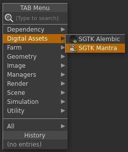

# Houdini Mantra Node

Houdini Mantra Node 앱은 렌더 파일이 출력되는 위치를 쉽게 표준화할 수 있는 커스텀  Mantra 출력 노드를 제공합니다.  각 환경에 맞게 구성할 수 있습니다.

## 일반적인 사용

 Mantra 노드를 사용하려면 먼저 스크립트를 툴킷 작업 파일로 저장한 다음 Houdini의 TAB 메뉴를 통해 새 노드를 만듭니다. 이렇게 하면 일반적인 Mantra 출력 노드와 비슷한 노드가 만들어집니다.

이 노드는 여러 출력 프로파일로 구성될 수 있으며, 각 출력 프로파일은 렌더 출력(이미지, ifd, dcm, aov 등)을 디스크에 기록해야 하는 위치에 대해 서로 다른 템플릿 경로 세트를 사용합니다.

직접 경로를 입력하는 대신 사용할 구성을 지정하면 노드가 나머지 경로를 자동으로 계산합니다. UI에서 계산된 경로를 볼 수 있습니다.

렌더링된 파일의 버전이 지정되고 버전 번호의 경우 항상 Multi Publish를 사용하여 게시할 때 자동으로 증가되는 현재 Houdini 씬 파일 버전을 따릅니다.

## 구성

툴킷 mantra 노드는 환경 구성에 대해 여러 출력 프로파일을 지정할 수 있는 기능을 제공합니다. 다음은 여러 프로파일을 사용하여 노드를 구성하는 예입니다.

<pre>
  tk-houdini:
    apps:
      tk-houdini-mantranode:
        location:
          name: tk-houdini-mantranode
          type: dev
          version: v0.2.2
        default_node_name: tk_mantra_out
        work_file_template: houdini_shot_work
        output_profiles:
          - name: Primary Render
            settings: {}
            color: [1.0, 0.5, 0.0]
            output_render_template: houdini_shot_render
            output_ifd_template: houdini_shot_ifd
            output_dcm_template: houdini_shot_dcm
            output_extra_plane_template: houdini_shot_extra_plane
          - name: Local Render
            settings: {}
            color: [0.0, 0.5, 1.0]
            output_render_template: houdini_shot_local_render
            output_ifd_template: houdini_shot_local_ifd
            output_dcm_template: houdini_shot_local_dcm
            output_extra_plane_template: houdini_shot_local_extra_plane
</pre>

출력 프로파일을 사용하여 `color` 필드를 통해 노드 모양을 변경하고 `settings` 필드에 해당 매개변수와 일치하는 키/값 쌍을 제공하여 기본 Alembic 노드에서 개별 매개변수를 조정할 수 있습니다. 마지막으로, `output_*_template` 필드는 Mantra 렌더러에 의해 디스크에 기록된 파일의 출력 경로를 구동합니다.