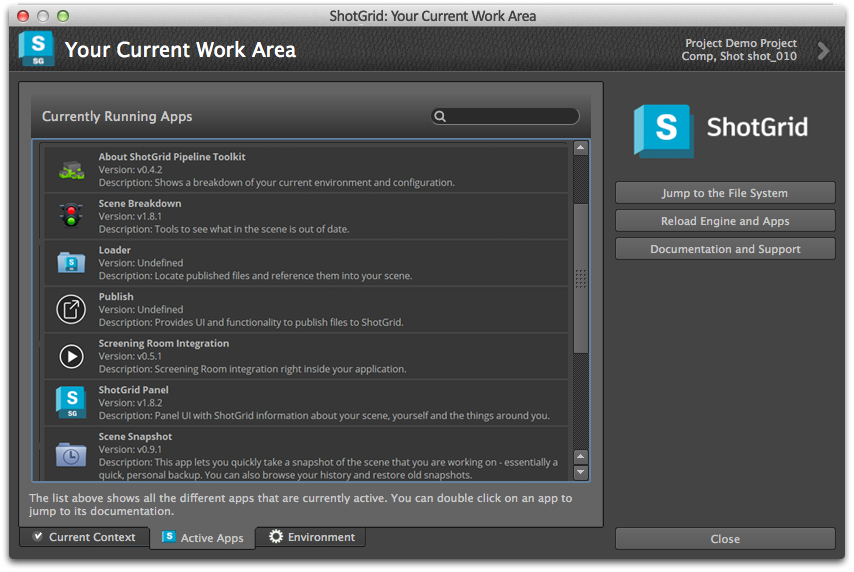

# 정보

이 앱은 현재 작업 영역과 현재 환경에서 실행 중인 모든 앱을 그래픽으로 분할합니다. 상황에 맞는 메뉴에서 찾을 수 있습니다.

## 모든 앱 다시 로드

전체 환경을 다시 로드하는 편리한 버튼이 있습니다. 이 버튼은 개발을 수행하고 일부 코드를 변경할 때 유용합니다. Maya나 Nuke를 다시 시작할 필요 없이 다시 로드 버튼만 누르면 됩니다.

다시 로드 기능 외에도 이 앱은 현재 작업 영역과 현재 로드된 모든 앱의 분할 정보를 표시합니다.

다음과 같이 세 개의 별도 뷰가 있습니다.

## 현재 작업 영역

현재 샷 또는 에셋, 현재 태스크 등을 보여 줍니다. 목록의 항목 중 하나를 두 번 클릭하면 해당 항목에 대한  상세 정보 페이지가 열립니다.

## 실행 중인 앱

현재 실행 중인 모든 앱에 대한 뷰로, 해당 버전 및 설명이 함께 표시됩니다. 앱을 두 번 클릭하면 해당 앱에 대한 문서 페이지가 열립니다.

## 현재 환경

현재 로드된 환경 파일 및 엔진 뷰입니다. 이 뷰는 디버깅 목적에 유용할 수 있습니다.
