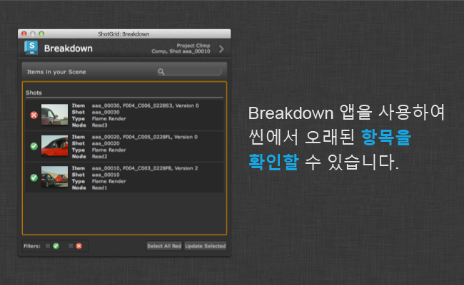

# Breakdown

Scene Breakdown 앱은 참조된 컨텐츠 목록을 표시하여 어떤 항목이 오래되었는지 알려 줍니다.  메뉴에서 액세스합니다.



하나 이상의 항목을 선택하고 선택 항목 업데이트(Update Selected)를 누릅니다. 이렇게 하면 최신 버전의 컨텐츠를 사용하도록 항목이 전환됩니다.

## 씬 스캔

Breakdown 앱이 참조용 씬을 스캔할 때 특수 스캔 후크를 호출합니다. 스캔 후크는 파일 해당 경로가 포함된 노드 목록을 반환합니다. 찾은 각각의 참조에 대해 파일 경로를 반환하고 탱크는 파일 경로를 보고 파일 경로를 게시로 인식하는지 먼저 확인한 후 게시로 인식할 경우 사용 가능한 최신 버전이 있는지 확인합니다.

사용자가 오래된 버전에 대해 업데이트(Update) 버튼을 클릭하면 앱이 다른 후크를 호출하여 실제 업데이트 작업을 수행합니다. 즉, 이러한 후크를 커스터마이즈하면 새 커스텀 노드를 분할에 추가하는 것이 비교적 간단해집니다.

##  데이터에 액세스

후크에서 업데이트 예정인 게시의  데이터에 액세스해야 하는 경우 간단하게 처리됩니다. 다음과 같이 `find_publish` 단일 호출로 앱에서 전달되는 모든 항목의 메타데이터를 검색합니다.

```python
class BreakdownHook(Hook):

    def update(self, items):
        """
        Perform replacements given a number of scene items passed from the app.

        Once a selection has been performed in the main UI and the user clicks
        the update button, this method is called.

        The items parameter is a list of dictionaries on the same form as was
        generated by the scan_scene hook above. The path key now holds
        the that each node should be updated *to* rather than the current path.
        """

        engine = self.parent.engine

        # resolve  data for all paths passed via the items dictionary
        sg_data = tank.util.find_publish(engine.sgtk,
                                         [i["path"] for i in items],
                                         fields=["id", "code", "version_number"])

        for i in items:
            node_name = i["node"]
            node_type = i["type"]
            new_path = i["path"]
            # now that each item is processed, it is easy to access the
            #  data via a dictionary lookup:
            sg_data = sg_data.get(i["path"])

            # once we have all our desired info and metadata, we can go ahead
            # and apply the update business logic.
            # [-business logic here-]

```

## API 액세스

해당 API를 사용하여 프로그래밍 방식으로 Breakdown 앱에 액세스할 수 있습니다. 다음 방식을 사용할 수 있습니다.

### Breakdown UI 표시

```
app_object.show_breakdown_dialog()
```

Breakdown UI를 표시하려면 `show_breakdown_dialog()` 방식을 실행합니다. 앱이 현재 실행 중인 환경의 `tk-multi-breakdown` 섹션에 포함되어 있을 경우 다음과 같이 수행할 수 있습니다.

```
>>> import sgtk
>>> e = sgtk.platform.current_engine()
>>> e.apps["tk-multi-breakdown"].show_breakdown_dialog()
```

### 씬 분석 실행

```
items = app_object.analyze_scene()
```

`analyze_scene()` 방식을 실행하여 프로그래밍 방식으로 씬 분석 로직을 실행할 수 있습니다. 이 방식은 Breakdown UI가 씬 항목의 목록을 빌드할 때 사용하는 것과 정확히 동일한 로직을 실행합니다.

방식은 분할 항목의 목록을 반환합니다. 각 항목은 항목을 설명하는 여러 개의 키가 있는 사전으로 표시됩니다. 툴킷 템플릿 파일의 템플릿에 해당하는 경로의 파일만 탐지됩니다. 파일이 게시로 에 있어야 할 필요는 없지만 만약 있다면 이 방식은 기본  게시 메타데이터를 반환합니다.

두 개의 키 `node_name` 및 `node_type`은 DCC 중심의 "주소"를 반환하거나 DCC 내의 경로를 식별할 수 있도록 하는 표현을 반환하는 데 사용됩니다. 예를 들어 Maya 및 Nuke에서는 노드 이름과 유형을 반환합니다. 이 로직은 후크에서 구현되며 DCC 간에 달라집니다. 이 방식은 에 연결을 시도하지만 호출 횟수가 일정하고 씬 복잡성과 무관합니다.

다음은 반환 데이터의 사전에 대한 일반적인 예입니다.

```
{'fields': {'Sequence': 'aaa',
            'Shot': 'aaa_00010',
            'Step': 'Comp',
            'eye': '%V',
            'height': 1556,
            'name': 'test',
            'output': 'output',
            'version': 1,
            'width': 2048},
 'template': <Sgtk TemplatePath nuke_shot_render_pub_mono_dpx>,

 'node_name': 'Read2',
 'node_type': 'Read',

 'sg_data': {'code': 'aaa_00010_test_output_v001.%04d.dpx',
             'entity': {'id': 1660, 'name': 'aaa_00010', 'type': 'Shot'},
             'id': 1424,
             'name': 'test',
             'published_file_type': {'id': 3,
                                     'name': 'Rendered Image',
                                     'type': 'PublishedFileType'},
             'task': {'id': 4714, 'name': 'Comp', 'type': 'Task'},
             'type': 'PublishedFile',
             'project': {'id': 234, 'name': 'Climp', 'type': 'Project'},
             'version_number': 1},
 }
```

**편리한 팁**: 위에서 볼 수 있듯이 각 항목은 `template` 객체와 `fields` 사전을 반환하여 경로를 나타냅니다. 항목의 실제 로우 경로를 보려면 간단히 `template_obj.apply_fields(fields_dict)`를 실행하면 됩니다. 이 방식에서 반환된 항목 사전 중 하나의 컨텍스트에서 코드는 다음과 같습니다.

```
breakdown_items = analyze_scene()
for item in breakdown_items:
   path = item["template"].apply_fields(item["fields"])
```


### 항목의 가장 높은 버전 계산

```
highest_version = app_object.compute_highest_version(template, fields)
```

항목의 가장 높은 버전을 찾으려면 `compute_highest_version(template, fields)` 방식을 사용합니다. 분석해야 할 경로를 나타내는 `template` 및 `fields` 매개변수는 `analyze_scene()` 방식의 출력에서 찾을 수 있습니다. Breakdown 앱에서는 버전 번호가 포함된 템플릿 키의 이름을 항상 `{version}`으로 지정해야 합니다.

이렇게 하면 디스크에서 스캔을 수행하여 가장 높은 버전을 확인합니다. 방식은 디스크에서 발견된 가장 높은 버전 번호를 반환합니다. 자세한 정보는 아래의 사용 예를 참조하십시오.


### 씬 항목 업데이트

```
app_object.update_item(node_type, node_name, template, fields)
```

항목을 업데이트하려면 `update_item(node_type, node_name, template, fields)` 방식을 사용하면 됩니다. `template` 및 `fields` 매개변수는 업데이트해야 할 경로를 나타냅니다. `node_name` 및 `node_type` 매개변수는 수정해야 할 씬의 노드를 식별하는 데 사용됩니다. 일반적으로 이러한 값은 `analyze_scene()` 방식의 출력에서 찾을 수 있습니다.

이 방식은 Breakdown UI에서 업데이트를 실행하는 것과 비슷합니다. 실제 업데이트 호출은 DCC 특정 로직을 처리하는 후크에 디스패치됩니다. 자세한 정보는 아래의 사용 예를 참조하십시오.


### Breakdown API 예

다음은 씬 분할을 검색하여 최신 버전을 사용하지 않는 모든 항목을 업데이트하는 방법을 보여 주는 예입니다.

```
# find the breakdown app instance
import sgtk
engine = sgtk.platform.current_engine()
breakdown_app = engine.apps["tk-multi-breakdown"]

# get list of breakdown items
items = breakdown_app.analyze_scene()

# now loop over all items
for item in items:

    # get the latest version on disk
    latest_version = breakdown_app.compute_highest_version(item["template"], item["fields"])

    # if our current version is out of date, update it!
    current_version = item["fields"]["version"]
    if latest_version > current_version:

        # make a fields dictionary representing the latest version
        latest_fields = copy.copy(item["fields"])
        latest_fields["version"] = latest_version

        # request that the breakdown updates to the latest version
        breakdown_app.update_item(item["node_type"], item["node_name"], item["template"], latest_fields)

```
