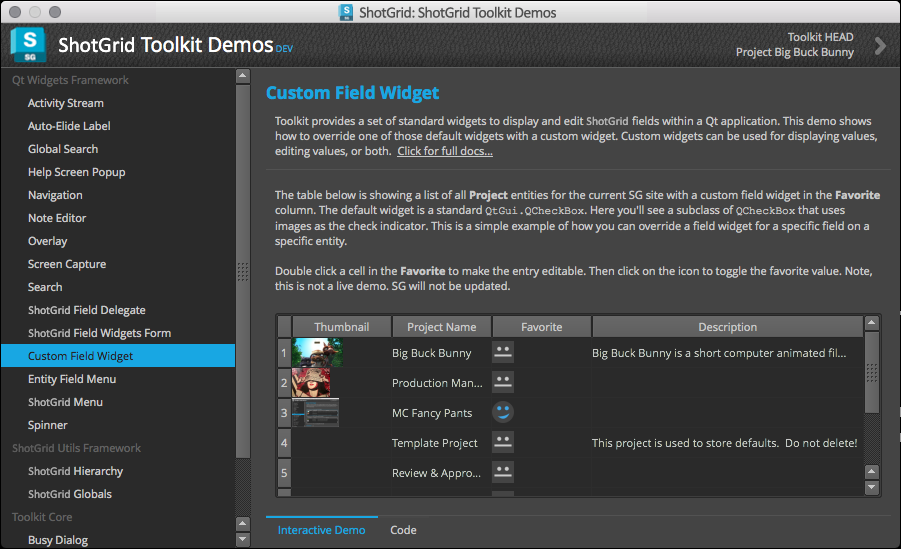
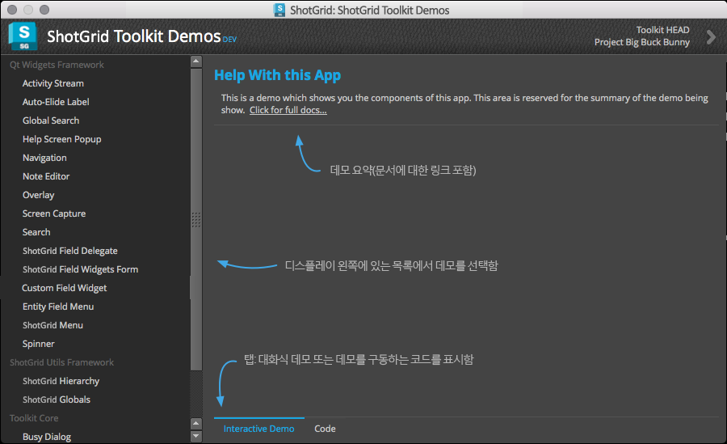

# Demo

Demo 앱은  유틸리티 프레임워크, Qt Widgets 프레임워크, Toolkit Core 등 의 기본 개발자 플랫폼 구성 요소의 라이브 시연 모습을 제공합니다.



앱에 표시되는 각 데모에는 하나 이상의 기본 플랫폼 구성요소를 사용하는 방법을 보여 주는 실제 인터랙티브 UI가 포함됩니다. 또한 구동 중인 코드를 사용자의 앱에 쉽게 복사해 붙여넣을 수 있습니다.



앱은 사용이 간단합니다. 왼쪽 목록에서 데모를 선택한 다음 오른쪽에서 구성요소와 상호 작용하면 됩니다. Qt Widgets 프레임워크에서 위젯 하나를 표시해 주는 정도로 간단한 데모도 있고,  플랫폼 구성요소들이 프로덕션 앱에서 사용할 수 있도록 함께 연결되는 방식을 예로 보여 주는 데모도 있습니다.


새 구성요소가 플랫폼에 추가되고, 시간이 허락한다면 새 데모도 추가할 예정입니다. 보고 싶은 공통된 구성요소 사용 패턴이나 데모가 있다면 [티켓을 제출](https://knowledge.autodesk.com/ko/contact-support)하여 알려 주십시오.

## 설치

Demo 앱을 설치하려면 다음 명령을 실행하십시오.

```
tank install_app project tk-shell tk-multi-demo
```

설치하고 나면 다음 명령을 실행하여 앱을 구동할 수 있습니다.

`./tank demos`
