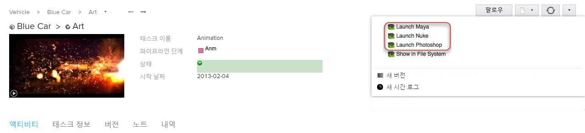

# 시작 앱

이 앱은 에서 지원되는 응용프로그램으로 쉽게 이동할 수 있는 단축키를 제공합니다. 구성 선택 사항에 따라 의 다양한 엔티티에 대해 호출되는  액션 항목을 등록합니다.

## 작동 방식

구성 옵션에 따라 엔티티를 마우스 오른쪽 버튼으로 클릭하거나  Actions 메뉴 또는 톱니바퀴 메뉴를 사용하면 메뉴 항목이 에 표시됩니다.

예를 들어 이 스크린샷은 Maya, Nuke 및 Photoshop용 메뉴를 구현하기 위해 이 앱을 세 번 사용하는 구성 사이트에서 가져온 것입니다.



현재 지원되는 응용프로그램 및 엔진은 다음과 같습니다.

- 3DSMax
- Hiero
- Maya
- MotionBuilder
- Nuke
- Photoshop
- Mari
- Houdini
- Softimage
- Flame

### 시작 시 명령행 인수 사용

많은 응용프로그램에는 응용프로그램의 다른 버전(예: Nuke와 NukeX)을 선택하거나 기타 다양한 사용 측면을 지정하기 위해 호출할 수 있는 명령행 옵션이 있습니다. 시작 관리자 앱에는 이 목적으로 구성할 수 있는 각 OS에 대한 'args' 설정이 있습니다. 예를 들어 여기에 '--nukex'를 넣으면 명령행 실행에 추가되어 일반 Nuke 대신 NukeX가 실행됩니다.

---접기---
NukeX 시작 예

```yaml
launch_nuke:
  engine: tk-nuke
  extra: {}
  hook_app_launch: default
  hook_before_app_launch: default
  linux_args: "--nukex"
  linux_path: "@nuke_linux"
  location: { name: tk-multi-launchapp, type: app_store, version: v0.2.15 }
  mac_args: "--nukex"
  mac_path: "@nuke_mac"
  menu_name: Launch Nuke
  windows_args: "--nukex"
  windows_path: "@nuke_windows"
```

---접기---

### 시작 시 환경 변수 설정 및 동작 자동화

응용프로그램이 스튜디오 파이프라인에서 제대로 작동하기 위해서는 특정 환경 변수, 플러그인 경로 등을 설정해야 하는 경우가 있습니다. 시작 앱은 'before_app_launch' 후크를 통해 이 경우를 해결할 수 있습니다. 이 후크를 사용하면 응용프로그램을 시작할 때마다 실행할 코드 조각을 정의할 수 있습니다. 기본적으로 'before_app_launch' 후크는 아무런 동작도 수행하지 않는 단순한 통과 후크지만 <a href='https://support.shotgunsoftware.com/entries/95442818#Using%20Hooks%20to%20customize%20App%20Behaviour'>이 문서</a>의 지침에 따라 재지정될 수 있습니다.

예를 들어 <a href='https://www.zyncrender.com/'>Zync 렌더</a>를 사용하는 경우 Zync Maya 플러그인 디렉토리는 $PYTHONPATH 및 $XBMLANGPATH의 일부여야 합니다. 시작 앱이 이러한 환경 변수를 설정하게 하려면 'before_app_launch' 후크를 다음과 같이 몇 줄의 코드로 업데이트합니다.

---접기---
환경 변수 설정 예

```python
def execute(self, **kwargs):
    """
    The execute functon of the hook will be called to start the required application
    """

    # Example to show how to set env vars on Maya launch

    # Append the desired path to the existing $PYTHONPATH to ensure
    # everything upstream still works
    os.environ["PYTHONPATH"] = os.environ["PYTHONPATH"] + os.pathsep + "~/Library/zync/zync-maya"

    # Set $XBMLANGPATH to the desired path, may need to append it as
    # with $PYTHONPATH if already defined in your pipeline
    os.environ["XBMLANGPATH"] = "~/Library/zync/zync-maya"
```

---접기---

'before_app_launch'를 사용하여  업데이트를 비롯한 다른 동작을 자동화할 수도 있습니다. 예를 들어 다음과 같이 시작 앱이 실행될 때마다 태스크 상태를 업데이트하도록(이 경우 "진행 중"으로) 구성할 수 있습니다(태스크에서 시작하는 경우).

---접기---
태스크 상태 업데이트 자동화 예

```python
def execute(self, **kwargs):
    """
    The execute functon of the hook will be called to start the required application
    """

    # If there is a Task in the context, set its status to 'ip'

    if self.parent.context.task:
        task_id = self.parent.context.task['id']
        data = {
            'sg_status_list':'ip'
        }
        self.parent.shotgun.update("Task", task_id, data)
```

---접기---

상상할 수 있듯이 여기에는 많은 가능성이 있으며, 시작 앱은 파이프라인에 필요한 유연성을 제공하는 것을 목표로 합니다.

### 아직 엔진이 없는 응용프로그램 시작

또한 시작 앱을 사용하여 아직 툴킷 엔진이 없는 응용프로그램을 시작할 수 있습니다. 이 경우 시작 중인 샷, 태스크 또는 에셋에 대한 폴더가 디스크에 만들어지고 응용프로그램이 시작되지만 응용프로그램 시작 후 코드가 실행되지 않으며 응용프로그램 내에  메뉴가 나타나지 않습니다. 즉, 아직 툴킷에서 지원하지 않는 응용프로그램을  내에서 시작할 수 있습니다.

이렇게 하려면 시작할 응용프로그램에 대한 경로를 사용하여 앱을 구성하고 엔진 옵션은 빈 문자열로 남겨 둡니다.

## 기술적 상세 정보

### 3DSMax

이 앱은 3DSMax가 부트 프로세스의 일부로 실행될 3DSMax 명령행에 자동으로 MaxScript, `init_tank.ms`를 추가합니다.

3DSMax 부팅 과정은 다음과 같습니다.

1. 3DSMax 시작 시 `init_tank.ms`를 실행합니다.
1. `init_tank.ms`는 Python 인터프리터를 사용하고 `tank_startup.py`를 실행할 수 있도록 합니다.
1.  툴킷 컨텍스트 API를 사용하면 에서 전달된 엔티티 ID가 툴킷 컨텍스트로 변환됩니다.
1. `tank.system.start_engine()`을 통해 적절한 엔진을 시작하고 컨텍스트에 전달합니다. 엔진이 나머지 부분을 처리합니다.

### Maya

이 앱은 Maya가 부트 프로세스의 일부로 호출할 `userSetup.py` 자동 시작 스크립트를 Maya에 등록합니다.

Maya 부팅 과정은 다음과 같습니다.

1. Maya가 `userSetup.py` 시작 스크립트를 실행합니다.
1.  툴킷 컨텍스트 API를 사용하면 에서 전달된 엔티티 ID가 툴킷 컨텍스트로 변환됩니다.
1. `tank.system.start_engine()`을 통해 적절한 엔진을 시작하고 컨텍스트에 전달합니다. 엔진이 나머지 부분을 처리합니다.

### MotionBuilder

이 앱은 MotionBuilder가 부트 프로세스의 일부로 호출할 `init_tank.py` 자동 시작 스크립트를 MotionBuilder에 등록합니다.

MotionBuilder 부팅 과정은 다음과 같습니다.

1. MotionBuilder가 `init_tank.py` 시작 스크립트를 실행합니다.
1.  툴킷 컨텍스트 API를 사용하면 에서 전달된 엔티티 ID가 툴킷 컨텍스트로 변환됩니다.
1. `tank.system.start_engine()`을 통해 적절한 엔진을 시작하고 컨텍스트에 전달합니다. 엔진이 나머지 부분을 처리합니다.

### Nuke

이 앱은 Nuke가 부트 프로세스의 일부로 호출할 `menu.py` 자동 시작 스크립트를 Nuke에 등록합니다.

Nuke 부팅 과정은 다음과 같습니다.

1. Nuke가 `menu.py` 시작 스크립트를 실행합니다.
1.  툴킷 컨텍스트 API를 사용하면 에서 전달된 엔티티 ID가 툴킷 컨텍스트로 변환됩니다.
1. `tank.system.start_engine()`을 통해 적절한 엔진을 시작하고 컨텍스트에 전달합니다. 엔진이 나머지 부분을 처리합니다.

### Photoshop

이 앱은 Adobe 익스텐션 관리자를 사용하여 탱크 플러그인을 설치하거나 설치되었는지 확인합니다.

Photoshop 부팅 과정은 다음과 같습니다.

1. Photoshop이 탱크 플러그인을 실행합니다.
1.  툴킷 컨텍스트 API를 사용하면 에서 전달된 엔티티 ID가 툴킷 컨텍스트로 변환됩니다.
1. `tank.system.start_engine()`을 통해 적절한 엔진을 시작하고 컨텍스트에 전달합니다. 엔진이 나머지 부분을 처리합니다.

#### 추가 구성

이 앱을 사용하여 Photoshop을 시작하려면 _추가_ 섹션에 4개의 구성 값을 제공해야 합니다. 다음은 조정해야 하는 시스템 및 설치 위치에 대한 구성 및 올바른 기본값입니다.

```yaml
mac_python_path: "/usr/bin/python"
windows_python_path: "C:\\Python27\\python.exe"
mac_extension_manager_path: "/Applications/Adobe Extension Manager CS6/Adobe Extension Manager CS6.app"
windows_extension_manager_path: "C:\\Program Files (x86)\\Adobe\\Adobe Extension Manager CS6\\XManCommand.exe"
```
