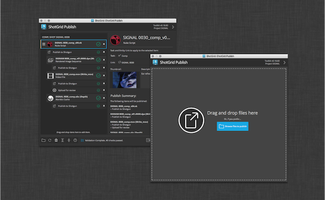

# Publish

## 개요

아티스트는 Publish 앱을 통해 아티스트 다운스트림에서 사용할 수 있도록 작업물을 게시할 수 있습니다. 아티스트의 컨텐츠 생성 소프트웨어 내에서 기존 게시 워크플로우를 지원하고 디스크상의 파일을 독립 실행형으로 게시할 수 있습니다. 컨텐츠 생성 소프트웨어에서 작업하거나 기본  통합을 사용하여 작업할 때 이 앱은 아티스트가 게시할 수 있는 항목을 자동으로 검색해 표시해 줍니다. 보다 정교한 프로덕션이 필요한 경우 스튜디오는 커스텀 게시 플러그인을 작성하여 아티스트 워크플로우를 진행할 수 있습니다.

## 설명서

Publisher에 대한 전체 설명서는 [여기](https://developer.shotgridsoftware.com/d587be80/?title=Integrations+User+Guide#the-publisher)에서 찾아볼 수 있습니다!

