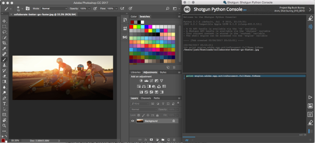
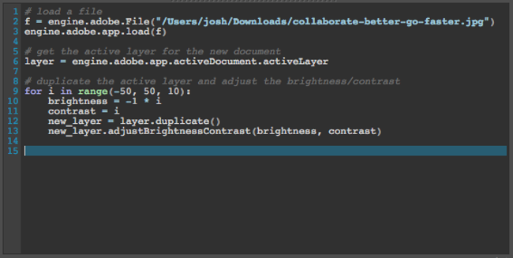
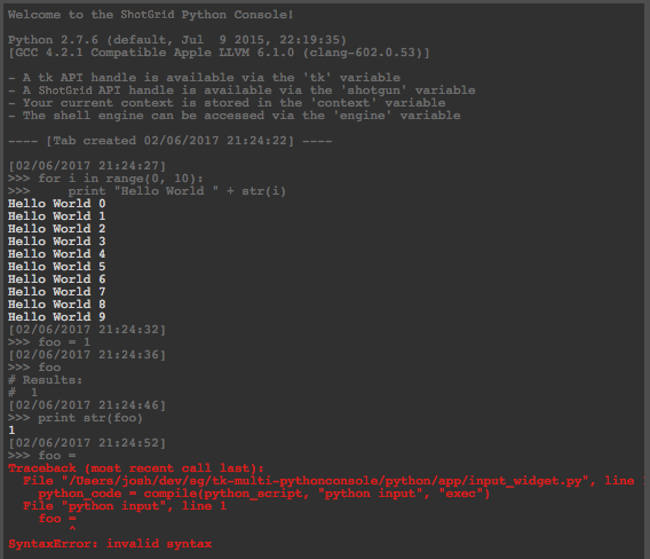
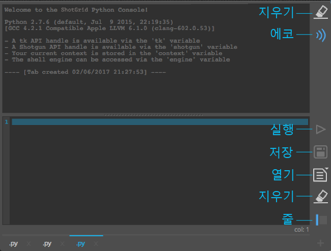
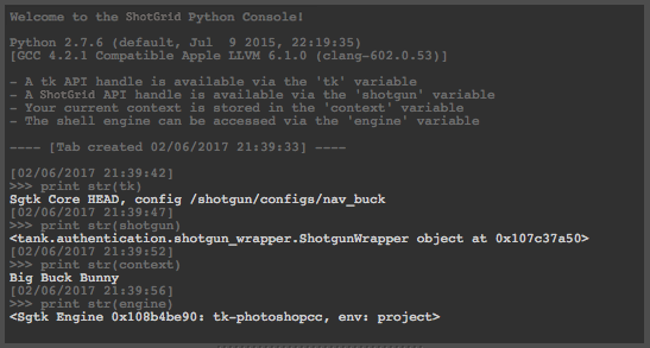

# Python 콘솔

다음은 Python 인터프리터에 액세스할 수 있는 DCC에서 사용하는 Python 콘솔 패널로 해당 인터프리터와의 상호 작용은 제한되어 있거나 지원되지 않습니다.

## Panel

콘솔을 설치하고 나면 DCC에 패널로 등록되고,  메뉴에서 사용할 수 있습니다. 포함된 툴킷 패널(Maya, Nuke, Houdini)을 지원하는 앱에서는 콘솔이 고정 패널에 표시됩니다. 이전 버전의 DCC 또는 패널을 지원하지 않는 DCC와 사용하는 경우 콘솔은 일반 툴킷 대화상자로 표시됩니다.

## 탭

Python 콘솔은 각각 편집기 및 출력 창을 포함하고 있는 탭을 하나 이상 표시합니다. 오른쪽 아래에 있는 `+` 버튼을 클릭해서 새 탭을 생성할 수 있습니다. 탭 이름 옆에는 `x` 버튼이 있어 탭을 삭제할 수 있습니다. 탭 자체를 두 번 클릭하면 탭의 새 이름을 입력하라는 메시지가 표시됩니다. 탭은 드래그 앤 드롭으로 재정렬할 수 있습니다. 탭의 상태는 DCC를 닫을 때 저장되었다가 다음에 실행할 때 복원됩니다.

### 편집기

콘솔에는 Python 편집을 위한 입력 영역이 있습니다. 편집기에는 행 번호가 포함되며, 현재 커서가 가리키는 행이 강조 표시되고, 기본적인 구문 강조 표시도 지원됩니다. 콘솔은 DCC의 팔레트를 사용하여 통합된 모양과 느낌을 주려고 합니다.

블록 들여쓰기 또는 내어쓰기가 지원됩니다. 하나 이상의 행을 선택하고 `tab` 키를 눌러 4칸 들여쓰기를 지정하거나 `shift + tab`을 눌러 4칸 내어쓰기를 지정합니다. 4칸 블록으로 들여쓰기를 유지하려고 시도하므로 가장 인접한 4칸 전체 블록으로 들여쓰거나 내어쓰게 됩니다.

블록 주석 지정 및 주석 해제 기능도 지원됩니다. 하나 이상의 행을 선택하고 Mac에서는 `cmd + /`, Windows 및 Linux에서는 `ctrl + /`를 누릅니다. 선택한 행 중에 시작 부분에 `#`이 없는 행이 있는 경우 선택한 모든 행에 추가됩니다. 모든 행에 `#`이 있는 경우 제거됩니다.

### 출력

출력 영역에는 실행한 Python의 결과가 표시됩니다. 소스 Python 명령 에코는 기본적으로 켜져 있고, 해당 출력은 `>>>` 접두사가 추가되어 구별됩니다. 각 실행에는 타임스탬프도 표시됩니다. 에코를 끌 수 있는 토글도 있습니다. 구문 및 런타임 오류는 디버깅을 위한 전체 스택 트래킹과 함께 빨간색으로 표시됩니다.

## 버튼

### 출력

* **지우기(Clear)** - 출력 브라우저의 컨텐츠를 지웁니다.
* **에코(Echo)** - 출력 브라우저에서 실행된 명령의 에코를 토글합니다.

### 편집기

* **실행(Execute)** - 편집기의 컨텐츠를 실행합니다.
* **저장(Save)** - 편집기의 현재 컨텐츠를 파일에 저장합니다.
* **열기(Open)** - 파일을 편집기에서 엽니다.
* **지우기(Clear)** - 편집기의 컨텐츠를 지웁니다.
* **행(Lines)** - 현재 탭의 행 번호를 토글합니다.

## 전역

일부 /툴킷 전역은 [셸용  엔진](https://support.shotgunsoftware.com/hc/ko/articles/219039898)에서 사용할 수 있는 항목과 유사하게 콘솔에 사전 정의되어 있습니다.

* Tk API 핸들은 `tk` 변수를 통해 사용할 수 있습니다.
*  API 핸들은 `shotgun` 변수를 통해 사용할 수 있습니다.
* 현재 컨텍스트는 `context` 변수에 저장됩니다.
* 셸 엔진은 `engine` 변수를 통해 액세스할 수 있습니다.

## 외부 소스

앱에는 외부 위치에서 Python 소스를 로드하기 위해 구현할 수 있는 후크가 함께 제공됩니다. 이 후크는 `external_sources_hook`라고 부르며, 사용하려면 `get_external_source_actions`라는 방식을 구현해야 합니다. 이 방식은 트리거 시 콘솔에 (컨텐츠와 함께) 새 탭을 추가하는 `QActions` 목록을 반환해야 합니다. 사전 정의된 사용자 목록을 위해 github에서 gist를 로드하는 구현 예시가 제공됩니다. 후크에 의해 반환되는 액션은 **열기(Open)** 버튼을 오래 누르면 나타나는 팝업 메뉴에 표시됩니다.

## 핫키

* 선택 항목 실행은 `Ctrl + Enter`
* 새 탭 생성은 `Ctrl + T`
* 탭 탐색은 `Ctrl + Shift + [` 또는 `Ctrl + Shift + ]`
* 입력/출력 글꼴 크기 조정은 `Ctrl + Wheel`

**참고:** 일부 DCC에서는 핫키를 사용하지 못할 수도 있습니다.

## 기타 참고 사항

* 일부 이전 버전의 DCC에서는 세션을 닫을 때 Python 콘솔을 연 채로 두면 충돌이 발생할 수도 있습니다. 이는 일부 이전 버전의 PySide에서 발생하는 버그일 수 있습니다. 최신 버전의 PySide와 번들로 제공되는 보다 최신 버전의 DCC에서는 종료 시 충돌이 나타나지 않습니다. 최신 DCC 릴리즈 버전에서 이 문제가 발생하면 자세히 조사할 수 있도록 [티켓을 제출](https://knowledge.autodesk.com/contact-support)해 주십시오.