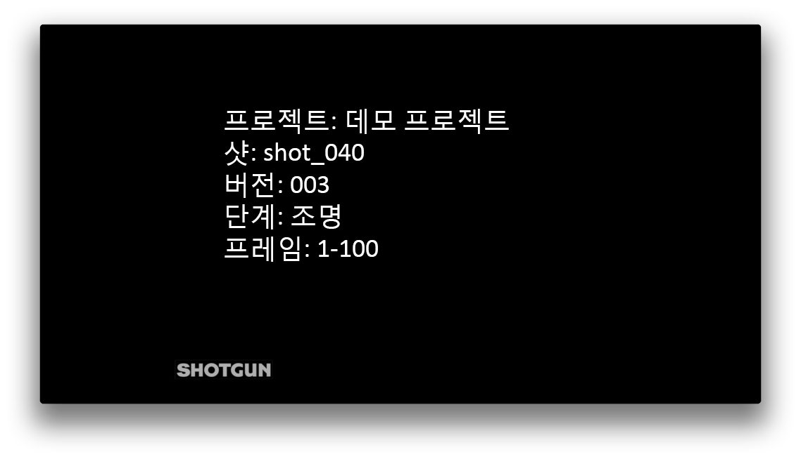

# Review Submission

## 앱 사용 방법

### API로 사용

이 앱에는 Multi Publish 앱과 같은 다른 앱 내에서 호출되는 모드가 있습니다.

이 모드는 이미지 시퀀스에서 Quicktime을 만들고 리뷰를 용이하게 하기 위해 에 버전으로 제출합니다. 생성된 Quicktime에는 슬레이트 및 번인이 있습니다. 글꼴, 로고 위치, 영상 압축 옵션 및 번인/슬레이트 정보 등은 현재 기본 후크에서 하드코딩되어 있으므로 후크 함수를 다시 구현하여 동작을 조정하는 것이 좋습니다.

슬레이트 및 번인의 현재 기본 형식은 다음과 같습니다.




자체 앱 또는 후크에서 이 앱을 활용하고 싶다면 간단한 다음 방법을 참조하십시오.

- 현재 엔진에서 `tk-multi-reviewsubmission` 앱을 가져옵니다. 이 작업은 `self.parent.engine.apps.get('tk-multi-reviewsubmission')` 호출을 사용하여 후크 내에서 수행할 수 있습니다.
- 앱을 사용할 수 있는 경우 `render_and_submit_version()` 방식을 호출합니다.

후크 코드의 내용은 다음 예와 같습니다.

```python
review_submission_app = self.parent.engine.apps.get("tk-multi-reviewsubmission")
if review_submission_app:
    review_submission_app.render_and_submit_version(
        template,
        fields,
        first_frame,
        last_frame,
        sg_publishes,
        sg_task,
        comment,
        thumbnail_path,
        progress_cb,
        color_space
    )
```

`render_and_submit_version`에 전달해야 하는 인수는 다음과 같습니다.

- `template`: 게시할 파일의 위치를 정의하는 템플릿
- `fields`: 템플릿을 입력하는 데 사용할 필드
- `first_frame`: 처리할 이미지 시퀀스의 첫 번째 프레임
- `last_frame`: 처리할 이미지 시퀀스의 마지막 프레임
- `sg_publishes`: 버전을 링크할  게시된 파일 객체의 목록
- `sg_task`: 버전을 링크할  태스크 링크 사전
- `comment`: 버전 설명에 추가할 텍스트
- `thumbnail_path`: 영상이 에 업로드되지 않을 경우 버전에 사용할 썸네일 경로(구성에서 설정)
- `progress_cb`: 진행률을 보고하기 위한 콜백. `callback(percent, message)` 형식이어야 합니다.
- `color_space`: 입력 프레임이 있는 색상 공간. Nuke에서 쓰기 노드의 색상 영역 노브에 있는 열거 값 중 하나입니다.

### 메뉴 항목으로 사용

이 모드는 DCC 내부의  메뉴에 메뉴 항목을 추가합니다. 

이 모드는 현재 뷰포트의 빠른 스냅샷을 만들고 이를 버전 초안으로  Create에 보냅니다. 그런 다음 사용자는 주석, 텍스트 또는 비교 노트를 추가해  Create 내에서 리뷰 제출물을 확장할 수 있습니다.

이 기능을 컨텍스트에 추가하려면 다음을 수행해야 합니다.

- `display_name` 필드가 메뉴 항목에 포함되도록 설정합니다.
- DCC에서 미디어를 렌더링하는 방법을 알려주는 `render_media_hook` 필드를 후크로 설정합니다(tk-photoshopcc 및 tk-maya에는 기본 구현이 있음).
- `submitter_hook` 필드를 `{self}/submitter_create.py`로 설정합니다.

다음과 같습니다.

```yaml
tk-multi-reviewsubmission:
  display_name: Send for review
  render_media_hook: "{self}/render_media.py:{self}/{engine_name}/render_media.py"
  submitter_hook: "{self}/submitter_create.py"
  location:
    type: app_store
    name: tk-multi-reviewsubmission
    version: v1.0.1
```
