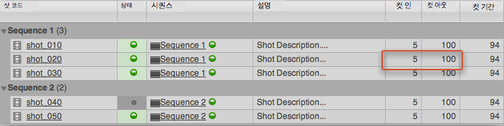
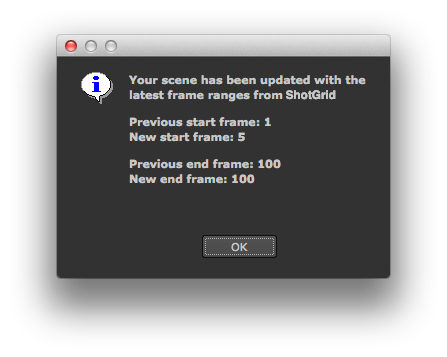
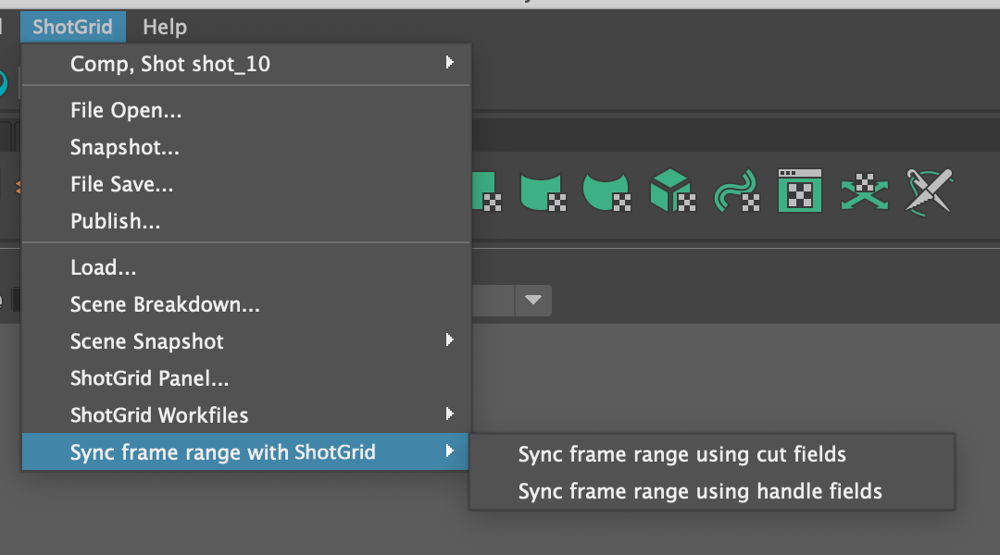

# Set Frame Range

이 앱은 현재 열려 있는 씬에서 프레임 범위를 관리하는 데 도움을 줍니다. **프레임 범위 동기화(Sync Frame Range with )** 메뉴 옵션을 클릭하면  메뉴에서 앱에 액세스할 수 있습니다.

이 버튼을 클릭하면  툴킷은 현재 작업 영역(일반적으로 샷)과 관련된  엔티티를 보고 입력 및 출력 프레임 정보가 있는 입력 및 출력 필드를 찾습니다. 일반적으로 샷과 함께 사용되며 이 경우 앱은 의 기본 구성에 정의된 표준 샷 입력 및 출력 필드를 사용합니다. 그러나 다른 필드에서 프레임 범위를 가져오도록 앱을 구성할 수도 있습니다.



앱을 실행하면 현재 씬을 해당 입출력으로 업데이트하고 마지막으로 요약 메시지를 표시합니다.



## 여러  필드 동기화 옵션

 메뉴에서 `menu_name` 속성을 설정하여 이 앱의 인스턴스를 여러 개 정의할 수 있습니다. 이렇게 하면 서로 다른  필드의 동기화를 위해 여러 가지 메뉴 액션을 정의할 수 있게 됩니다.

이를 위해 각 인스턴스에 대해 다른 앱 인스턴스 이름, `menu_name` 및 입력/출력 프레임 필드를 설정하십시오.

```yaml
tk-multi-setframerange_cuts:
  menu_name: Sync frame range using cut fields
  sg_in_frame_field: sg_cut_in
  sg_out_frame_field: sg_cut_out
  location: "@apps.tk-multi-setframerange.location"
tk-multi-setframerange_handles:
  menu_name: Sync frame range using handle fields
  sg_in_frame_field: sg_handle_in
  sg_out_frame_field: sg_handle_out
  location: "@apps.tk-multi-setframerange.location"
```
그러면 각 항목이  메뉴에 별도의 옵션으로 표시됩니다.



참고: 이는 앱 `v0.4.0` 버전의 새로운 기능입니다.

## 작업 후크

현재 씬 프레임 범위를 가져오거나 프레임 범위를 설정하기 위한 소프트웨어별 로직은 프레임 작업 후크에서 처리됩니다. 새 엔진에 대한 지원을 추가하거나 해당 동작의 구현 방법을 변경하려는 경우 `hook_frame_operation` 앱 속성을 설정하고 고유의 가져오기(get) 및 설정(set) 로직을 구현하여 프레임 작업 후크를 인수할 수 있습니다.

참고: 이는 앱 `v0.4.0` 버전의 새로운 기능입니다.